---
format:
  html:
    toc: true
    toc-depth: 5
    theme: [cosmo, ../../clay/custom.scss]
    toc-location: right
    anchor-sections: true
    reference-location: margin
    fontsize: 1.0em
code-block-background: true

---
<style></style><style>.printedClojure .sourceCode {
  background-color: transparent;
  border-style: none;
}
</style><style>.clay-limit-image-width .clay-image {max-width: 100%}
.clay-side-by-side .sourceCode {margin: 0}
.clay-side-by-side {margin: 1em 0}
</style>
<script src="https://code.jquery.com/jquery-3.6.0.min.js" type="text/javascript"></script><script src="https://code.jquery.com/ui/1.13.1/jquery-ui.min.js" type="text/javascript"></script>

# Random {.unnumbered}

Collection of functions which deal with randomness. There are four groups:


* random number generation
* probability distributions
* sequences generators
* noise (value, gradient, simplex)


::: {.sourceClojure}
```clojure
(require '[fastmath.random :as r])
```
:::


Set initial seed


::: {.sourceClojure}
```clojure
(r/set-seed! 31337)
```
:::


::: {.printedClojure}
```clojure
#object[org.apache.commons.math3.random.JDKRandomGenerator 0x3219c867 "org.apache.commons.math3.random.JDKRandomGenerator@3219c867"]

```
:::


## Common functions

List of the functions which work with PRNG and distribution objects:


### Random number generation

::: {.callout-tip title="Defined functions"}

* `irandom`, `lrandom`, `frandom`, `drandom`
:::


* `irandom`, for random integer, returns long
* `lrandom`, returns long
* `frandom`, for random float, returns boxed float
* `drandom`, random double
* First argument should be PRNG or distribution object
* With no additional arguments, functions return:
    * full range for integers and longs
    * $[0,1)$ for floats and doubles
* Only for PRNGs
    * With one additional argument, number from $[0,max)$ range is returned
    * With two additional arguments, number form $[min,max)$ range is returned

::: {.callout-note title="Examples"}


::: {.sourceClojure}
```clojure
(r/irandom (r/rng :mersenne)) ;; => -936749448
(r/drandom (r/rng :mersenne) 0 10) ;; => 2.445377471909802
```
:::


:::

For PRNGs, see more examples in PRNG > Functions section.

For Distributions, see more examples in Distributions > Functions > Examples section.


### Sampling

::: {.callout-tip title="Defined functions"}

* `->seq`
:::

To generate infinite lazy sequence of random values, call `->seq` on given PRNG or distribution.
Second (optional) argument can limit number of returned numbers.
Third (optional) argument controls sampling method (for given `n` number of samples), there are the following options:


* `:antithetic` - random values in pairs `[r1,1-r1,r2,1-r2,...]`
* `:uniform` - spacings between numbers follow uniform distribution
* `:systematic` - the same spacing with random starting point
* `:stratified` - divide $[0,1]$ into `n` intervals and get random value from each subinterval

::: {.callout-note title="Examples"}


::: {.sourceClojure}
```clojure
(take 3 (r/->seq (r/rng :mersenne))) ;; => (0.1892552326537429 0.34524957212028684 0.31941140366994736)
(r/->seq (r/rng :mersenne) 3) ;; => (0.8348587201888429 0.27692976600197805 0.5981733652872607)
```
:::


:::

For PRNGs, see more examples in PRNG > Functions section.

For Distributions, see more examples in Distributions > Functions > Examples section.


### Seed

::: {.callout-tip title="Defined functions"}

* `set-seed!`, `set-seed`
:::


* `set-seed!` mutates object if it's supported by underlying Java implementation, can also return newly created object.
* `set-seed` is implemented only for PRNGs currently

See examples in PRNG > Seed section.


## PRNG

Related functions:

::: {.callout-tip title="Defined functions"}

* `rng`, `synced-rng`
* `grandom`, `brandom`
* `irand`, `lrand`, `frand`, `drand`, `grand`, `brand`
* `->seq`
* `set-seed`, `set-seed!`
* `randval`, `flip`, `flipb`, `roll-a-dice`
* `randval-rng`, `flip-rng`, `flipb-rng`, `roll-a-dice-rng`
:::

Random number generation is based on PRNG (Pseudorandom Numeber Generator) objects which are responsible for keeping the state. All PRNGs are based on Apache Commons Math 3.6.1 algorithms.

::: {.clay-table}

```{=html}
<table class="table table-hover table-responsive clay-table"><thead><tr><th>Algorithm</th><th>Description</th></tr></thead><tbody><tr><td><div><pre><code class="sourceCode language-clojure source-clojure bg-light">:mersenne</code></pre></div></td><td>Mersenne Twister</td></tr><tr><td><div><pre><code class="sourceCode language-clojure source-clojure bg-light">:isaac</code></pre></div></td><td>ISAAC, cryptographically secure PRNG</td></tr><tr><td><div><pre><code class="sourceCode language-clojure source-clojure bg-light">:well512a</code></pre></div></td><td><div><p>WELL <span><script>katex.render("2^{512}-1", document.currentScript.parentElement, {displayMode: false, throwOnError: false});</script></span> period, variant a</p></div></td></tr><tr><td><div><pre><code class="sourceCode language-clojure source-clojure bg-light">:well1024a</code></pre></div></td><td><div><p>WELL <span><script>katex.render("2^{1024}-1", document.currentScript.parentElement, {displayMode: false, throwOnError: false});</script></span> period, variant a</p></div></td></tr><tr><td><div><pre><code class="sourceCode language-clojure source-clojure bg-light">:well19937a</code></pre></div></td><td><div><p>WELL <span><script>katex.render("2^{19937}-1", document.currentScript.parentElement, {displayMode: false, throwOnError: false});</script></span> period, variant a</p></div></td></tr><tr><td><div><pre><code class="sourceCode language-clojure source-clojure bg-light">:well19937c</code></pre></div></td><td><div><p>WELL <span><script>katex.render("2^{19937}-1", document.currentScript.parentElement, {displayMode: false, throwOnError: false});</script></span> period, variant c</p></div></td></tr><tr><td><div><pre><code class="sourceCode language-clojure source-clojure bg-light">:well44497a</code></pre></div></td><td><div><p>WELL <span><script>katex.render("2^{44497}-1", document.currentScript.parentElement, {displayMode: false, throwOnError: false});</script></span> period, variant a</p></div></td></tr><tr><td><div><pre><code class="sourceCode language-clojure source-clojure bg-light">:well44497b</code></pre></div></td><td><div><p>WELL <span><script>katex.render("2^{44497}-1", document.currentScript.parentElement, {displayMode: false, throwOnError: false});</script></span> period, variant b</p></div></td></tr><tr><td><div><pre><code class="sourceCode language-clojure source-clojure bg-light">:jdk</code></pre></div></td><td>java.util.Random instance, thread safe</td></tr></tbody></table>
```

:::


To create PRNG, call `rng` with algorithm name (as a keyword) and optional seed parameter.
`rng` creates a PRNG with optional seed
`synced-rng` wraps PRNG to ensure thread safety

::: {.callout-note title="Examples"}


::: {.sourceClojure}
```clojure
(r/rng :isaac) ;; => #object[org.apache.commons.math3.random.ISAACRandom 0x1a511524 "org.apache.commons.math3.random.ISAACRandom@1a511524"]
(r/rng :isaac 5336) ;; => #object[org.apache.commons.math3.random.ISAACRandom 0x82221d6 "org.apache.commons.math3.random.ISAACRandom@82221d6"]
(r/synced-rng (r/rng :isaac)) ;; => #object[org.apache.commons.math3.random.SynchronizedRandomGenerator 0x7c470503 "org.apache.commons.math3.random.SynchronizedRandomGenerator@7c470503"]
```
:::


:::


### Functions

Two additional functions are supported by PRNGs


* `grandom`
   * 1-arity - returns random number from Normal (Gaussian) distribution, N(0,1)
   * 2-arity - N(0,stddev)
   * 3-arity - N(mean, stddev)
* `brandom`
   * 1-arity - returns true/false with probability=0.5
   * 2-arity - returns true with given probability

All examples will use Mersenne Twister PRNG with random seed


::: {.sourceClojure}
```clojure
(def my-prng (r/rng :mersenne))
```
:::


::: {.callout-note title="Examples"}


::: {.sourceClojure}
```clojure
(r/irandom my-prng) ;; => 392835900
(r/irandom my-prng 5) ;; => 1
(r/irandom my-prng 10 20) ;; => 16
(r/lrandom my-prng) ;; => -4848697678600800971
(r/lrandom my-prng 5) ;; => 3
(r/lrandom my-prng 10 20) ;; => 13
(r/frandom my-prng) ;; => 0.66481376
(r/frandom my-prng 2.5) ;; => 1.6758845
(r/frandom my-prng 10.1 10.11) ;; => 10.1093235
(r/drandom my-prng) ;; => 0.08704017025391497
(r/drandom my-prng 2.5) ;; => 2.2506794226876936
(r/drandom my-prng 10.1 10.11) ;; => 10.104437400980684
(r/grandom my-prng) ;; => 1.309901502749643
(r/grandom my-prng 20.0) ;; => -11.146016075887923
(r/grandom my-prng 10.0 20.0) ;; => -61.42181991555253
(r/brandom my-prng) ;; => false
(r/brandom my-prng 0.01) ;; => false
(r/brandom my-prng 0.99) ;; => true
```
:::


:::


### Sampling

::: {.callout-note title="Examples"}


::: {.sourceClojure}
```clojure
(take 2 (r/->seq my-prng)) ;; => (0.9782351978771968 0.06999100655809931)
(r/->seq my-prng 2) ;; => (0.9674931524543453 0.2261535062085902)
(r/->seq my-prng 5 :antithetic) ;; => (0.5899875772556031 0.41001242274439686 0.4234648950441251 0.5765351049558749 0.15529520109599004)
(r/->seq my-prng 5 :uniform) ;; => (0.10779011937367124 0.2448659764184362 0.38832004976841494 0.5261344842521138 0.6204526759762972)
(r/->seq my-prng 5 :systematic) ;; => (0.12382145306104025 0.32382145306104027 0.5238214530610403 0.7238214530610403 0.9238214530610404)
(r/->seq my-prng 5 :stratified) ;; => (0.16550087631953667 0.2875970716497087 0.5600957714376505 0.765520486637666 0.9049054370437241)
```
:::


:::


### Seed

Let's define two copies of the same PRNG with the same seed. Second one is obtained by setting a seed new seed.


::: {.sourceClojure}
```clojure
(def isaac-prng (r/rng :isaac 9988))
```
:::


::: {.sourceClojure}
```clojure
(def isaac-prng2 ;; new instance
  (r/set-seed isaac-prng 12345))
```
:::


::: {.callout-note title="Examples"}


::: {.sourceClojure}
```clojure
(r/->seq isaac-prng 3) ;; => (0.2017025716542833 0.18388677470983206 0.956730341010493)
(r/->seq isaac-prng2 3) ;; => (0.9750469483729258 0.8824640458238968 0.931330617691251)
(r/->seq isaac-prng 3) ;; => (0.5016097251798766 0.9741775702598627 0.4876589891468033)
(r/->seq isaac-prng2 3) ;; => (0.7878968013812606 0.4365686819291106 0.9175915936830081)
```
:::


:::

Let's now reseed both PRNGs


::: {.sourceClojure}
```clojure
(r/set-seed! isaac-prng 9988)
```
:::


::: {.printedClojure}
```clojure
#object[org.apache.commons.math3.random.ISAACRandom 0xe3de35b "org.apache.commons.math3.random.ISAACRandom@e3de35b"]

```
:::


::: {.sourceClojure}
```clojure
(r/set-seed! isaac-prng2 9988)
```
:::


::: {.printedClojure}
```clojure
#object[org.apache.commons.math3.random.ISAACRandom 0x534620ca "org.apache.commons.math3.random.ISAACRandom@534620ca"]

```
:::


::: {.callout-note title="Examples"}


::: {.sourceClojure}
```clojure
(r/->seq isaac-prng 3) ;; => (0.2017025716542833 0.18388677470983206 0.956730341010493)
(r/->seq isaac-prng2 3) ;; => (0.2017025716542833 0.18388677470983206 0.956730341010493)
```
:::


:::


### Default PRNG

There is defined one global variable `default-rng` which is synchonized `:jvm` PRNG. Following set of functions work on this particular PRNG. The are the same as `xrandom`, ie `(irand)` is the same as `(irandom default-rng)`.


* `irand`, random integer, as long
* `lrand`, random long
* `frand`, random float as boxed Float
* `drand`, random double
* `grand`, random gaussian
* `brand`, random boolean
* `->seq`, returns infinite lazy sequence
* `set-seed`, seeds default-rng, returns new instance
* `set-seed!`, seeds default-rng and Smile's RNG

::: {.callout-note title="Examples"}


::: {.sourceClojure}
```clojure
(r/irand) ;; => 105368218
(r/irand 5) ;; => 3
(r/irand 10 20) ;; => 19
(r/lrand) ;; => -6326787748595902987
(r/lrand 5) ;; => 4
(r/lrand 10 20) ;; => 16
(r/frand) ;; => 0.20756257
(r/frand 2.5) ;; => 0.95548046
(r/frand 10.1 10.11) ;; => 10.105913
(r/drand) ;; => 0.5293197586726303
(r/drand 2.5) ;; => 0.5856958321231587
(r/drand 10.1 10.11) ;; => 10.10447314352286
(r/grand) ;; => 2.1340019834469315
(r/grand 20.0) ;; => -33.23574732491791
(r/grand 10.0 20.0) ;; => 11.061399646894813
(r/brand) ;; => false
(r/brand 0.01) ;; => false
(r/brand 0.99) ;; => true
(take 3 (r/->seq)) ;; => (0.8820950564851541 0.8432355490117891 0.7757833765798361)
r/default-rng ;; => #object[org.apache.commons.math3.random.JDKRandomGenerator 0x3219c867 "org.apache.commons.math3.random.JDKRandomGenerator@3219c867"]
(r/set-seed) ;; => #object[org.apache.commons.math3.random.JDKRandomGenerator 0x73924952 "org.apache.commons.math3.random.JDKRandomGenerator@73924952"]
(r/set-seed 9988) ;; => #object[org.apache.commons.math3.random.JDKRandomGenerator 0x25c9ac66 "org.apache.commons.math3.random.JDKRandomGenerator@25c9ac66"]
(r/set-seed!) ;; => #object[org.apache.commons.math3.random.JDKRandomGenerator 0x3219c867 "org.apache.commons.math3.random.JDKRandomGenerator@3219c867"]
(r/set-seed! 9988) ;; => #object[org.apache.commons.math3.random.JDKRandomGenerator 0x3219c867 "org.apache.commons.math3.random.JDKRandomGenerator@3219c867"]
```
:::


:::

Additionally there are some helpers:


* `randval`, A macro, returns value with given probability (default true/false with prob=0.5)
* `flip`, Returns 1 with given probability (or 0)
* `flipb`, Returns true with given probability (default probability 0.5)
* `roll-a-dice`, Returns a result of rolling a n-sides dice(s)

::: {.callout-note title="Examples"}


::: {.sourceClojure}
```clojure
(r/randval) ;; => false
(r/randval 0.99) ;; => true
(r/randval 0.01) ;; => false
(r/randval :value1 :value2) ;; => :value2
(r/randval 0.99 :highly-probable-value :less-probably-value) ;; => :highly-probable-value
(r/randval 0.01 :less-probably-value :highly-probable-value) ;; => :highly-probable-value
(repeatedly 10 r/flip) ;; => (0 1 1 1 0 0 1 0 0 0)
(repeatedly 10 (fn* [] (r/flip 0.8))) ;; => (1 1 1 1 1 1 1 0 1 1)
(repeatedly 10 (fn* [] (r/flip 0.2))) ;; => (0 0 0 0 0 0 0 0 0 0)
(repeatedly 10 r/flipb) ;; => (true true false true true false false true false true)
(repeatedly 10 (fn* [] (r/flipb 0.8))) ;; => (true true false true false true true false true true)
(repeatedly 10 (fn* [] (r/flipb 0.2))) ;; => (false false false false true false false false false false)
(r/roll-a-dice 6) ;; => 6
(r/roll-a-dice 100) ;; => 30
(r/roll-a-dice 10 6) ;; => 31
```
:::


:::

Above helpers can accept custom PRNG


::: {.sourceClojure}
```clojure
(def isaac3-prng (r/rng :isaac 1234))
```
:::


* `randval-rng`, A macro, returns value with given probability (default true/false with prob=0.5)
* `flip-rng`, Returns 1 with given probability (or 0)
* `flipb-rng`, Returns true with given probability
* `roll-a-dice-rng`, Returns a result of rolling a n-sides dice(s)

::: {.callout-note title="Examples"}


::: {.sourceClojure}
```clojure
(r/randval-rng isaac3-prng) ;; => false
(r/randval-rng isaac3-prng 0.99) ;; => true
(r/randval-rng isaac3-prng 0.01) ;; => false
(r/randval-rng isaac3-prng :value1 :value2) ;; => :value1
(r/randval-rng isaac3-prng 0.99 :highly-probable-value :less-probably-value) ;; => :highly-probable-value
(r/randval-rng isaac3-prng 0.01 :less-probably-value :highly-probable-value) ;; => :highly-probable-value
(repeatedly 10 (fn* [] (r/flip-rng isaac3-prng))) ;; => (0 0 0 1 1 0 0 1 0 1)
(repeatedly 10 (fn* [] (r/flip-rng isaac3-prng 0.8))) ;; => (1 0 0 0 1 1 1 1 1 1)
(repeatedly 10 (fn* [] (r/flip-rng isaac3-prng 0.2))) ;; => (1 0 0 0 1 0 0 0 0 1)
(repeatedly 10 (fn* [] (r/flipb-rng isaac3-prng))) ;; => (false false true false false true true false false true)
(repeatedly 10 (fn* [] (r/flipb-rng isaac3-prng 0.8))) ;; => (false true false true true true true true false false)
(repeatedly 10 (fn* [] (r/flipb-rng isaac3-prng 0.2))) ;; => (false false true true false false false false false false)
(r/roll-a-dice-rng isaac3-prng 6) ;; => 1
(r/roll-a-dice-rng isaac3-prng 100) ;; => 12
(r/roll-a-dice-rng isaac3-prng 10 6) ;; => 30
```
:::


:::


## Distributions

Collection of probability distributions. 

Related functions:

::: {.callout-tip title="Defined functions"}

* `distribution`, `distribution?`, 
* `pdf`, `lpdf`, `observe1`
* `cdf`, `ccdf`, `icdf`
* `sample`, `dimensions`, `continuous?`
* `log-likelihood`, `observe`, `likelihood`
* `mean`, `means`, `variance`, `covariance`
* `lower-bound`, `upper-bound`
* `distribution-id`, `distribution-parameters`
* `integrate-pdf`
:::

`distribution` is Distribution creator, a multimethod.


* First parameter is distribution as a `:key`.
* Second parameter is a map with configuration.

::: {.callout-note title="Examples"}


::: {.sourceClojure}
```clojure
(r/distribution :cauchy) ;; => #object[org.apache.commons.math3.distribution.CauchyDistribution 0x575ae96d "org.apache.commons.math3.distribution.CauchyDistribution@575ae96d"]
(r/distribution :cauchy {:median 2.0, :scale 2.0}) ;; => #object[org.apache.commons.math3.distribution.CauchyDistribution 0x38fce013 "org.apache.commons.math3.distribution.CauchyDistribution@38fce013"]
```
:::


:::


### Functions

Here are the quick description of available functions:


* `distribution?`, checks if given object is a distribution
* `pdf`, probability density (for continuous) or probability mass (for discrete)
* `lpdf`, log of pdf
* `observe1`, log of pdf, alias of lpdf
* `cdf`, cumulative density or probability, distribution
* `ccdf`, complementary cdf, 1-cdf
* `icdf`, inverse cdf, quantiles
* `sample`, returns random sample
* `dimensions`, number of dimensions
* `continuous?`, is distribution continuous (true) or discrete (false)?
* `log-likelihood`, sum of lpdfs for given seq of samples
* `observe`, macro version of log-likelihood
* `likelihood`, exp of log-likelihood
* `mean`, distribution mean
* `means`, distribution means for multivariate distributions
* `variance`, distribution variance
* `covariance`, covariance for multivariate distributions
* `lower-bound`, support lower bound
* `upper-bound`, support upper bound
* `distribution-id`, name of distribution
* `distribution-parameters`, list of parameters
* `integrate-pdf`, construct cdf and icdf out of pdf function

Notes:


* `distribution-parameters` by default returns only obligatory parameters, when last argument is `true`, returns also optional parameters, for example `:rng`
* `drandom`, `frandom`, `lrandom` and `irandom` work only on univariate distributions
* `lrandom` and `irandom` use `round-even` to convert double to integer.
* `cdf`, `ccdf` and `icdf` are defined only for univariate distributions


#### Examples

Let's define Beta, Dirichlet and Bernoulli distributions as examples of univariate continuous, multivariate continuous and univariate discrete.


##### Log-logistic, univariate continuous


::: {.sourceClojure}
```clojure
(def log-logistic (r/distribution :log-logistic {:alpha 3 :beta 7}))
```
:::


::: {.callout-note title="Examples"}


::: {.sourceClojure}
```clojure
(r/drandom log-logistic) ;; => 12.318970602382208
(r/frandom log-logistic) ;; => 4.2667246
(r/lrandom log-logistic) ;; => 4
(r/irandom log-logistic) ;; => 13
(r/sample log-logistic) ;; => 10.278040232939754
(r/distribution? log-logistic) ;; => true
(r/distribution? 2.3) ;; => false
(r/pdf log-logistic 1) ;; => 0.008695578691184421
(r/lpdf log-logistic 1) ;; => -4.744940578912748
(r/observe1 log-logistic 1) ;; => -4.744940578912748
(r/cdf log-logistic 1) ;; => 0.0029069767441860456
(r/ccdf log-logistic 1) ;; => 0.997093023255814
(r/icdf log-logistic 0.002907) ;; => 1.0000026744341148
(r/dimensions log-logistic) ;; => 1
(r/continuous? log-logistic) ;; => true
(r/log-likelihood log-logistic (range 1 10)) ;; => -24.684504975903153
(r/observe log-logistic (range 1 10)) ;; => -24.684504975903153
(r/likelihood log-logistic (range 1 10)) ;; => 1.9039507073388636E-11
(r/mean log-logistic) ;; => 8.464397033093016
(r/variance log-logistic) ;; => 46.85554132946835
(r/lower-bound log-logistic) ;; => 0.0
(r/upper-bound log-logistic) ;; => ##Inf
(r/distribution-id log-logistic) ;; => :log-logistic
(r/distribution-parameters log-logistic) ;; => [{:alpha 3, :beta 7}]
(r/distribution-parameters log-logistic true) ;; => [:rng {:alpha 3, :beta 7}]
```
:::


:::


##### Dirichlet, multivariate continuous


::: {.sourceClojure}
```clojure
(def dirichlet (r/distribution :dirichlet {:alpha [1 2 3]}))
```
:::


::: {.callout-note title="Examples"}


::: {.sourceClojure}
```clojure
(r/sample dirichlet) ;; => [0.08646949915986785 0.46226920664650367 0.45126129419362854]
(reduce + (r/sample dirichlet)) ;; => 1.0
(r/distribution? dirichlet) ;; => true
(r/pdf dirichlet [0.5 0.1 0.4]) ;; => 0.9600000000000001
(r/lpdf dirichlet [0.5 0.1 0.4]) ;; => -0.040821994520255034
(r/observe1 dirichlet [0.5 0.1 0.4]) ;; => -0.040821994520255034
(r/dimensions dirichlet) ;; => 3
(r/continuous? dirichlet) ;; => true
(r/log-likelihood dirichlet (repeatedly 10 (fn* [] (r/sample dirichlet)))) ;; => 7.1259181683419905
(r/observe dirichlet (repeatedly 10 (fn* [] (r/sample dirichlet)))) ;; => 10.887332232365871
(r/likelihood dirichlet (repeatedly 10 (fn* [] (r/sample dirichlet)))) ;; => 3694347.9000141053
(r/means dirichlet) ;; => (0.16666666666666666 0.3333333333333333 0.5)
(r/covariance dirichlet) ;; => [[0.019841269841269844 -0.007936507936507936 -0.011904761904761904] [-0.007936507936507936 0.03174603174603175 -0.023809523809523808] [-0.011904761904761904 -0.023809523809523808 0.03571428571428571]]
(r/distribution-id dirichlet) ;; => :dirichlet
(r/distribution-parameters dirichlet) ;; => [:alpha]
(r/distribution-parameters dirichlet true) ;; => [:alpha :rng]
```
:::


:::


* multivariate distributions don't implement some of the functions, like `drandom` or `cdf`, `icdf`, etc.


##### Poisson, univariate discrete


::: {.sourceClojure}
```clojure
(def poisson (r/distribution :poisson {:p 10}))
```
:::


::: {.callout-note title="Examples"}


::: {.sourceClojure}
```clojure
(r/drandom poisson) ;; => 11.0
(r/frandom poisson) ;; => 10.0
(r/lrandom poisson) ;; => 14
(r/irandom poisson) ;; => 14
(r/sample poisson) ;; => 9
(r/distribution? poisson) ;; => true
(r/pdf poisson 5) ;; => 0.03783327480207072
(r/lpdf poisson 5) ;; => -3.274566277811817
(r/observe1 poisson 5) ;; => -3.274566277811817
(r/cdf poisson 5) ;; => 0.0670859628790319
(r/ccdf poisson 5) ;; => 0.9329140371209681
(r/icdf poisson 0.999) ;; => 21
(r/dimensions poisson) ;; => 1
(r/continuous? poisson) ;; => false
(r/log-likelihood poisson (range 1 10)) ;; => -35.34496599408817
(r/observe poisson (range 1 10)) ;; => -35.34496599408817
(r/likelihood poisson (range 1 10)) ;; => 4.46556387351644E-16
(r/mean poisson) ;; => 10.0
(r/variance poisson) ;; => 10.0
(r/lower-bound poisson) ;; => 0.0
(r/upper-bound poisson) ;; => 2.147483647E9
(r/distribution-id poisson) ;; => :poisson
(r/distribution-parameters poisson) ;; => [:p]
(r/distribution-parameters poisson true) ;; => [:rng :p :epsilon :max-iterations]
```
:::


:::


#### PDF integration

`integrate-pdf` returns a pair of CDF and iCDF functions using Romberg integration and interpolation. Given interval is divided into `steps` number of subinterval. Each subinteval is integrated and added to cumulative sum. All points a later interpolated to build CDF and iCDF.

Parameters:


* `pdf-func` - univariate function, double->double
* `mn` - lower bound for integration, value of pdf-func should be 0.0 at this point
* `mx` - upper bound for integration
* `steps` - how much subintervals to integrate (default 1000)
* `interpolator` - interpolation method between integrated points (default :linear)

Let's compare cdf and icdf to integrated pdf of beta distribution


::: {.sourceClojure}
```clojure
(def beta (r/distribution :beta))
```
:::


::: {.sourceClojure}
```clojure
(def integrated (r/integrate-pdf (partial r/pdf beta)
                                 {:mn -0.001 :mx 1.001 :steps 10000
                                  :interpolator :spline}))
```
:::


::: {.sourceClojure}
```clojure
(def beta-cdf (first integrated))
```
:::


::: {.sourceClojure}
```clojure
(def beta-icdf (second integrated))
```
:::


::: {.callout-note title="Examples"}


::: {.sourceClojure}
```clojure
(r/cdf beta 0.5) ;; => 0.890625
(beta-cdf 0.5) ;; => 0.890624992926758
(r/icdf beta 0.5) ;; => 0.26444998329511316
(beta-icdf 0.5) ;; => 0.26444998499009115
```
:::


:::


### Sampling


::: {.sourceClojure}
```clojure
(def weibull (r/distribution :weibull))
```
:::


::: {.callout-note title="Examples"}


::: {.sourceClojure}
```clojure
(r/sample weibull) ;; => 0.18055266417471297
(r/->seq weibull 3) ;; => (0.5071269767786863 2.153689416088179 0.3989340853191044)
(r/->seq weibull 5 :antithetic) ;; => (0.8789298248121516 0.7871567720020644 0.3359031152662685 1.4959111180822753 0.5761405777290171)
(r/->seq weibull 5 :uniform) ;; => (0.27819628819981307 0.5105865483391676 0.6372189139644687 1.1425580683435526 1.7502730290537003)
(r/->seq weibull 5 :systematic) ;; => (0.42415794076771685 0.6734882729621214 0.911929539913042 1.2027888245275842 1.8282741464907257)
(r/->seq weibull 5 :stratified) ;; => (0.400168757730896 0.6539622749107047 0.891072131829612 1.1739728271224017 1.719290334861315)
```
:::


:::


### PRNG and seed

All distributions accept `:rng` optional parameter which is used internally for random number generation. By default, creator constructs custom PRNG instance.


::: {.sourceClojure}
```clojure
(def cauchy-mersenne-2288 (r/distribution :cauchy {:rng (r/rng :mersenne 2288)}))
```
:::


::: {.callout-note title="Examples"}


::: {.sourceClojure}
```clojure
(vec (r/->seq cauchy-mersenne-2288 3)) ;; => [-0.1079136480774541 -5.558982159984645 -3.127061922456471]
(vec (r/->seq cauchy-mersenne-2288 3)) ;; => [8.13804818209913 1.6141542337020716 -0.6694661861436221]
(r/set-seed! cauchy-mersenne-2288 2288) ;; => #object[org.apache.commons.math3.distribution.CauchyDistribution 0x4ef6813e "org.apache.commons.math3.distribution.CauchyDistribution@4ef6813e"]
(vec (r/->seq cauchy-mersenne-2288 3)) ;; => [-0.1079136480774541 -5.558982159984645 -3.127061922456471]
```
:::


:::


### Default Normal

`default-normal` is a public var which is a normal distribution N(0,1), thread-safe.

::: {.callout-note title="Examples"}


::: {.sourceClojure}
```clojure
(r/->seq r/default-normal 3) ;; => (0.7264741136491574 1.505333295221918 -0.7673827417050838)
(r/pdf r/default-normal 0.0) ;; => 0.3989422804014327
(r/cdf r/default-normal 0.0) ;; => 0.5
(r/icdf r/default-normal 0.5) ;; => 0.0
(r/mean r/default-normal) ;; => 0.0
(r/variance r/default-normal) ;; => 1.0
```
:::


:::


### Univariate, cont.

::: {.clay-table}

```{=html}
<table class="table table-hover table-responsive clay-table"><thead><tr><th>name</th><th>parameters</th></tr></thead><tbody><tr><td><div><pre><code class="sourceCode language-clojure source-clojure bg-light">:anderson-darling</code></pre></div></td><td><div><pre><code class="sourceCode language-clojure printed-clojure">[:rng {:n 1.0}]
</code></pre></div></td></tr><tr><td><div><pre><code class="sourceCode language-clojure source-clojure bg-light">:beta</code></pre></div></td><td><div><pre><code class="sourceCode language-clojure printed-clojure">[:rng :alpha :beta :inverse-cumm-accuracy]
</code></pre></div></td></tr><tr><td><div><pre><code class="sourceCode language-clojure source-clojure bg-light">:cauchy</code></pre></div></td><td><div><pre><code class="sourceCode language-clojure printed-clojure">[:rng :median :scale :inverse-cumm-accuracy]
</code></pre></div></td></tr><tr><td><div><pre><code class="sourceCode language-clojure source-clojure bg-light">:chi</code></pre></div></td><td><div><pre><code class="sourceCode language-clojure printed-clojure">[:rng {:nu 1.0}]
</code></pre></div></td></tr><tr><td><div><pre><code class="sourceCode language-clojure source-clojure bg-light">:chi-squared</code></pre></div></td><td><div><pre><code class="sourceCode language-clojure printed-clojure">[:rng :degrees-of-freedom :inverse-cumm-accuracy]
</code></pre></div></td></tr><tr><td><div><pre><code class="sourceCode language-clojure source-clojure bg-light">:chi-squared-noncentral</code></pre></div></td><td><div><pre><code class="sourceCode language-clojure printed-clojure">[:rng {:nu 1.0, :lambda 1.0}]
</code></pre></div></td></tr><tr><td><div><pre><code class="sourceCode language-clojure source-clojure bg-light">:cramer-von-mises</code></pre></div></td><td><div><pre><code class="sourceCode language-clojure printed-clojure">[:rng {:n 1.0}]
</code></pre></div></td></tr><tr><td><div><pre><code class="sourceCode language-clojure source-clojure bg-light">:erlang</code></pre></div></td><td><div><pre><code class="sourceCode language-clojure printed-clojure">[:rng {:k 1, :lambda 1}]
</code></pre></div></td></tr><tr><td><div><pre><code class="sourceCode language-clojure source-clojure bg-light">:exgaus</code></pre></div></td><td><div><pre><code class="sourceCode language-clojure printed-clojure">[:mu :sigma :nu :rng]
</code></pre></div></td></tr><tr><td><div><pre><code class="sourceCode language-clojure source-clojure bg-light">:exponential</code></pre></div></td><td><div><pre><code class="sourceCode language-clojure printed-clojure">[:rng :mean :inverse-cumm-accuracy]
</code></pre></div></td></tr><tr><td><div><pre><code class="sourceCode language-clojure source-clojure bg-light">:f</code></pre></div></td><td><div><pre><code class="sourceCode language-clojure printed-clojure">[:rng
 :numerator-degrees-of-freedom
 :denominator-degrees-of-freedom
 :inverse-cumm-accuracy]
</code></pre></div></td></tr><tr><td><div><pre><code class="sourceCode language-clojure source-clojure bg-light">:fatigue-life</code></pre></div></td><td><div><pre><code class="sourceCode language-clojure printed-clojure">[:rng {:mu 0.0, :beta 1.0, :gamma 1.0}]
</code></pre></div></td></tr><tr><td><div><pre><code class="sourceCode language-clojure source-clojure bg-light">:folded-normal</code></pre></div></td><td><div><pre><code class="sourceCode language-clojure printed-clojure">[:rng {:mu 0.0, :sigma 1.0}]
</code></pre></div></td></tr><tr><td><div><pre><code class="sourceCode language-clojure source-clojure bg-light">:frechet</code></pre></div></td><td><div><pre><code class="sourceCode language-clojure printed-clojure">[:rng {:alpha 1.0, :beta 1.0, :delta 0.0}]
</code></pre></div></td></tr><tr><td><div><pre><code class="sourceCode language-clojure source-clojure bg-light">:gamma</code></pre></div></td><td><div><pre><code class="sourceCode language-clojure printed-clojure">[:rng :shape :scale :inverse-cumm-accuracy]
</code></pre></div></td></tr><tr><td><div><pre><code class="sourceCode language-clojure source-clojure bg-light">:gumbel</code></pre></div></td><td><div><pre><code class="sourceCode language-clojure printed-clojure">[:rng :mu :beta]
</code></pre></div></td></tr><tr><td><div><pre><code class="sourceCode language-clojure source-clojure bg-light">:half-cauchy</code></pre></div></td><td><div><pre><code class="sourceCode language-clojure printed-clojure">[:scale :rng]
</code></pre></div></td></tr><tr><td><div><pre><code class="sourceCode language-clojure source-clojure bg-light">:half-normal</code></pre></div></td><td><div><pre><code class="sourceCode language-clojure printed-clojure">[:sigma :rng]
</code></pre></div></td></tr><tr><td><div><pre><code class="sourceCode language-clojure source-clojure bg-light">:hyperbolic-secant</code></pre></div></td><td><div><pre><code class="sourceCode language-clojure printed-clojure">[:rng {:mu 0.0, :sigma 1.0}]
</code></pre></div></td></tr><tr><td><div><pre><code class="sourceCode language-clojure source-clojure bg-light">:hypoexponential</code></pre></div></td><td><div><pre><code class="sourceCode language-clojure printed-clojure">[:rng :lambdas]
</code></pre></div></td></tr><tr><td><div><pre><code class="sourceCode language-clojure source-clojure bg-light">:hypoexponential-equal</code></pre></div></td><td><div><pre><code class="sourceCode language-clojure printed-clojure">[:rng {:n 1.0, :k 1.0, :h 1.0}]
</code></pre></div></td></tr><tr><td><div><pre><code class="sourceCode language-clojure source-clojure bg-light">:inverse-gamma</code></pre></div></td><td><div><pre><code class="sourceCode language-clojure printed-clojure">[:rng {:alpha 2.0, :beta 1.0}]
</code></pre></div></td></tr><tr><td><div><pre><code class="sourceCode language-clojure source-clojure bg-light">:inverse-gaussian</code></pre></div></td><td><div><pre><code class="sourceCode language-clojure printed-clojure">[:rng {:mu 1.0, :lambda 1.0}]
</code></pre></div></td></tr><tr><td><div><pre><code class="sourceCode language-clojure source-clojure bg-light">:johnson-sb</code></pre></div></td><td><div><pre><code class="sourceCode language-clojure printed-clojure">[:rng {:gamma 0.0, :delta 1.0, :xi 0.0, :lambda 1.0}]
</code></pre></div></td></tr><tr><td><div><pre><code class="sourceCode language-clojure source-clojure bg-light">:johnson-sl</code></pre></div></td><td><div><pre><code class="sourceCode language-clojure printed-clojure">[:rng {:gamma 0.0, :delta 1.0, :xi 0.0, :lambda 1.0}]
</code></pre></div></td></tr><tr><td><div><pre><code class="sourceCode language-clojure source-clojure bg-light">:johnson-su</code></pre></div></td><td><div><pre><code class="sourceCode language-clojure printed-clojure">[:rng {:gamma 0.0, :delta 1.0, :xi 0.0, :lambda 1.0}]
</code></pre></div></td></tr><tr><td><div><pre><code class="sourceCode language-clojure source-clojure bg-light">:kolmogorov</code></pre></div></td><td><div><pre><code class="sourceCode language-clojure printed-clojure">[:rng]
</code></pre></div></td></tr><tr><td><div><pre><code class="sourceCode language-clojure source-clojure bg-light">:kolmogorov-smirnov</code></pre></div></td><td><div><pre><code class="sourceCode language-clojure printed-clojure">[:rng {:n 1.0}]
</code></pre></div></td></tr><tr><td><div><pre><code class="sourceCode language-clojure source-clojure bg-light">:kolmogorov-smirnov+</code></pre></div></td><td><div><pre><code class="sourceCode language-clojure printed-clojure">[:rng {:n 1.0}]
</code></pre></div></td></tr><tr><td><div><pre><code class="sourceCode language-clojure source-clojure bg-light">:laplace</code></pre></div></td><td><div><pre><code class="sourceCode language-clojure printed-clojure">[:rng :mu :beta]
</code></pre></div></td></tr><tr><td><div><pre><code class="sourceCode language-clojure source-clojure bg-light">:levy</code></pre></div></td><td><div><pre><code class="sourceCode language-clojure printed-clojure">[:rng :mu :c]
</code></pre></div></td></tr><tr><td><div><pre><code class="sourceCode language-clojure source-clojure bg-light">:log-logistic</code></pre></div></td><td><div><pre><code class="sourceCode language-clojure printed-clojure">[:rng {:alpha 3.0, :beta 1.0}]
</code></pre></div></td></tr><tr><td><div><pre><code class="sourceCode language-clojure source-clojure bg-light">:log-normal</code></pre></div></td><td><div><pre><code class="sourceCode language-clojure printed-clojure">[:rng :scale :shape :inverse-cumm-accuracy]
</code></pre></div></td></tr><tr><td><div><pre><code class="sourceCode language-clojure source-clojure bg-light">:logistic</code></pre></div></td><td><div><pre><code class="sourceCode language-clojure printed-clojure">[:rng :mu :s]
</code></pre></div></td></tr><tr><td><div><pre><code class="sourceCode language-clojure source-clojure bg-light">:nakagami</code></pre></div></td><td><div><pre><code class="sourceCode language-clojure printed-clojure">[:rng :mu :omega :inverse-cumm-accuracy]
</code></pre></div></td></tr><tr><td><div><pre><code class="sourceCode language-clojure source-clojure bg-light">:normal</code></pre></div></td><td><div><pre><code class="sourceCode language-clojure printed-clojure">[:rng :mu :sd :inverse-cumm-accuracy]
</code></pre></div></td></tr><tr><td><div><pre><code class="sourceCode language-clojure source-clojure bg-light">:normal-inverse-gaussian</code></pre></div></td><td><div><pre><code class="sourceCode language-clojure printed-clojure">[:rng {:alpha 1.0, :beta 0.0, :mu 0.0, :delta 1.0}]
</code></pre></div></td></tr><tr><td><div><pre><code class="sourceCode language-clojure source-clojure bg-light">:pareto</code></pre></div></td><td><div><pre><code class="sourceCode language-clojure printed-clojure">[:rng :scale :shape :inverse-cumm-accuracy]
</code></pre></div></td></tr><tr><td><div><pre><code class="sourceCode language-clojure source-clojure bg-light">:pearson-6</code></pre></div></td><td><div><pre><code class="sourceCode language-clojure printed-clojure">[:rng {:alpha1 1.0, :alpha2 1.0, :beta 1.0}]
</code></pre></div></td></tr><tr><td><div><pre><code class="sourceCode language-clojure source-clojure bg-light">:power</code></pre></div></td><td><div><pre><code class="sourceCode language-clojure printed-clojure">[:rng {:a 0.0, :b 1.0, :c 2.0}]
</code></pre></div></td></tr><tr><td><div><pre><code class="sourceCode language-clojure source-clojure bg-light">:rayleigh</code></pre></div></td><td><div><pre><code class="sourceCode language-clojure printed-clojure">[:rng {:a 0.0, :beta 1.0}]
</code></pre></div></td></tr><tr><td><div><pre><code class="sourceCode language-clojure source-clojure bg-light">:reciprocal-sqrt</code></pre></div></td><td><div><pre><code class="sourceCode language-clojure printed-clojure">[:a :rng]
</code></pre></div></td></tr><tr><td><div><pre><code class="sourceCode language-clojure source-clojure bg-light">:t</code></pre></div></td><td><div><pre><code class="sourceCode language-clojure printed-clojure">[:rng :degrees-of-freedom :inverse-cumm-accuracy]
</code></pre></div></td></tr><tr><td><div><pre><code class="sourceCode language-clojure source-clojure bg-light">:triangular</code></pre></div></td><td><div><pre><code class="sourceCode language-clojure printed-clojure">[:rng :a :c :b]
</code></pre></div></td></tr><tr><td><div><pre><code class="sourceCode language-clojure source-clojure bg-light">:uniform-real</code></pre></div></td><td><div><pre><code class="sourceCode language-clojure printed-clojure">[:rng :lower :upper]
</code></pre></div></td></tr><tr><td><div><pre><code class="sourceCode language-clojure source-clojure bg-light">:watson-g</code></pre></div></td><td><div><pre><code class="sourceCode language-clojure printed-clojure">[:rng {:n 2.0}]
</code></pre></div></td></tr><tr><td><div><pre><code class="sourceCode language-clojure source-clojure bg-light">:watson-u</code></pre></div></td><td><div><pre><code class="sourceCode language-clojure printed-clojure">[:rng {:n 2.0}]
</code></pre></div></td></tr><tr><td><div><pre><code class="sourceCode language-clojure source-clojure bg-light">:weibull</code></pre></div></td><td><div><pre><code class="sourceCode language-clojure printed-clojure">[:rng :alpha :beta :inverse-cumm-accuracy]
</code></pre></div></td></tr><tr><td><div><pre><code class="sourceCode language-clojure source-clojure bg-light">:zaga</code></pre></div></td><td><div><pre><code class="sourceCode language-clojure printed-clojure">[:mu :sigma :nu :lower-tail? :rng]
</code></pre></div></td></tr></tbody></table>
```

:::


#### Anderson-Darling

Distribution of Anderson-Darling statistic $A^2$ on $n$ independent uniforms $U[0,1]$.


* Name: `:anderson-darling`
* Default parameters:
   * `:n`: $1$
* [source](http://umontreal-simul.github.io/ssj/docs/master/classumontreal_1_1ssj_1_1probdist_1_1AndersonDarlingDist.html)

::: {.clay-table}

```{=html}
<table class="table table-hover table-responsive clay-table"><tbody><tr><td><dl><dt><div><pre><code class="sourceCode language-clojure source-clojure bg-light">{:n 1}</code></pre></div></dt><dd><table class="table table-hover table-responsive clay-table"><tbody><tr><td><div class="clay-image"><p>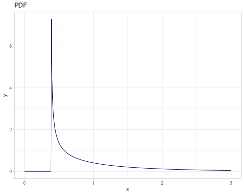</p></div></td><td><div class="clay-image"><p>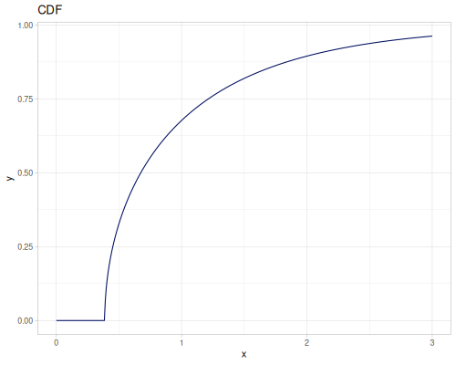</p></div></td><td><div class="clay-image"><p>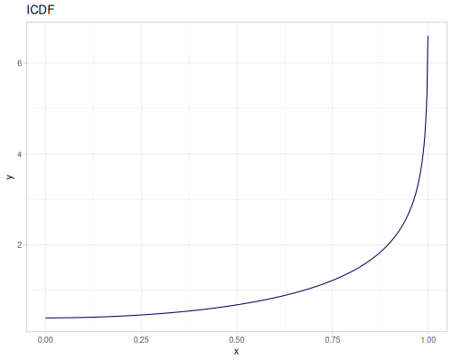</p></div></td></tr></tbody></table></dd></dl></td></tr><tr><td><dl><dt><div><pre><code class="sourceCode language-clojure source-clojure bg-light">{:n 5}</code></pre></div></dt><dd><table class="table table-hover table-responsive clay-table"><tbody><tr><td><div class="clay-image"><p>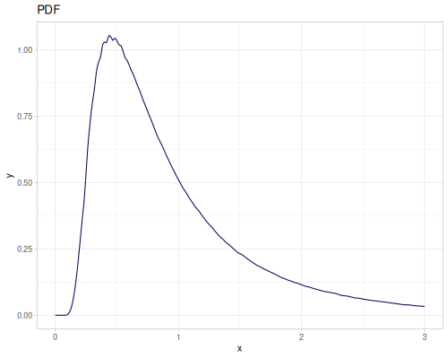</p></div></td><td><div class="clay-image"><p>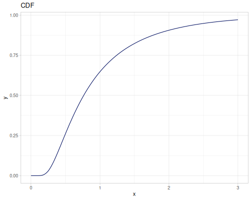</p></div></td><td><div class="clay-image"><p>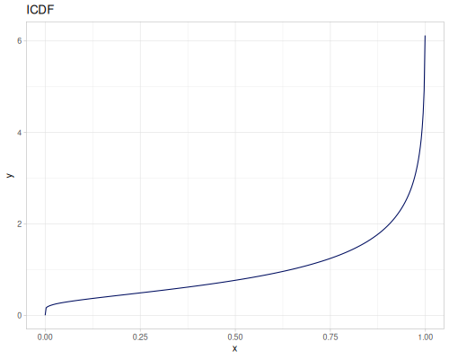</p></div></td></tr></tbody></table></dd></dl></td></tr></tbody></table>
```

:::


#### Beta


* Name: `:beta`
* Default parameters:
   * `:alpha`: $2.0$
   * `:beta`: $5.0$
* [wiki](https://en.wikipedia.org/wiki/Beta_distribution), [source](https://commons.apache.org/proper/commons-math/javadocs/api-3.6.1/org/apache/commons/math3/distribution/BetaDistribution.html)

::: {.clay-table}

```{=html}
<table class="table table-hover table-responsive clay-table"><tbody><tr><td><dl><dt><div><pre><code class="sourceCode language-clojure source-clojure bg-light">{:alpha 1, :beta 1}</code></pre></div></dt><dd><table class="table table-hover table-responsive clay-table"><tbody><tr><td><div class="clay-image"><p>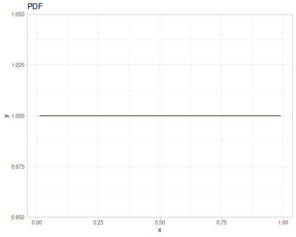</p></div></td><td><div class="clay-image"><p>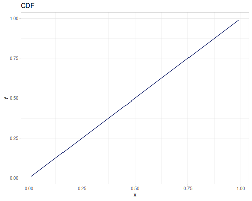</p></div></td><td><div class="clay-image"><p></p></div></td></tr></tbody></table></dd></dl></td></tr><tr><td><dl><dt><div><pre><code class="sourceCode language-clojure source-clojure bg-light">{:alpha 0.5, :beta 0.5}</code></pre></div></dt><dd><table class="table table-hover table-responsive clay-table"><tbody><tr><td><div class="clay-image"><p>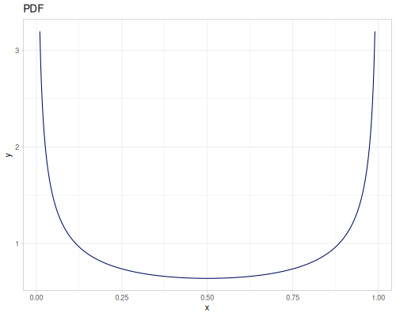</p></div></td><td><div class="clay-image"><p>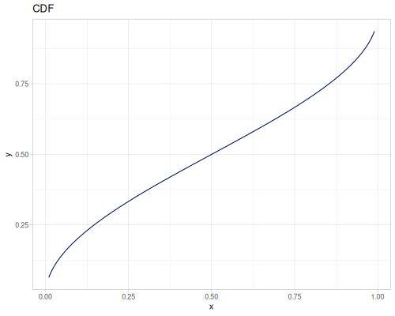</p></div></td><td><div class="clay-image"><p>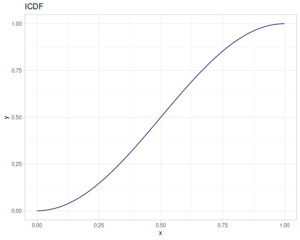</p></div></td></tr></tbody></table></dd></dl></td></tr><tr><td><dl><dt><div><pre><code class="sourceCode language-clojure source-clojure bg-light">{:alpha 3, :beta 3}</code></pre></div></dt><dd><table class="table table-hover table-responsive clay-table"><tbody><tr><td><div class="clay-image"><p>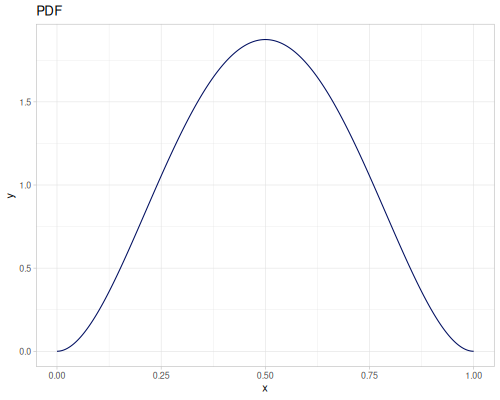</p></div></td><td><div class="clay-image"><p>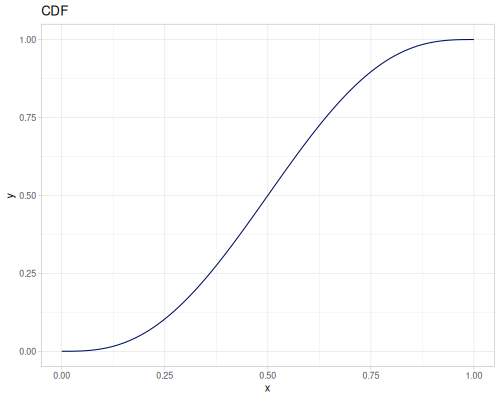</p></div></td><td><div class="clay-image"><p>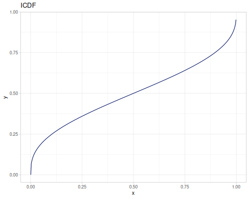</p></div></td></tr></tbody></table></dd></dl></td></tr><tr><td><dl><dt><div><pre><code class="sourceCode language-clojure source-clojure bg-light">{:alpha 5, :beta 2}</code></pre></div></dt><dd><table class="table table-hover table-responsive clay-table"><tbody><tr><td><div class="clay-image"><p>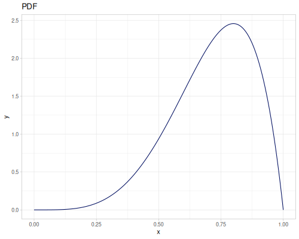</p></div></td><td><div class="clay-image"><p>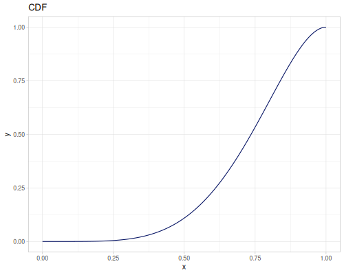</p></div></td><td><div class="clay-image"><p>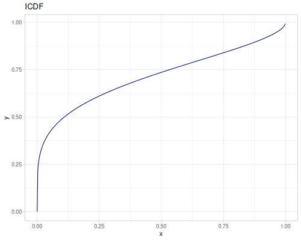</p></div></td></tr></tbody></table></dd></dl></td></tr></tbody></table>
```

:::


#### Cauchy


* Name `:cauchy`
* Default parameters:
   * `:median`, location: $0.0$
   * `:scale`: $1.0$
* [wiki](https://en.wikipedia.org/wiki/Cauchy_distribution), [source](https://commons.apache.org/proper/commons-math/javadocs/api-3.6.1/org/apache/commons/math3/distribution/CauchyDistribution.html)

::: {.clay-table}

```{=html}
<table class="table table-hover table-responsive clay-table"><tbody><tr><td><dl><dt><div><pre><code class="sourceCode language-clojure source-clojure bg-light">{:median 0, :scale 1}</code></pre></div></dt><dd><table class="table table-hover table-responsive clay-table"><tbody><tr><td><div class="clay-image"><p>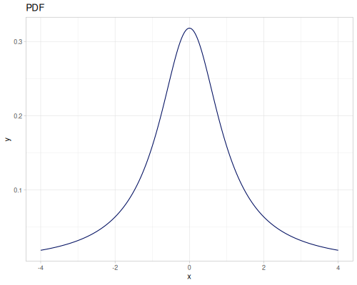</p></div></td><td><div class="clay-image"><p>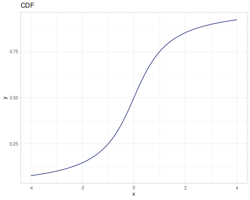</p></div></td><td><div class="clay-image"><p>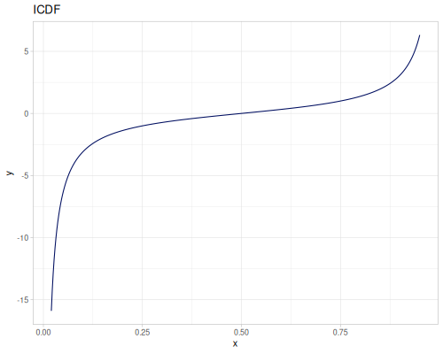</p></div></td></tr></tbody></table></dd></dl></td></tr><tr><td><dl><dt><div><pre><code class="sourceCode language-clojure source-clojure bg-light">{:median 1, :scale 0.5}</code></pre></div></dt><dd><table class="table table-hover table-responsive clay-table"><tbody><tr><td><div class="clay-image"><p>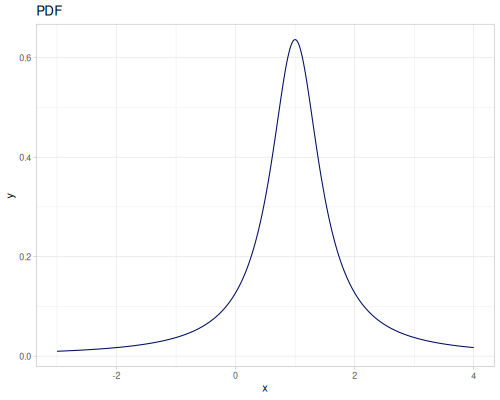</p></div></td><td><div class="clay-image"><p>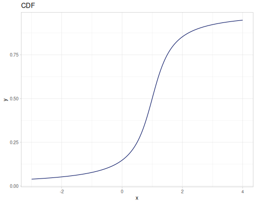</p></div></td><td><div class="clay-image"><p>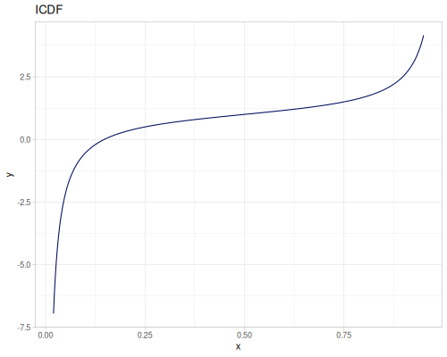</p></div></td></tr></tbody></table></dd></dl></td></tr></tbody></table>
```

:::


#### Chi


* Name: `:chi`
* Default parameters:
   * `:nu`, degrees of freedom: $1.0$
* [wiki](https://en.wikipedia.org/wiki/Chi_distribution), [source](http://umontreal-simul.github.io/ssj/docs/master/classumontreal_1_1ssj_1_1probdist_1_1ChiDist.html)

::: {.clay-table}

```{=html}
<table class="table table-hover table-responsive clay-table"><tbody><tr><td><dl><dt><div><pre><code class="sourceCode language-clojure source-clojure bg-light">{:nu 1}</code></pre></div></dt><dd><table class="table table-hover table-responsive clay-table"><tbody><tr><td><div class="clay-image"><p>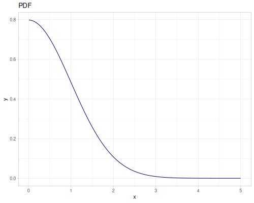</p></div></td><td><div class="clay-image"><p>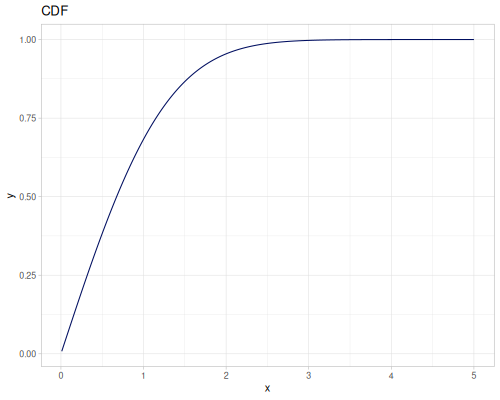</p></div></td><td><div class="clay-image"><p></p></div></td></tr></tbody></table></dd></dl></td></tr><tr><td><dl><dt><div><pre><code class="sourceCode language-clojure source-clojure bg-light">{:nu 3}</code></pre></div></dt><dd><table class="table table-hover table-responsive clay-table"><tbody><tr><td><div class="clay-image"><p>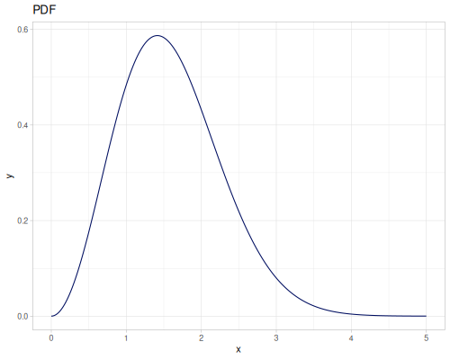</p></div></td><td><div class="clay-image"><p>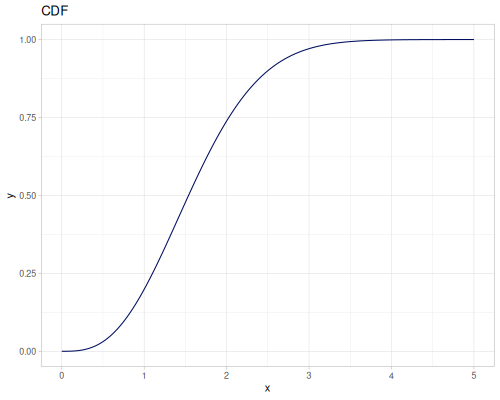</p></div></td><td><div class="clay-image"><p>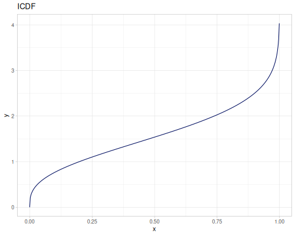</p></div></td></tr></tbody></table></dd></dl></td></tr></tbody></table>
```

:::


#### Chi-squared


* Name: `:chi-squered`
* Default parameters:
   * `:degrees-of-freedom`: $1.0$
* [wiki](https://en.wikipedia.org/wiki/Chi-squared_distribution), [source](https://commons.apache.org/proper/commons-math/javadocs/api-3.6.1/org/apache/commons/math3/distribution/ChiSquaredDistribution.html)

::: {.clay-table}

```{=html}
<table class="table table-hover table-responsive clay-table"><tbody><tr><td><dl><dt><div><pre><code class="sourceCode language-clojure source-clojure bg-light">{:degrees-of-freedom 1}</code></pre></div></dt><dd><table class="table table-hover table-responsive clay-table"><tbody><tr><td><div class="clay-image"><p>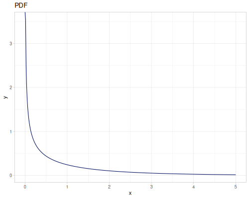</p></div></td><td><div class="clay-image"><p>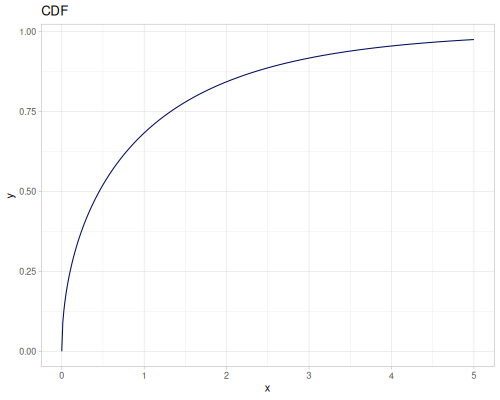</p></div></td><td><div class="clay-image"><p>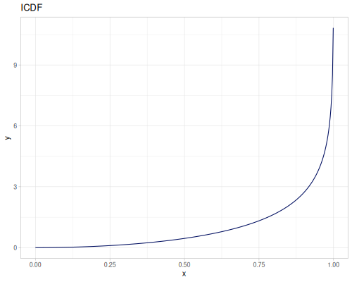</p></div></td></tr></tbody></table></dd></dl></td></tr><tr><td><dl><dt><div><pre><code class="sourceCode language-clojure source-clojure bg-light">{:degrees-of-freedom 3}</code></pre></div></dt><dd><table class="table table-hover table-responsive clay-table"><tbody><tr><td><div class="clay-image"><p>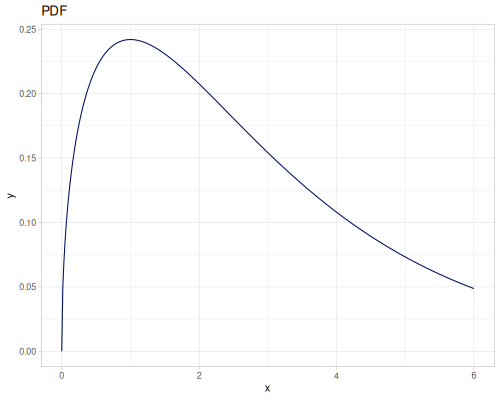</p></div></td><td><div class="clay-image"><p>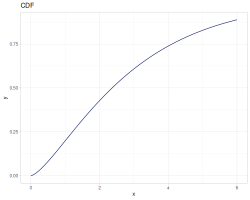</p></div></td><td><div class="clay-image"><p>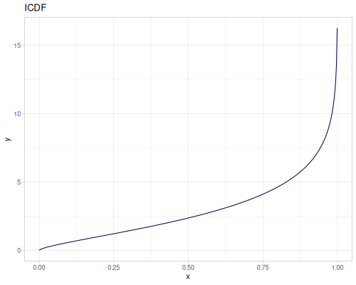</p></div></td></tr></tbody></table></dd></dl></td></tr></tbody></table>
```

:::


#### Chi-squared noncentral


* Name: `:chi-squared-noncentral`
* Default parameters:
   * `:nu`, degrees-of-freedom: $1.0$
   * `:lambda`, noncentrality: $1.0$
* [source](http://umontreal-simul.github.io/ssj/docs/master/classumontreal_1_1ssj_1_1probdist_1_1ChiSquareNoncentralDist.html)

::: {.clay-table}

```{=html}
<table class="table table-hover table-responsive clay-table"><tbody><tr><td><dl><dt><div><pre><code class="sourceCode language-clojure source-clojure bg-light">{:nu 1, :lambda 1}</code></pre></div></dt><dd><table class="table table-hover table-responsive clay-table"><tbody><tr><td><div class="clay-image"><p>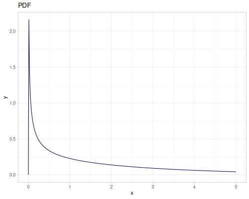</p></div></td><td><div class="clay-image"><p>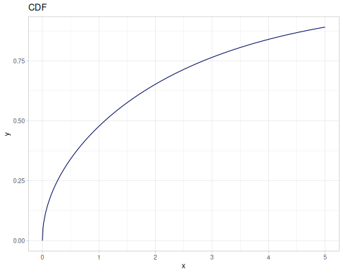</p></div></td><td><div class="clay-image"><p>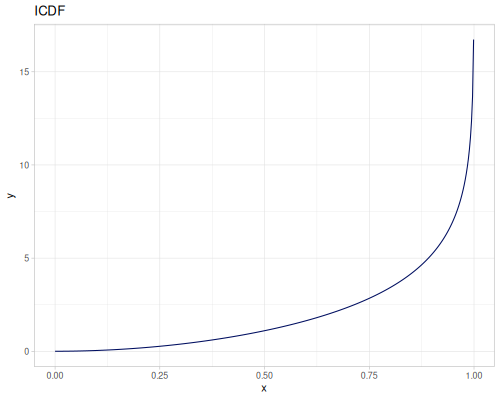</p></div></td></tr></tbody></table></dd></dl></td></tr><tr><td><dl><dt><div><pre><code class="sourceCode language-clojure source-clojure bg-light">{:nu 3, :lambda 2}</code></pre></div></dt><dd><table class="table table-hover table-responsive clay-table"><tbody><tr><td><div class="clay-image"><p>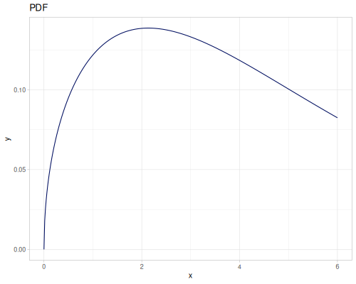</p></div></td><td><div class="clay-image"><p>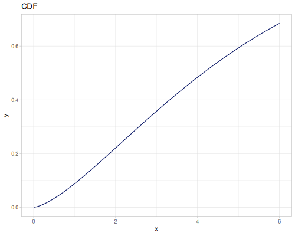</p></div></td><td><div class="clay-image"><p>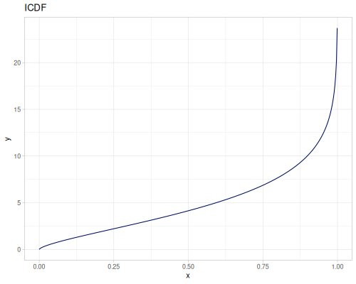</p></div></td></tr></tbody></table></dd></dl></td></tr></tbody></table>
```

:::


#### Cramer-von Mises

Distribution of Cramer-von Mises statistic $W^2$ on $n$ independent uniforms $U[0,1]$.


* Name: `:cramer-von-mises`
* Default parameters
   * `:n`: $1$
* [source](http://umontreal-simul.github.io/ssj/docs/master/classumontreal_1_1ssj_1_1probdist_1_1CramerVonMisesDist.html)

Note: PDF is calculated using finite difference method from CDF.

::: {.clay-table}

```{=html}
<table class="table table-hover table-responsive clay-table"><tbody><tr><td><dl><dt><div><pre><code class="sourceCode language-clojure source-clojure bg-light">{:n 1}</code></pre></div></dt><dd><table class="table table-hover table-responsive clay-table"><tbody><tr><td><div class="clay-image"><p>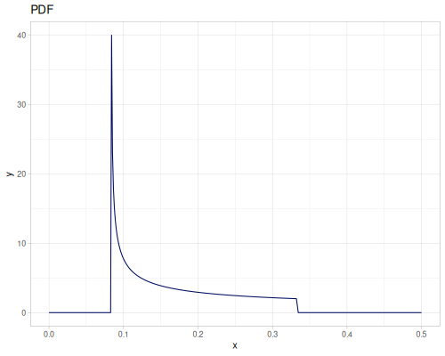</p></div></td><td><div class="clay-image"><p>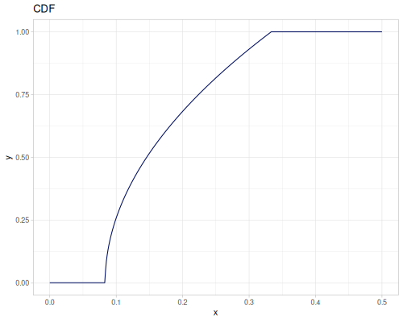</p></div></td><td><div class="clay-image"><p>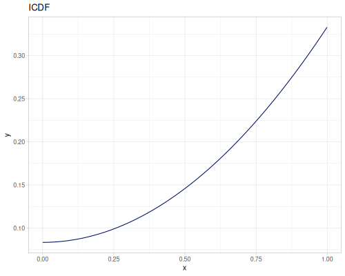</p></div></td></tr></tbody></table></dd></dl></td></tr><tr><td><dl><dt><div><pre><code class="sourceCode language-clojure source-clojure bg-light">{:n 5}</code></pre></div></dt><dd><table class="table table-hover table-responsive clay-table"><tbody><tr><td><div class="clay-image"><p>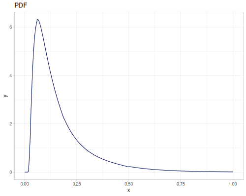</p></div></td><td><div class="clay-image"><p>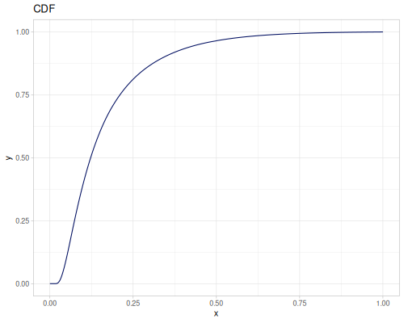</p></div></td><td><div class="clay-image"><p>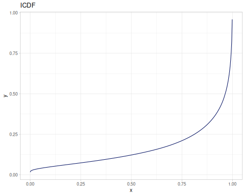</p></div></td></tr></tbody></table></dd></dl></td></tr></tbody></table>
```

:::


#### Erlang


* Name: `:erlang`
* Default parameters
   * `:k`, shape: $1.0$
   * `:lambda`, scale: $1.0$ 
* [wiki](https://en.wikipedia.org/wiki/Erlang_distribution), [source](http://umontreal-simul.github.io/ssj/docs/master/classumontreal_1_1ssj_1_1probdist_1_1ErlangDist.html)

::: {.clay-table}

```{=html}
<table class="table table-hover table-responsive clay-table"><tbody><tr><td><dl><dt><div><pre><code class="sourceCode language-clojure source-clojure bg-light">{:k 1, :lambda 1}</code></pre></div></dt><dd><table class="table table-hover table-responsive clay-table"><tbody><tr><td><div class="clay-image"><p></p></div></td><td><div class="clay-image"><p></p></div></td><td><div class="clay-image"><p></p></div></td></tr></tbody></table></dd></dl></td></tr><tr><td><dl><dt><div><pre><code class="sourceCode language-clojure source-clojure bg-light">{:k 7, :lambda 2.0}</code></pre></div></dt><dd><table class="table table-hover table-responsive clay-table"><tbody><tr><td><div class="clay-image"><p>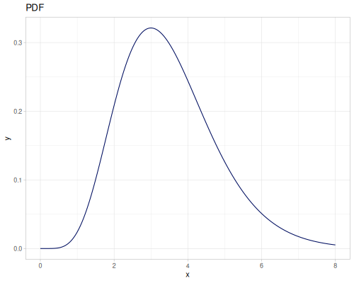</p></div></td><td><div class="clay-image"><p>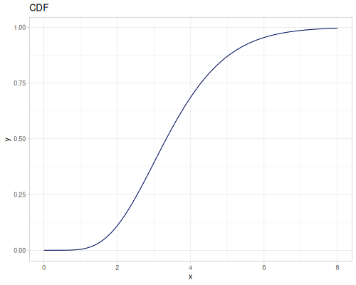</p></div></td><td><div class="clay-image"><p>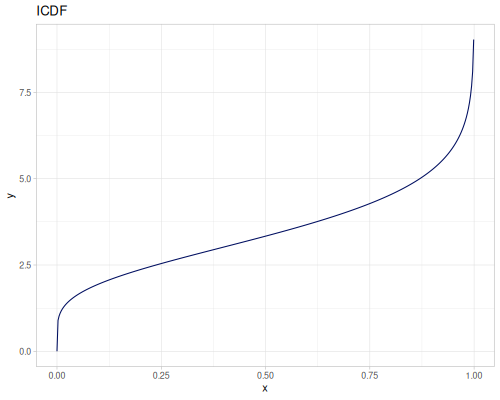</p></div></td></tr></tbody></table></dd></dl></td></tr></tbody></table>
```

:::


#### ex-Gaussian


* Name: `:exgaus`
* Default parameters
   * `:mu`, mean: $5.0$
   * `:sigma`, standard deviation: $1.0$
   * `:nu`, mean of exponential variable: $1.0$ 
* [wiki](https://en.wikipedia.org/wiki/Exponentially_modified_Gaussian_distribution), [source](https://search.r-project.org/CRAN/refmans/gamlss.dist/html/exGAUS.html)

::: {.clay-table}

```{=html}
<table class="table table-hover table-responsive clay-table"><tbody><tr><td><dl><dt><div><pre><code class="sourceCode language-clojure source-clojure bg-light">{:mu 0, :sigma 1, :nu 1}</code></pre></div></dt><dd><table class="table table-hover table-responsive clay-table"><tbody><tr><td><div class="clay-image"><p>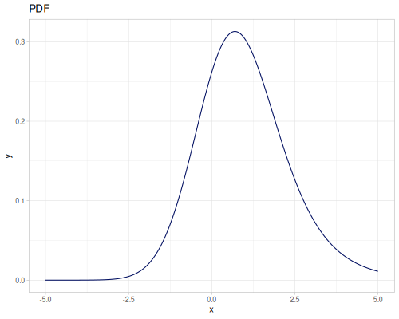</p></div></td><td><div class="clay-image"><p></p></div></td><td><div class="clay-image"><p></p></div></td></tr></tbody></table></dd></dl></td></tr><tr><td><dl><dt><div><pre><code class="sourceCode language-clojure source-clojure bg-light">{:mu -2, :sigma 0.5, :nu 4}</code></pre></div></dt><dd><table class="table table-hover table-responsive clay-table"><tbody><tr><td><div class="clay-image"><p></p></div></td><td><div class="clay-image"><p></p></div></td><td><div class="clay-image"><p></p></div></td></tr></tbody></table></dd></dl></td></tr></tbody></table>
```

:::


#### Exponential


* Name: `:exponential`
* Default parameters
   * `:mean`: $1.0$
* [wiki](https://en.wikipedia.org/wiki/Exponential_distribution), [source](https://commons.apache.org/proper/commons-math/javadocs/api-3.6.1/org/apache/commons/math3/distribution/ExponentialDistribution.html)

::: {.clay-table}

```{=html}
<table class="table table-hover table-responsive clay-table"><tbody><tr><td><dl><dt><div><pre><code class="sourceCode language-clojure source-clojure bg-light">{:mean 1}</code></pre></div></dt><dd><table class="table table-hover table-responsive clay-table"><tbody><tr><td><div class="clay-image"><p></p></div></td><td><div class="clay-image"><p></p></div></td><td><div class="clay-image"><p></p></div></td></tr></tbody></table></dd></dl></td></tr><tr><td><dl><dt><div><pre><code class="sourceCode language-clojure source-clojure bg-light">{:mean 3}</code></pre></div></dt><dd><table class="table table-hover table-responsive clay-table"><tbody><tr><td><div class="clay-image"><p></p></div></td><td><div class="clay-image"><p></p></div></td><td><div class="clay-image"><p></p></div></td></tr></tbody></table></dd></dl></td></tr></tbody></table>
```

:::


#### F


* Name: `:f`
* Default parameters
   * `:numerator-degrees-of-freedom`: $1.0$
   * `:denominator-degrees-of-freedom`: $1.0$
* [wiki](https://en.wikipedia.org/wiki/F-distribution), [source](https://commons.apache.org/proper/commons-math/javadocs/api-3.6.1/org/apache/commons/math3/distribution/FDistribution.html)

::: {.clay-table}

```{=html}
<table class="table table-hover table-responsive clay-table"><tbody><tr><td><dl><dt><div><pre><code class="sourceCode language-clojure source-clojure bg-light">{:numerator-degrees-of-freedom 1, :denominator-degrees-of-freedom 1}</code></pre></div></dt><dd><table class="table table-hover table-responsive clay-table"><tbody><tr><td><div class="clay-image"><p></p></div></td><td><div class="clay-image"><p></p></div></td><td><div class="clay-image"><p></p></div></td></tr></tbody></table></dd></dl></td></tr><tr><td><dl><dt><div><pre><code class="sourceCode language-clojure source-clojure bg-light">{:numerator-degrees-of-freedom 10, :denominator-degrees-of-freedom 15}</code></pre></div></dt><dd><table class="table table-hover table-responsive clay-table"><tbody><tr><td><div class="clay-image"><p></p></div></td><td><div class="clay-image"><p></p></div></td><td><div class="clay-image"><p></p></div></td></tr></tbody></table></dd></dl></td></tr></tbody></table>
```

:::


#### Fatigue life


* Name: `:fatigue-life`
* Default parameters
   * `:mu`, location: $0.0$
   * `:beta`, scale: $1.0$
   * `:gamma`, shape: $1.0$
* [wiki](https://en.wikipedia.org/wiki/Birnbaum%E2%80%93Saunders_distribution), [source](http://umontreal-simul.github.io/ssj/docs/master/classumontreal_1_1ssj_1_1probdist_1_1FatigueLifeDist.html)

::: {.clay-table}

```{=html}
<table class="table table-hover table-responsive clay-table"><tbody><tr><td><dl><dt><div><pre><code class="sourceCode language-clojure source-clojure bg-light">{:mu 0, :beta 1, :gamma 1}</code></pre></div></dt><dd><table class="table table-hover table-responsive clay-table"><tbody><tr><td><div class="clay-image"><p></p></div></td><td><div class="clay-image"><p></p></div></td><td><div class="clay-image"><p></p></div></td></tr></tbody></table></dd></dl></td></tr><tr><td><dl><dt><div><pre><code class="sourceCode language-clojure source-clojure bg-light">{:mu -1, :beta 3, :gamma 0.5}</code></pre></div></dt><dd><table class="table table-hover table-responsive clay-table"><tbody><tr><td><div class="clay-image"><p></p></div></td><td><div class="clay-image"><p></p></div></td><td><div class="clay-image"><p></p></div></td></tr></tbody></table></dd></dl></td></tr></tbody></table>
```

:::


#### Folded Normal


* Name: `:folded-normal`
* Default parameters
   * `:mu`: $0.0$
   * `:sigma`: $1.0$
* [wiki](https://en.wikipedia.org/wiki/Folded_normal_distribution), [source](http://umontreal-simul.github.io/ssj/docs/master/classumontreal_1_1ssj_1_1probdist_1_1FoldedNormalDist.html)

::: {.clay-table}

```{=html}
<table class="table table-hover table-responsive clay-table"><tbody><tr><td><dl><dt><div><pre><code class="sourceCode language-clojure source-clojure bg-light">{:mu 0, :sigma 1}</code></pre></div></dt><dd><table class="table table-hover table-responsive clay-table"><tbody><tr><td><div class="clay-image"><p></p></div></td><td><div class="clay-image"><p></p></div></td><td><div class="clay-image"><p></p></div></td></tr></tbody></table></dd></dl></td></tr><tr><td><dl><dt><div><pre><code class="sourceCode language-clojure source-clojure bg-light">{:mu 2, :sigma 1}</code></pre></div></dt><dd><table class="table table-hover table-responsive clay-table"><tbody><tr><td><div class="clay-image"><p></p></div></td><td><div class="clay-image"><p></p></div></td><td><div class="clay-image"><p></p></div></td></tr></tbody></table></dd></dl></td></tr></tbody></table>
```

:::


#### Frechet


* Name: `:frechet`
* Default parameters
   * `:delta`, location: $0.0$
   * `:alpha`, shape: $1.0$
   * `:beta`, scale: $1.0$
* [wiki](https://en.wikipedia.org/wiki/Fr%C3%A9chet_distribution), [source](http://umontreal-simul.github.io/ssj/docs/master/classumontreal_1_1ssj_1_1probdist_1_1FrechetDist.html)

::: {.clay-table}

```{=html}
<table class="table table-hover table-responsive clay-table"><tbody><tr><td><dl><dt><div><pre><code class="sourceCode language-clojure source-clojure bg-light">{:delta 0, :alpha 1, :beta 1}</code></pre></div></dt><dd><table class="table table-hover table-responsive clay-table"><tbody><tr><td><div class="clay-image"><p></p></div></td><td><div class="clay-image"><p></p></div></td><td><div class="clay-image"><p></p></div></td></tr></tbody></table></dd></dl></td></tr><tr><td><dl><dt><div><pre><code class="sourceCode language-clojure source-clojure bg-light">{:delta 1, :alpha 3, :beta 0.5}</code></pre></div></dt><dd><table class="table table-hover table-responsive clay-table"><tbody><tr><td><div class="clay-image"><p></p></div></td><td><div class="clay-image"><p></p></div></td><td><div class="clay-image"><p></p></div></td></tr></tbody></table></dd></dl></td></tr></tbody></table>
```

:::


#### Gamma


* Name: `:gamma`
* Default parameters
   * `:shape`: $2.0$
   * `:scale`: $2.0$
* [wiki](https://en.wikipedia.org/wiki/Gamma_distribution), [source](https://commons.apache.org/proper/commons-math/javadocs/api-3.6.1/org/apache/commons/math3/distribution/GammaDistribution.html)

::: {.clay-table}

```{=html}
<table class="table table-hover table-responsive clay-table"><tbody><tr><td><dl><dt><div><pre><code class="sourceCode language-clojure source-clojure bg-light">{:shape 2, :scale 2}</code></pre></div></dt><dd><table class="table table-hover table-responsive clay-table"><tbody><tr><td><div class="clay-image"><p></p></div></td><td><div class="clay-image"><p></p></div></td><td><div class="clay-image"><p></p></div></td></tr></tbody></table></dd></dl></td></tr><tr><td><dl><dt><div><pre><code class="sourceCode language-clojure source-clojure bg-light">{:shape 5, :scale 0.5}</code></pre></div></dt><dd><table class="table table-hover table-responsive clay-table"><tbody><tr><td><div class="clay-image"><p></p></div></td><td><div class="clay-image"><p></p></div></td><td><div class="clay-image"><p></p></div></td></tr></tbody></table></dd></dl></td></tr></tbody></table>
```

:::


#### Gumbel


* Name: `:gumbel`
* Default parameters
   * `:mu`, location: $1.0$
   * `:beta`, scale: $2.0$
* [wiki](https://en.wikipedia.org/wiki/Gumbel_distribution), [source](https://commons.apache.org/proper/commons-math/javadocs/api-3.6.1/org/apache/commons/math3/distribution/GumbelDistribution.html)

::: {.clay-table}

```{=html}
<table class="table table-hover table-responsive clay-table"><tbody><tr><td><dl><dt><div><pre><code class="sourceCode language-clojure source-clojure bg-light">{:mu 1, :beta 2}</code></pre></div></dt><dd><table class="table table-hover table-responsive clay-table"><tbody><tr><td><div class="clay-image"><p></p></div></td><td><div class="clay-image"><p></p></div></td><td><div class="clay-image"><p></p></div></td></tr></tbody></table></dd></dl></td></tr><tr><td><dl><dt><div><pre><code class="sourceCode language-clojure source-clojure bg-light">{:mu 1, :beta 0.5}</code></pre></div></dt><dd><table class="table table-hover table-responsive clay-table"><tbody><tr><td><div class="clay-image"><p></p></div></td><td><div class="clay-image"><p></p></div></td><td><div class="clay-image"><p></p></div></td></tr></tbody></table></dd></dl></td></tr></tbody></table>
```

:::


#### Half Cauchy


* Name: `:half-cauchy`
* Default parameters
   * `:scale`: $1.0$
* [info](https://distribution-explorer.github.io/continuous/halfcauchy.html)

::: {.clay-table}

```{=html}
<table class="table table-hover table-responsive clay-table"><tbody><tr><td><dl><dt><div><pre><code class="sourceCode language-clojure source-clojure bg-light">{:scale 1}</code></pre></div></dt><dd><table class="table table-hover table-responsive clay-table"><tbody><tr><td><div class="clay-image"><p></p></div></td><td><div class="clay-image"><p></p></div></td><td><div class="clay-image"><p></p></div></td></tr></tbody></table></dd></dl></td></tr><tr><td><dl><dt><div><pre><code class="sourceCode language-clojure source-clojure bg-light">{:scale 2}</code></pre></div></dt><dd><table class="table table-hover table-responsive clay-table"><tbody><tr><td><div class="clay-image"><p></p></div></td><td><div class="clay-image"><p></p></div></td><td><div class="clay-image"><p></p></div></td></tr></tbody></table></dd></dl></td></tr></tbody></table>
```

:::


#### Half Normal


* Name: `:half-normal`
* Default parameters
   * `:sigma`: $1.0$
* [wiki](https://en.wikipedia.org/wiki/Half-normal_distribution)

::: {.clay-table}

```{=html}
<table class="table table-hover table-responsive clay-table"><tbody><tr><td><dl><dt><div><pre><code class="sourceCode language-clojure source-clojure bg-light">{:sigma 1}</code></pre></div></dt><dd><table class="table table-hover table-responsive clay-table"><tbody><tr><td><div class="clay-image"><p></p></div></td><td><div class="clay-image"><p></p></div></td><td><div class="clay-image"><p></p></div></td></tr></tbody></table></dd></dl></td></tr><tr><td><dl><dt><div><pre><code class="sourceCode language-clojure source-clojure bg-light">{:sigma 2}</code></pre></div></dt><dd><table class="table table-hover table-responsive clay-table"><tbody><tr><td><div class="clay-image"><p></p></div></td><td><div class="clay-image"><p></p></div></td><td><div class="clay-image"><p></p></div></td></tr></tbody></table></dd></dl></td></tr></tbody></table>
```

:::


#### Hyperbolic secant


* Name: `:hyperbolic-secant`
* Default parameters
   * `:mu`: $0.0$
   * `:sigma`, scale: $1.0$
* [wiki](https://en.wikipedia.org/wiki/Hyperbolic_secant_distribution), [source](http://umontreal-simul.github.io/ssj/docs/master/classumontreal_1_1ssj_1_1probdist_1_1HyperbolicSecantDist.html)

::: {.clay-table}

```{=html}
<table class="table table-hover table-responsive clay-table"><tbody><tr><td><dl><dt><div><pre><code class="sourceCode language-clojure source-clojure bg-light">{:mu 0, :sigma 1}</code></pre></div></dt><dd><table class="table table-hover table-responsive clay-table"><tbody><tr><td><div class="clay-image"><p></p></div></td><td><div class="clay-image"><p></p></div></td><td><div class="clay-image"><p></p></div></td></tr></tbody></table></dd></dl></td></tr><tr><td><dl><dt><div><pre><code class="sourceCode language-clojure source-clojure bg-light">{:mu 1, :sigma 2}</code></pre></div></dt><dd><table class="table table-hover table-responsive clay-table"><tbody><tr><td><div class="clay-image"><p></p></div></td><td><div class="clay-image"><p></p></div></td><td><div class="clay-image"><p></p></div></td></tr></tbody></table></dd></dl></td></tr></tbody></table>
```

:::


#### Hypoexponential


* Name: `:hypoexponential`
* Default parameters
   * `:lambdas`, list of rates: `[1.0]`
* [wiki](https://en.wikipedia.org/wiki/Hypoexponential_distribution), [source](http://umontreal-simul.github.io/ssj/docs/master/classumontreal_1_1ssj_1_1probdist_1_1HypoExponentialDist.html)

::: {.clay-table}

```{=html}
<table class="table table-hover table-responsive clay-table"><tbody><tr><td><dl><dt><div><pre><code class="sourceCode language-clojure source-clojure bg-light">{:lambdas [1]}</code></pre></div></dt><dd><table class="table table-hover table-responsive clay-table"><tbody><tr><td><div class="clay-image"><p></p></div></td><td><div class="clay-image"><p></p></div></td><td><div class="clay-image"><p></p></div></td></tr></tbody></table></dd></dl></td></tr><tr><td><dl><dt><div><pre><code class="sourceCode language-clojure source-clojure bg-light">{:lambdas [1 2 3 4 1]}</code></pre></div></dt><dd><table class="table table-hover table-responsive clay-table"><tbody><tr><td><div class="clay-image"><p></p></div></td><td><div class="clay-image"><p></p></div></td><td><div class="clay-image"><p></p></div></td></tr></tbody></table></dd></dl></td></tr></tbody></table>
```

:::


#### Hypoexponential equal

Hypoexponential distribution, where $\lambda_i=(n+1-i)h,\text{ for } i=1\dots k$


* Name: `:hypoexponential-equal`
* Default parameters
   * `:k`, number of rates: $1$
   * `:h`, difference between rates: $1$
   * `:n` $=\frac{\lambda_1}{h}$: $1$
* [source](http://umontreal-simul.github.io/ssj/docs/master/classumontreal_1_1ssj_1_1probdist_1_1HypoExponentialDistEqual.html)

::: {.clay-table}

```{=html}
<table class="table table-hover table-responsive clay-table"><tbody><tr><td><dl><dt><div><pre><code class="sourceCode language-clojure source-clojure bg-light">{:n 1, :k 1, :h 1}</code></pre></div></dt><dd><table class="table table-hover table-responsive clay-table"><tbody><tr><td><div class="clay-image"><p></p></div></td><td><div class="clay-image"><p></p></div></td><td><div class="clay-image"><p></p></div></td></tr></tbody></table></dd></dl></td></tr><tr><td><dl><dt><div><pre><code class="sourceCode language-clojure source-clojure bg-light">{:n 5, :h 0.5, :k 6}</code></pre></div></dt><dd><table class="table table-hover table-responsive clay-table"><tbody><tr><td><div class="clay-image"><p></p></div></td><td><div class="clay-image"><p></p></div></td><td><div class="clay-image"><p></p></div></td></tr></tbody></table></dd></dl></td></tr></tbody></table>
```

:::


#### Inverse Gamma


* Name: `:inverse-gamma`
* Default parameters
   * `:alpha`, shape: $2.0$
   * `:beta`, scale: $1.0$
*[wiki](https://en.wikipedia.org/wiki/Inverse-gamma_distribution), [source](http://umontreal-simul.github.io/ssj/docs/master/classumontreal_1_1ssj_1_1probdist_1_1InverseGammaDist.html)

::: {.clay-table}

```{=html}
<table class="table table-hover table-responsive clay-table"><tbody><tr><td><dl><dt><div><pre><code class="sourceCode language-clojure source-clojure bg-light">{:alpha 2, :beta 1}</code></pre></div></dt><dd><table class="table table-hover table-responsive clay-table"><tbody><tr><td><div class="clay-image"><p></p></div></td><td><div class="clay-image"><p></p></div></td><td><div class="clay-image"><p></p></div></td></tr></tbody></table></dd></dl></td></tr><tr><td><dl><dt><div><pre><code class="sourceCode language-clojure source-clojure bg-light">{:alpha 1.5, :beta 2}</code></pre></div></dt><dd><table class="table table-hover table-responsive clay-table"><tbody><tr><td><div class="clay-image"><p></p></div></td><td><div class="clay-image"><p></p></div></td><td><div class="clay-image"><p></p></div></td></tr></tbody></table></dd></dl></td></tr></tbody></table>
```

:::


#### Inverse Gaussian


* Name: `:inverse-gaussian`
* Default parameters
   * `:mu`, location: $1.0$
   * `:lambda`, scale: $1.0$
*[wiki](https://en.wikipedia.org/wiki/Inverse_Gaussian_distribution), [source](http://umontreal-simul.github.io/ssj/docs/master/classumontreal_1_1ssj_1_1probdist_1_1InverseGaussianDist.html)

::: {.clay-table}

```{=html}
<table class="table table-hover table-responsive clay-table"><tbody><tr><td><dl><dt><div><pre><code class="sourceCode language-clojure source-clojure bg-light">{:mu 1, :lambda 1}</code></pre></div></dt><dd><table class="table table-hover table-responsive clay-table"><tbody><tr><td><div class="clay-image"><p></p></div></td><td><div class="clay-image"><p></p></div></td><td><div class="clay-image"><p></p></div></td></tr></tbody></table></dd></dl></td></tr><tr><td><dl><dt><div><pre><code class="sourceCode language-clojure source-clojure bg-light">{:mu 2, :lambda 0.5}</code></pre></div></dt><dd><table class="table table-hover table-responsive clay-table"><tbody><tr><td><div class="clay-image"><p></p></div></td><td><div class="clay-image"><p></p></div></td><td><div class="clay-image"><p></p></div></td></tr></tbody></table></dd></dl></td></tr></tbody></table>
```

:::


#### Johnson Sb


* Name: `:johnson-sb`
* Default parameters
   * `:gamma`, shape: $0.0$
   * `:delta`, shape: $1.0$
   * `:xi`, location: $0.0$
   * `:lambda`, scale: $1.0$
* [wiki](https://en.wikipedia.org/wiki/Johnson%27s_SU-distribution#Johnson's_SB-distribution), [source](http://umontreal-simul.github.io/ssj/docs/master/classumontreal_1_1ssj_1_1probdist_1_1JohnsonSBDist.html)

::: {.clay-table}

```{=html}
<table class="table table-hover table-responsive clay-table"><tbody><tr><td><dl><dt><div><pre><code class="sourceCode language-clojure source-clojure bg-light">{:gamma 0, :delta 1, :xi 0, :lambda 1}</code></pre></div></dt><dd><table class="table table-hover table-responsive clay-table"><tbody><tr><td><div class="clay-image"><p></p></div></td><td><div class="clay-image"><p></p></div></td><td><div class="clay-image"><p></p></div></td></tr></tbody></table></dd></dl></td></tr><tr><td><dl><dt><div><pre><code class="sourceCode language-clojure source-clojure bg-light">{:gamma 0.5, :delta 2, :xi 0, :lambda 2}</code></pre></div></dt><dd><table class="table table-hover table-responsive clay-table"><tbody><tr><td><div class="clay-image"><p></p></div></td><td><div class="clay-image"><p></p></div></td><td><div class="clay-image"><p></p></div></td></tr></tbody></table></dd></dl></td></tr></tbody></table>
```

:::


#### Johnson Sl


* Name: `:johnson-sl`
* Default parameters
   * `:gamma`, shape: $0.0$
   * `:delta`, shape: $1.0$
   * `:xi`, location: $0.0$
   * `:lambda`, scale: $1.0$
* [source](http://umontreal-simul.github.io/ssj/docs/master/classumontreal_1_1ssj_1_1probdist_1_1JohnsonSLDist.html)

::: {.clay-table}

```{=html}
<table class="table table-hover table-responsive clay-table"><tbody><tr><td><dl><dt><div><pre><code class="sourceCode language-clojure source-clojure bg-light">{:gamma 0, :delta 1, :xi 0, :lambda 1}</code></pre></div></dt><dd><table class="table table-hover table-responsive clay-table"><tbody><tr><td><div class="clay-image"><p></p></div></td><td><div class="clay-image"><p></p></div></td><td><div class="clay-image"><p></p></div></td></tr></tbody></table></dd></dl></td></tr><tr><td><dl><dt><div><pre><code class="sourceCode language-clojure source-clojure bg-light">{:gamma 0.5, :delta 2, :xi 0, :lambda 2}</code></pre></div></dt><dd><table class="table table-hover table-responsive clay-table"><tbody><tr><td><div class="clay-image"><p></p></div></td><td><div class="clay-image"><p></p></div></td><td><div class="clay-image"><p></p></div></td></tr></tbody></table></dd></dl></td></tr></tbody></table>
```

:::


#### Johnson Su


* Name: `:johnson-su`
* Default parameters
   * `:gamma`, shape: $0.0$
   * `:delta`, shape: $1.0$
   * `:xi`, location: $0.0$
   * `:lambda`, scale: $1.0$
* [wiki](https://en.wikipedia.org/wiki/Johnson%27s_SU-distribution), [source](http://umontreal-simul.github.io/ssj/docs/master/classumontreal_1_1ssj_1_1probdist_1_1JohnsonSUDist.html)


::: {.callout-note}
## ERR
```
Apr 15, 2026 4:08:57 PM clojure.tools.logging$eval21120$fn__21123 invoke
INFO: [:clojisr.v1.session/gc-clean-r-objects {:objects-before 13090, :objects-after 5368}]

```
:::


::: {.clay-table}

```{=html}
<table class="table table-hover table-responsive clay-table"><tbody><tr><td><dl><dt><div><pre><code class="sourceCode language-clojure source-clojure bg-light">{:gamma 0, :delta 1, :xi 0, :lambda 1}</code></pre></div></dt><dd><table class="table table-hover table-responsive clay-table"><tbody><tr><td><div class="clay-image"><p></p></div></td><td><div class="clay-image"><p></p></div></td><td><div class="clay-image"><p></p></div></td></tr></tbody></table></dd></dl></td></tr><tr><td><dl><dt><div><pre><code class="sourceCode language-clojure source-clojure bg-light">{:gamma 0.5, :delta 2, :xi 0, :lambda 2}</code></pre></div></dt><dd><table class="table table-hover table-responsive clay-table"><tbody><tr><td><div class="clay-image"><p></p></div></td><td><div class="clay-image"><p></p></div></td><td><div class="clay-image"><p></p></div></td></tr></tbody></table></dd></dl></td></tr></tbody></table>
```

:::


#### Kolmogorov


* Name: `:kolmogorov`
* [wiki](https://en.wikipedia.org/wiki/Kolmogorov%E2%80%93Smirnov_test#Kolmogorov_distribution), [info](https://www.math.ucla.edu/~tom/distributions/Kolmogorov.html)

::: {.clay-table}

```{=html}
<table class="table table-hover table-responsive clay-table"><tbody><tr><td><div class="clay-image"><p></p></div></td><td><div class="clay-image"><p></p></div></td><td><div class="clay-image"><p></p></div></td></tr></tbody></table>
```

:::


#### Kolmogorov-Smirnov


* Name: `:kolmogorov-smirnov`
* Default parameters
   * `:n`, sample size: 1
* [source](http://umontreal-simul.github.io/ssj/docs/master/classumontreal_1_1ssj_1_1probdist_1_1KolmogorovSmirnovDist.html)

::: {.clay-table}

```{=html}
<table class="table table-hover table-responsive clay-table"><tbody><tr><td><dl><dt><div><pre><code class="sourceCode language-clojure source-clojure bg-light">{:n 1}</code></pre></div></dt><dd><table class="table table-hover table-responsive clay-table"><tbody><tr><td><div class="clay-image"><p></p></div></td><td><div class="clay-image"><p></p></div></td><td><div class="clay-image"><p></p></div></td></tr></tbody></table></dd></dl></td></tr><tr><td><dl><dt><div><pre><code class="sourceCode language-clojure source-clojure bg-light">{:n 10}</code></pre></div></dt><dd><table class="table table-hover table-responsive clay-table"><tbody><tr><td><div class="clay-image"><p></p></div></td><td><div class="clay-image"><p></p></div></td><td><div class="clay-image"><p></p></div></td></tr></tbody></table></dd></dl></td></tr></tbody></table>
```

:::


#### Kolmogorov-Smirnov+


* Name: `:kolmogorov-smirnov+`
* Default parameters
   * `:n`, sample size: 1
* [source](http://umontreal-simul.github.io/ssj/docs/master/classumontreal_1_1ssj_1_1probdist_1_1KolmogorovSmirnovPlusDist.html)

::: {.clay-table}

```{=html}
<table class="table table-hover table-responsive clay-table"><tbody><tr><td><dl><dt><div><pre><code class="sourceCode language-clojure source-clojure bg-light">{:n 1}</code></pre></div></dt><dd><table class="table table-hover table-responsive clay-table"><tbody><tr><td><div class="clay-image"><p></p></div></td><td><div class="clay-image"><p></p></div></td><td><div class="clay-image"><p></p></div></td></tr></tbody></table></dd></dl></td></tr><tr><td><dl><dt><div><pre><code class="sourceCode language-clojure source-clojure bg-light">{:n 10}</code></pre></div></dt><dd><table class="table table-hover table-responsive clay-table"><tbody><tr><td><div class="clay-image"><p></p></div></td><td><div class="clay-image"><p></p></div></td><td><div class="clay-image"><p></p></div></td></tr></tbody></table></dd></dl></td></tr></tbody></table>
```

:::


#### Laplace


* Name: `:laplace`
* Default parameters
   * `:mu`: $0.0$
   * `:beta`, scale: $1.0$
* [wiki](https://en.wikipedia.org/wiki/Laplace_distribution), [source](https://commons.apache.org/proper/commons-math/javadocs/api-3.6.1/org/apache/commons/math3/distribution/LaplaceDistribution.html)

::: {.clay-table}

```{=html}
<table class="table table-hover table-responsive clay-table"><tbody><tr><td><dl><dt><div><pre><code class="sourceCode language-clojure source-clojure bg-light">{:mu 0, :beta 1}</code></pre></div></dt><dd><table class="table table-hover table-responsive clay-table"><tbody><tr><td><div class="clay-image"><p></p></div></td><td><div class="clay-image"><p></p></div></td><td><div class="clay-image"><p></p></div></td></tr></tbody></table></dd></dl></td></tr><tr><td><dl><dt><div><pre><code class="sourceCode language-clojure source-clojure bg-light">{:mu 1, :beta 2}</code></pre></div></dt><dd><table class="table table-hover table-responsive clay-table"><tbody><tr><td><div class="clay-image"><p></p></div></td><td><div class="clay-image"><p></p></div></td><td><div class="clay-image"><p></p></div></td></tr></tbody></table></dd></dl></td></tr></tbody></table>
```

:::


#### Levy


* Name: `:levy`
* Default parameters
   * `:mu`: $0.0$
   * `:c`, scale: $1.0$
* [wiki](https://en.wikipedia.org/wiki/L%C3%A9vy_distribution), [source](https://commons.apache.org/proper/commons-math/javadocs/api-3.6.1/org/apache/commons/math3/distribution/LevyDistribution.html)

::: {.clay-table}

```{=html}
<table class="table table-hover table-responsive clay-table"><tbody><tr><td><dl><dt><div><pre><code class="sourceCode language-clojure source-clojure bg-light">{:mu 0, :c 1}</code></pre></div></dt><dd><table class="table table-hover table-responsive clay-table"><tbody><tr><td><div class="clay-image"><p></p></div></td><td><div class="clay-image"><p></p></div></td><td><div class="clay-image"><p></p></div></td></tr></tbody></table></dd></dl></td></tr><tr><td><dl><dt><div><pre><code class="sourceCode language-clojure source-clojure bg-light">{:mu 1, :c 2}</code></pre></div></dt><dd><table class="table table-hover table-responsive clay-table"><tbody><tr><td><div class="clay-image"><p></p></div></td><td><div class="clay-image"><p></p></div></td><td><div class="clay-image"><p></p></div></td></tr></tbody></table></dd></dl></td></tr></tbody></table>
```

:::


#### Log Logistic


* Name: `:log-logistic`
* Default parameters
   * `:alpha`, shape: $3.0$
   * `:beta`, scale: $1.0$
* [wiki](https://en.wikipedia.org/wiki/Log-logistic_distribution), [source](http://umontreal-simul.github.io/ssj/docs/master/classumontreal_1_1ssj_1_1probdist_1_1LoglogisticDist.html)

::: {.clay-table}

```{=html}
<table class="table table-hover table-responsive clay-table"><tbody><tr><td><dl><dt><div><pre><code class="sourceCode language-clojure source-clojure bg-light">{:alpha 3, :beta 1}</code></pre></div></dt><dd><table class="table table-hover table-responsive clay-table"><tbody><tr><td><div class="clay-image"><p></p></div></td><td><div class="clay-image"><p></p></div></td><td><div class="clay-image"><p></p></div></td></tr></tbody></table></dd></dl></td></tr><tr><td><dl><dt><div><pre><code class="sourceCode language-clojure source-clojure bg-light">{:alpha 5, :beta 2}</code></pre></div></dt><dd><table class="table table-hover table-responsive clay-table"><tbody><tr><td><div class="clay-image"><p></p></div></td><td><div class="clay-image"><p></p></div></td><td><div class="clay-image"><p></p></div></td></tr></tbody></table></dd></dl></td></tr></tbody></table>
```

:::


#### Log Normal


* Name: `:log-normal`
* Default parameters
   * `:scale`: $1.0$
   * `:shape`: $1.0$
* [wiki](https://en.wikipedia.org/wiki/Log-normal_distribution), [source](https://commons.apache.org/proper/commons-math/javadocs/api-3.6.1/org/apache/commons/math3/distribution/LogNormalDistribution.html)

::: {.clay-table}

```{=html}
<table class="table table-hover table-responsive clay-table"><tbody><tr><td><dl><dt><div><pre><code class="sourceCode language-clojure source-clojure bg-light">{:scale 1, :shape 1}</code></pre></div></dt><dd><table class="table table-hover table-responsive clay-table"><tbody><tr><td><div class="clay-image"><p></p></div></td><td><div class="clay-image"><p></p></div></td><td><div class="clay-image"><p></p></div></td></tr></tbody></table></dd></dl></td></tr><tr><td><dl><dt><div><pre><code class="sourceCode language-clojure source-clojure bg-light">{:scale 2, :shape 2}</code></pre></div></dt><dd><table class="table table-hover table-responsive clay-table"><tbody><tr><td><div class="clay-image"><p></p></div></td><td><div class="clay-image"><p></p></div></td><td><div class="clay-image"><p></p></div></td></tr></tbody></table></dd></dl></td></tr></tbody></table>
```

:::


#### Logistic


* Name: `:logistic`
* Default parameters
   * `:mu`, location: $0.0$
   * `:s`, scale: $1.0$
* [wiki](https://en.wikipedia.org/wiki/Logistic_distribution), [source](https://commons.apache.org/proper/commons-math/javadocs/api-3.6.1/org/apache/commons/math3/distribution/LogisticDistribution.html)

::: {.clay-table}

```{=html}
<table class="table table-hover table-responsive clay-table"><tbody><tr><td><dl><dt><div><pre><code class="sourceCode language-clojure source-clojure bg-light">{:mu 0, :scale 1}</code></pre></div></dt><dd><table class="table table-hover table-responsive clay-table"><tbody><tr><td><div class="clay-image"><p></p></div></td><td><div class="clay-image"><p></p></div></td><td><div class="clay-image"><p></p></div></td></tr></tbody></table></dd></dl></td></tr><tr><td><dl><dt><div><pre><code class="sourceCode language-clojure source-clojure bg-light">{:mu 1, :scale 0.5}</code></pre></div></dt><dd><table class="table table-hover table-responsive clay-table"><tbody><tr><td><div class="clay-image"><p></p></div></td><td><div class="clay-image"><p></p></div></td><td><div class="clay-image"><p></p></div></td></tr></tbody></table></dd></dl></td></tr></tbody></table>
```

:::


#### Nakagami


* Name: `:nakagami`
* Default parameters
   * `:mu`, shape: $1.0$
   * `:omega`, spread: $1.0$ 
* [wiki](https://en.wikipedia.org/wiki/Nakagami_distribution), [source](https://commons.apache.org/proper/commons-math/javadocs/api-3.6.1/org/apache/commons/math3/distribution/NakagamiDistribution.html)

::: {.clay-table}

```{=html}
<table class="table table-hover table-responsive clay-table"><tbody><tr><td><dl><dt><div><pre><code class="sourceCode language-clojure source-clojure bg-light">{:mu 1, :omega 1}</code></pre></div></dt><dd><table class="table table-hover table-responsive clay-table"><tbody><tr><td><div class="clay-image"><p></p></div></td><td><div class="clay-image"><p></p></div></td><td><div class="clay-image"><p></p></div></td></tr></tbody></table></dd></dl></td></tr><tr><td><dl><dt><div><pre><code class="sourceCode language-clojure source-clojure bg-light">{:mu 0.5, :omega 0.5}</code></pre></div></dt><dd><table class="table table-hover table-responsive clay-table"><tbody><tr><td><div class="clay-image"><p></p></div></td><td><div class="clay-image"><p></p></div></td><td><div class="clay-image"><p></p></div></td></tr></tbody></table></dd></dl></td></tr></tbody></table>
```

:::


#### Normal


* Name: `:normal`
* Default parameters
   * `:mu`, mean: $0.0$
   * `:sd`, standard deviation: $1.0$
* [wiki](https://en.wikipedia.org/wiki/Normal_distribution), [source](https://commons.apache.org/proper/commons-math/javadocs/api-3.6.1/org/apache/commons/math3/distribution/NormalDistribution.html)

::: {.clay-table}

```{=html}
<table class="table table-hover table-responsive clay-table"><tbody><tr><td><dl><dt><div><pre><code class="sourceCode language-clojure source-clojure bg-light">{:mu 0, :sd 1}</code></pre></div></dt><dd><table class="table table-hover table-responsive clay-table"><tbody><tr><td><div class="clay-image"><p></p></div></td><td><div class="clay-image"><p></p></div></td><td><div class="clay-image"><p></p></div></td></tr></tbody></table></dd></dl></td></tr><tr><td><dl><dt><div><pre><code class="sourceCode language-clojure source-clojure bg-light">{:mu 0.5, :sd 0.5}</code></pre></div></dt><dd><table class="table table-hover table-responsive clay-table"><tbody><tr><td><div class="clay-image"><p></p></div></td><td><div class="clay-image"><p></p></div></td><td><div class="clay-image"><p></p></div></td></tr></tbody></table></dd></dl></td></tr></tbody></table>
```

:::


#### Normal-Inverse Gaussian


* Name: `:normal-inverse-gaussian`
* Default parameters
   * `:alpha`, tail heavyness: $1.0$
   * `:beta`, asymmetry: $0.0$
   * `:mu`, location: $0.0$
   * `:delta`, scale: $1.0$
* [wiki](https://en.wikipedia.org/wiki/Normal-inverse_Gaussian_distribution), [source](http://umontreal-simul.github.io/ssj/docs/master/classumontreal_1_1ssj_1_1probdist_1_1NormalInverseGaussianDist.html)

Only PDF is supported, you may call `integrate-pdf` to get CDF and iCDF pair.

::: {.clay-table}

```{=html}
<table class="table table-hover table-responsive clay-table"><tbody><tr><td><div><pre><code class="sourceCode language-clojure printed-clojure">{:alpha 1, :beta 0, :mu 0, :delta 1}
</code></pre></div></td><td><div><pre><code class="sourceCode language-clojure printed-clojure">{:alpha 2, :beta 1, :mu 0, :delta 0.5}
</code></pre></div></td></tr><tr><td><div class="clay-image"><p></p></div></td><td><div class="clay-image"><p></p></div></td></tr></tbody></table>
```

:::


::: {.sourceClojure}
```clojure
(let [[cdf icdf] (r/integrate-pdf
                  (partial r/pdf (r/distribution :normal-inverse-gaussian))
                  {:mn -800.0 :mx 800.0 :steps 5000
                   :interpolator :monotone})]
  [(cdf 0.0) (icdf 0.5)])
```
:::


::: {.printedClojure}
```clojure
[0.5000000000001334 -2.5040386431030015E-13]

```
:::


::: {.clay-table}

```{=html}
<table class="table table-hover table-responsive clay-table"><tbody><tr><td>CDF</td><td>iCDF</td></tr><tr><td><div class="clay-image"><p></p></div></td><td><div class="clay-image"><p></p></div></td></tr></tbody></table>
```

:::


#### Pareto


* Name: `:pareto`
* Default parameters
   * `:shape`: $1.0$
   * `:scale`: $1.0$
* [wiki](https://en.wikipedia.org/wiki/Pareto_distribution), [source](https://commons.apache.org/proper/commons-math/javadocs/api-3.6.1/org/apache/commons/math3/distribution/ParetoDistribution.html)

::: {.clay-table}

```{=html}
<table class="table table-hover table-responsive clay-table"><tbody><tr><td><dl><dt><div><pre><code class="sourceCode language-clojure source-clojure bg-light">{:scale 1, :shape 1}</code></pre></div></dt><dd><table class="table table-hover table-responsive clay-table"><tbody><tr><td><div class="clay-image"><p></p></div></td><td><div class="clay-image"><p></p></div></td><td><div class="clay-image"><p></p></div></td></tr></tbody></table></dd></dl></td></tr><tr><td><dl><dt><div><pre><code class="sourceCode language-clojure source-clojure bg-light">{:scale 2, :shape 2}</code></pre></div></dt><dd><table class="table table-hover table-responsive clay-table"><tbody><tr><td><div class="clay-image"><p></p></div></td><td><div class="clay-image"><p></p></div></td><td><div class="clay-image"><p></p></div></td></tr></tbody></table></dd></dl></td></tr></tbody></table>
```

:::


#### Pearson VI


* Name: `:pearson-6`
* Default parameters:
   * `:alpha1`: $1.0$
   * `:alpha2`: $1.0$
   * `:beta`: $1.0$
* [wiki](https://en.wikipedia.org/wiki/Pearson_distribution#The_Pearson_type_VI_distribution), [source](http://umontreal-simul.github.io/ssj/docs/master/classumontreal_1_1ssj_1_1probdist_1_1Pearson6Dist.html)

::: {.clay-table}

```{=html}
<table class="table table-hover table-responsive clay-table"><tbody><tr><td><dl><dt><div><pre><code class="sourceCode language-clojure source-clojure bg-light">{:alpha1 1, :alpha2 1, :beta 1}</code></pre></div></dt><dd><table class="table table-hover table-responsive clay-table"><tbody><tr><td><div class="clay-image"><p></p></div></td><td><div class="clay-image"><p></p></div></td><td><div class="clay-image"><p></p></div></td></tr></tbody></table></dd></dl></td></tr><tr><td><dl><dt><div><pre><code class="sourceCode language-clojure source-clojure bg-light">{:scale 2, :shape 2}</code></pre></div></dt><dd><table class="table table-hover table-responsive clay-table"><tbody><tr><td><div class="clay-image"><p></p></div></td><td><div class="clay-image"><p></p></div></td><td><div class="clay-image"><p></p></div></td></tr></tbody></table></dd></dl></td></tr></tbody></table>
```

:::


#### Power


* Name: `:power`
* Default parameters
   * `:a`: $0.0$
   * `:b`: $1.0$
   * `:c`: $2.0$
* [source](http://umontreal-simul.github.io/ssj/docs/master/classumontreal_1_1ssj_1_1probdist_1_1PowerDist.html)

::: {.clay-table}

```{=html}
<table class="table table-hover table-responsive clay-table"><tbody><tr><td><dl><dt><div><pre><code class="sourceCode language-clojure source-clojure bg-light">{:a 0, :b 1, :c 2}</code></pre></div></dt><dd><table class="table table-hover table-responsive clay-table"><tbody><tr><td><div class="clay-image"><p></p></div></td><td><div class="clay-image"><p></p></div></td><td><div class="clay-image"><p></p></div></td></tr></tbody></table></dd></dl></td></tr><tr><td><dl><dt><div><pre><code class="sourceCode language-clojure source-clojure bg-light">{:a 1, :b 2, :c 1.25}</code></pre></div></dt><dd><table class="table table-hover table-responsive clay-table"><tbody><tr><td><div class="clay-image"><p></p></div></td><td><div class="clay-image"><p></p></div></td><td><div class="clay-image"><p></p></div></td></tr></tbody></table></dd></dl></td></tr></tbody></table>
```

:::


#### Rayleigh


* Name: `:rayleigh`
* Default parameters
   * `:a`, location: $0.0$
   * `:beta`, scale: $1.0$
* [wiki](https://en.wikipedia.org/wiki/Rayleigh_distribution), [source](http://umontreal-simul.github.io/ssj/docs/master/classumontreal_1_1ssj_1_1probdist_1_1RayleighDist.html)

::: {.clay-table}

```{=html}
<table class="table table-hover table-responsive clay-table"><tbody><tr><td><dl><dt><div><pre><code class="sourceCode language-clojure source-clojure bg-light">{:a 0, :b 1, :c 2}</code></pre></div></dt><dd><table class="table table-hover table-responsive clay-table"><tbody><tr><td><div class="clay-image"><p></p></div></td><td><div class="clay-image"><p></p></div></td><td><div class="clay-image"><p></p></div></td></tr></tbody></table></dd></dl></td></tr><tr><td><dl><dt><div><pre><code class="sourceCode language-clojure source-clojure bg-light">{:a 1, :b 2, :c 1.25}</code></pre></div></dt><dd><table class="table table-hover table-responsive clay-table"><tbody><tr><td><div class="clay-image"><p></p></div></td><td><div class="clay-image"><p></p></div></td><td><div class="clay-image"><p></p></div></td></tr></tbody></table></dd></dl></td></tr></tbody></table>
```

:::


#### Reciprocal Sqrt

$\operatorname{PDF}(x)=\frac{1}{\sqrt{x}}, x\in(a,(\frac{1}{2}(1+2\sqrt{a}))^2)$


* Name: `:reciprocal-sqrt`
* Default parameters
   * `:a`, location, lower limit: $0.5$

::: {.clay-table}

```{=html}
<table class="table table-hover table-responsive clay-table"><tbody><tr><td><dl><dt><div><pre><code class="sourceCode language-clojure source-clojure bg-light">{:a 0.5}</code></pre></div></dt><dd><table class="table table-hover table-responsive clay-table"><tbody><tr><td><div class="clay-image"><p></p></div></td><td><div class="clay-image"><p></p></div></td><td><div class="clay-image"><p></p></div></td></tr></tbody></table></dd></dl></td></tr><tr><td><dl><dt><div><pre><code class="sourceCode language-clojure source-clojure bg-light">{:a 2}</code></pre></div></dt><dd><table class="table table-hover table-responsive clay-table"><tbody><tr><td><div class="clay-image"><p></p></div></td><td><div class="clay-image"><p></p></div></td><td><div class="clay-image"><p></p></div></td></tr></tbody></table></dd></dl></td></tr></tbody></table>
```

:::


#### Student's t


* Name: `:t`
* Default parameters
   * `:degrees-of-freedom`: $1.0$
* [wiki](https://en.wikipedia.org/wiki/Student%27s_t-distribution), [source](https://commons.apache.org/proper/commons-math/javadocs/api-3.6.1/org/apache/commons/math3/distribution/TDistribution.html)

::: {.clay-table}

```{=html}
<table class="table table-hover table-responsive clay-table"><tbody><tr><td><dl><dt><div><pre><code class="sourceCode language-clojure source-clojure bg-light">{:degrees-of-freedom 1}</code></pre></div></dt><dd><table class="table table-hover table-responsive clay-table"><tbody><tr><td><div class="clay-image"><p></p></div></td><td><div class="clay-image"><p></p></div></td><td><div class="clay-image"><p></p></div></td></tr></tbody></table></dd></dl></td></tr><tr><td><dl><dt><div><pre><code class="sourceCode language-clojure source-clojure bg-light">{:degrees-of-freedom 50}</code></pre></div></dt><dd><table class="table table-hover table-responsive clay-table"><tbody><tr><td><div class="clay-image"><p></p></div></td><td><div class="clay-image"><p></p></div></td><td><div class="clay-image"><p></p></div></td></tr></tbody></table></dd></dl></td></tr></tbody></table>
```

:::


#### Triangular


* Name: `:triangular`
* Default parameters
   * `:a`, lower limit: $-1.0$
   * `:b`, mode: $0.0$
   * `:c`, upper limit: $1.0$
* [wiki](https://en.wikipedia.org/wiki/Triangular_distribution), [source](https://commons.apache.org/proper/commons-math/javadocs/api-3.6.1/org/apache/commons/math3/distribution/TriangularDistribution.html)

::: {.clay-table}

```{=html}
<table class="table table-hover table-responsive clay-table"><tbody><tr><td><dl><dt><div><pre><code class="sourceCode language-clojure source-clojure bg-light">{:a -1, :b 1, :c 0}</code></pre></div></dt><dd><table class="table table-hover table-responsive clay-table"><tbody><tr><td><div class="clay-image"><p></p></div></td><td><div class="clay-image"><p></p></div></td><td><div class="clay-image"><p></p></div></td></tr></tbody></table></dd></dl></td></tr><tr><td><dl><dt><div><pre><code class="sourceCode language-clojure source-clojure bg-light">{:a -0.5, :b 1, :c 0.5}</code></pre></div></dt><dd><table class="table table-hover table-responsive clay-table"><tbody><tr><td><div class="clay-image"><p></p></div></td><td><div class="clay-image"><p></p></div></td><td><div class="clay-image"><p></p></div></td></tr></tbody></table></dd></dl></td></tr></tbody></table>
```

:::


#### Uniform


* Name: `:uniform-real`
* Default parameters
   * `:lower`, lower limit: $0.0$
   * `:upper`, upper limit: $1.0$
* [wiki](https://en.wikipedia.org/wiki/Continuous_uniform_distribution), [source](https://commons.apache.org/proper/commons-math/javadocs/api-3.6.1/org/apache/commons/math3/distribution/UniformRealDistribution.html)

::: {.clay-table}

```{=html}
<table class="table table-hover table-responsive clay-table"><tbody><tr><td><dl><dt><div><pre><code class="sourceCode language-clojure source-clojure bg-light">{:lower 0, :upper 1}</code></pre></div></dt><dd><table class="table table-hover table-responsive clay-table"><tbody><tr><td><div class="clay-image"><p></p></div></td><td><div class="clay-image"><p></p></div></td><td><div class="clay-image"><p></p></div></td></tr></tbody></table></dd></dl></td></tr><tr><td><dl><dt><div><pre><code class="sourceCode language-clojure source-clojure bg-light">{:lower -1, :upper 0.5}</code></pre></div></dt><dd><table class="table table-hover table-responsive clay-table"><tbody><tr><td><div class="clay-image"><p></p></div></td><td><div class="clay-image"><p></p></div></td><td><div class="clay-image"><p></p></div></td></tr></tbody></table></dd></dl></td></tr></tbody></table>
```

:::


#### Watson G


* Name: `:watson-g`
* Default parameters
   * `:n`: $2$
* [source](http://umontreal-simul.github.io/ssj/docs/master/classumontreal_1_1ssj_1_1probdist_1_1WatsonGDist.html)

::: {.clay-table}

```{=html}
<table class="table table-hover table-responsive clay-table"><tbody><tr><td><dl><dt><div><pre><code class="sourceCode language-clojure source-clojure bg-light">{:n 2}</code></pre></div></dt><dd><table class="table table-hover table-responsive clay-table"><tbody><tr><td><div class="clay-image"><p></p></div></td><td><div class="clay-image"><p></p></div></td><td><div class="clay-image"><p></p></div></td></tr></tbody></table></dd></dl></td></tr><tr><td><dl><dt><div><pre><code class="sourceCode language-clojure source-clojure bg-light">{:n 10}</code></pre></div></dt><dd><table class="table table-hover table-responsive clay-table"><tbody><tr><td><div class="clay-image"><p></p></div></td><td><div class="clay-image"><p></p></div></td><td><div class="clay-image"><p></p></div></td></tr></tbody></table></dd></dl></td></tr></tbody></table>
```

:::


#### Watson U


* Name: `:watson-u`
* Default parameters
   * `:n`: $2$
* [source](http://umontreal-simul.github.io/ssj/docs/master/classumontreal_1_1ssj_1_1probdist_1_1WatsonUDist.html)

::: {.clay-table}

```{=html}
<table class="table table-hover table-responsive clay-table"><tbody><tr><td><dl><dt><div><pre><code class="sourceCode language-clojure source-clojure bg-light">{:n 2}</code></pre></div></dt><dd><table class="table table-hover table-responsive clay-table"><tbody><tr><td><div class="clay-image"><p></p></div></td><td><div class="clay-image"><p></p></div></td><td><div class="clay-image"><p></p></div></td></tr></tbody></table></dd></dl></td></tr><tr><td><dl><dt><div><pre><code class="sourceCode language-clojure source-clojure bg-light">{:n 10}</code></pre></div></dt><dd><table class="table table-hover table-responsive clay-table"><tbody><tr><td><div class="clay-image"><p></p></div></td><td><div class="clay-image"><p></p></div></td><td><div class="clay-image"><p></p></div></td></tr></tbody></table></dd></dl></td></tr></tbody></table>
```

:::


#### Weibull


* Name: `:weibull`
* Default parameters
   * `:alpha`, shape: $2.0$
   * `:beta`, scale: $1.0$
* [wiki](https://en.wikipedia.org/wiki/Weibull_distribution), [source](https://commons.apache.org/proper/commons-math/javadocs/api-3.6.1/org/apache/commons/math3/distribution/WeibullDistribution.html)

::: {.clay-table}

```{=html}
<table class="table table-hover table-responsive clay-table"><tbody><tr><td><dl><dt><div><pre><code class="sourceCode language-clojure source-clojure bg-light">{:alpha 2, :beta 1}</code></pre></div></dt><dd><table class="table table-hover table-responsive clay-table"><tbody><tr><td><div class="clay-image"><p></p></div></td><td><div class="clay-image"><p></p></div></td><td><div class="clay-image"><p></p></div></td></tr></tbody></table></dd></dl></td></tr><tr><td><dl><dt><div><pre><code class="sourceCode language-clojure source-clojure bg-light">{:alpha 1.2, :beta 0.8}</code></pre></div></dt><dd><table class="table table-hover table-responsive clay-table"><tbody><tr><td><div class="clay-image"><p></p></div></td><td><div class="clay-image"><p></p></div></td><td><div class="clay-image"><p></p></div></td></tr></tbody></table></dd></dl></td></tr></tbody></table>
```

:::


#### Zero adjusted Gamma (zaga)


* Name: `:zaga`
* Default parameters:
   * `:mu`, location: $0.0$
   * `:sigma`, scale: $1.0$
   * `:nu`, density at 0.0: $0.1$
   * `:lower-tail?` - true
* [source](https://search.r-project.org/CRAN/refmans/gamlss.dist/html/ZAGA.html), [book](https://www.gamlss.com/wp-content/uploads/2018/01/DistributionsForModellingLocationScaleandShape.pdf)

::: {.clay-table}

```{=html}
<table class="table table-hover table-responsive clay-table"><tbody><tr><td><dl><dt><div><pre><code class="sourceCode language-clojure source-clojure bg-light">{:mu 0, :sigma 1, :nu 0.1}</code></pre></div></dt><dd><table class="table table-hover table-responsive clay-table"><tbody><tr><td><div class="clay-image"><p></p></div></td><td><div class="clay-image"><p></p></div></td><td><div class="clay-image"><p></p></div></td></tr></tbody></table></dd></dl></td></tr><tr><td><dl><dt><div><pre><code class="sourceCode language-clojure source-clojure bg-light">{:mu 1, :sigma 1, :nu 0.5}</code></pre></div></dt><dd><table class="table table-hover table-responsive clay-table"><tbody><tr><td><div class="clay-image"><p></p></div></td><td><div class="clay-image"><p></p></div></td><td><div class="clay-image"><p></p></div></td></tr></tbody></table></dd></dl></td></tr></tbody></table>
```

:::


### Univariate, discr.

::: {.clay-table}

```{=html}
<table class="table table-hover table-responsive clay-table"><thead><tr><th>name</th><th>parameters</th></tr></thead><tbody><tr><td><div><pre><code class="sourceCode language-clojure source-clojure bg-light">:bb</code></pre></div></td><td><div><pre><code class="sourceCode language-clojure printed-clojure">[:mu :sigma :bd :rng]
</code></pre></div></td></tr><tr><td><div><pre><code class="sourceCode language-clojure source-clojure bg-light">:bernoulli</code></pre></div></td><td><div><pre><code class="sourceCode language-clojure printed-clojure">[:rng :trials :p]
</code></pre></div></td></tr><tr><td><div><pre><code class="sourceCode language-clojure source-clojure bg-light">:binomial</code></pre></div></td><td><div><pre><code class="sourceCode language-clojure printed-clojure">[:rng :trials :p]
</code></pre></div></td></tr><tr><td><div><pre><code class="sourceCode language-clojure source-clojure bg-light">:fishers-noncentral-hypergeometric</code></pre></div></td><td><div><pre><code class="sourceCode language-clojure printed-clojure">[:rng :ns :nf :n :omega]
</code></pre></div></td></tr><tr><td><div><pre><code class="sourceCode language-clojure source-clojure bg-light">:geometric</code></pre></div></td><td><div><pre><code class="sourceCode language-clojure printed-clojure">[:rng :p]
</code></pre></div></td></tr><tr><td><div><pre><code class="sourceCode language-clojure source-clojure bg-light">:hypergeometric</code></pre></div></td><td><div><pre><code class="sourceCode language-clojure printed-clojure">[:rng :population-size :number-of-successes :sample-size]
</code></pre></div></td></tr><tr><td><div><pre><code class="sourceCode language-clojure source-clojure bg-light">:logarithmic</code></pre></div></td><td><div><pre><code class="sourceCode language-clojure printed-clojure">[:rng :theta]
</code></pre></div></td></tr><tr><td><div><pre><code class="sourceCode language-clojure source-clojure bg-light">:nbi</code></pre></div></td><td><div><pre><code class="sourceCode language-clojure printed-clojure">[:mu :sigma :rng]
</code></pre></div></td></tr><tr><td><div><pre><code class="sourceCode language-clojure source-clojure bg-light">:negative-binomial</code></pre></div></td><td><div><pre><code class="sourceCode language-clojure printed-clojure">[:r :p :rng]
</code></pre></div></td></tr><tr><td><div><pre><code class="sourceCode language-clojure source-clojure bg-light">:pascal</code></pre></div></td><td><div><pre><code class="sourceCode language-clojure printed-clojure">[:rng :r :p]
</code></pre></div></td></tr><tr><td><div><pre><code class="sourceCode language-clojure source-clojure bg-light">:poisson</code></pre></div></td><td><div><pre><code class="sourceCode language-clojure printed-clojure">[:rng :p :epsilon :max-iterations]
</code></pre></div></td></tr><tr><td><div><pre><code class="sourceCode language-clojure source-clojure bg-light">:uniform-int</code></pre></div></td><td><div><pre><code class="sourceCode language-clojure printed-clojure">[:rng :lower :upper]
</code></pre></div></td></tr><tr><td><div><pre><code class="sourceCode language-clojure source-clojure bg-light">:zabb</code></pre></div></td><td><div><pre><code class="sourceCode language-clojure printed-clojure">[:mu :sigma :bd :nu :rng]
</code></pre></div></td></tr><tr><td><div><pre><code class="sourceCode language-clojure source-clojure bg-light">:zabi</code></pre></div></td><td><div><pre><code class="sourceCode language-clojure printed-clojure">[:mu :sigma :bd :rng]
</code></pre></div></td></tr><tr><td><div><pre><code class="sourceCode language-clojure source-clojure bg-light">:zanbi</code></pre></div></td><td><div><pre><code class="sourceCode language-clojure printed-clojure">[:mu :sigma :nu :rng]
</code></pre></div></td></tr><tr><td><div><pre><code class="sourceCode language-clojure source-clojure bg-light">:zibb</code></pre></div></td><td><div><pre><code class="sourceCode language-clojure printed-clojure">[:mu :sigma :bd :nu :rng]
</code></pre></div></td></tr><tr><td><div><pre><code class="sourceCode language-clojure source-clojure bg-light">:zibi</code></pre></div></td><td><div><pre><code class="sourceCode language-clojure printed-clojure">[:mu :sigma :bd :rng]
</code></pre></div></td></tr><tr><td><div><pre><code class="sourceCode language-clojure source-clojure bg-light">:zinbi</code></pre></div></td><td><div><pre><code class="sourceCode language-clojure printed-clojure">[:mu :sigma :nu :rng]
</code></pre></div></td></tr><tr><td><div><pre><code class="sourceCode language-clojure source-clojure bg-light">:zip</code></pre></div></td><td><div><pre><code class="sourceCode language-clojure printed-clojure">[:mu :sigma :rng]
</code></pre></div></td></tr><tr><td><div><pre><code class="sourceCode language-clojure source-clojure bg-light">:zip2</code></pre></div></td><td><div><pre><code class="sourceCode language-clojure printed-clojure">[:mu :sigma :rng]
</code></pre></div></td></tr><tr><td><div><pre><code class="sourceCode language-clojure source-clojure bg-light">:zipf</code></pre></div></td><td><div><pre><code class="sourceCode language-clojure printed-clojure">[:rng :number-of-elements :exponent]
</code></pre></div></td></tr></tbody></table>
```

:::


#### Beta Binomial (bb)


* Name: `:bb`
* Default parameters
   * `:mu`, probability: $0.5$
   * `:sigma`, dispersion: $1.0$
   * `:bd`, binomial denominator: $10$
* [wiki](https://en.wikipedia.org/wiki/Beta-binomial_distribution), [source](https://search.r-project.org/CRAN/refmans/gamlss.dist/html/BB.html)

Parameters $\mu,\sigma$ in terms of $\alpha, \beta$ (Wikipedia definition)


* probability: $\mu=\frac{\alpha}{\alpha+\beta}$
* dispersion: $\sigma=\frac{1}{\alpha+\beta}$

::: {.clay-table}

```{=html}
<table class="table table-hover table-responsive clay-table"><tbody><tr><td><dl><dt><div><pre><code class="sourceCode language-clojure source-clojure bg-light">{:mu 0.5, :sigma 1, :bd 10}</code></pre></div></dt><dd><table class="table table-hover table-responsive clay-table"><tbody><tr><td><div class="clay-image"><p></p></div></td><td><div class="clay-image"><p></p></div></td><td><div class="clay-image"><p></p></div></td></tr></tbody></table></dd></dl></td></tr><tr><td><dl><dt><div><pre><code class="sourceCode language-clojure source-clojure bg-light">{:mu 0.65, :sigma 0.3, :bd 20}</code></pre></div></dt><dd><table class="table table-hover table-responsive clay-table"><tbody><tr><td><div class="clay-image"><p></p></div></td><td><div class="clay-image"><p></p></div></td><td><div class="clay-image"><p></p></div></td></tr></tbody></table></dd></dl></td></tr></tbody></table>
```

:::


#### Bernoulli

The same as Binomial with trials=1.


* Name: `:bernoulli`
* Default parameters
   * `:p`, probability, $0.5$ 
* [wiki](https://en.wikipedia.org/wiki/Bernoulli_distribution)

::: {.clay-table}

```{=html}
<table class="table table-hover table-responsive clay-table"><tbody><tr><td><dl><dt><div><pre><code class="sourceCode language-clojure source-clojure bg-light">{:p 0.5}</code></pre></div></dt><dd><table class="table table-hover table-responsive clay-table"><tbody><tr><td><div class="clay-image"><p></p></div></td><td><div class="clay-image"><p></p></div></td><td><div class="clay-image"><p></p></div></td></tr></tbody></table></dd></dl></td></tr><tr><td><dl><dt><div><pre><code class="sourceCode language-clojure source-clojure bg-light">{:p 0.25}</code></pre></div></dt><dd><table class="table table-hover table-responsive clay-table"><tbody><tr><td><div class="clay-image"><p></p></div></td><td><div class="clay-image"><p></p></div></td><td><div class="clay-image"><p></p></div></td></tr></tbody></table></dd></dl></td></tr></tbody></table>
```

:::


#### Binomial


* Name: `:binomial`
* Default parameters
   * `:p`, probability: $0.5$
   * `:trials`: $20$
* [wiki](https://en.wikipedia.org/wiki/Binomial_distribution), [source](https://commons.apache.org/proper/commons-math/javadocs/api-3.6.1/org/apache/commons/math3/distribution/BinomialDistribution.html)

::: {.clay-table}

```{=html}
<table class="table table-hover table-responsive clay-table"><tbody><tr><td><dl><dt><div><pre><code class="sourceCode language-clojure source-clojure bg-light">{:trials 20, :p 0.5}</code></pre></div></dt><dd><table class="table table-hover table-responsive clay-table"><tbody><tr><td><div class="clay-image"><p></p></div></td><td><div class="clay-image"><p></p></div></td><td><div class="clay-image"><p></p></div></td></tr></tbody></table></dd></dl></td></tr><tr><td><dl><dt><div><pre><code class="sourceCode language-clojure source-clojure bg-light">{:trials 50, :p 0.25}</code></pre></div></dt><dd><table class="table table-hover table-responsive clay-table"><tbody><tr><td><div class="clay-image"><p></p></div></td><td><div class="clay-image"><p></p></div></td><td><div class="clay-image"><p></p></div></td></tr></tbody></table></dd></dl></td></tr></tbody></table>
```

:::


#### Fisher's noncentral hypergeometric


* Name: `:fishers-noncentral-hypergeometric`
* Default parameters
   * `:ns`, number of sucesses: $10$
   * `:nf`, number of failures: $10$
   * `:n`, sample size, ($n<ns+nf$): $5$
   * `:omega`, odds ratio: $1$
* [wiki](https://en.wikipedia.org/wiki/Fisher%27s_noncentral_hypergeometric_distribution), [source](https://github.com/JuliaStats/Distributions.jl/blob/master/src/univariate/discrete/noncentralhypergeometric.jl)

::: {.clay-table}

```{=html}
<table class="table table-hover table-responsive clay-table"><tbody><tr><td><dl><dt><div><pre><code class="sourceCode language-clojure source-clojure bg-light">{:ns 10, :nf 10, :n 5, :omega 1}</code></pre></div></dt><dd><table class="table table-hover table-responsive clay-table"><tbody><tr><td><div class="clay-image"><p></p></div></td><td><div class="clay-image"><p></p></div></td><td><div class="clay-image"><p></p></div></td></tr></tbody></table></dd></dl></td></tr><tr><td><dl><dt><div><pre><code class="sourceCode language-clojure source-clojure bg-light">{:ns 30, :nf 60, :n 20, :omega 0.75}</code></pre></div></dt><dd><table class="table table-hover table-responsive clay-table"><tbody><tr><td><div class="clay-image"><p></p></div></td><td><div class="clay-image"><p></p></div></td><td><div class="clay-image"><p></p></div></td></tr></tbody></table></dd></dl></td></tr></tbody></table>
```

:::


#### Geometric


* Name: `:geometric`
* Default parameters
   * `:p`, probability: $0.5$
* [wiki](https://en.wikipedia.org/wiki/Geometric_distribution), [source](https://commons.apache.org/proper/commons-math/javadocs/api-3.6.1/org/apache/commons/math3/distribution/GeometricDistribution.html)

::: {.clay-table}

```{=html}
<table class="table table-hover table-responsive clay-table"><tbody><tr><td><dl><dt><div><pre><code class="sourceCode language-clojure source-clojure bg-light">{:p 0.5}</code></pre></div></dt><dd><table class="table table-hover table-responsive clay-table"><tbody><tr><td><div class="clay-image"><p></p></div></td><td><div class="clay-image"><p></p></div></td><td><div class="clay-image"><p></p></div></td></tr></tbody></table></dd></dl></td></tr><tr><td><dl><dt><div><pre><code class="sourceCode language-clojure source-clojure bg-light">{:p 0.15}</code></pre></div></dt><dd><table class="table table-hover table-responsive clay-table"><tbody><tr><td><div class="clay-image"><p></p></div></td><td><div class="clay-image"><p></p></div></td><td><div class="clay-image"><p></p></div></td></tr></tbody></table></dd></dl></td></tr></tbody></table>
```

:::


#### Hypergeometric


* Name: `:hypergeometric`
* Default parameters
   * `:population-size`: $100$
   * `:number-of-successes`: $50%
   * `:sample-size`: $25%
* [wiki](https://en.wikipedia.org/wiki/Hypergeometric_distribution), [source](https://commons.apache.org/proper/commons-math/javadocs/api-3.6.1/org/apache/commons/math3/distribution/HypergeometricDistribution.html)

::: {.clay-table}

```{=html}
<table class="table table-hover table-responsive clay-table"><tbody><tr><td><dl><dt><div><pre><code class="sourceCode language-clojure source-clojure bg-light">{:population-size 100, :number-of-successes 50, :sample-size 25}</code></pre></div></dt><dd><table class="table table-hover table-responsive clay-table"><tbody><tr><td><div class="clay-image"><p></p></div></td><td><div class="clay-image"><p></p></div></td><td><div class="clay-image"><p></p></div></td></tr></tbody></table></dd></dl></td></tr><tr><td><dl><dt><div><pre><code class="sourceCode language-clojure source-clojure bg-light">{:population-size 2000, :number-of-successes 20, :sample-size 200}</code></pre></div></dt><dd><table class="table table-hover table-responsive clay-table"><tbody><tr><td><div class="clay-image"><p></p></div></td><td><div class="clay-image"><p></p></div></td><td><div class="clay-image"><p></p></div></td></tr></tbody></table></dd></dl></td></tr></tbody></table>
```

:::


#### Logarithmic


* Name: `:logarithmic`
* Default parameters
   * `:theta`, shape: $0.5$
* [wiki](https://en.wikipedia.org/wiki/Logarithmic_distribution), [source](http://umontreal-simul.github.io/ssj/docs/master/classumontreal_1_1ssj_1_1probdist_1_1LogarithmicDist.html)

::: {.clay-table}

```{=html}
<table class="table table-hover table-responsive clay-table"><tbody><tr><td><dl><dt><div><pre><code class="sourceCode language-clojure source-clojure bg-light">{:theta 0.5}</code></pre></div></dt><dd><table class="table table-hover table-responsive clay-table"><tbody><tr><td><div class="clay-image"><p></p></div></td><td><div class="clay-image"><p></p></div></td><td><div class="clay-image"><p></p></div></td></tr></tbody></table></dd></dl></td></tr><tr><td><dl><dt><div><pre><code class="sourceCode language-clojure source-clojure bg-light">{:theta 0.99}</code></pre></div></dt><dd><table class="table table-hover table-responsive clay-table"><tbody><tr><td><div class="clay-image"><p></p></div></td><td><div class="clay-image"><p></p></div></td><td><div class="clay-image"><p></p></div></td></tr></tbody></table></dd></dl></td></tr></tbody></table>
```

:::


#### Negative binomial


* Name: `:negative-binomial`
* Default parameters
   * `:r`, number of successes: $20$, can be a real number.
   * `:p`, probability of success: $0.5$
* [wiki](https://en.wikipedia.org/wiki/Negative_binomial_distribution)

::: {.clay-table}

```{=html}
<table class="table table-hover table-responsive clay-table"><tbody><tr><td><dl><dt><div><pre><code class="sourceCode language-clojure source-clojure bg-light">{:r 20, :p 0.5}</code></pre></div></dt><dd><table class="table table-hover table-responsive clay-table"><tbody><tr><td><div class="clay-image"><p></p></div></td><td><div class="clay-image"><p></p></div></td><td><div class="clay-image"><p></p></div></td></tr></tbody></table></dd></dl></td></tr><tr><td><dl><dt><div><pre><code class="sourceCode language-clojure source-clojure bg-light">{:r 100, :p 0.95}</code></pre></div></dt><dd><table class="table table-hover table-responsive clay-table"><tbody><tr><td><div class="clay-image"><p></p></div></td><td><div class="clay-image"><p></p></div></td><td><div class="clay-image"><p></p></div></td></tr></tbody></table></dd></dl></td></tr><tr><td><dl><dt><div><pre><code class="sourceCode language-clojure source-clojure bg-light">{:r 21.2345, :p 0.7}</code></pre></div></dt><dd><table class="table table-hover table-responsive clay-table"><tbody><tr><td><div class="clay-image"><p></p></div></td><td><div class="clay-image"><p></p></div></td><td><div class="clay-image"><p></p></div></td></tr></tbody></table></dd></dl></td></tr></tbody></table>
```

:::


#### Pascal

The same as `:negative-binomial` but `r` is strictly integer


* Name: `:pascal`
* Default parameters
   * `:r`, number of successes: $20$
   * `:p`, probability of success: $0.5$
* [wiki](https://en.wikipedia.org/wiki/Negative_binomial_distribution), [source](https://commons.apache.org/proper/commons-math/javadocs/api-3.6.1/org/apache/commons/math3/distribution/PascalDistribution.html)

::: {.clay-table}

```{=html}
<table class="table table-hover table-responsive clay-table"><tbody><tr><td><dl><dt><div><pre><code class="sourceCode language-clojure source-clojure bg-light">{:r 20, :p 0.5}</code></pre></div></dt><dd><table class="table table-hover table-responsive clay-table"><tbody><tr><td><div class="clay-image"><p></p></div></td><td><div class="clay-image"><p></p></div></td><td><div class="clay-image"><p></p></div></td></tr></tbody></table></dd></dl></td></tr><tr><td><dl><dt><div><pre><code class="sourceCode language-clojure source-clojure bg-light">{:r 100, :p 0.95}</code></pre></div></dt><dd><table class="table table-hover table-responsive clay-table"><tbody><tr><td><div class="clay-image"><p></p></div></td><td><div class="clay-image"><p></p></div></td><td><div class="clay-image"><p></p></div></td></tr></tbody></table></dd></dl></td></tr></tbody></table>
```

:::


#### Poisson


* Name: `:poisson`
* Default parameters
   * `:p`, lambda, mean: $0.5$
* [wiki](https://en.wikipedia.org/wiki/Poisson_distribution), [source](https://commons.apache.org/proper/commons-math/javadocs/api-3.6.1/org/apache/commons/math3/distribution/PoissonDistribution.html)

::: {.clay-table}

```{=html}
<table class="table table-hover table-responsive clay-table"><tbody><tr><td><dl><dt><div><pre><code class="sourceCode language-clojure source-clojure bg-light">{:p 0.5}</code></pre></div></dt><dd><table class="table table-hover table-responsive clay-table"><tbody><tr><td><div class="clay-image"><p></p></div></td><td><div class="clay-image"><p></p></div></td><td><div class="clay-image"><p></p></div></td></tr></tbody></table></dd></dl></td></tr><tr><td><dl><dt><div><pre><code class="sourceCode language-clojure source-clojure bg-light">{:p 4}</code></pre></div></dt><dd><table class="table table-hover table-responsive clay-table"><tbody><tr><td><div class="clay-image"><p></p></div></td><td><div class="clay-image"><p></p></div></td><td><div class="clay-image"><p></p></div></td></tr></tbody></table></dd></dl></td></tr></tbody></table>
```

:::


#### Uniform


* Name: `:uniform-int`
* Default parameters
   * `:lower`, lower bound: $0$
   * `:upper`, upper bound: $2147483647$
* [wiki](https://en.wikipedia.org/wiki/Discrete_uniform_distribution),[source](https://commons.apache.org/proper/commons-math/javadocs/api-3.6.1/org/apache/commons/math3/distribution/UniformIntegerDistribution.html) 

::: {.clay-table}

```{=html}
<table class="table table-hover table-responsive clay-table"><tbody><tr><td><dl><dt><div><pre><code class="sourceCode language-clojure source-clojure bg-light">{:lower 0, :upper 20}</code></pre></div></dt><dd><table class="table table-hover table-responsive clay-table"><tbody><tr><td><div class="clay-image"><p></p></div></td><td><div class="clay-image"><p></p></div></td><td><div class="clay-image"><p></p></div></td></tr></tbody></table></dd></dl></td></tr><tr><td><dl><dt><div><pre><code class="sourceCode language-clojure source-clojure bg-light">{:lower -5, :upper 5}</code></pre></div></dt><dd><table class="table table-hover table-responsive clay-table"><tbody><tr><td><div class="clay-image"><p></p></div></td><td><div class="clay-image"><p></p></div></td><td><div class="clay-image"><p></p></div></td></tr></tbody></table></dd></dl></td></tr></tbody></table>
```

:::


#### Zero Adjusted Beta Binomial (zabb)


* Name: `:zabb`
* Default parameters
   * `:mu`, probability: $0.5$
   * `:sigma`, dispersion: $0.1$
   * `:nu`, probability at 0.0: $0.1$
   * `:bd`, binomial denominator: $1$
* [source](https://search.r-project.org/CRAN/refmans/gamlss.dist/html/ZABB.html), [book](https://www.gamlss.com/wp-content/uploads/2018/01/DistributionsForModellingLocationScaleandShape.pdf)

::: {.clay-table}

```{=html}
<table class="table table-hover table-responsive clay-table"><tbody><tr><td><dl><dt><div><pre><code class="sourceCode language-clojure source-clojure bg-light">{:mu 0.5, :sigma 0.1, :bd 10, :nu 0.1}</code></pre></div></dt><dd><table class="table table-hover table-responsive clay-table"><tbody><tr><td><div class="clay-image"><p></p></div></td><td><div class="clay-image"><p></p></div></td><td><div class="clay-image"><p></p></div></td></tr></tbody></table></dd></dl></td></tr><tr><td><dl><dt><div><pre><code class="sourceCode language-clojure source-clojure bg-light">{:nu 0.1, :mu 0.65, :sigma 0.3, :bd 20}</code></pre></div></dt><dd><table class="table table-hover table-responsive clay-table"><tbody><tr><td><div class="clay-image"><p></p></div></td><td><div class="clay-image"><p></p></div></td><td><div class="clay-image"><p></p></div></td></tr></tbody></table></dd></dl></td></tr></tbody></table>
```

:::


#### Zero Adjusted Binomial (zabi)


* Name: `:zabi`
* Default parameters
   * `:mu`, probability: $0.5$
   * `:sigma`, probability at 0.0: $0.1$
   * `:bd`, binomial denominator: $1$
* [source](https://search.r-project.org/CRAN/refmans/gamlss.dist/html/ZABI.html), [book](https://www.gamlss.com/wp-content/uploads/2018/01/DistributionsForModellingLocationScaleandShape.pdf)

::: {.clay-table}

```{=html}
<table class="table table-hover table-responsive clay-table"><tbody><tr><td><dl><dt><div><pre><code class="sourceCode language-clojure source-clojure bg-light">{:mu 0.5, :sigma 0.1, :bd 10}</code></pre></div></dt><dd><table class="table table-hover table-responsive clay-table"><tbody><tr><td><div class="clay-image"><p></p></div></td><td><div class="clay-image"><p></p></div></td><td><div class="clay-image"><p></p></div></td></tr></tbody></table></dd></dl></td></tr><tr><td><dl><dt><div><pre><code class="sourceCode language-clojure source-clojure bg-light">{:mu 0.65, :sigma 0.3, :bd 20}</code></pre></div></dt><dd><table class="table table-hover table-responsive clay-table"><tbody><tr><td><div class="clay-image"><p></p></div></td><td><div class="clay-image"><p></p></div></td><td><div class="clay-image"><p></p></div></td></tr></tbody></table></dd></dl></td></tr></tbody></table>
```

:::


#### Zero Adjusted Negative Binomial (zanbi)


* Name: `:zanbi`
* Default parameters
   * `:mu`, mean: $1.0$
   * `:sigma`, dispersion: $1.0$
   * `:nu`, probability at 0.0: $0.3$
* [source](https://search.r-project.org/CRAN/refmans/gamlss.dist/html/ZANBI.html), [book](https://www.gamlss.com/wp-content/uploads/2018/01/DistributionsForModellingLocationScaleandShape.pdf)

::: {.clay-table}

```{=html}
<table class="table table-hover table-responsive clay-table"><tbody><tr><td><dl><dt><div><pre><code class="sourceCode language-clojure source-clojure bg-light">{:mu 1, :sigma 1, :nu 0.3}</code></pre></div></dt><dd><table class="table table-hover table-responsive clay-table"><tbody><tr><td><div class="clay-image"><p></p></div></td><td><div class="clay-image"><p></p></div></td><td><div class="clay-image"><p></p></div></td></tr></tbody></table></dd></dl></td></tr><tr><td><dl><dt><div><pre><code class="sourceCode language-clojure source-clojure bg-light">{:nu 0.1, :mu 2, :sigma 0.5}</code></pre></div></dt><dd><table class="table table-hover table-responsive clay-table"><tbody><tr><td><div class="clay-image"><p></p></div></td><td><div class="clay-image"><p></p></div></td><td><div class="clay-image"><p></p></div></td></tr></tbody></table></dd></dl></td></tr></tbody></table>
```

:::


#### Zero Inflated Beta Binomial (zibb)


* Name: `:zibb`
* Default parameters
   * `:mu`, probability: $0.5$
   * `:sigma`, dispersion: $0.1$
   * `:nu`, probability factor at 0.0: $0.1$
   * `:bd`, binomial denominator: $1$
* [source](https://search.r-project.org/CRAN/refmans/gamlss.dist/html/ZABB.html), [book](https://www.gamlss.com/wp-content/uploads/2018/01/DistributionsForModellingLocationScaleandShape.pdf)

::: {.clay-table}

```{=html}
<table class="table table-hover table-responsive clay-table"><tbody><tr><td><dl><dt><div><pre><code class="sourceCode language-clojure source-clojure bg-light">{:mu 0.5, :sigma 0.5, :bd 10, :nu 0.1}</code></pre></div></dt><dd><table class="table table-hover table-responsive clay-table"><tbody><tr><td><div class="clay-image"><p></p></div></td><td><div class="clay-image"><p></p></div></td><td><div class="clay-image"><p></p></div></td></tr></tbody></table></dd></dl></td></tr><tr><td><dl><dt><div><pre><code class="sourceCode language-clojure source-clojure bg-light">{:nu 0.1, :mu 0.65, :sigma 1, :bd 20}</code></pre></div></dt><dd><table class="table table-hover table-responsive clay-table"><tbody><tr><td><div class="clay-image"><p></p></div></td><td><div class="clay-image"><p></p></div></td><td><div class="clay-image"><p></p></div></td></tr></tbody></table></dd></dl></td></tr></tbody></table>
```

:::


#### Zero Inflated Binomial (zibi)


* Name: `:zibi`
* Default parameters
   * `:mu`, probability: $0.5$
   * `:sigma`, probability factor at 0.0: $0.1$
   * `:bd`, binomial denominator: $1$
* [source](https://search.r-project.org/CRAN/refmans/gamlss.dist/html/ZABI.html), [book](https://www.gamlss.com/wp-content/uploads/2018/01/DistributionsForModellingLocationScaleandShape.pdf)

::: {.clay-table}

```{=html}
<table class="table table-hover table-responsive clay-table"><tbody><tr><td><dl><dt><div><pre><code class="sourceCode language-clojure source-clojure bg-light">{:mu 0.5, :sigma 0.1, :bd 10}</code></pre></div></dt><dd><table class="table table-hover table-responsive clay-table"><tbody><tr><td><div class="clay-image"><p></p></div></td><td><div class="clay-image"><p></p></div></td><td><div class="clay-image"><p></p></div></td></tr></tbody></table></dd></dl></td></tr><tr><td><dl><dt><div><pre><code class="sourceCode language-clojure source-clojure bg-light">{:mu 0.65, :sigma 0.3, :bd 20}</code></pre></div></dt><dd><table class="table table-hover table-responsive clay-table"><tbody><tr><td><div class="clay-image"><p></p></div></td><td><div class="clay-image"><p></p></div></td><td><div class="clay-image"><p></p></div></td></tr></tbody></table></dd></dl></td></tr></tbody></table>
```

:::


#### Zero Inflated Negative Binomial (zinbi)


* Name: `:zinbi`
* Default parameters
   * `:mu`, mean: $1.0$
   * `:sigma`, dispersion: $1.0$
   * `:nu`, probability factor at 0.0: $0.3$
* [source](https://search.r-project.org/CRAN/refmans/gamlss.dist/html/ZANBI.html), [book](https://www.gamlss.com/wp-content/uploads/2018/01/DistributionsForModellingLocationScaleandShape.pdf)

::: {.clay-table}

```{=html}
<table class="table table-hover table-responsive clay-table"><tbody><tr><td><dl><dt><div><pre><code class="sourceCode language-clojure source-clojure bg-light">{:mu 1, :sigma 1, :nu 0.3}</code></pre></div></dt><dd><table class="table table-hover table-responsive clay-table"><tbody><tr><td><div class="clay-image"><p></p></div></td><td><div class="clay-image"><p></p></div></td><td><div class="clay-image"><p></p></div></td></tr></tbody></table></dd></dl></td></tr><tr><td><dl><dt><div><pre><code class="sourceCode language-clojure source-clojure bg-light">{:nu 0.1, :mu 2, :sigma 0.5}</code></pre></div></dt><dd><table class="table table-hover table-responsive clay-table"><tbody><tr><td><div class="clay-image"><p></p></div></td><td><div class="clay-image"><p></p></div></td><td><div class="clay-image"><p></p></div></td></tr></tbody></table></dd></dl></td></tr></tbody></table>
```

:::


#### Zero Inflated Poisson (zip)


* Name: `:zip`
* Default parameters
   * `:mu`, mean: $5$
   * `:sigma`, probability at 0.0: $0.1$
* [source](https://search.r-project.org/CRAN/refmans/gamlss.dist/html/ZIP.html), [book](https://www.gamlss.com/wp-content/uploads/2018/01/DistributionsForModellingLocationScaleandShape.pdf)

::: {.clay-table}

```{=html}
<table class="table table-hover table-responsive clay-table"><tbody><tr><td><dl><dt><div><pre><code class="sourceCode language-clojure source-clojure bg-light">{:mu 5, :sigma 0.1}</code></pre></div></dt><dd><table class="table table-hover table-responsive clay-table"><tbody><tr><td><div class="clay-image"><p></p></div></td><td><div class="clay-image"><p></p></div></td><td><div class="clay-image"><p></p></div></td></tr></tbody></table></dd></dl></td></tr><tr><td><dl><dt><div><pre><code class="sourceCode language-clojure source-clojure bg-light">{:mu 2, :sigma 0.5}</code></pre></div></dt><dd><table class="table table-hover table-responsive clay-table"><tbody><tr><td><div class="clay-image"><p></p></div></td><td><div class="clay-image"><p></p></div></td><td><div class="clay-image"><p></p></div></td></tr></tbody></table></dd></dl></td></tr></tbody></table>
```

:::


#### Zero Inflated Poisson, type 2 (zip2)


* Name: `:zip2`
* Default parameters
   * `:mu`, mean: $5$
   * `:sigma`, probability at 0.0: $0.1$
* [source](https://search.r-project.org/CRAN/refmans/gamlss.dist/html/ZIP2.html), [book](https://www.gamlss.com/wp-content/uploads/2018/01/DistributionsForModellingLocationScaleandShape.pdf)

::: {.clay-table}

```{=html}
<table class="table table-hover table-responsive clay-table"><tbody><tr><td><dl><dt><div><pre><code class="sourceCode language-clojure source-clojure bg-light">{:mu 5, :sigma 0.1}</code></pre></div></dt><dd><table class="table table-hover table-responsive clay-table"><tbody><tr><td><div class="clay-image"><p></p></div></td><td><div class="clay-image"><p></p></div></td><td><div class="clay-image"><p></p></div></td></tr></tbody></table></dd></dl></td></tr><tr><td><dl><dt><div><pre><code class="sourceCode language-clojure source-clojure bg-light">{:mu 2, :sigma 0.5}</code></pre></div></dt><dd><table class="table table-hover table-responsive clay-table"><tbody><tr><td><div class="clay-image"><p></p></div></td><td><div class="clay-image"><p></p></div></td><td><div class="clay-image"><p></p></div></td></tr></tbody></table></dd></dl></td></tr></tbody></table>
```

:::


#### Zipf


* Name: `:zipf`
* Default parameters
   * `:number-of-elements`: $100$
   * `:exponent`: $3.0$
* [wiki](https://en.wikipedia.org/wiki/Zipf%27s_law), [source](https://commons.apache.org/proper/commons-math/javadocs/api-3.6.1/org/apache/commons/math3/distribution/ZipfDistribution.html)

::: {.clay-table}

```{=html}
<table class="table table-hover table-responsive clay-table"><tbody><tr><td><dl><dt><div><pre><code class="sourceCode language-clojure source-clojure bg-light">{:number-of-elements 100, :exponent 3}</code></pre></div></dt><dd><table class="table table-hover table-responsive clay-table"><tbody><tr><td><div class="clay-image"><p></p></div></td><td><div class="clay-image"><p></p></div></td><td><div class="clay-image"><p></p></div></td></tr></tbody></table></dd></dl></td></tr><tr><td><dl><dt><div><pre><code class="sourceCode language-clojure source-clojure bg-light">{:number-of-elements 20, :exponent 0.5}</code></pre></div></dt><dd><table class="table table-hover table-responsive clay-table"><tbody><tr><td><div class="clay-image"><p></p></div></td><td><div class="clay-image"><p></p></div></td><td><div class="clay-image"><p></p></div></td></tr></tbody></table></dd></dl></td></tr></tbody></table>
```

:::


### Multivariate

::: {.clay-table}

```{=html}
<table class="table table-hover table-responsive clay-table"><thead><tr><th>name</th><th>parameters</th><th>continuous?</th></tr></thead><tbody><tr><td><div><pre><code class="sourceCode language-clojure source-clojure bg-light">:dirichlet</code></pre></div></td><td><div><pre><code class="sourceCode language-clojure printed-clojure">[:alpha :rng]
</code></pre></div></td><td>true</td></tr><tr><td><div><pre><code class="sourceCode language-clojure source-clojure bg-light">:multi-normal</code></pre></div></td><td><div><pre><code class="sourceCode language-clojure printed-clojure">[:means :covariances :rng]
</code></pre></div></td><td>true</td></tr><tr><td><div><pre><code class="sourceCode language-clojure source-clojure bg-light">:multinomial</code></pre></div></td><td><div><pre><code class="sourceCode language-clojure printed-clojure">[:n :ps :rng]
</code></pre></div></td><td>false</td></tr></tbody></table>
```

:::


#### Dirichlet


* Name: `:dirichlet`
* Default parameters
   * `:alpha`, concentration, vector: `[1 1]`
* [wiki](https://en.wikipedia.org/wiki/Dirichlet_distribution)

Please note, `PDF` doesn't validate input.

Projections of the 2d and 3d Dirichlet distributions.


* 2d case - all vectors $[x,1-x]$
* 3d case - all (supported) vectors $[x,y,1-x-y]$

::: {.clay-table}

```{=html}
<table class="table table-hover table-responsive clay-table"><tbody><tr><td><div><pre><code class="sourceCode language-clojure printed-clojure">{:alpha [0.6 0.6]}
</code></pre></div></td><td><div><pre><code class="sourceCode language-clojure printed-clojure">{:alpha [3 3]}
</code></pre></div></td><td><div><pre><code class="sourceCode language-clojure printed-clojure">{:alpha [0.5 2]}
</code></pre></div></td></tr><tr><td><div class="clay-image"><p></p></div></td><td><div class="clay-image"><p></p></div></td><td><div class="clay-image"><p></p></div></td></tr><tr><td><div><pre><code class="sourceCode language-clojure printed-clojure">{:alpha [3 1 3]}
</code></pre></div></td><td><div><pre><code class="sourceCode language-clojure printed-clojure">{:alpha [3 3 3]}
</code></pre></div></td><td><div><pre><code class="sourceCode language-clojure printed-clojure">{:alpha [1 3 1]}
</code></pre></div></td></tr><tr><td><div class="clay-image"><p></p></div></td><td><div class="clay-image"><p></p></div></td><td><div class="clay-image"><p></p></div></td></tr></tbody></table>
```

:::


::: {.sourceClojure}
```clojure
(def dirichlet3 (r/distribution :dirichlet {:alpha [3 1 3]}))
```
:::


::: {.callout-note title="Examples"}


::: {.sourceClojure}
```clojure
(r/sample dirichlet3) ;; => [0.198604084598718 0.07849299526305373 0.7229029201382283]
(r/sample dirichlet3) ;; => [0.08890704364609324 0.0319365043302041 0.8791564520237025]
(r/pdf dirichlet3 [0.2 0.3 0.5]) ;; => 1.8000000000000003
(r/pdf dirichlet3 [0.3 0.5 0.2]) ;; => 0.648
(r/pdf dirichlet3 [0.5 0.2 0.3]) ;; => 4.05
(r/means dirichlet3) ;; => (0.42857142857142855 0.14285714285714285 0.42857142857142855)
(r/covariance dirichlet3) ;; => [[0.03061224489795918 -0.007653061224489796 -0.02295918367346939] [-0.007653061224489796 0.015306122448979591 -0.007653061224489796] [-0.02295918367346939 -0.007653061224489796 0.03061224489795918]]
```
:::


:::


#### Multi normal


* Name: `:multi-normal`
* Default parameters
   * `:means`, vector: `[0 0]`
   * `:covariances`, vector of vectors (row-wise matrix): `[[1 0] [0 1]]`
* [wiki](https://en.wikipedia.org/wiki/Multivariate_normal_distribution), [source](https://commons.apache.org/proper/commons-math/javadocs/api-3.6.1/org/apache/commons/math3/distribution/MultivariateNormalDistribution.html)

::: {.clay-table}

```{=html}
<table class="table table-hover table-responsive clay-table"><tbody><tr><td><div><pre><code class="sourceCode language-clojure printed-clojure">{:means [0 0], :convariances [[1 0] [0 1]]}
</code></pre></div></td></tr><tr><td><div class="clay-image"><p></p></div></td></tr><tr><td><div><pre><code class="sourceCode language-clojure printed-clojure">{:means [0.5 0], :convariances [[0.5 -0.1] [0.1 0.1]]}
</code></pre></div></td></tr><tr><td><div class="clay-image"><p></p></div></td></tr><tr><td><div><pre><code class="sourceCode language-clojure printed-clojure">{:means [0 -0.5], :convariances [[1 0.2] [0.3 1]]}
</code></pre></div></td></tr><tr><td><div class="clay-image"><p></p></div></td></tr></tbody></table>
```

:::


#### Multinomial


* Name: `:multinomial`
* Default parameters
   * `:ps`, probabilities or weights, vector: `[0.5 0.5]`
   * `:trials`: $20$
* [wiki](https://en.wikipedia.org/wiki/Multinomial_distribution), [source](http://umontreal-simul.github.io/ssj/docs/master/classumontreal_1_1ssj_1_1probdistmulti_1_1MultinomialDist.html)


::: {.sourceClojure}
```clojure
(def multinomial (r/distribution :multinomial {:trials 150 :ps [1 2 3 4 5]}))
```
:::


::: {.callout-note title="Examples"}


::: {.sourceClojure}
```clojure
(r/sample multinomial) ;; => [9 16 22 40 63]
(r/sample multinomial) ;; => [9 19 31 41 50]
(r/pdf multinomial [10 10 10 10 110]) ;; => 3.9088379874482466E-28
(r/pdf multinomial [10 20 30 40 50]) ;; => 8.791729390927823E-5
(r/pdf multinomial [110 10 10 10 10]) ;; => 4.955040820983416E-98
(r/means multinomial) ;; => (10.0 20.0 30.0 40.0 50.0)
(r/covariance multinomial) ;; => [[9.333333333333334 -1.3333333333333333 -2.0 -2.6666666666666665 -3.333333333333333] [-1.3333333333333333 17.333333333333336 -4.0 -5.333333333333333 -6.666666666666666] [-2.0 -4.0 24.0 -8.0 -10.0] [-2.6666666666666665 -5.333333333333333 -8.0 29.333333333333336 -13.333333333333332] [-3.3333333333333335 -6.666666666666667 -10.0 -13.333333333333334 33.333333333333336]]
```
:::


:::


### Mixture

::: {.clay-table}

```{=html}
<table class="table table-hover table-responsive clay-table"><thead><tr><th>name</th><th>parameters</th></tr></thead><tbody><tr><td><div><pre><code class="sourceCode language-clojure source-clojure bg-light">:mixture</code></pre></div></td><td><div><pre><code class="sourceCode language-clojure printed-clojure">[:distrs :weights :rng]
</code></pre></div></td></tr></tbody></table>
```

:::


Mixture distribution  

Creates a distribution from other distributions and weights.


* Name: `:mixture`
* Default parameters:
   * `:distrs`, list of distributions: `[default-normal]`
   * `:weights`, list of weights: `[1.0]`
* [wiki](https://en.wikipedia.org/wiki/Mixture_distribution)

Please note: `set-seed!` doesn't affect distributions which are part of the mixture 


::: {.sourceClojure}
```clojure
(def three-normals
  (r/distribution :mixture {:distrs [(r/distribution :normal {:mu -2 :sd 2})
                                     (r/distribution :normal)
                                     (r/distribution :normal {:mu 2 :sd 0.5})]
                            :weights [2 1 3]}))
```
:::


::: {.sourceClojure}
```clojure
(def mixture-of-three
  (r/distribution :mixture {:distrs [(r/distribution :gamma)
                                     (r/distribution :laplace)
                                     (r/distribution :log-logistic)]
                            :weights [2 1 3]}))
```
:::


::: {.clay-table}

```{=html}
<table class="table table-hover table-responsive clay-table"><tbody><tr><td><dl><dt><div><pre><code class="sourceCode language-clojure source-clojure bg-light">three normals</code></pre></div></dt><dd><table class="table table-hover table-responsive clay-table"><tbody><tr><td><div class="clay-image"><p></p></div></td><td><div class="clay-image"><p></p></div></td><td><div class="clay-image"><p></p></div></td></tr></tbody></table></dd></dl></td></tr><tr><td><dl><dt><div><pre><code class="sourceCode language-clojure source-clojure bg-light">gamma, laplace and log-logistic</code></pre></div></dt><dd><table class="table table-hover table-responsive clay-table"><tbody><tr><td><div class="clay-image"><p></p></div></td><td><div class="clay-image"><p></p></div></td><td><div class="clay-image"><p></p></div></td></tr></tbody></table></dd></dl></td></tr></tbody></table>
```

:::


::: {.callout-note title="Examples"}


::: {.sourceClojure}
```clojure
(r/sample mixture-of-three) ;; => 4.176822995435125
(r/sample mixture-of-three) ;; => 1.206538760923561
(r/pdf mixture-of-three 0) ;; => 0.08333333333333333
(r/pdf mixture-of-three 1) ;; => 0.45620084174033965
(r/pdf mixture-of-three 2) ;; => 0.14666525453903217
(r/cdf mixture-of-three 0) ;; => 0.08333333333333333
(r/cdf mixture-of-three 1) ;; => 0.4160780500460631
(r/cdf mixture-of-three 2) ;; => 0.6879135433937651
(r/icdf mixture-of-three 0.01) ;; => -2.1202635780176586
(r/icdf mixture-of-three 0.5) ;; => 1.2029317631660499
(r/icdf mixture-of-three 0.99) ;; => 10.808075578087667
(r/mean mixture-of-three) ;; => 1.937933121411406
(r/variance mixture-of-three) ;; => 5.7869481264261236
(r/lower-bound mixture-of-three) ;; => ##-Inf
(r/upper-bound mixture-of-three) ;; => ##Inf
```
:::


:::


### Truncated

::: {.clay-table}

```{=html}
<table class="table table-hover table-responsive clay-table"><thead><tr><th>name</th><th>parameters</th></tr></thead><tbody><tr><td><div><pre><code class="sourceCode language-clojure source-clojure bg-light">:truncated</code></pre></div></td><td><div><pre><code class="sourceCode language-clojure printed-clojure">[:distr :left :right :rng]
</code></pre></div></td></tr></tbody></table>
```

:::


* Name: `:truncated`
* Default parameters
   * `:distr`, distribution to truncate: `default-normal`
   * `:left`, lower boundary
   * `:right`, upper boundary
* [wiki](https://en.wikipedia.org/wiki/Truncated_distribution)

By default boundaries are the same as boundaries from a distributions. This way you can make one side truncation.

Please note: derived `mean` or `variance` is not calculated. Also, `set-seed!` doesn't affect original distribution.


::: {.sourceClojure}
```clojure
(def truncated-normal (r/distribution :truncated {:distr r/default-normal
                                                  :left -2 :right 2}))
```
:::


::: {.sourceClojure}
```clojure
(def left-truncated-laplace (r/distribution :truncated {:distr (r/distribution :laplace)
                                                        :left -0.5}))
```
:::


::: {.clay-table}

```{=html}
<table class="table table-hover table-responsive clay-table"><tbody><tr><td><dl><dt><div><pre><code class="sourceCode language-clojure source-clojure bg-light">truncated normal</code></pre></div></dt><dd><table class="table table-hover table-responsive clay-table"><tbody><tr><td><div class="clay-image"><p></p></div></td><td><div class="clay-image"><p></p></div></td><td><div class="clay-image"><p></p></div></td></tr></tbody></table></dd></dl></td></tr><tr><td><dl><dt><div><pre><code class="sourceCode language-clojure source-clojure bg-light">trucated levy (left side)</code></pre></div></dt><dd><table class="table table-hover table-responsive clay-table"><tbody><tr><td><div class="clay-image"><p></p></div></td><td><div class="clay-image"><p></p></div></td><td><div class="clay-image"><p></p></div></td></tr></tbody></table></dd></dl></td></tr></tbody></table>
```

:::


::: {.callout-note title="Examples"}


::: {.sourceClojure}
```clojure
(r/sample truncated-normal) ;; => -1.687192653810423
(r/sample truncated-normal) ;; => -1.1856690178052396
(r/pdf truncated-normal 2.0000001) ;; => 0.0
(r/pdf truncated-normal 2.0) ;; => 0.0565646741125192
(r/cdf truncated-normal 2.0) ;; => 1.0
(r/cdf truncated-normal 0.0) ;; => 0.5000000000000001
(map (partial r/icdf truncated-normal) [1.0E-4 0.5 0.9999]) ;; => (-1.9982352293163053 -1.3914582123358836E-16 1.9982352293163053)
(r/lower-bound truncated-normal) ;; => -2.0
(r/upper-bound truncated-normal) ;; => 2.0
```
:::


:::


### From data

All below distributions can be constructed from datasets or list of values with probabilities.

::: {.clay-table}

```{=html}
<table class="table table-hover table-responsive clay-table"><thead><tr><th>name</th><th>parameters</th><th>continuous?</th></tr></thead><tbody><tr><td><div><pre><code class="sourceCode language-clojure source-clojure bg-light">:continuous-distribution</code></pre></div></td><td><div><pre><code class="sourceCode language-clojure printed-clojure">[:data :steps :kde :bandwidth :rng]
</code></pre></div></td><td><div><pre><code class="sourceCode language-clojure source-clojure bg-light">true</code></pre></div></td></tr><tr><td><div><pre><code class="sourceCode language-clojure source-clojure bg-light">:kde</code></pre></div></td><td><div><pre><code class="sourceCode language-clojure printed-clojure">[:data :steps :kde :bandwidth :rng]
</code></pre></div></td><td><div><pre><code class="sourceCode language-clojure source-clojure bg-light">true</code></pre></div></td></tr><tr><td><div><pre><code class="sourceCode language-clojure source-clojure bg-light">:empirical</code></pre></div></td><td><div><pre><code class="sourceCode language-clojure printed-clojure">[:rng :bin-count :data]
</code></pre></div></td><td><div><pre><code class="sourceCode language-clojure source-clojure bg-light">true</code></pre></div></td></tr><tr><td><div><pre><code class="sourceCode language-clojure source-clojure bg-light">:real-discrete-distribution</code></pre></div></td><td><div><pre><code class="sourceCode language-clojure printed-clojure">[:data :probabilities :rng]
</code></pre></div></td><td><div><pre><code class="sourceCode language-clojure source-clojure bg-light">false</code></pre></div></td></tr><tr><td><div><pre><code class="sourceCode language-clojure source-clojure bg-light">:integer-discrete-distribution</code></pre></div></td><td><div><pre><code class="sourceCode language-clojure printed-clojure">[:data :probabilities :rng]
</code></pre></div></td><td><div><pre><code class="sourceCode language-clojure source-clojure bg-light">false</code></pre></div></td></tr><tr><td><div><pre><code class="sourceCode language-clojure source-clojure bg-light">:categorical-distribution</code></pre></div></td><td><div><pre><code class="sourceCode language-clojure printed-clojure">[:data :probabilities :rng]
</code></pre></div></td><td><div><pre><code class="sourceCode language-clojure source-clojure bg-light">false</code></pre></div></td></tr><tr><td><div><pre><code class="sourceCode language-clojure source-clojure bg-light">:enumerated-real</code></pre></div></td><td><div><pre><code class="sourceCode language-clojure printed-clojure">[:rng :data :probabilities]
</code></pre></div></td><td><div><pre><code class="sourceCode language-clojure source-clojure bg-light">false</code></pre></div></td></tr><tr><td><div><pre><code class="sourceCode language-clojure source-clojure bg-light">:enumerated-int</code></pre></div></td><td><div><pre><code class="sourceCode language-clojure printed-clojure">[:data :probabilities :rng]
</code></pre></div></td><td><div><pre><code class="sourceCode language-clojure source-clojure bg-light">false</code></pre></div></td></tr></tbody></table>
```

:::


#### Continuous

Continous distribution build from data is based on KDE (Kernel Density Estimation) and PDF integration for CDF and iCDF. Mean and variance are calculated from samples.

`:continous-distribution` and `:kde` are two names for the same distribution


* Name: `:continuous-distribution` or `:kde`
* Default parameters:
   * `:data`, samples, sequence of numbers
   * `:kde`, density estimation kernel: `:epenechnikov`
   * `:bandwidth`, KDE bandwidth, smoothing parameter: `nil` (auto)
   * `:steps`, number of steps for PDF integration: 5000
   * `:min-iterations`, number of PDF integrator iterations: `nil` (default)
   * `:interpolator`, CDF/iCDF interpolator for PDF integration: `nil` (default, `:linear`)
* [wiki](https://en.wikipedia.org/wiki/Kernel_density_estimation), [pdf integration](#pdf-integration)


::: {.sourceClojure}
```clojure
(def random-data (repeatedly 1000 (fn [] (+ (* (r/drand -2 2) (r/drand -2 2))
                                            (m/sqrt (* (r/drand) (r/drand)))))))
```
:::


::: {.sourceClojure}
```clojure
(def kde-distr (r/distribution :continuous-distribution {:data random-data}))
```
:::


::: {.clay-table}

```{=html}
<table class="table table-hover table-responsive clay-table"><tbody><tr><td><dl><dt><div><pre><code class="sourceCode language-clojure source-clojure bg-light">default</code></pre></div></dt><dd><table class="table table-hover table-responsive clay-table"><tbody><tr><td><div class="clay-image"><p></p></div></td><td><div class="clay-image"><p></p></div></td><td><div class="clay-image"><p></p></div></td></tr></tbody></table></dd></dl></td></tr><tr><td><dl><dt><div><pre><code class="sourceCode language-clojure source-clojure bg-light">bandwidth=1.0</code></pre></div></dt><dd><table class="table table-hover table-responsive clay-table"><tbody><tr><td><div class="clay-image"><p></p></div></td><td><div class="clay-image"><p></p></div></td><td><div class="clay-image"><p></p></div></td></tr></tbody></table></dd></dl></td></tr><tr><td><dl><dt><div><pre><code class="sourceCode language-clojure source-clojure bg-light">gaussian kernel</code></pre></div></dt><dd><table class="table table-hover table-responsive clay-table"><tbody><tr><td><div class="clay-image"><p></p></div></td><td><div class="clay-image"><p></p></div></td><td><div class="clay-image"><p></p></div></td></tr></tbody></table></dd></dl></td></tr><tr><td><dl><dt><div><pre><code class="sourceCode language-clojure source-clojure bg-light">triangular kernel, bandwidth=0.1</code></pre></div></dt><dd><table class="table table-hover table-responsive clay-table"><tbody><tr><td><div class="clay-image"><p></p></div></td><td><div class="clay-image"><p></p></div></td><td><div class="clay-image"><p></p></div></td></tr></tbody></table></dd></dl></td></tr></tbody></table>
```

:::


::: {.callout-note title="Examples"}


::: {.sourceClojure}
```clojure
(r/sample kde-distr) ;; => 0.8264684850589145
(r/sample kde-distr) ;; => 1.8286726878463897
(r/pdf kde-distr 0.0) ;; => 0.2895732291670891
(r/cdf kde-distr 0.0) ;; => 0.31552593767229803
(map (partial r/icdf kde-distr) [1.0E-4 0.5 0.9999]) ;; => (-4.036565369328684 0.49883262884502827 5.012273231015241)
(r/lower-bound kde-distr) ;; => -4.1635203556799745
(r/upper-bound kde-distr) ;; => 5.139228217366505
(r/mean kde-distr) ;; => 0.5262235226230889
(r/variance kde-distr) ;; => 1.8233876483481286
```
:::


:::


##### Kernels

Distributions for various kernels:


* `:data`: `[-2 -2 -2 -1 0 1 2 -1 0 1 2 0 1 2 1 2 2]`
* `:steps`: `100`
* `:bandwidth`: auto

`fastmath.kernel/kernel-list` contains three types of kernels: RBF, KDE and what we can call "vector kernels" which includes Marcer, positive definite, and similar.


KDE kernels

Here's the list of KDE kernels

`:cauchy`
,
`:cosine`
,
`:epanechnikov`
,
`:gaussian`
,
`:laplace`
,
`:logistic`
,
`:quartic`
,
`:sigmoid`
,
`:silverman`
,
`:triangular`
,
`:tricube`
,
`:triweight`
,
`:uniform`
,
`:wigner`

KDE kernels distribution plots

::: {.clay-table}

```{=html}
<table class="table table-hover table-responsive clay-table"><tbody><tr><td><dl><dt><div><pre><code class="sourceCode language-clojure source-clojure bg-light">:cauchy</code></pre></div></dt><dd><table class="table table-hover table-responsive clay-table"><tbody><tr><td><div class="clay-image"><p></p></div></td><td><div class="clay-image"><p></p></div></td><td><div class="clay-image"><p></p></div></td></tr></tbody></table></dd></dl></td></tr><tr><td><dl><dt><div><pre><code class="sourceCode language-clojure source-clojure bg-light">:cosine</code></pre></div></dt><dd><table class="table table-hover table-responsive clay-table"><tbody><tr><td><div class="clay-image"><p></p></div></td><td><div class="clay-image"><p></p></div></td><td><div class="clay-image"><p></p></div></td></tr></tbody></table></dd></dl></td></tr><tr><td><dl><dt><div><pre><code class="sourceCode language-clojure source-clojure bg-light">:epanechnikov</code></pre></div></dt><dd><table class="table table-hover table-responsive clay-table"><tbody><tr><td><div class="clay-image"><p></p></div></td><td><div class="clay-image"><p></p></div></td><td><div class="clay-image"><p></p></div></td></tr></tbody></table></dd></dl></td></tr><tr><td><dl><dt><div><pre><code class="sourceCode language-clojure source-clojure bg-light">:gaussian</code></pre></div></dt><dd><table class="table table-hover table-responsive clay-table"><tbody><tr><td><div class="clay-image"><p></p></div></td><td><div class="clay-image"><p></p></div></td><td><div class="clay-image"><p></p></div></td></tr></tbody></table></dd></dl></td></tr><tr><td><dl><dt><div><pre><code class="sourceCode language-clojure source-clojure bg-light">:laplace</code></pre></div></dt><dd><table class="table table-hover table-responsive clay-table"><tbody><tr><td><div class="clay-image"><p></p></div></td><td><div class="clay-image"><p></p></div></td><td><div class="clay-image"><p></p></div></td></tr></tbody></table></dd></dl></td></tr><tr><td><dl><dt><div><pre><code class="sourceCode language-clojure source-clojure bg-light">:logistic</code></pre></div></dt><dd><table class="table table-hover table-responsive clay-table"><tbody><tr><td><div class="clay-image"><p></p></div></td><td><div class="clay-image"><p></p></div></td><td><div class="clay-image"><p></p></div></td></tr></tbody></table></dd></dl></td></tr><tr><td><dl><dt><div><pre><code class="sourceCode language-clojure source-clojure bg-light">:quartic</code></pre></div></dt><dd><table class="table table-hover table-responsive clay-table"><tbody><tr><td><div class="clay-image"><p></p></div></td><td><div class="clay-image"><p></p></div></td><td><div class="clay-image"><p></p></div></td></tr></tbody></table></dd></dl></td></tr><tr><td><dl><dt><div><pre><code class="sourceCode language-clojure source-clojure bg-light">:sigmoid</code></pre></div></dt><dd><table class="table table-hover table-responsive clay-table"><tbody><tr><td><div class="clay-image"><p></p></div></td><td><div class="clay-image"><p></p></div></td><td><div class="clay-image"><p></p></div></td></tr></tbody></table></dd></dl></td></tr><tr><td><dl><dt><div><pre><code class="sourceCode language-clojure source-clojure bg-light">:silverman</code></pre></div></dt><dd><table class="table table-hover table-responsive clay-table"><tbody><tr><td><div class="clay-image"><p></p></div></td><td><div class="clay-image"><p></p></div></td><td><div class="clay-image"><p></p></div></td></tr></tbody></table></dd></dl></td></tr><tr><td><dl><dt><div><pre><code class="sourceCode language-clojure source-clojure bg-light">:triangular</code></pre></div></dt><dd><table class="table table-hover table-responsive clay-table"><tbody><tr><td><div class="clay-image"><p></p></div></td><td><div class="clay-image"><p></p></div></td><td><div class="clay-image"><p></p></div></td></tr></tbody></table></dd></dl></td></tr><tr><td><dl><dt><div><pre><code class="sourceCode language-clojure source-clojure bg-light">:tricube</code></pre></div></dt><dd><table class="table table-hover table-responsive clay-table"><tbody><tr><td><div class="clay-image"><p></p></div></td><td><div class="clay-image"><p></p></div></td><td><div class="clay-image"><p></p></div></td></tr></tbody></table></dd></dl></td></tr><tr><td><dl><dt><div><pre><code class="sourceCode language-clojure source-clojure bg-light">:triweight</code></pre></div></dt><dd><table class="table table-hover table-responsive clay-table"><tbody><tr><td><div class="clay-image"><p></p></div></td><td><div class="clay-image"><p></p></div></td><td><div class="clay-image"><p></p></div></td></tr></tbody></table></dd></dl></td></tr><tr><td><dl><dt><div><pre><code class="sourceCode language-clojure source-clojure bg-light">:uniform</code></pre></div></dt><dd><table class="table table-hover table-responsive clay-table"><tbody><tr><td><div class="clay-image"><p></p></div></td><td><div class="clay-image"><p></p></div></td><td><div class="clay-image"><p></p></div></td></tr></tbody></table></dd></dl></td></tr><tr><td><dl><dt><div><pre><code class="sourceCode language-clojure source-clojure bg-light">:wigner</code></pre></div></dt><dd><table class="table table-hover table-responsive clay-table"><tbody><tr><td><div class="clay-image"><p></p></div></td><td><div class="clay-image"><p></p></div></td><td><div class="clay-image"><p></p></div></td></tr></tbody></table></dd></dl></td></tr></tbody></table>
```

:::


#### Empirical

Empirical distribution calculates PDF, CDF and iCDF from a histogram.


* Name: `:empirical`
* Default parameters
   * `:data`, samples, sequence of numbers
   * `:bin-count`, number of bins for histogram: 10% of the size of the data
* [wiki](https://en.wikipedia.org/wiki/Empirical_distribution_function), [source](https://commons.apache.org/proper/commons-math/javadocs/api-3.6.1/org/apache/commons/math3/random/EmpiricalDistribution.html)


::: {.sourceClojure}
```clojure
(def empirical-distr (r/distribution :empirical {:data random-data}))
```
:::


::: {.clay-table}

```{=html}
<table class="table table-hover table-responsive clay-table"><tbody><tr><td><dl><dt><div><pre><code class="sourceCode language-clojure source-clojure bg-light">default</code></pre></div></dt><dd><table class="table table-hover table-responsive clay-table"><tbody><tr><td><div class="clay-image"><p></p></div></td><td><div class="clay-image"><p></p></div></td><td><div class="clay-image"><p></p></div></td></tr></tbody></table></dd></dl></td></tr><tr><td><dl><dt><div><pre><code class="sourceCode language-clojure source-clojure bg-light">bin-count=10</code></pre></div></dt><dd><table class="table table-hover table-responsive clay-table"><tbody><tr><td><div class="clay-image"><p></p></div></td><td><div class="clay-image"><p></p></div></td><td><div class="clay-image"><p></p></div></td></tr></tbody></table></dd></dl></td></tr></tbody></table>
```

:::


::: {.callout-note title="Examples"}


::: {.sourceClojure}
```clojure
(r/sample empirical-distr) ;; => 2.31644994924112
(r/sample empirical-distr) ;; => 2.38442755782876
(r/pdf empirical-distr 0.0) ;; => 0.3367652060230363
(r/cdf empirical-distr 0.0) ;; => 0.3060844150814384
(map (partial r/icdf empirical-distr) [1.0E-4 0.5 0.9999]) ;; => (-3.8445695885397138 0.49402601627672765 4.820277450226245)
(r/lower-bound empirical-distr) ;; => -3.8445695885397138
(r/upper-bound empirical-distr) ;; => 4.820277450226245
(r/mean empirical-distr) ;; => 0.5262235226230891
(r/variance empirical-distr) ;; => 1.8233876483481297
```
:::


:::


#### Discrete


* Default parameters
   * `:data`, sequence of numbers (integers/longs or doubles)
   * `:probabilities`, optional, probabilities or weights
* [wiki](https://en.wikipedia.org/wiki/Probability_distribution#Discrete_probability_distribution), [source1](https://commons.apache.org/proper/commons-math/javadocs/api-3.6.1/org/apache/commons/math3/distribution/EnumeratedRealDistribution.html), [source2](https://commons.apache.org/proper/commons-math/javadocs/api-3.6.1/org/apache/commons/math3/distribution/EnumeratedIntegerDistribution.html)

Please note: data can contain duplicates.

There are four discrete distributions:


* `:enumerated-int` for integers, backed by Apache Commons Math
* `:enumerated-real` for doubles, backed by Apache Commons Math
* `:integer-discrete-distribution` - for longs, custom implementation
* `:real-discrete-distribution` - for doubles, custom implementation

Please note:


* Apache Commons Math implementation have some issues with iCDF.
* `:integer-discrete-distribution` is backed by `clojure.data.int-map`


##### Doubles


::: {.sourceClojure}
```clojure
(def data-doubles (repeatedly 100 #(m/sq (m/approx (r/drand 2.0) 1))))
```
:::


::: {.clay-table}

```{=html}
<table class="table table-hover table-responsive clay-table"><tbody><tr><td><dl><dt><div><pre><code class="sourceCode language-clojure source-clojure bg-light">:real-discrete-distribution</code></pre></div></dt><dd><table class="table table-hover table-responsive clay-table"><tbody><tr><td><div class="clay-image"><p></p></div></td><td><div class="clay-image"><p></p></div></td><td><div class="clay-image"><p></p></div></td></tr></tbody></table></dd></dl></td></tr><tr><td><dl><dt><div><pre><code class="sourceCode language-clojure source-clojure bg-light">:enumerated-real</code></pre></div></dt><dd><table class="table table-hover table-responsive clay-table"><tbody><tr><td><div class="clay-image"><p></p></div></td><td><div class="clay-image"><p></p></div></td><td><div class="clay-image"><p></p></div></td></tr></tbody></table></dd></dl></td></tr></tbody></table>
```

:::


::: {.sourceClojure}
```clojure
(def real-distr (r/distribution :real-discrete-distribution {:data [0.1 0.2 0.3 0.4 0.3 0.2 0.1]
                                                             :probabilities [5 4 3 2 1 5 4]}))
```
:::


::: {.callout-note title="Examples"}


::: {.sourceClojure}
```clojure
(r/sample real-distr) ;; => 0.1
(r/sample real-distr) ;; => 0.2
(r/pdf real-distr 0.1) ;; => 0.375
(r/pdf real-distr 0.15) ;; => 0.0
(r/cdf real-distr 0.2) ;; => 0.75
(map (partial r/icdf real-distr) [1.0E-4 0.5 0.9999]) ;; => (0.1 0.2 0.4)
(r/lower-bound real-distr) ;; => 0.1
(r/upper-bound real-distr) ;; => 0.4
(r/mean real-distr) ;; => 0.19583333333333333
(r/variance real-distr) ;; => 0.008732638888888894
```
:::


:::


##### Integers / Longs


::: {.sourceClojure}
```clojure
(def data-ints (repeatedly 500 #(int (m/sqrt (r/drand 100.0)))))
```
:::


::: {.clay-table}

```{=html}
<table class="table table-hover table-responsive clay-table"><tbody><tr><td><dl><dt><div><pre><code class="sourceCode language-clojure source-clojure bg-light">:integer-discrete-distribution</code></pre></div></dt><dd><table class="table table-hover table-responsive clay-table"><tbody><tr><td><div class="clay-image"><p></p></div></td><td><div class="clay-image"><p></p></div></td><td><div class="clay-image"><p></p></div></td></tr></tbody></table></dd></dl></td></tr><tr><td><dl><dt><div><pre><code class="sourceCode language-clojure source-clojure bg-light">:enumerated-int</code></pre></div></dt><dd><table class="table table-hover table-responsive clay-table"><tbody><tr><td><div class="clay-image"><p></p></div></td><td><div class="clay-image"><p></p></div></td><td><div class="clay-image"><p></p></div></td></tr></tbody></table></dd></dl></td></tr></tbody></table>
```

:::


::: {.sourceClojure}
```clojure
(def int-distr (r/distribution :integer-discrete-distribution {:data [10 20 30 40 30 20 10]
                                                               :probabilities [5 4 3 2 1 5 4]}))
```
:::


::: {.callout-note title="Examples"}


::: {.sourceClojure}
```clojure
(r/sample int-distr) ;; => 20
(r/sample int-distr) ;; => 10
(r/pdf int-distr 10) ;; => 0.375
(r/pdf int-distr 15) ;; => 0.0
(r/cdf int-distr 20) ;; => 0.75
(map (partial r/icdf int-distr) [1.0E-4 0.5 0.9999]) ;; => (10 20 40)
(r/lower-bound int-distr) ;; => 10.0
(r/upper-bound int-distr) ;; => 40.0
(r/mean int-distr) ;; => 19.583333333333332
(r/variance int-distr) ;; => 87.32638888888891
```
:::


:::


#### Categorical

Categorical distribution is a discrete distribution which accepts any data.


* Name: `:categorical-distribution`
* Default parameters:
   * `:data`, sequence of any values
   * `:probabilities`, optional, probabilities or weights

Order for CDF/iCDF is created by calling `(distinct data)`. If sorted data is needed, external sort is necessary. `lower-bound` and `upper-bound` are not defined though.


::: {.sourceClojure}
```clojure
(def cat-distr (r/distribution :categorical-distribution {:data (repeatedly 100 #(rand-nth [:a :b nil "s"]))}))
```
:::


::: {.callout-note title="Examples"}


::: {.sourceClojure}
```clojure
(r/sample cat-distr) ;; => :b
(r/sample cat-distr) ;; => "s"
(r/pdf cat-distr nil) ;; => 0.17
(r/pdf cat-distr "ss") ;; => 0.0
(r/cdf cat-distr :b) ;; => 1.0000000000000002
(map (partial r/icdf cat-distr) [1.0E-4 0.5 0.9999]) ;; => (:a "s" :b)
```
:::


:::


## Sequences

Related functions:

::: {.callout-tip title="Defined functions"}

* `sequence-generator`, `jittered-sequence-generator`
:::


Sequence generators can create random or quasi random vector with certain property like low discrepancy or from ball/sphere.

There are two multimethods:

1. `sequence-generator`, returns lazy sequence of generated vectors (for dim>1) or primitives (for dim=1)
2. `jittered-sequence-generator`, returns lazy sequence like above and also add jittering, works only for low discrepancy sequences.

Parameters:


   * `seq-generator` - generator name
   * `dimensions` - vector dimensionality, 1 for primitive
   * `jitter` - only for jittered sequences, from 0.0 to 1.0, default 0.25

For given dimensionality, returns sequence of:


   * 1 - doubles
   * 2 - `Vec2` type
   * 3 - `Vec3` type
   * 4 - `Vec4` type
   * n>4 - Clojure vector

`Vec2`, `Vec3` and `Vec4` are fixed size vectors optimized for speed. They act exactly like 2,3 and 4 elements Clojure vectors


### Low discrepancy

There are 3 types of sequences:


* `:sobol` - up to 1000 dimensions, [wiki](https://en.wikipedia.org/wiki/Sobol_sequence), [source](https://commons.apache.org/proper/commons-math/javadocs/api-3.6.1/org/apache/commons/math3/random/SobolSequenceGenerator.html)
* `:halton` - up to 40 dimensions, [wiki](https://en.wikipedia.org/wiki/Halton_sequence), [source](https://commons.apache.org/proper/commons-math/javadocs/api-3.6.1/org/apache/commons/math3/random/HaltonSequenceGenerator.html)
* `:r2` - up to 15 dimensions, [info](http://extremelearning.com.au/unreasonable-effectiveness-of-quasirandom-sequences/)

1000 samples from each of the sequence type without and with jittering

::: {.clay-table}

```{=html}
<table class="table table-hover table-responsive clay-table"><tbody><tr><td>:sobol</td><td>:halton</td><td>:r2</td></tr><tr><td><div class="clay-image"><p></p></div></td><td><div class="clay-image"><p></p></div></td><td><div class="clay-image"><p></p></div></td></tr><tr><td>:sobol (jittered)</td><td>:halton (jittered)</td><td>:r2 (jittered)</td></tr><tr><td><div class="clay-image"><p></p></div></td><td><div class="clay-image"><p></p></div></td><td><div class="clay-image"><p></p></div></td></tr></tbody></table>
```

:::


::: {.callout-note title="Examples"}


::: {.sourceClojure}
```clojure
(first (r/sequence-generator :sobol 4)) ;; => #vec4 [0.0, 0.0, 0.0, 0.0]
(first (r/jittered-sequence-generator :sobol 4)) ;; => #vec4 [0.02900236218752402, 0.03321895859029258, 0.03343024406202439, 0.01735820373097604]
(first (r/sequence-generator :halton 3)) ;; => #vec3 [0.0, 0.0, 0.0]
(first (r/jittered-sequence-generator :halton 3)) ;; => #vec3 [0.00988332128494876, 0.163602670427742, 0.09647432740056015]
(first (r/sequence-generator :r2 2)) ;; => #vec2 [0.2548776662466927, 0.06984029099805333]
(first (r/jittered-sequence-generator :r2 2)) ;; => #vec2 [0.29704197409033695, 0.07653356059721561]
```
:::


:::

15 dimensional sequence


::: {.sourceClojure}
```clojure
(take 2 (r/sequence-generator :r2 15))
```
:::


::: {.printedClojure}
```clojure
([0.45625055763798894
  0.4144151289829652
  0.37440997700257395
  0.33615502811293263
  0.2995737119048001
  0.26459280788164197
  0.231142298902816
  0.19915523103853916
  0.16856757955612012
  0.13931812076922045
  0.11134830949363828
  0.08460216186433356
  0.05902614327914302
  0.03456906124489478
  0.01118196291144713]
 [0.4125011152759779
  0.32883025796593035
  0.2488199540051479
  0.17231005622586526
  0.09914742380960018
  0.029185615763283934
  0.962284597805632
  0.8983104620770783
  0.8371351591122402
  0.7786362415384409
  0.7226966189872766
  0.6692043237286671
  0.6180522865582859
  0.5691381224897896
  0.5223639258228941])

```
:::


One dimensional sequence is just a sequence of numbers


::: {.sourceClojure}
```clojure
(take 20 (r/sequence-generator :sobol 1))
```
:::


::: {.printedClojure}
```clojure
(0.0
 0.5
 0.75
 0.25
 0.375
 0.875
 0.625
 0.125
 0.1875
 0.6875
 0.9375
 0.4375
 0.3125
 0.8125
 0.5625
 0.0625
 0.09375
 0.59375
 0.84375
 0.34375)

```
:::


### Sphere and ball

Unit sphere or unit ball sequences can generate any dimension.


* `:sphere` - [source](https://commons.apache.org/proper/commons-math/javadocs/api-3.6.1/org/apache/commons/math3/random/UnitSphereRandomVectorGenerator.html)
* `:ball` - dropped coordinates, [info]( http://extremelearning.com.au/how-to-generate-uniformly-random-points-on-n-spheres-and-n-balls)

500 samples

::: {.clay-table}

```{=html}
<table class="table table-hover table-responsive clay-table"><tbody><tr><td><div><pre><code class="sourceCode language-clojure source-clojure bg-light">:sphere</code></pre></div></td><td><div><pre><code class="sourceCode language-clojure source-clojure bg-light">:ball</code></pre></div></td></tr><tr><td><div class="clay-image"><p></p></div></td><td><div class="clay-image"><p></p></div></td></tr></tbody></table>
```

:::


::: {.callout-note title="Examples"}


::: {.sourceClojure}
```clojure
(first (r/sequence-generator :sphere 4)) ;; => #vec4 [-0.21855587381059483, 0.036614699217426334, -0.7571523411051607, -0.6145022588917629]
(first (r/sequence-generator :ball 3)) ;; => #vec3 [0.6106439662537149, -0.19719273807051046, -0.5338472481721354]
```
:::


:::

20 dimensional sequence


::: {.sourceClojure}
```clojure
(take 2 (r/sequence-generator :sphere 20))
```
:::


::: {.printedClojure}
```clojure
([0.34319161216664074
  0.17231062056778076
  -0.23067290069480836
  -0.01819765498526974
  0.2703115442131286
  0.011306776648358097
  -0.174128811488393
  -0.10119009676465285
  -0.33238630249937207
  0.2012422276300756
  -0.10286044795242971
  -0.03940928860724148
  0.24058057938599722
  0.31374260685609984
  -0.01754457109137949
  -0.36854905294195983
  -0.31468803160426995
  0.3587334988298673
  -0.04414970255275941
  0.0011786306711107238]
 [0.040323337036254805
  0.3756065129511965
  -0.29434483051904764
  0.026719604133800406
  0.33957133296755704
  -0.22550922603592838
  -0.15414777544122807
  -0.003441377138564386
  -0.15405276612913085
  0.24919038620470577
  0.44520712767424125
  -0.3739317425738639
  -0.18323942719909816
  0.26952671310871296
  0.05536168407691035
  0.008118213599897329
  -0.035399870861933795
  0.20861041222745796
  -0.044484782219690995
  0.0062874075262950805])

```
:::


### Uniform and Gaussian

Additionally uniform and gaussian N(0,1) sequences can generate any number of dimensions. They rely on `default-rng`


* `:default` - uniform distribution U(0,1)
* `:gaussian` - gaussian, normal distribution, N(0,1) for each dimension

1000 samples

::: {.clay-table}

```{=html}
<table class="table table-hover table-responsive clay-table"><tbody><tr><td><div><pre><code class="sourceCode language-clojure source-clojure bg-light">:default</code></pre></div></td><td><div><pre><code class="sourceCode language-clojure source-clojure bg-light">:gaussian</code></pre></div></td></tr><tr><td><div class="clay-image"><p></p></div></td><td><div class="clay-image"><p></p></div></td></tr></tbody></table>
```

:::


::: {.callout-note title="Examples"}


::: {.sourceClojure}
```clojure
(first (r/sequence-generator :default 4)) ;; => #vec4 [0.47512411831706514, 0.9192840007208322, 0.8915903760933624, 0.5999298799277241]
(first (r/sequence-generator :gaussian 3)) ;; => #vec3 [-0.5036463956341344, -0.32895615013785706, 0.4149779826362254]
```
:::


:::


## Noise

Value, gradient and simplex noises plus various combinations. 1d ,2d and 3d versions are prepared.

Related functions:

::: {.callout-tip title="Defined functions"}

* `single-noise`, `fbm-noise`, `billow-noise`, `ridgemulti-noise`
* `vnoise`, `noise`, `simplex`
* `random-noise-cfg`, `random-noise-fn`
* `discrete-noise`
:::


### Generation

There are four main methods of noise creation:


* `single-noise`,  single frequency (octave) noise
* `fbm-noise`, multi frequency (octaves), fractal brownian motion
*.`billow-noise`, multi frequency, "billowy" noise

* `ridgemulti-noise`, multi frequency, ridged multi-fractal

Each noise can be configured in, here is the list of options:


* `:seed` - seed for noise randomness
* `:noise-type`
   * `:value` - value noise
   * `:gradient` (default) - gradient noise (Perlin)
   * `:simplex` - OpenSimplex noise
* `:interpolation` - interpolation between knots, only for value and gradient noise
   * `:none`
   * `:linear`
   * `:hermite` (default)
   * `:quintic`
* `:octaves` (default: 6) - number of frequencies/octaves for multi frequency creators
* `:lacunarity` (default: 2) - noise length (1/frequency) for each octave
* `:gain` (default: 0.5) - amplitude factor for each octave
* `:normalize?` (default: true) - if true, range is `[0,1]`, `[-1,1]` otherwise.

[more info](http://www.campi3d.com/External/MariExtensionPack/userGuide5R4v1/Understandingsomebasicnoiseterms.html) about octaves, gain and lacunarity.


#### Single


::: {.sourceClojure}
```clojure
(def single-g-noise (r/single-noise {:noise-type :gradient :seed 1}))
```
:::


::: {.callout-note title="Examples"}


::: {.sourceClojure}
```clojure
(single-g-noise 0.2) ;; => 0.23759999999999998
(single-g-noise 0.2 0.3) ;; => 0.48526400000000003
(single-g-noise 0.2 0.3 0.4) ;; => 0.660938496
```
:::


:::

Single octave of simplex noise:

::: {.clay-image}

:::


Value and gradient single noise for different interpolations

::: {.clay-table}

```{=html}
<table class="table table-hover table-responsive clay-table"><tbody><tr><td></td><td><div><pre><code class="sourceCode language-clojure source-clojure bg-light">:none</code></pre></div></td><td><div><pre><code class="sourceCode language-clojure source-clojure bg-light">:linear</code></pre></div></td><td><div><pre><code class="sourceCode language-clojure source-clojure bg-light">:hermite</code></pre></div></td><td><div><pre><code class="sourceCode language-clojure source-clojure bg-light">:quintic</code></pre></div></td></tr><tr><td>value</td><td><div class="clay-image"><p></p></div></td><td><div class="clay-image"><p></p></div></td><td><div class="clay-image"><p></p></div></td><td><div class="clay-image"><p></p></div></td></tr><tr><td>gradient</td><td><div class="clay-image"><p></p></div></td><td><div class="clay-image"><p></p></div></td><td><div class="clay-image"><p></p></div></td><td><div class="clay-image"><p></p></div></td></tr></tbody></table>
```

:::


#### FBM


::: {.sourceClojure}
```clojure
(def fbm-noise (r/fbm-noise {:noise-type :gradient :octaves 3 :seed 1}))
```
:::


::: {.callout-note title="Examples"}


::: {.sourceClojure}
```clojure
(fbm-noise 0.2) ;; => 0.7029714285714286
(fbm-noise 0.2 0.3) ;; => 0.44446811428571426
(fbm-noise 0.2 0.3 0.4) ;; => 0.54825344
```
:::


:::

6 octave of simplex noise:

::: {.clay-image}

:::


Value and gradient FBM noise for different interpolations

::: {.clay-table}

```{=html}
<table class="table table-hover table-responsive clay-table"><tbody><tr><td><div><pre><code class="sourceCode language-clojure source-clojure bg-light"></code></pre></div></td><td><div><pre><code class="sourceCode language-clojure source-clojure bg-light">:none</code></pre></div></td><td><div><pre><code class="sourceCode language-clojure source-clojure bg-light">:linear</code></pre></div></td><td><div><pre><code class="sourceCode language-clojure source-clojure bg-light">:hermite</code></pre></div></td><td><div><pre><code class="sourceCode language-clojure source-clojure bg-light">:quintic</code></pre></div></td></tr><tr><td>value</td><td><div class="clay-image"><p></p></div></td><td><div class="clay-image"><p></p></div></td><td><div class="clay-image"><p></p></div></td><td><div class="clay-image"><p></p></div></td></tr><tr><td>gradient</td><td><div class="clay-image"><p></p></div></td><td><div class="clay-image"><p></p></div></td><td><div class="clay-image"><p></p></div></td><td><div class="clay-image"><p></p></div></td></tr></tbody></table>
```

:::


Different number of octaves for FBM gradient noise

::: {.clay-table}

```{=html}
<table class="table table-hover table-responsive clay-table"><tbody><tr><td>octaves=2</td><td>octaves=4</td><td>octaves=6</td><td>octaves=8</td></tr><tr><td><div class="clay-image"><p></p></div></td><td><div class="clay-image"><p></p></div></td><td><div class="clay-image"><p></p></div></td><td><div class="clay-image"><p></p></div></td></tr></tbody></table>
```

:::


Different gains and lacunarities for FBM gradient noise

::: {.clay-table}

```{=html}
<table class="table table-hover table-responsive clay-table"><tbody><tr><td></td><td>lacunarity=0.5</td><td>lacunarity=2</td><td>lacunarity=5</td><td>lacunarity=8</td></tr><tr><td>gain=0.25</td><td><div class="clay-image"><p></p></div></td><td><div class="clay-image"><p></p></div></td><td><div class="clay-image"><p></p></div></td><td><div class="clay-image"><p></p></div></td></tr><tr><td>gain=0.5</td><td><div class="clay-image"><p></p></div></td><td><div class="clay-image"><p></p></div></td><td><div class="clay-image"><p></p></div></td><td><div class="clay-image"><p></p></div></td></tr><tr><td>gain=0.75</td><td><div class="clay-image"><p></p></div></td><td><div class="clay-image"><p></p></div></td><td><div class="clay-image"><p></p></div></td><td><div class="clay-image"><p></p></div></td></tr></tbody></table>
```

:::


#### Billow


::: {.sourceClojure}
```clojure
(def billow-noise (r/billow-noise {:seed 1}))
```
:::


::: {.clay-image}

:::


::: {.clay-table}

```{=html}
<table class="table table-hover table-responsive clay-table"><tbody><tr><td>simplex noise</td><td>value noise</td><td>gradient noise, 1 octave</td></tr><tr><td><div class="clay-image"><p></p></div></td><td><div class="clay-image"><p></p></div></td><td><div class="clay-image"><p></p></div></td></tr></tbody></table>
```

:::


::: {.callout-note title="Examples"}


::: {.sourceClojure}
```clojure
(billow-noise 0.2) ;; => 0.3879619047619048
(billow-noise 0.2 0.3) ;; => 0.1804361142857142
(billow-noise 0.2 0.3 0.4) ;; => 0.11801290199365083
```
:::


:::


#### Ridged Multi


::: {.sourceClojure}
```clojure
(def ridgedmulti-noise (r/ridgedmulti-noise {:seed 1}))
```
:::


::: {.clay-image}

:::


::: {.clay-table}

```{=html}
<table class="table table-hover table-responsive clay-table"><tbody><tr><td>simplex noise</td><td>value noise</td><td>gradient noise, 1 octave</td></tr><tr><td><div class="clay-image"><p></p></div></td><td><div class="clay-image"><p></p></div></td><td><div class="clay-image"><p></p></div></td></tr></tbody></table>
```

:::


::: {.callout-note title="Examples"}


::: {.sourceClojure}
```clojure
(ridgedmulti-noise 0.2) ;; => 0.33387061650044203
(ridgedmulti-noise 0.2 0.3) ;; => 0.6479155481384621
(ridgedmulti-noise 0.2 0.3 0.4) ;; => 0.786227445531883
```
:::


:::


### Predefined

There are three ready to use preconfigured noises:


* `vnoise`, FBM value noise, 6 octaves, hermite interpolation
* `noise`, Perlin noise, FBM gradient noise, 6 octaves, quintic interpolation
* `simplex`, FBM simplex noise, 6 octaves

::: {.clay-table}

```{=html}
<table class="table table-hover table-responsive clay-table"><tbody><tr><td><div><pre><code class="sourceCode language-clojure source-clojure bg-light">vnoise</code></pre></div></td><td><div><pre><code class="sourceCode language-clojure source-clojure bg-light">noise</code></pre></div></td><td><div><pre><code class="sourceCode language-clojure source-clojure bg-light">simplex</code></pre></div></td></tr><tr><td><div class="clay-image"><p></p></div></td><td><div class="clay-image"><p></p></div></td><td><div class="clay-image"><p></p></div></td></tr></tbody></table>
```

:::


::: {.callout-note title="Examples"}


::: {.sourceClojure}
```clojure
(r/vnoise 0.2) ;; => 0.5472574025641739
(r/vnoise 0.2 0.3) ;; => 0.5282897783724483
(r/vnoise 0.2 0.3 0.4) ;; => 0.4694702697943309
(r/noise 0.2) ;; => 0.4481112380952381
(r/noise 0.2 0.3) ;; => 0.5151597927212698
(r/noise 0.2 0.3 0.4) ;; => 0.5241370437958379
(r/simplex 0.2) ;; => 0.4786967510552381
(r/simplex 0.2 0.3) ;; => 0.47127358708325784
(r/simplex 0.2 0.3 0.4) ;; => 0.36435370294179903
```
:::


:::


### Warping

Warp noise [info](http://www.iquilezles.org/www/articles/warp/warp.htm)

`warp-noise-fn`, create warp noise.

Default parameters:

Parameters:


* `noise` function, default: `vnoise`
* `scale` factor, default: 4.0
* `depth` (1 or 2), default 1

::: {.clay-table}

```{=html}
<table class="table table-hover table-responsive clay-table"><tbody><tr><td></td><td><div><pre><code class="sourceCode language-clojure source-clojure bg-light">vnoise</code></pre></div></td><td><div><pre><code class="sourceCode language-clojure source-clojure bg-light">noise</code></pre></div></td><td><div><pre><code class="sourceCode language-clojure source-clojure bg-light">simplex</code></pre></div></td></tr><tr><td>scale=2</td><td><div class="clay-image"><p></p></div></td><td><div class="clay-image"><p></p></div></td><td><div class="clay-image"><p></p></div></td></tr><tr><td>scale=4</td><td><div class="clay-image"><p></p></div></td><td><div class="clay-image"><p></p></div></td><td><div class="clay-image"><p></p></div></td></tr></tbody></table>
```

:::


### Random configuration

For generative art purposes it's good to generate random configuration and noise based on it.


* `random-noise-cfg`, create random configuration
* `random-noise-fn`, create random noise from random configuration

Optional parameter is a map with values user wants to fix.


::: {.sourceClojure}
```clojure
(r/random-noise-cfg)
```
:::


::: {.printedClojure}
```clojure
{:interpolation :hermite,
 :warp-scale 0.0,
 :seed 665844940,
 :normalize? true,
 :noise-type :gradient,
 :lacunarity 1.90872786462909,
 :gain 0.24908653479282347,
 :generator :ridgemulti,
 :warp-depth 1,
 :octaves 6}

```
:::


::: {.sourceClojure}
```clojure
(r/random-noise-cfg {:seed 1})
```
:::


::: {.printedClojure}
```clojure
{:interpolation :quintic,
 :warp-scale 4.0,
 :seed 1,
 :normalize? true,
 :noise-type :gradient,
 :lacunarity 1.8874943472437105,
 :gain 0.508204375355278,
 :generator :single,
 :warp-depth 1,
 :octaves 3}

```
:::


::: {.sourceClojure}
```clojure
(def some-random-noise (r/random-noise-fn {:seed 1}))
```
:::


::: {.clay-image}

:::


::: {.callout-note title="Examples"}


::: {.sourceClojure}
```clojure
(some-random-noise 0.2) ;; => 0.16185623056520626
(some-random-noise 0.2 0.3) ;; => 0.18578069675434122
(some-random-noise 0.2 0.3 0.4) ;; => 0.037756794126578785
```
:::


:::

::: {.clay-table}

```{=html}
<table class="table table-hover table-responsive clay-table"><tbody><tr><td><div class="clay-image"><p></p></div></td><td><div class="clay-image"><p></p></div></td><td><div class="clay-image"><p></p></div></td></tr><tr><td><div class="clay-image"><p></p></div></td><td><div class="clay-image"><p></p></div></td><td><div class="clay-image"><p></p></div></td></tr></tbody></table>
```

:::


### Discrete noise

`discrete-noise` is a 1d or 2d hashing function which hashes long or two longs and converts it to a double from `[0,1]` range.

::: {.callout-note title="Examples"}


::: {.sourceClojure}
```clojure
(r/discrete-noise 100) ;; => 0.07493987729537295
(r/discrete-noise 101) ;; => 0.9625321542669703
(r/discrete-noise 200 100) ;; => 0.6713155553076955
(r/discrete-noise 200 101) ;; => 0.22706653793671472
```
:::


:::


## Reference

### fastmath.random

Various random and noise functions.

  Namespace defines various random number generators (RNGs), different types of random functions, sequence generators and noise functions.

  ### RNGs

  You can use a selection of various RNGs defined in [Apache Commons Math](http://commons.apache.org/proper/commons-math/apidocs/org/apache/commons/math3/random/package-summary.html) library.

  Currently supported RNGs:


  * `:jdk` - default java.util.Random
  * `:mersenne` - MersenneTwister
  * `:isaac` - ISAAC
  * `:well512a`, `:well1024a`, `:well19937a`, `:well19937c`, `:well44497a`, `:well44497b` - several WELL variants

  To create your RNG use [rng](#LOS-rng) multimethod. Pass RNG name and (optional) seed. Returned RNG is equipped with [RNGProto](#LOS-RNGProto) protocol with methods: [irandom](#LOS-irandom), [lrandom](#LOS-lrandom), [frandom](#LOS-frandom) [drandom](#LOS-drandom), [grandom](#LOS-grandom), [brandom](#LOS-brandom) which return random primitive value with given RNG.

  ```
  (let [rng (rng :isaac 1337)]
    (irandom rng))
  ```

  For conveniency default RNG (`:jdk`) with following functions are created: [irand](#LOS-irand), [lrand](#LOS-lrand), [frand](#LOS-frand), [drand](#LOS-drand), [grand](#LOS-grand), [brand](#LOS-brand).

  Each prefix denotes returned type:


  * i - int
  * l - long
  * f - float
  * d - double
  * g - gaussian (double)
  * b - boolean

  Check individual function for parameters description.

  ### Random Vector Sequences

  Couple of functions to generate sequences of numbers or vectors.

  To create generator call [sequence-generator](#LOS-sequence-generator) with generator name and vector size.
  Following generators are available:


  * `:halton` - Halton low-discrepancy sequence; range [0,1]
  * `:sobol` - Sobol low-discrepancy sequence; range [0,1]
  * `:r2` - R2 low-discrepancy sequence; range [0,1], [more...](http://extremelearning.com.au/unreasonable-effectiveness-of-quasirandom-sequences/)
  * `:sphere` - uniformly random distributed on unit sphere
  * `:ball` - uniformly random distributed from unit ball
  * `:gaussian` - gaussian distributed (mean=0, stddev=1)
  * `:default` - uniformly random; range:[0,1]

  `:halton`, `:sobol` and `:r2` can be also randomly jittered according to this [article](http://extremelearning.com.au/a-simple-method-to-construct-isotropic-quasirandom-blue-noise-point-sequences/). Call [jittered-sequence-generator](#LOS-jittered-sequence-generator).
  
  After creation you get lazy sequence

  ### Noise

  List of continuous noise functions (1d, 2d and 3d):


  * `:value` - value noise
  * `:gradient` - gradient noise (improved Ken Perlin version)
  * `:simplex` - simplex noise

  First two (`:value` and `:gradient`) can use 4 different interpolation types: `:none`, `:linear`, `:hermite` (cubic) and `:quintic`.
  
  All can be combined in following variants:


  * Noise - pure noise value, create with [single-noise](#LOS-single-noise)
  * FBM - fractal brownian motion, create with [fbm-noise](#LOS-fbm-noise)
  * Billow - billow noise, [billow-noise](#LOS-billow-noise)
  * RidgedMulti - ridged multi, [ridgedmulti-noise](#LOS-ridgedmulti-noise)

  Noise creation requires detailed configuration which is simple map of following keys:


  * `:seed` - seed as integer
  * `:noise-type` - type of noise: `:value`, `:gradient` (default), `:simplex`
  * `:interpolation` - type of interpolation (for value and gradient): `:none`, `:linear`, `:hermite` (default) or `:quintic`
  * `:octaves` - number of octaves for combined noise (like FBM), default: 6
  * `:lacunarity` - scaling factor for combined noise, default: 2.00
  * `:gain` - amplitude scaling factor for combined noise, default: 0.5
  * `:normalize?` - should be normalized to `[0,1]` range (true, default) or to `[-1,1]` range (false)

  For usage convenience 3 ready to use functions are prepared. Returning value from `[0,1]` range:


  * [noise](#LOS-noise) - Perlin Noise (gradient noise, 6 octaves, quintic interpolation)
  * [vnoise](#LOS-vnoise) - Value Noise (as in Processing, 6 octaves, hermite interpolation)
  * [simplex](#LOS-simplex) - Simplex Noise (6 octaves)

  For random noise generation you can use [random-noise-cfg](#LOS-random-noise-cfg) and [random-noise-fn](#LOS-random-noise-fn). Both can be feed with configuration. Additional configuration:


  * `:generator` can be set to one of the noise variants, defaults to `:fbm`
  * `:warp-scale` - 0.0 - do not warp, >0.0 warp
  * `:warp-depth` - depth for warp (default 1.0, if warp-scale is positive)
  
  #### Discrete Noise

  [discrete-noise](#LOS-discrete-noise) is a 1d or 2d hash function for given integers. Returns double from `[0,1]` range.

  ### Distribution

  Various real and integer distributions. See [DistributionProto](#LOS-DistributionProto) and [RNGProto](#LOS-RNGProto) for functions.

  To create distribution call [distribution](#LOS-distribution) multimethod with name as a keyword and map as parameters.


```{=html}
<span id="#LOS--&gt;seq"></span>
```


#### ->seq


+ `(->seq)`
+ `(->seq rng)`
+ `(->seq rng n)`
+ `(->seq rng n sampling-method)`

Returns lazy sequence of random samples (can be limited to optional `n` values).

  Additionally one of the sampling methods can be provided, ie: `:uniform`, `:antithetic`, `:systematic` and `:stratified`.


```{=html}
<div style="text-align: right"><small><a href="https://github.com/generateme/fastmath/tree/3.x/src/fastmath/random.clj#L2376">source</a></small><hr style="margin: 0" /></div>
```


```{=html}
<span id="#LOS-ar"></span>
```


#### ar


+ `(ar)`
+ `(ar phi)`
+ `(ar phi signal)`


```{=html}
<div style="text-align: right"><small><a href="https://github.com/generateme/fastmath/tree/3.x/src/fastmath/random.clj#L2454">source</a></small><hr style="margin: 0" /></div>
```


```{=html}
<span id="#LOS-arfima"></span>
```


#### arfima


+ `(arfima)`
+ `(arfima phi d theta)`
+ `(arfima phi d theta signal)`
+ `(arfima phi d dlimit theta signal)`


```{=html}
<div style="text-align: right"><small><a href="https://github.com/generateme/fastmath/tree/3.x/src/fastmath/random.clj#L2498">source</a></small><hr style="margin: 0" /></div>
```


```{=html}
<span id="#LOS-arma"></span>
```


#### arma


+ `(arma)`
+ `(arma phi theta)`
+ `(arma phi theta signal)`


```{=html}
<div style="text-align: right"><small><a href="https://github.com/generateme/fastmath/tree/3.x/src/fastmath/random.clj#L2459">source</a></small><hr style="margin: 0" /></div>
```


```{=html}
<span id="#LOS-ball-random"></span>
```


#### ball-random


+ `(ball-random dims)`
+ `(ball-random rng dims)`

Return random vector from a ball


```{=html}
<div style="text-align: right"><small><a href="https://github.com/generateme/fastmath/tree/3.x/src/fastmath/random.clj#L432">source</a></small><hr style="margin: 0" /></div>
```


```{=html}
<span id="#LOS-billow-noise"></span>
```


#### billow-noise


+ `(billow-noise)`
+ `(billow-noise cfg__55070__auto__)`

Create billow-noise function with optional configuration.


```{=html}
<div style="text-align: right"><small><a href="https://github.com/generateme/fastmath/tree/3.x/src/fastmath/random.clj#L628">source</a></small><hr style="margin: 0" /></div>
```


```{=html}
<span id="#LOS-brand"></span>
```


#### brand

Random boolean with default RNG.

Returns true or false with equal probability. You can set `p` probability for `true`


```{=html}
<div style="text-align: right"><small><a href="https://github.com/generateme/fastmath/tree/3.x/src/fastmath/random.clj#L317">source</a></small><hr style="margin: 0" /></div>
```


```{=html}
<span id="#LOS-brandom"></span>
```


#### brandom


+ `(brandom rng)`
+ `(brandom rng p)`

Random boolean with provided RNG


```{=html}
<div style="text-align: right"><small><a href="https://github.com/generateme/fastmath/tree/3.x/src/fastmath/random.clj#L216">source</a></small><hr style="margin: 0" /></div>
```


```{=html}
<span id="#LOS-ccdf"></span>
```


#### ccdf


+ `(ccdf d v)`

Complementary cumulative probability.


```{=html}
<div style="text-align: right"><small><a href="https://github.com/generateme/fastmath/tree/3.x/src/fastmath/random.clj#L761">source</a></small><hr style="margin: 0" /></div>
```


```{=html}
<span id="#LOS-cdf"></span>
```


#### cdf


+ `(cdf d v)`
+ `(cdf d v1 v2)`

Cumulative probability.


```{=html}
<div style="text-align: right"><small><a href="https://github.com/generateme/fastmath/tree/3.x/src/fastmath/random.clj#L756">source</a></small><hr style="margin: 0" /></div>
```


```{=html}
<span id="#LOS-continuous?"></span>
```


#### continuous?


+ `(continuous? d)`

Does distribution support continuous domain?


```{=html}
<div style="text-align: right"><small><a href="https://github.com/generateme/fastmath/tree/3.x/src/fastmath/random.clj#L793">source</a></small><hr style="margin: 0" /></div>
```


```{=html}
<span id="#LOS-covariance"></span>
```


#### covariance


+ `(covariance d)`

Distribution covariance matrix (for multivariate distributions)


```{=html}
<div style="text-align: right"><small><a href="https://github.com/generateme/fastmath/tree/3.x/src/fastmath/random.clj#L831">source</a></small><hr style="margin: 0" /></div>
```


```{=html}
<span id="#LOS-default-normal"></span>
```


#### default-normal

Default normal distribution (u=0.0, sigma=1.0).


```{=html}
<div style="text-align: right"><small><a href="https://github.com/generateme/fastmath/tree/3.x/src/fastmath/random.clj#L2074">source</a></small><hr style="margin: 0" /></div>
```


```{=html}
<span id="#LOS-default-rng"></span>
```


#### default-rng

Default RNG - JDK


```{=html}
<div style="text-align: right"><small><a href="https://github.com/generateme/fastmath/tree/3.x/src/fastmath/random.clj#L315">source</a></small><hr style="margin: 0" /></div>
```


```{=html}
<span id="#LOS-dimensions"></span>
```


#### dimensions


+ `(dimensions d)`

Distribution dimensionality


```{=html}
<div style="text-align: right"><small><a href="https://github.com/generateme/fastmath/tree/3.x/src/fastmath/random.clj#L785">source</a></small><hr style="margin: 0" /></div>
```


```{=html}
<span id="#LOS-discrete-noise"></span>
```


#### discrete-noise


+ `(discrete-noise X Y)`
+ `(discrete-noise X)`

Discrete noise. Parameters:


  * X (long)
  * Y (long, optional)

  Returns double value from [0,1] range


```{=html}
<div style="text-align: right"><small><a href="https://github.com/generateme/fastmath/tree/3.x/src/fastmath/random.clj#L725">source</a></small><hr style="margin: 0" /></div>
```


```{=html}
<span id="#LOS-distribution"></span>
```


#### distribution

Create distribution object.


* First parameter is distribution as a `:key`.
* Second parameter is a map with configuration.

All distributions accept `rng` under `:rng` key (default: [default-rng](#LOS-default-rng)) and some of them accept `inverse-cumm-accuracy` (default set to `1e-9`).


```{=html}
<div style="text-align: right"><small><a href="https://github.com/generateme/fastmath/tree/3.x/src/fastmath/random.clj#L737">source</a></small><hr style="margin: 0" /></div>
```


```{=html}
<span id="#LOS-distribution-id"></span>
```


#### distribution-id


+ `(distribution-id d)`

Distribution identifier as keyword.


```{=html}
<div style="text-align: right"><small><a href="https://github.com/generateme/fastmath/tree/3.x/src/fastmath/random.clj#L843">source</a></small><hr style="margin: 0" /></div>
```


```{=html}
<span id="#LOS-distribution-parameters"></span>
```


#### distribution-parameters


+ `(distribution-parameters d)`
+ `(distribution-parameters d all?)`

Distribution highest supported value.

  When `all?` is true, technical parameters are included, ie: `:rng` and `:inverser-cumm-accuracy`.


```{=html}
<div style="text-align: right"><small><a href="https://github.com/generateme/fastmath/tree/3.x/src/fastmath/random.clj#L847">source</a></small><hr style="margin: 0" /></div>
```


```{=html}
<span id="#LOS-distribution?"></span>
```


#### distribution?


+ `(distribution? distr)`

Checks if `distr` is a distribution object.


```{=html}
<div style="text-align: right"><small><a href="https://github.com/generateme/fastmath/tree/3.x/src/fastmath/random.clj#L750">source</a></small><hr style="margin: 0" /></div>
```


```{=html}
<span id="#LOS-distributions-list"></span>
```


#### distributions-list

List of distributions.


```{=html}
<div style="text-align: right"><small><a href="https://github.com/generateme/fastmath/tree/3.x/src/fastmath/random.clj#L2311">source</a></small><hr style="margin: 0" /></div>
```


```{=html}
<span id="#LOS-drand"></span>
```


#### drand


+ `(drand)`
+ `(drand mx)`
+ `(drand mn mx)`

Random double number with default RNG.

  As default returns random double from `[0,1)` range.
  When `mx` is passed, range is set to `[0, mx)`. When `mn` is passed, range is set to `[mn, mx)`.


```{=html}
<div style="text-align: right"><small><a href="https://github.com/generateme/fastmath/tree/3.x/src/fastmath/random.clj#L331">source</a></small><hr style="margin: 0" /></div>
```


```{=html}
<span id="#LOS-drandom"></span>
```


#### drandom


+ `(drandom rng)`
+ `(drandom rng mx)`
+ `(drandom rng mn mx)`

Random double number with provided RNG


```{=html}
<div style="text-align: right"><small><a href="https://github.com/generateme/fastmath/tree/3.x/src/fastmath/random.clj#L192">source</a></small><hr style="margin: 0" /></div>
```


```{=html}
<span id="#LOS-fbm-noise"></span>
```


#### fbm-noise


+ `(fbm-noise)`
+ `(fbm-noise cfg__55070__auto__)`

Create fbm-noise function with optional configuration.


```{=html}
<div style="text-align: right"><small><a href="https://github.com/generateme/fastmath/tree/3.x/src/fastmath/random.clj#L627">source</a></small><hr style="margin: 0" /></div>
```


```{=html}
<span id="#LOS-fi"></span>
```


#### fi


+ `(fi)`
+ `(fi d)`
+ `(fi d signal)`
+ `(fi d dlimit signal)`


```{=html}
<div style="text-align: right"><small><a href="https://github.com/generateme/fastmath/tree/3.x/src/fastmath/random.clj#L2478">source</a></small><hr style="margin: 0" /></div>
```


```{=html}
<span id="#LOS-flip"></span>
```


#### flip


+ `(flip p)`
+ `(flip)`

Returns 1 with given probability, 0 otherwise


```{=html}
<div style="text-align: right"><small><a href="https://github.com/generateme/fastmath/tree/3.x/src/fastmath/random.clj#L378">source</a></small><hr style="margin: 0" /></div>
```


```{=html}
<span id="#LOS-flip-rng"></span>
```


#### flip-rng


+ `(flip-rng rng p)`
+ `(flip-rng rng)`

Returns 1 with given probability, 0 otherwise, for given rng


```{=html}
<div style="text-align: right"><small><a href="https://github.com/generateme/fastmath/tree/3.x/src/fastmath/random.clj#L410">source</a></small><hr style="margin: 0" /></div>
```


```{=html}
<span id="#LOS-flipb"></span>
```


#### flipb


+ `(flipb p)`
+ `(flipb)`

Returns true with given probability, false otherwise


```{=html}
<div style="text-align: right"><small><a href="https://github.com/generateme/fastmath/tree/3.x/src/fastmath/random.clj#L385">source</a></small><hr style="margin: 0" /></div>
```


```{=html}
<span id="#LOS-flipb-rng"></span>
```


#### flipb-rng


+ `(flipb-rng rng p)`
+ `(flipb-rng rng)`

Returns true with given probability, false otherwise, for given rng


```{=html}
<div style="text-align: right"><small><a href="https://github.com/generateme/fastmath/tree/3.x/src/fastmath/random.clj#L417">source</a></small><hr style="margin: 0" /></div>
```


```{=html}
<span id="#LOS-frand"></span>
```


#### frand


+ `(frand)`
+ `(frand mx)`
+ `(frand mn mx)`

Random double number with default RNG.

  As default returns random float from `[0,1)` range.
  When `mx` is passed, range is set to `[0, mx)`. When `mn` is passed, range is set to `[mn, mx)`.


```{=html}
<div style="text-align: right"><small><a href="https://github.com/generateme/fastmath/tree/3.x/src/fastmath/random.clj#L322">source</a></small><hr style="margin: 0" /></div>
```


```{=html}
<span id="#LOS-frandom"></span>
```


#### frandom


+ `(frandom rng)`
+ `(frandom rng mx)`
+ `(frandom rng mn mx)`

Random double number with provided RNG


```{=html}
<div style="text-align: right"><small><a href="https://github.com/generateme/fastmath/tree/3.x/src/fastmath/random.clj#L186">source</a></small><hr style="margin: 0" /></div>
```


```{=html}
<span id="#LOS-grand"></span>
```


#### grand


+ `(grand)`
+ `(grand stddev)`
+ `(grand mean stddev)`

Random gaussian double number with default RNG.

  As default returns random double from `N(0,1)`.
  When `std` is passed, `N(0,std)` is used. When `mean` is passed, distribution is set to `N(mean, std)`.


```{=html}
<div style="text-align: right"><small><a href="https://github.com/generateme/fastmath/tree/3.x/src/fastmath/random.clj#L340">source</a></small><hr style="margin: 0" /></div>
```


```{=html}
<span id="#LOS-grandom"></span>
```


#### grandom


+ `(grandom rng)`
+ `(grandom rng stddev)`
+ `(grandom rng mean stddev)`

Random gaussian double number with provided RNG


```{=html}
<div style="text-align: right"><small><a href="https://github.com/generateme/fastmath/tree/3.x/src/fastmath/random.clj#L198">source</a></small><hr style="margin: 0" /></div>
```


```{=html}
<span id="#LOS-icdf"></span>
```


#### icdf


+ `(icdf d v)`

Inverse cumulative probability


```{=html}
<div style="text-align: right"><small><a href="https://github.com/generateme/fastmath/tree/3.x/src/fastmath/random.clj#L773">source</a></small><hr style="margin: 0" /></div>
```


```{=html}
<span id="#LOS-integrate-pdf"></span>
```


#### integrate-pdf


+ `(integrate-pdf pdf-func mn mx steps)`
+ `(integrate-pdf pdf-func {:keys [mn mx steps interpolator], :or {mn 0.0, mx 1.0, steps 1000, interpolator :linear}, :as options})`

Integrate PDF function, returns CDF and iCDF

  Parameters:

  * `pdf-func` - univariate function
  * `mn` - lower bound for integration, value of pdf-func should be 0.0 at this point
  * `mx` - upper bound for integration
  * `steps` - how much subintervals to integrate (default 1000)
  * `interpolator` - interpolation method between integrated points (default :linear)

  Also other integration related parameters are accepted (`:gauss-kronrod` integration is used).

  Possible interpolation methods: `:linear` (default), `:spline`, `:monotone` or any function from `fastmath.interpolation`


```{=html}
<div style="text-align: right"><small><a href="https://github.com/generateme/fastmath/tree/3.x/src/fastmath/random.clj#L861">source</a></small><hr style="margin: 0" /></div>
```


```{=html}
<span id="#LOS-irand"></span>
```


#### irand


+ `(irand)`
+ `(irand mx)`
+ `(irand mn mx)`

Random integer number with default RNG.

  As default returns random integer from full integer range. 
  When `mx` is passed, range is set to `[0, mx)`. When `mn` is passed, range is set to `[mn, mx)`.


```{=html}
<div style="text-align: right"><small><a href="https://github.com/generateme/fastmath/tree/3.x/src/fastmath/random.clj#L349">source</a></small><hr style="margin: 0" /></div>
```


```{=html}
<span id="#LOS-irandom"></span>
```


#### irandom


+ `(irandom rng)`
+ `(irandom rng mx)`
+ `(irandom rng mn mx)`

Random integer number with provided RNG


```{=html}
<div style="text-align: right"><small><a href="https://github.com/generateme/fastmath/tree/3.x/src/fastmath/random.clj#L204">source</a></small><hr style="margin: 0" /></div>
```


```{=html}
<span id="#LOS-jittered-sequence-generator"></span>
```


#### jittered-sequence-generator


+ `(jittered-sequence-generator seq-generator dimensions)`
+ `(jittered-sequence-generator seq-generator dimensions jitter)`

Create jittered sequence generator.

  Suitable for `:r2`, `:sobol` and `:halton` sequences.

  `jitter` parameter range is from `0` (no jitter) to `1` (full jitter). Default: 0.25.

  See also [sequence-generator](#LOS-sequence-generator).


```{=html}
<div style="text-align: right"><small><a href="https://github.com/generateme/fastmath/tree/3.x/src/fastmath/random.clj#L528">source</a></small><hr style="margin: 0" /></div>
```


```{=html}
<span id="#LOS-likelihood"></span>
```


#### likelihood


+ `(likelihood d vs)`

Likelihood of samples


```{=html}
<div style="text-align: right"><small><a href="https://github.com/generateme/fastmath/tree/3.x/src/fastmath/random.clj#L814">source</a></small><hr style="margin: 0" /></div>
```


```{=html}
<span id="#LOS-log-likelihood"></span>
```


#### log-likelihood


+ `(log-likelihood d vs)`

Log likelihood of samples


```{=html}
<div style="text-align: right"><small><a href="https://github.com/generateme/fastmath/tree/3.x/src/fastmath/random.clj#L802">source</a></small><hr style="margin: 0" /></div>
```


```{=html}
<span id="#LOS-lower-bound"></span>
```


#### lower-bound


+ `(lower-bound d)`

Distribution lowest supported value


```{=html}
<div style="text-align: right"><small><a href="https://github.com/generateme/fastmath/tree/3.x/src/fastmath/random.clj#L835">source</a></small><hr style="margin: 0" /></div>
```


```{=html}
<span id="#LOS-lpdf"></span>
```


#### lpdf


+ `(lpdf d v)`

Log density


```{=html}
<div style="text-align: right"><small><a href="https://github.com/generateme/fastmath/tree/3.x/src/fastmath/random.clj#L769">source</a></small><hr style="margin: 0" /></div>
```


```{=html}
<span id="#LOS-lrand"></span>
```


#### lrand


+ `(lrand)`
+ `(lrand mx)`
+ `(lrand mn mx)`

Random long number with default RNG.

  As default returns random long from full integer range. 
  When `mx` is passed, range is set to `[0, mx)`. When `mn` is passed, range is set to `[mn, mx)`.


```{=html}
<div style="text-align: right"><small><a href="https://github.com/generateme/fastmath/tree/3.x/src/fastmath/random.clj#L358">source</a></small><hr style="margin: 0" /></div>
```


```{=html}
<span id="#LOS-lrandom"></span>
```


#### lrandom


+ `(lrandom rng)`
+ `(lrandom rng mx)`
+ `(lrandom rng mn mx)`

Random long number with provided RNG


```{=html}
<div style="text-align: right"><small><a href="https://github.com/generateme/fastmath/tree/3.x/src/fastmath/random.clj#L210">source</a></small><hr style="margin: 0" /></div>
```


```{=html}
<span id="#LOS-ma"></span>
```


#### ma


+ `(ma)`
+ `(ma theta)`
+ `(ma theta signal)`

Generates a Moving Average (MA) stochastic process.

  An MA(q) process is a time series where the current value is a linear combination
  of past white noise error terms. This function generates a first-order MA(1)
  process by default, or an MA(q) process if a collection of `theta` coefficients
  is provided.

  This function generates the process based on a provided sequence of white noise.

  Parameters:


  - `theta` (optional, number or sequence of numbers): The MA coefficient(s) (θ).
    If a single number, generates an MA(1) process `Yt = εt + θ₁εt-₁`.
    If a sequence of numbers `[θ₁, θ₂, ..., θq]`, generates an MA(q) process.
    The sequence is interpreted such that `theta[i]` is the coefficient for `εt-(i+1)`.
    Defaults to `0.0` (pure white noise).

  - `signal` (optional, sequence of numbers): The underlying white noise series (εt).
    Defaults to a sequence of standard normal random numbers (`white-noise`).

  Returns a lazy sequence representing the generated MA process.

  See also [ar](#LOS-ar) (Autoregressive process), [arma](#LOS-arma) (ARMA process), [arfima](#LOS-arfima) (ARFIMA process),
  [white-noise](#LOS-white-noise).


```{=html}
<div style="text-align: right"><small><a href="https://github.com/generateme/fastmath/tree/3.x/src/fastmath/random.clj#L2426">source</a></small><hr style="margin: 0" /></div>
```


```{=html}
<span id="#LOS-mean"></span>
```


#### mean


+ `(mean d)`

Distribution mean


```{=html}
<div style="text-align: right"><small><a href="https://github.com/generateme/fastmath/tree/3.x/src/fastmath/random.clj#L819">source</a></small><hr style="margin: 0" /></div>
```


```{=html}
<span id="#LOS-means"></span>
```


#### means


+ `(means d)`

Distribution means (for multivariate distributions)


```{=html}
<div style="text-align: right"><small><a href="https://github.com/generateme/fastmath/tree/3.x/src/fastmath/random.clj#L823">source</a></small><hr style="margin: 0" /></div>
```


```{=html}
<span id="#LOS-noise"></span>
```


#### noise


+ `(noise x)`
+ `(noise x y)`
+ `(noise x y z)`

Improved Perlin Noise.

  6 octaves, quintic interpolation.


```{=html}
<div style="text-align: right"><small><a href="https://github.com/generateme/fastmath/tree/3.x/src/fastmath/random.clj#L599">source</a></small><hr style="margin: 0" /></div>
```


```{=html}
<span id="#LOS-noise-generators"></span>
```


#### noise-generators

List of possible noise generators as a map of names and functions.


```{=html}
<div style="text-align: right"><small><a href="https://github.com/generateme/fastmath/tree/3.x/src/fastmath/random.clj#L686">source</a></small><hr style="margin: 0" /></div>
```


```{=html}
<span id="#LOS-noise-interpolations"></span>
```


#### noise-interpolations

List of possible noise interpolations as a map of names and values.


```{=html}
<div style="text-align: right"><small><a href="https://github.com/generateme/fastmath/tree/3.x/src/fastmath/random.clj#L556">source</a></small><hr style="margin: 0" /></div>
```


```{=html}
<span id="#LOS-noise-types"></span>
```


#### noise-types

List of possible noise types as a map of names and values.


```{=html}
<div style="text-align: right"><small><a href="https://github.com/generateme/fastmath/tree/3.x/src/fastmath/random.clj#L562">source</a></small><hr style="margin: 0" /></div>
```


```{=html}
<span id="#LOS-observe"></span>
```


#### observe ^~MACRO~^


+ `(observe d vs)`

Log likelihood of samples. Alias for [log-likelihood](#LOS-log-likelihood).


```{=html}
<div style="text-align: right"><small><a href="https://github.com/generateme/fastmath/tree/3.x/src/fastmath/random.clj#L809">source</a></small><hr style="margin: 0" /></div>
```


```{=html}
<span id="#LOS-observe1"></span>
```


#### observe1


+ `(observe1 d v)`

Log of probability/density of the value. Alias for [lpdf](#LOS-lpdf).


```{=html}
<div style="text-align: right"><small><a href="https://github.com/generateme/fastmath/tree/3.x/src/fastmath/random.clj#L797">source</a></small><hr style="margin: 0" /></div>
```


```{=html}
<span id="#LOS-pdf"></span>
```


#### pdf


+ `(pdf d v)`

Density


```{=html}
<div style="text-align: right"><small><a href="https://github.com/generateme/fastmath/tree/3.x/src/fastmath/random.clj#L765">source</a></small><hr style="margin: 0" /></div>
```


```{=html}
<span id="#LOS-probability"></span>
```


#### probability


+ `(probability d v)`

Probability (PMF)


```{=html}
<div style="text-align: right"><small><a href="https://github.com/generateme/fastmath/tree/3.x/src/fastmath/random.clj#L777">source</a></small><hr style="margin: 0" /></div>
```


```{=html}
<span id="#LOS-random-noise-cfg"></span>
```


#### random-noise-cfg


+ `(random-noise-cfg pre-config)`
+ `(random-noise-cfg)`

Create random noise configuration.

  Optional map with fixed values.


```{=html}
<div style="text-align: right"><small><a href="https://github.com/generateme/fastmath/tree/3.x/src/fastmath/random.clj#L693">source</a></small><hr style="margin: 0" /></div>
```


```{=html}
<span id="#LOS-random-noise-fn"></span>
```


#### random-noise-fn


+ `(random-noise-fn cfg)`
+ `(random-noise-fn)`

Create random noise function from all possible options.

  Optionally provide own configuration `cfg`. In this case one of 4 different blending methods will be selected.


```{=html}
<div style="text-align: right"><small><a href="https://github.com/generateme/fastmath/tree/3.x/src/fastmath/random.clj#L710">source</a></small><hr style="margin: 0" /></div>
```


```{=html}
<span id="#LOS-randval"></span>
```


#### randval ^~MACRO~^


+ `(randval v1 v2)`
+ `(randval prob v1 v2)`
+ `(randval prob)`
+ `(randval)`

Return value with given probability (default 0.5)


```{=html}
<div style="text-align: right"><small><a href="https://github.com/generateme/fastmath/tree/3.x/src/fastmath/random.clj#L367">source</a></small><hr style="margin: 0" /></div>
```


```{=html}
<span id="#LOS-randval-rng"></span>
```


#### randval-rng ^~MACRO~^


+ `(randval-rng rng v1 v2)`
+ `(randval-rng rng prob v1 v2)`
+ `(randval-rng rng prob)`
+ `(randval-rng rng)`

Return value with given probability (default 0.5), for given rng


```{=html}
<div style="text-align: right"><small><a href="https://github.com/generateme/fastmath/tree/3.x/src/fastmath/random.clj#L399">source</a></small><hr style="margin: 0" /></div>
```


```{=html}
<span id="#LOS-ridgedmulti-noise"></span>
```


#### ridgedmulti-noise


+ `(ridgedmulti-noise)`
+ `(ridgedmulti-noise cfg__55070__auto__)`

Create ridgedmulti-noise function with optional configuration.


```{=html}
<div style="text-align: right"><small><a href="https://github.com/generateme/fastmath/tree/3.x/src/fastmath/random.clj#L629">source</a></small><hr style="margin: 0" /></div>
```


```{=html}
<span id="#LOS-rng"></span>
```


#### rng

Create RNG for given name (as keyword) and optional seed. Return object enhanced with [RNGProto](#LOS-RNGProto). See: [rngs-list](#LOS-rngs-list) for names.


```{=html}
<div style="text-align: right"><small><a href="https://github.com/generateme/fastmath/tree/3.x/src/fastmath/random.clj#L141">source</a></small><hr style="margin: 0" /></div>
```


```{=html}
<span id="#LOS-rngs-list"></span>
```


#### rngs-list

List of all possible RNGs.


```{=html}
<div style="text-align: right"><small><a href="https://github.com/generateme/fastmath/tree/3.x/src/fastmath/random.clj#L182">source</a></small><hr style="margin: 0" /></div>
```


```{=html}
<span id="#LOS-roll-a-dice"></span>
```


#### roll-a-dice


+ `(roll-a-dice sides)`
+ `(roll-a-dice dices sides)`

Roll a dice with given sides


```{=html}
<div style="text-align: right"><small><a href="https://github.com/generateme/fastmath/tree/3.x/src/fastmath/random.clj#L390">source</a></small><hr style="margin: 0" /></div>
```


```{=html}
<span id="#LOS-roll-a-dice-rng"></span>
```


#### roll-a-dice-rng


+ `(roll-a-dice-rng rng sides)`
+ `(roll-a-dice-rng rng dices sides)`

Roll a dice with given sides and given rng


```{=html}
<div style="text-align: right"><small><a href="https://github.com/generateme/fastmath/tree/3.x/src/fastmath/random.clj#L422">source</a></small><hr style="margin: 0" /></div>
```


```{=html}
<span id="#LOS-sample"></span>
```


#### sample


+ `(sample d)`

Random sample


```{=html}
<div style="text-align: right"><small><a href="https://github.com/generateme/fastmath/tree/3.x/src/fastmath/random.clj#L781">source</a></small><hr style="margin: 0" /></div>
```


```{=html}
<span id="#LOS-sequence-generator"></span>
```


#### sequence-generator

Create Sequence generator. See [sequence-generators-list](#LOS-sequence-generators-list) for names.

Values:


* `:r2`, `:halton`, `:sobol`, `:default`/`:uniform` - range `[0-1] for each dimension`
* `:gaussian` - from `N(0,1)` distribution
* `:sphere` -  from surface of unit sphere (ie. euclidean distance from origin equals 1.0)
* `:ball` - from an unit ball

Possible dimensions:


* `:r2` - 1-15
* `:halton` - 1-40
* `:sobol` - 1-1000
* the rest - 1+

See also [jittered-sequence-generator](#LOS-jittered-sequence-generator).


```{=html}
<div style="text-align: right"><small><a href="https://github.com/generateme/fastmath/tree/3.x/src/fastmath/random.clj#L500">source</a></small><hr style="margin: 0" /></div>
```


```{=html}
<span id="#LOS-sequence-generators-list"></span>
```


#### sequence-generators-list

List of random sequence generator. See [sequence-generator](#LOS-sequence-generator).


```{=html}
<div style="text-align: right"><small><a href="https://github.com/generateme/fastmath/tree/3.x/src/fastmath/random.clj#L551">source</a></small><hr style="margin: 0" /></div>
```


```{=html}
<span id="#LOS-set-seed"></span>
```


#### set-seed


+ `(set-seed)`
+ `(set-seed v)`
+ `(set-seed rng v)`

Create and return new RNG


```{=html}
<div style="text-align: right"><small><a href="https://github.com/generateme/fastmath/tree/3.x/src/fastmath/random.clj#L2316">source</a></small><hr style="margin: 0" /></div>
```


```{=html}
<span id="#LOS-set-seed!"></span>
```


#### set-seed!


+ `(set-seed!)`
+ `(set-seed! v)`
+ `(set-seed! rng v)`

Sets seed.


```{=html}
<div style="text-align: right"><small><a href="https://github.com/generateme/fastmath/tree/3.x/src/fastmath/random.clj#L2325">source</a></small><hr style="margin: 0" /></div>
```


```{=html}
<span id="#LOS-simplex"></span>
```


#### simplex


+ `(simplex x)`
+ `(simplex x y)`
+ `(simplex x y z)`

Simplex noise. 6 octaves.


```{=html}
<div style="text-align: right"><small><a href="https://github.com/generateme/fastmath/tree/3.x/src/fastmath/random.clj#L607">source</a></small><hr style="margin: 0" /></div>
```


```{=html}
<span id="#LOS-single-noise"></span>
```


#### single-noise


+ `(single-noise)`
+ `(single-noise cfg__55070__auto__)`

Create single-noise function with optional configuration.


```{=html}
<div style="text-align: right"><small><a href="https://github.com/generateme/fastmath/tree/3.x/src/fastmath/random.clj#L626">source</a></small><hr style="margin: 0" /></div>
```


```{=html}
<span id="#LOS-source-object"></span>
```


#### source-object


+ `(source-object d)`

Returns Java or proxy object from backend library (if available)


```{=html}
<div style="text-align: right"><small><a href="https://github.com/generateme/fastmath/tree/3.x/src/fastmath/random.clj#L789">source</a></small><hr style="margin: 0" /></div>
```


```{=html}
<span id="#LOS-synced-rng"></span>
```


#### synced-rng


+ `(synced-rng m)`
+ `(synced-rng m seed)`

Create synchronized RNG for given name and optional seed. Wraps [rng](#LOS-rng) method.


```{=html}
<div style="text-align: right"><small><a href="https://github.com/generateme/fastmath/tree/3.x/src/fastmath/random.clj#L176">source</a></small><hr style="margin: 0" /></div>
```


```{=html}
<span id="#LOS-upper-bound"></span>
```


#### upper-bound


+ `(upper-bound d)`

Distribution highest supported value


```{=html}
<div style="text-align: right"><small><a href="https://github.com/generateme/fastmath/tree/3.x/src/fastmath/random.clj#L839">source</a></small><hr style="margin: 0" /></div>
```


```{=html}
<span id="#LOS-variance"></span>
```


#### variance


+ `(variance d)`

Distribution variance


```{=html}
<div style="text-align: right"><small><a href="https://github.com/generateme/fastmath/tree/3.x/src/fastmath/random.clj#L827">source</a></small><hr style="margin: 0" /></div>
```


```{=html}
<span id="#LOS-vnoise"></span>
```


#### vnoise


+ `(vnoise x)`
+ `(vnoise x y)`
+ `(vnoise x y z)`

Value Noise.

  6 octaves, Hermite interpolation (cubic, h01).


```{=html}
<div style="text-align: right"><small><a href="https://github.com/generateme/fastmath/tree/3.x/src/fastmath/random.clj#L591">source</a></small><hr style="margin: 0" /></div>
```


```{=html}
<span id="#LOS-warp-noise-fn"></span>
```


#### warp-noise-fn


+ `(warp-noise-fn noise scale depth)`
+ `(warp-noise-fn noise scale)`
+ `(warp-noise-fn noise)`
+ `(warp-noise-fn)`

Create warp noise (see [Inigo Quilez article](http://www.iquilezles.org/www/articles/warp/warp.htm)).

  Parameters:


  * noise function, default: vnoise
  * scale factor, default: 4.0
  * depth (1 or 2), default 1

  Normalization of warp noise depends on normalization of noise function.


```{=html}
<div style="text-align: right"><small><a href="https://github.com/generateme/fastmath/tree/3.x/src/fastmath/random.clj#L664">source</a></small><hr style="margin: 0" /></div>
```


```{=html}
<span id="#LOS-white-noise"></span>
```


#### white-noise


+ `(white-noise)`
+ `(white-noise sigma)`
+ `(white-noise rng sigma)`

Generates Gaussian white noise.

  The generated sequence consists of independent random numbers drawn from a normal
  distribution with mean 0.0 and a specified standard deviation.

  Parameters:


  - `sigma` (double, optional): The standard deviation of the generated noise.
  Defaults to 1.0 (standard normal distribution).

  - `rng` (fastmath.random.IRandomGenerator, optional): The random number generator to use.
  Defaults to a new JDK generator (`fastmath.random/rng :jdk`).

  Returns a lazy sequence of random numbers.


```{=html}
<div style="text-align: right"><small><a href="https://github.com/generateme/fastmath/tree/3.x/src/fastmath/random.clj#L2392">source</a></small><hr style="margin: 0" /></div>
```


```{=html}
<div style="background-color:grey;height:2px;width:100%;"></div>
```


```{=html}
<div><pre><small><small>source: <a href="https://github.com/generateme/fastmath//blob/master/clay/random.clj">clay/random.clj</a></small></small></pre></div>
```