---
format:
  html:
    toc: true
    toc-depth: 5
    theme: [cosmo, ../../clay/custom.scss]
    toc-location: right
    anchor-sections: true
    reference-location: margin
    fontsize: 1.0em
code-block-background: true

---
<style></style><style>.printedClojure .sourceCode {
  background-color: transparent;
  border-style: none;
}
</style><style>.clay-limit-image-width .clay-image {max-width: 100%}
.clay-side-by-side .sourceCode {margin: 0}
.clay-side-by-side {margin: 1em 0}
</style>
<script src="https://code.jquery.com/jquery-3.6.0.min.js" type="text/javascript"></script><script src="https://code.jquery.com/ui/1.13.1/jquery-ui.min.js" type="text/javascript"></script>

# Special functions {.unnumbered}

Collection of special functions for real arguments and real returned value. Most of the functions are implemented natively in Clojure, some are based on Apache Commons Math.

Native implementation is based on Julia packages ([SpecialFunctions.jl](https://github.com/JuliaMath/SpecialFunctions), [Bessel](https://github.com/JuliaMath/Bessels.jl), [HypergeometricFunctions](https://github.com/JuliaMath/HypergeometricFunctions.jl)) or scientific papers and books ([NIST](https://dlmf.nist.gov/), Meshfree Approximation Methods with Matlab by G. E. Fasshauer]).


::: {.sourceClojure}
```clojure
(require '[fastmath.special :as special]
         '[fastmath.core :as m]
         '[fastmath.complex :as complex])
```
:::


## Gamma

Gamma and related functions

::: {.callout-tip title="Defined functions"}

* `gamma`, `log-gamma`
* `inv-gamma-1pm1`, `log-gamma-1p`
* `upper-incomplete-gamma`, `lower-incomplete-gamma`
* `regularized-gamma-p`, `regularized-gamma-q`
* `digamma`, `trigamma`, `polygamma`
* `gamma-complex`, `log-gamma-complex`
:::


### Gamma function

`gamma` $\Gamma(x)$ function is an extension of the factorial.

$$\Gamma(x) = \int_0^\infty t^{x-1}e^{-t}\,dt$$

For positive integer `n`

$$\Gamma(n) = (n-1)!$$

Gamma for negative integers is not defined.

::: {.clay-image}
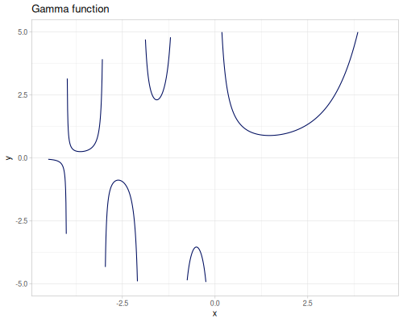
:::


::: {.callout-note title="Examples"}


::: {.sourceClojure}
```clojure
(special/gamma 1.5) ;; => 0.886226925452758
(special/gamma -1.5) ;; => 2.3632718012073544
(special/gamma -2.0) ;; => ##NaN
(special/gamma 15) ;; => 8.71782912E10
(m/factorial 14) ;; => 8.71782912E10
```
:::


:::

---

Additionally reciprocal gamma function `inv-gamma-1pm1` is defined as:

$$\frac{1}{\Gamma(x+1)}-1\text{ for } -0.5\leq x\leq 1.5$$

::: {.clay-image}
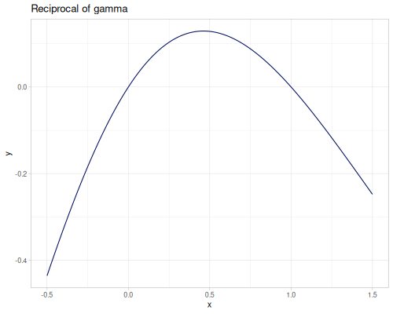
:::


::: {.callout-note title="Examples"}


::: {.sourceClojure}
```clojure
(special/inv-gamma-1pm1 -0.5) ;; => -0.4358104164522437
(special/inv-gamma-1pm1 0.5) ;; => 0.12837916709551256
```
:::


:::

---

For complex argument call `gamma-complex`.

::: {.clay-image}
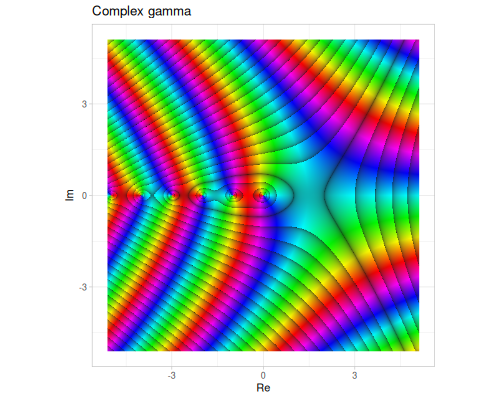
:::


::: {.callout-note title="Examples"}


::: {.sourceClojure}
```clojure
(special/gamma-complex (complex/complex 1.5 0.0)) ;; => #vec2 [0.8862269254527566, 0.0]
(special/gamma-complex (complex/complex 0.0 1.0)) ;; => #vec2 [-0.1549498283018112, -0.49801566811835757]
(special/gamma-complex (complex/complex -1.5 -1.0)) ;; => #vec2 [0.19071067188949734, -0.17418614261651502]
```
:::


:::


### Log gamma

Logartihm of gamma `log-gamma` $\log\Gamma(x)$ with derivatives: `digamma` $\psi$, `trigamma` $\psi_1$  and `polygamma` $\psi^{(m)}$.

::: {.clay-image}
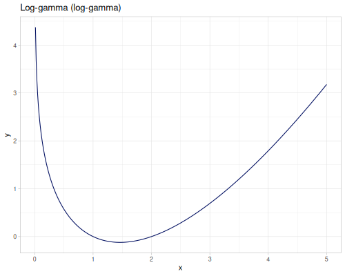
:::


::: {.callout-note title="Examples"}


::: {.sourceClojure}
```clojure
(special/log-gamma 1.01) ;; => -0.005690307946069651
(special/log-gamma 0.5) ;; => 0.5723649429247001
(m/exp (special/log-gamma 5)) ;; => 24.000000000000004
```
:::


:::

---

For complex argument call `log-gamma-complex`.

::: {.clay-image}
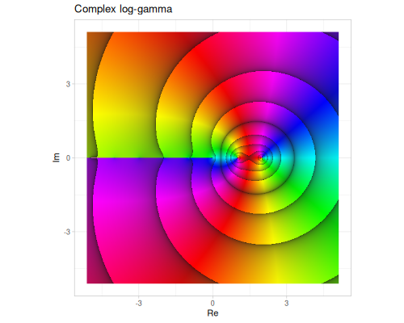
:::


::: {.callout-note title="Examples"}


::: {.sourceClojure}
```clojure
(special/log-gamma-complex (complex/complex 1.01 0.0)) ;; => #vec2 [-0.005690307946069651, 0.0]
(special/log-gamma-complex (complex/complex 0.0 1.0)) ;; => #vec2 [-0.6509231993018532, -1.8724366472624299]
(special/log-gamma-complex (complex/complex -1.5 -1.0)) ;; => #vec2 [-1.3536899180323017, 5.543041710180497]
```
:::


:::

---

`log-gamma-1p` is more accurate function defined as $\log\Gamma(x+1)$ for $-0.5\leq x 1.5$

::: {.clay-image}
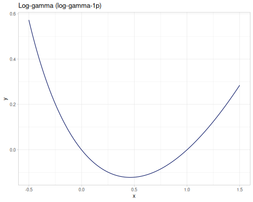
:::


::: {.callout-note title="Examples"}


::: {.sourceClojure}
```clojure
(special/log-gamma-1p -0.1) ;; => 0.06637623973474298
(special/log-gamma-1p 0.01) ;; => -0.005690307946069646
(special/log-gamma-1p 1.01) ;; => 0.004260022907098441
```
:::


:::

---

Derivatives of `log-gamma` function. First derivative `digamma`.

$$\operatorname{digamma}(x)=\psi(x)=\psi^{(0)}(x)=\frac{d}{dx}\log\Gamma(x)=\frac{\Gamma'(x)}{\Gamma(x)}$$

::: {.clay-image}
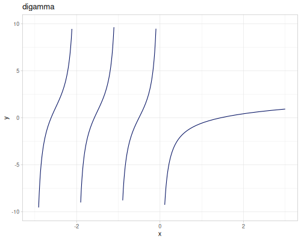
:::


---

Second derivative `trigamma`

$$\operatorname{trigamma}(x)=\psi_1(x)=\psi^{(1)}(x)=\frac{d}{dx}\psi(x)=\frac{d^2}{dx^2}\log\Gamma(x)$$

::: {.clay-image}
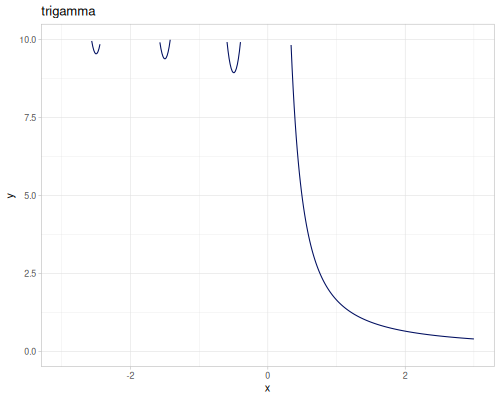
:::


---

`polygamma` as m^th^ derivative of `digamma`

$$\operatorname{polygamma}(m,x)=\psi^{(m)}=\frac{d^m}{dx^m}\psi(x)=\frac{d^{m+1}}{dx^{m+1}}\log\Gamma(x)$$

::: {.clay-image}
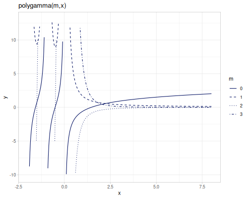
:::


::: {.callout-note title="Examples"}


::: {.sourceClojure}
```clojure
(special/digamma 0.5) ;; => -1.9635100260214235
(special/trigamma 0.5) ;; => 4.93480220054468
(special/polygamma 0 0.5) ;; => -1.9635100260214235
(special/polygamma 1 0.5) ;; => 4.93480220054468
(special/polygamma 2 0.5) ;; => -16.828796644234316
(special/polygamma 3 0.5) ;; => 97.40909103400247
```
:::


:::


### Incomplete and regularized

`upper-incomplete-gamma` $\Gamma(s,x)$ and `lower-incomplete-gamma` $\gamma(s,x)$ are versions of gamma function with parametrized integral limits.

Upper incomplete gamma is defined as:

$$\Gamma(s,x) = \int_x^\infty t^{s-1}e^{-t}\,dt$$

::: {.clay-table}

```{=html}
<table class="table table-hover table-responsive clay-table"><tbody><tr><td><div class="clay-image"><p>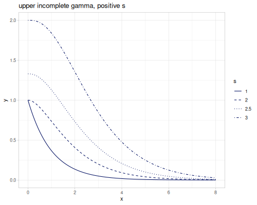</p></div></td><td><div class="clay-image"><p>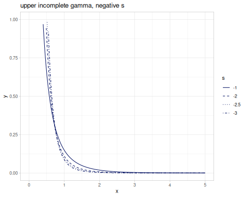</p></div></td></tr></tbody></table>
```

:::


::: {.callout-note title="Examples"}


::: {.sourceClojure}
```clojure
(special/upper-incomplete-gamma 2 0.5) ;; => 0.9097959895689501
(special/upper-incomplete-gamma -2 0.5) ;; => 0.886417457100714
```
:::


:::

---

Lower incomplete gamma is defined as:

$$\gamma(s,x) = \int_0^x t^{s-1}e^{-t}\,dt$$

::: {.clay-table}

```{=html}
<table class="table table-hover table-responsive clay-table"><tbody><tr><td><div class="clay-image"><p>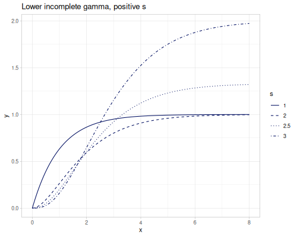</p></div></td><td><div class="clay-image"><p>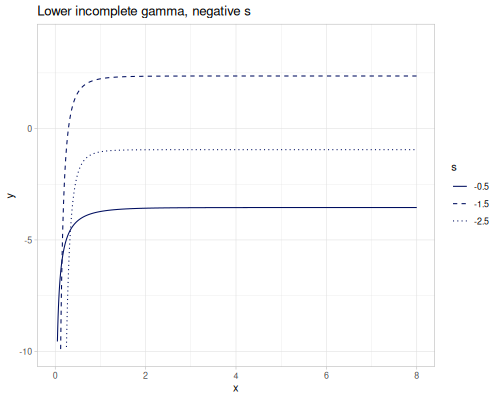</p></div></td></tr></tbody></table>
```

:::


::: {.callout-note title="Examples"}


::: {.sourceClojure}
```clojure
(special/lower-incomplete-gamma 0.5 3) ;; => 1.7470973415820528
(special/lower-incomplete-gamma -0.5 3) ;; => -3.5516838378128024
```
:::


:::

---

`regularized-gamma-p` $P(s,x)$ and `regularized-gamma-q` $Q(s,x)$ are normalized incomplete gamma functions by gamma of `s`. `s` can be negative non-integer.

$$P(s,x)=\frac{\gamma(s,x)}{\Gamma(x)}$$

::: {.clay-image}
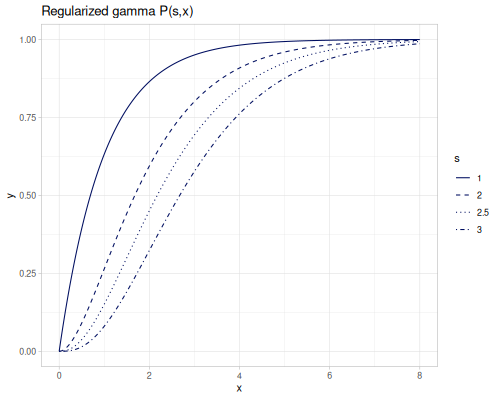
:::


::: {.callout-note title="Examples"}


::: {.sourceClojure}
```clojure
(special/regularized-gamma-p 2.5 0.5) ;; => 0.03743422675270362
(special/regularized-gamma-p -2.5 0.5) ;; => 2.134513839251947
```
:::


:::

---

$$Q(s,x)=\frac{\Gamma(s,x)}{\Gamma(x)}=1-P(s,x)$$

::: {.clay-image}
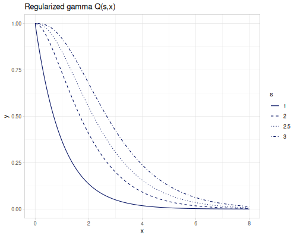
:::


::: {.callout-note title="Examples"}


::: {.sourceClojure}
```clojure
(special/regularized-gamma-q 2.5 0.5) ;; => 0.9625657732472964
(special/regularized-gamma-q -2.5 0.5) ;; => -1.134513839251947
```
:::


:::


## Beta

Beta and related functions

::: {.callout-tip title="Defined functions"}

* `beta`, `log-beta`
* `incomplete-beta`, `regularized-beta`
:::


### Beta function

`beta` $B(p,q)$ function, defined also for negative non-integer `p` and `q`.

$$B(p,q) = \int_0^1 t^{p-1}(1-t)^{q-1}\,dt = \frac{\Gamma(p)\Gamma(q)}{\Gamma(p+q)}$$

::: {.clay-image}
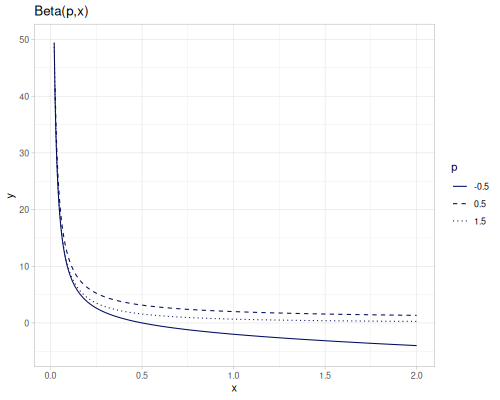
:::


::: {.callout-note title="Examples"}


::: {.sourceClojure}
```clojure
(special/beta 2 3) ;; => 0.08333333333333334
(special/beta -1.2 0.1) ;; => 4.750441365819471
(special/beta -1.2 -0.1) ;; => -15.574914582341846
```
:::


:::

---

`log-beta` is log of $B(p,q)$ for positive `p` and `q`

::: {.clay-image}
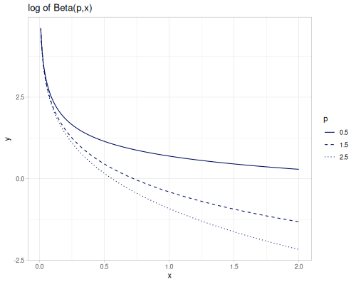
:::


::: {.callout-note title="Examples"}


::: {.sourceClojure}
```clojure
(special/log-beta 2 3) ;; => -2.4849066497880004
(special/log-beta 2 3) ;; => -2.4849066497880004
(m/log (special/beta 2 3)) ;; => -2.4849066497880004
```
:::


:::


### Incomplete and regularized

`incomplete-beta` $B(x,a,b)$ and `regularized-beta` $I_x(a,b)$. Both are defined also for negative non-integer `a` and `b`.

$$B(x,a,b)=\int_0^x t^{a-1}(1-t)^{b-1}\,dt$$

::: {.clay-image}
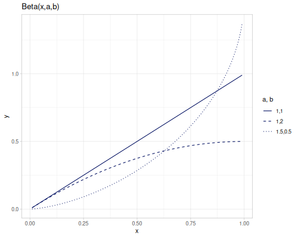
:::


::: {.callout-note title="Examples"}


::: {.sourceClojure}
```clojure
(special/incomplete-beta 0.5 0.1 0.2) ;; => 9.789912164505285
(special/incomplete-beta 0.5 -0.1 -0.2) ;; => -9.707992848052843
```
:::


:::

$$I_x(a,b)=\frac{B(x,a,b)}{B(a,b)}$$

::: {.clay-image}
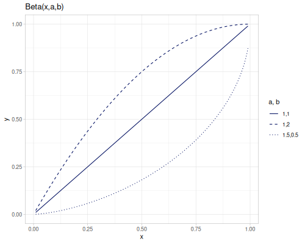
:::


::: {.callout-note title="Examples"}


::: {.sourceClojure}
```clojure
(special/regularized-beta 0.99 -0.5 -0.7) ;; => 12.086770426418143
(special/regularized-beta 0.01 0.5 0.5) ;; => 0.06376856085851987
```
:::


:::


## Bessel


* Bessel functions of the first ($J_\alpha$) and the second ($Y_\alpha$) kind
* Modified Bessel functions of the first ($I_\alpha$) and the second ($K_\alpha$) kind
* Spherical Bessel functions of the first ($j_\alpha$) and the second ($y_\alpha$) kind
* Modified spherical Bessel functions of the first ($i_\alpha^{(1)}$, $i_\alpha^{(2)}$) and the second ($k_\alpha$) kind
* Sombrero function `jinc`

::: {.callout-tip title="Defined functions"}

* `bessel-J0`, `bessel-J1`, `bessel-J`, `jinc`
* `bessel-Y0`, `bessel-Y1`, `bessel-Y`
* `bessel-I0`, `bessel-I1`, `bessel-I`
* `bessel-K0`, `bessel-K1`, `bessel-K`
* `bessel-K-half-odd`, `bessel-K-half-odd-scaled`
* `bessel-K-half-odd-complex`, `bessel-K-half-odd-scaled-complex`
* `spherical-bessel-j0`, `spherical-bessel-j1`, `spherical-bessel-j2`,`spherical-bessel-j`
* `spherical-bessel-y0`, `spherical-bessel-y1`, `spherical-bessel-y2`,`spherical-bessel-y`
* `spherical-bessel-1-i0`, `spherical-bessel-1-i1`, `spherical-bessel-1-i2`,`spherical-bessel-1-i`
* `spherical-bessel-2-i0`, `spherical-bessel-2-i1`, `spherical-bessel-2-i2`,`spherical-bessel-2-1`
* `spherical-bessel-k0`, `spherical-bessel-k1`, `spherical-bessel-k2`,`spherical-bessel-k`
:::


### Bessel J, j

Bessel functions of the first kind, `bessel-J` $J_\alpha(x)$. `bessel-J0` and `bessel-J1` are functions of orders `0` and `1`. An order should be integer for negative arguments.

::: {.clay-table}

```{=html}
<table class="table table-hover table-responsive clay-table"><tbody><tr><td><div class="clay-image"><p>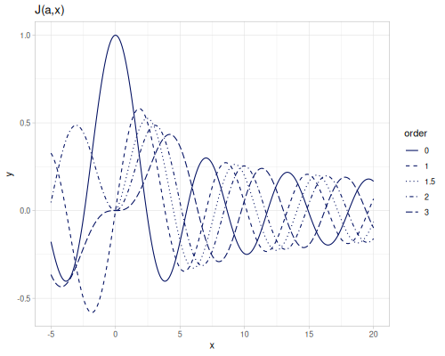</p></div></td><td><div class="clay-image"><p>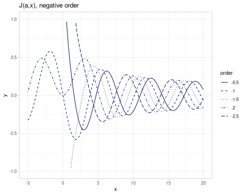</p></div></td></tr></tbody></table>
```

:::


::: {.callout-note title="Examples"}


::: {.sourceClojure}
```clojure
(special/bessel-J0 2.3) ;; => 0.055539784445602064
(special/bessel-J1 2.3) ;; => 0.5398725326043137
(special/bessel-J 2.1 3) ;; => 0.4761626361699597
(special/bessel-J -3 -3.2) ;; => 0.3430663764006682
(special/bessel-J 3 -3.2) ;; => -0.3430663764006682
(special/bessel-J -3.1 -3.2) ;; => ##NaN
(special/bessel-J 3.1 -3.2) ;; => ##NaN
```
:::


:::

---

Spherical Bessel functions of the first kind `spherical-bessel-j` $j_\alpha(x)$, `spherical-bessel-j0`, `spherical-bessel-j1` and `spherical-bessel-j2` are functions of orders `0`,`1` and `2`. Functions are defined for positive argument (only functions with orders `0`, `1` and `2` accept non positive argument).

$$j_\alpha(x)=\sqrt{\frac{\pi}{2x}}J_{\alpha+\frac{1}{2}}(x)$$

::: {.clay-table}

```{=html}
<table class="table table-hover table-responsive clay-table"><tbody><tr><td><div class="clay-image"><p>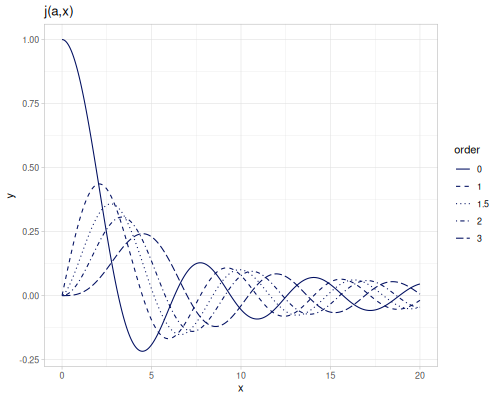</p></div></td><td><div class="clay-image"><p>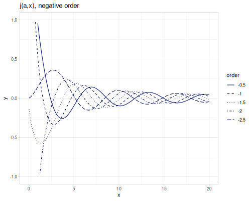</p></div></td></tr></tbody></table>
```

:::


::: {.callout-note title="Examples"}


::: {.sourceClojure}
```clojure
(special/spherical-bessel-j0 2.3) ;; => 0.3242196574681393
(special/spherical-bessel-j1 2.3) ;; => 0.43065029510781005
(special/spherical-bessel-j2 2.3) ;; => 0.23749811875943916
(special/spherical-bessel-j 3.1 3.2) ;; => 0.1579561007291703
(special/spherical-bessel-j -3.1 3.2) ;; => 0.12796785869167607
```
:::


:::

---

additional `jinc` (sombrero) function is defined as:

$$\operatorname{jinc}(x)=\frac{2J_1(\pi x)}{\pi x}$$

::: {.clay-image}
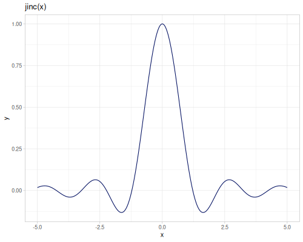
:::


::: {.callout-note title="Examples"}


::: {.sourceClojure}
```clojure
(special/jinc 0.0) ;; => 1.0
(special/jinc -2.3) ;; => 0.01707103495964295
(special/jinc 2.3) ;; => 0.01707103495964295
```
:::


:::


### Bessel Y, y

Bessel functions of the second kind, `bessel-Y`, $Y_\alpha(x)$. `bessel-Y0` and `bessel-Y1` are functions of orders `0` and `1`. They are defined for positive argument only and any order.

::: {.clay-table}

```{=html}
<table class="table table-hover table-responsive clay-table"><tbody><tr><td><div class="clay-image"><p>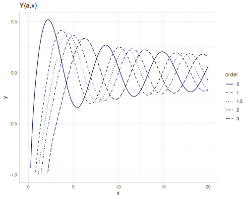</p></div></td><td><div class="clay-image"><p>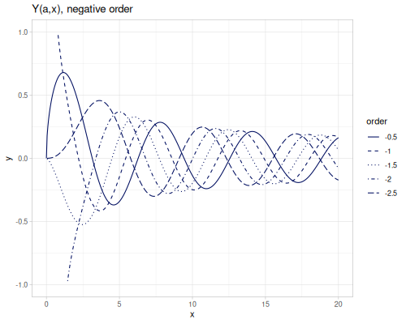</p></div></td></tr></tbody></table>
```

:::


::: {.callout-note title="Examples"}


::: {.sourceClojure}
```clojure
(special/bessel-Y0 2.3) ;; => 0.5180753962076221
(special/bessel-Y1 2.3) ;; => 0.05227731584422471
(special/bessel-Y 2 2.3) ;; => -0.47261686069090497
(special/bessel-Y -2.1 2.3) ;; => -0.36752629274516924
(special/bessel-Y 3 -1) ;; => ##NaN
```
:::


:::

---

Spherical Bessel functions of the second kind `spherical-bessel-y` $y_\alpha(x)$, `spherical-bessel-y0`, `spherical-bessel-y1` and `spherical-bessel-y2` are functions of orders `0`,`1` and `2`. Functions are defined for positive argument.

$$y_\alpha(x)=\sqrt{\frac{\pi}{2x}}Y_{\alpha+\frac{1}{2}}(x)$$

::: {.clay-table}

```{=html}
<table class="table table-hover table-responsive clay-table"><tbody><tr><td><div class="clay-image"><p>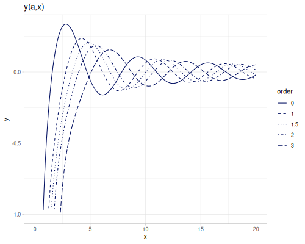</p></div></td><td><div class="clay-image"><p>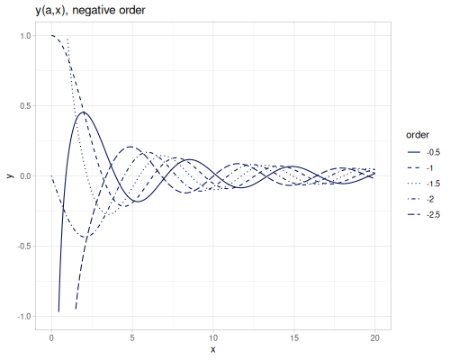</p></div></td></tr></tbody></table>
```

:::


::: {.callout-note title="Examples"}


::: {.sourceClojure}
```clojure
(special/spherical-bessel-j0 2.3) ;; => 0.3242196574681393
(special/spherical-bessel-j1 2.3) ;; => 0.43065029510781005
(special/spherical-bessel-j2 2.3) ;; => 0.23749811875943916
(special/spherical-bessel-j 3.1 3.2) ;; => 0.1579561007291703
(special/spherical-bessel-j -3.1 3.2) ;; => 0.12796785869167607
```
:::


:::


### Bessel I, i

Modified Bessel functions of the first kind, `bessel-I`, $I_\alpha(x)$, `bessel-I0` and `bessel-I1` are functions of orders `0` and `1`. An order should be integer for negative arguments.

::: {.clay-table}

```{=html}
<table class="table table-hover table-responsive clay-table"><tbody><tr><td><div class="clay-image"><p>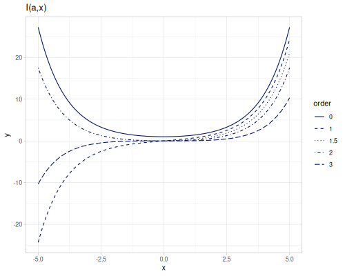</p></div></td><td><div class="clay-image"><p>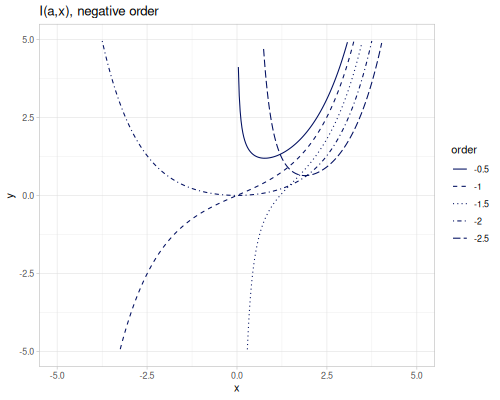</p></div></td></tr></tbody></table>
```

:::


::: {.callout-note title="Examples"}


::: {.sourceClojure}
```clojure
(special/bessel-I0 2.3) ;; => 2.8296056006275854
(special/bessel-I1 2.3) ;; => 2.097800027517421
(special/bessel-I 2 2.3) ;; => 1.0054316636559146
(special/bessel-I -2.1 2.3) ;; => 0.9505851207098388
(special/bessel-I -3 -1) ;; => -0.0221684249243319
(special/bessel-I -3.1 -1) ;; => ##NaN
```
:::


:::

Two modfified spherical Bessel functions of the first kind `spherical-bessel-1-i` $i_\alpha^{(1)}(x)$ and `spherical-bessel-2-i` $i_\alpha^{(2)}(x)$. `spherical-bessel-1-i0`, `spherical-bessel-1-i1`, `spherical-bessel-1-i2`, `spherical-bessel-2-i0`, `spherical-bessel-2-i1` and `spherical-bessel-2-i2` are functions of orders `0`,`1` and `2`. Functions are defined for positive argument.

$$i_\alpha^{(1)}(x)=\sqrt{\frac{\pi}{2x}}I_{\alpha+\frac{1}{2}}(x)$$
$$i_\alpha^{(2)}(x)=\sqrt{\frac{\pi}{2x}}I_{-\alpha-\frac{1}{2}}(x)$$

::: {.clay-table}

```{=html}
<table class="table table-hover table-responsive clay-table"><tbody><tr><td><div class="clay-image"><p>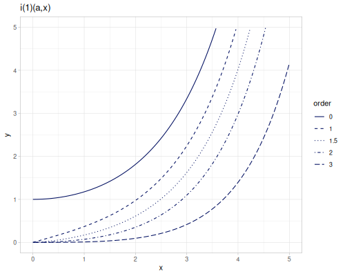</p></div></td><td><div class="clay-image"><p>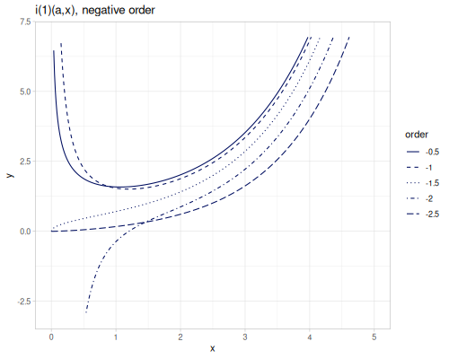</p></div></td></tr><tr><td><div class="clay-image"><p>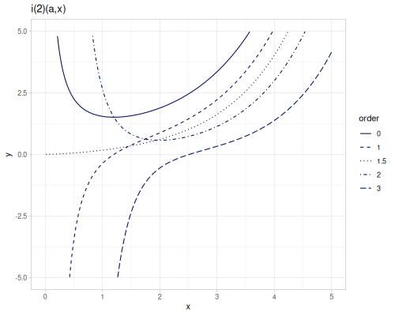</p></div></td><td><div class="clay-image"><p>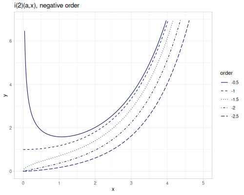</p></div></td></tr></tbody></table>
```

:::


::: {.callout-note title="Examples"}

$i_\alpha^{(1)}$


::: {.sourceClojure}
```clojure
(special/spherical-bessel-1-i0 2.3) ;; => 2.1465051328460687
(special/spherical-bessel-1-i1 2.3) ;; => 1.256832833227258
(special/spherical-bessel-1-i2 2.3) ;; => 0.5071579590713844
(special/spherical-bessel-1-i 3.1 3.2) ;; => 0.48382455936204793
(special/spherical-bessel-1-i -3.1 3.2) ;; => 1.271418391309527
```
:::


$i_\alpha^{(2)}$


::: {.sourceClojure}
```clojure
(special/spherical-bessel-2-i0 2.3) ;; => 2.1900959344646793
(special/spherical-bessel-2-i1 2.3) ;; => 1.1942895091657733
(special/spherical-bessel-2-i2 2.3) ;; => 0.6323270094658442
(special/spherical-bessel-2-i 3.1 3.2) ;; => 0.42032145323101916
(special/spherical-bessel-2-i -3.1 3.2) ;; => 1.2425414548936577
```
:::


:::


### Bessel K, k

Modified Bessel functions of the second kind, `bessel-K`, $K_\alpha(x)$, `bessel-K0` and `bessel-K1` are functions of orders `0` and `1`. They are defined for positive argument only and any order.

::: {.clay-table}

```{=html}
<table class="table table-hover table-responsive clay-table"><tbody><tr><td><div class="clay-image"><p>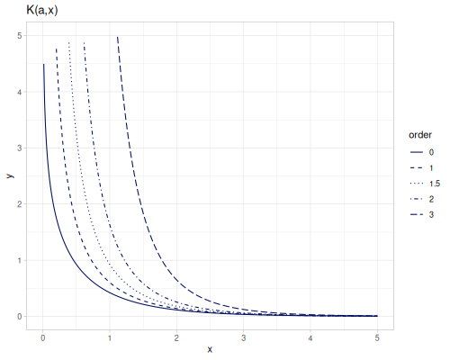</p></div></td><td><div class="clay-image"><p>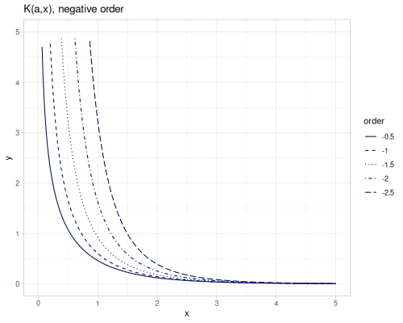</p></div></td></tr></tbody></table>
```

:::


::: {.callout-note title="Examples"}


::: {.sourceClojure}
```clojure
(special/bessel-K0 2.3) ;; => 0.07913993300209364
(special/bessel-K1 2.3) ;; => 0.09498244384536267
(special/bessel-K 2 2.3) ;; => 0.1617333624328438
(special/bessel-K -2.1 2.3) ;; => 0.17365527243516982
(special/bessel-K 3 -1) ;; => ##NaN
```
:::


:::

---

Additionally `bessel-K-half-odd` function is optimized version for order of the half of odd integer, ie `1/2`, `3/2`, `5/2` and so on. First argument is an odd numerator.

::: {.clay-image}
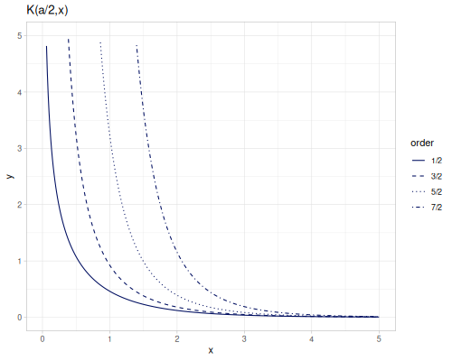
:::


::: {.callout-note title="Examples"}


::: {.sourceClojure}
```clojure
[(special/bessel-K-half-odd 1 2.3) (special/bessel-K 0.5 2.3)] ;; => [0.0828549981836159 0.0828549981836159]
[(special/bessel-K-half-odd 3 2.3) (special/bessel-K 1.5 2.3)] ;; => [0.11887891043736196 0.11887891043736196]
[(special/bessel-K-half-odd 5 2.3) (special/bessel-K 2.5 2.3)] ;; => [0.23791444658017497 0.23791444658017497]
```
:::


:::

The other variant is `bessel-K-half-odd-scaled` which is $K$ multiplied by $e^x$ ($e^{x}K_\frac{a}{2}(x)$).

::: {.clay-image}
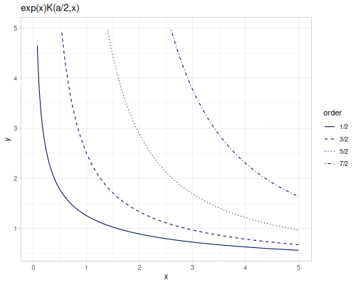
:::


::: {.callout-note title="Examples"}


::: {.sourceClojure}
```clojure
(special/bessel-K-half-odd-scaled 1 2.3) ;; => 0.826410869176727
(special/bessel-K-half-odd-scaled 3 2.3) ;; => 1.185719942731826
(special/bessel-K-half-odd-scaled 5 2.3) ;; => 2.3730020988269347
```
:::


:::

Both functions have their complex versions.

::: {.clay-table}

```{=html}
<table class="table table-hover table-responsive clay-table"><tbody><tr><td><div class="clay-image"><p>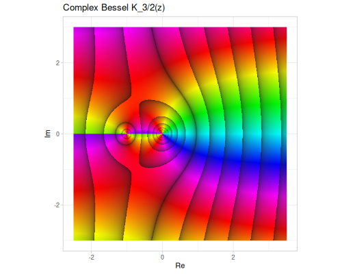</p></div></td><td><div class="clay-image"><p>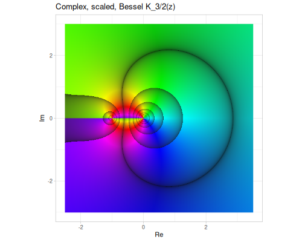</p></div></td></tr><tr><td><div class="clay-image"><p>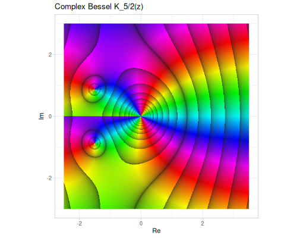</p></div></td><td><div class="clay-image"><p>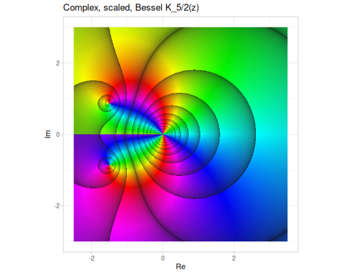</p></div></td></tr></tbody></table>
```

:::


---

Modified spherical Bessel functions of the second kind `spherical-bessel-k` $k_\alpha(x)$, `spherical-bessel-k0`, `spherical-bessel-k1` and `spherical-bessel-k2` are functions of orders `0`,`1` and `2`. Functions are defined for positive argument.

$$k_\alpha(x)=\sqrt{\frac{\pi}{2x}}K_{\alpha+\frac{1}{2}}(x)$$

::: {.clay-table}

```{=html}
<table class="table table-hover table-responsive clay-table"><tbody><tr><td><div class="clay-image"><p>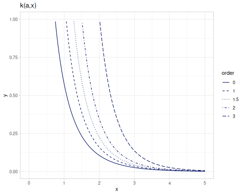</p></div></td><td><div class="clay-image"><p>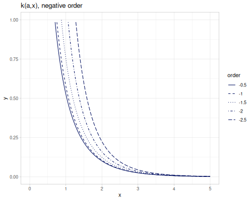</p></div></td></tr></tbody></table>
```

:::


::: {.callout-note title="Examples"}


::: {.sourceClojure}
```clojure
(special/spherical-bessel-k0 2.3) ;; => 0.06847227106455815
(special/spherical-bessel-k1 2.3) ;; => 0.09824282370132256
(special/spherical-bessel-k2 2.3) ;; => 0.19661508458802238
(special/spherical-bessel-k 3.1 3.2) ;; => 0.10488382566292166
(special/spherical-bessel-k -3.1 3.2) ;; => 0.047694101111715716
```
:::


:::


## Hankel

::: {.callout-tip title="Defined functions"}

* `hankel-1`, `hankel-2`
* `spherical-hankel-1`, `spherical-hankel-2`
:::

Hankel functions of the first and second kind.

$$H^{(1)}_\alpha(x)=J_\alpha(x)+ i Y_\alpha(x)$$
$$H^{(2)}_\alpha(x)=J_\alpha(x)- i Y_\alpha(x)$$

::: {.callout-note title="Examples"}


::: {.sourceClojure}
```clojure
(special/hankel-1 1 2.3) ;; => #vec2 [0.5398725326043137, 0.05227731584422471]
(special/hankel-2 1 2.3) ;; => #vec2 [0.5398725326043137, -0.05227731584422471]
```
:::


:::

Spherical functions of the first and second kind.

$$h^{(1)}_\alpha(x)=j_\alpha(x)+ i j_\alpha(x)$$
$$h^{(2)}_\alpha(x)=j_\alpha(x)- i j_\alpha(x)$$

::: {.callout-note title="Examples"}


::: {.sourceClojure}
```clojure
(special/spherical-hankel-1 1 2.3) ;; => #vec2 [0.43065029510781005, -0.19826955892752984]
(special/spherical-hankel-2 1 2.3) ;; => #vec2 [0.43065029510781005, 0.19826955892752984]
```
:::


:::


## Elliptic

Elliptic intergrals.

::: {.callout-tip title="Defined functions"}

* `elliptic-K`, `elliptic-F`, `elliptic-E`, `elliptic-PI`, `elliptic-D`
* `elliptic-Rf`, `elliptic-Rd`, `elliptic-Rg`, `elliptic-Rj`, `elliptic-Rc`
:::


### Elliptic F and K 

Incomplete `F` and complete `K` elliptic integrals of the first kind. `K` with 2-arity is equal to `F`.

::: {.clay-table}

```{=html}
<table class="table table-hover table-responsive clay-table"><tbody><tr><td><div class="clay-image"><p>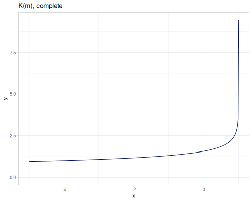</p></div></td><td><div class="clay-image"><p>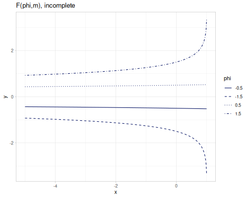</p></div></td></tr></tbody></table>
```

:::


::: {.sourceClojure}
```clojure
(special/elliptic-K 0.4) ;; => 1.7775193714912532
(special/elliptic-K -0.4) ;; => 1.4415183761084807
(special/elliptic-K 1 -0.4) ;; => 0.9518131108316235
(special/elliptic-F 1 -0.4) ;; => 0.9518131108316235
```
:::


### Elliptic E

Incomplete and complete `E` elliptic integrals of the second kind.

::: {.clay-table}

```{=html}
<table class="table table-hover table-responsive clay-table"><tbody><tr><td><div class="clay-image"><p>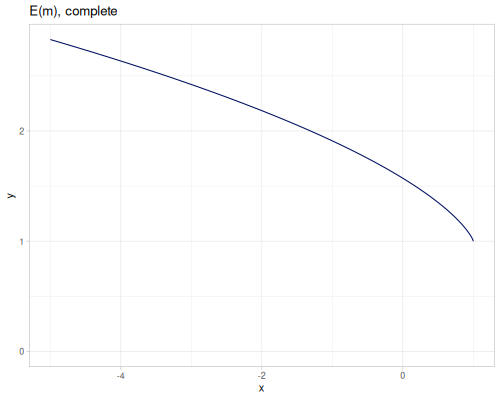</p></div></td><td><div class="clay-image"><p>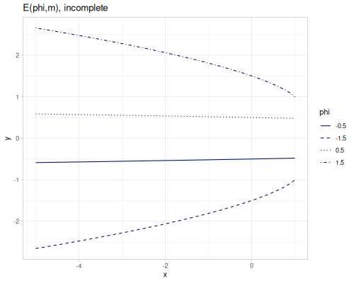</p></div></td></tr></tbody></table>
```

:::


::: {.sourceClojure}
```clojure
(special/elliptic-E 0.4) ;; => 1.3993921388974322
(special/elliptic-E -0.4) ;; => 1.7177141106621594
(special/elliptic-E 1 -0.4) ;; => 1.0522842450281298
(special/elliptic-E -1 -0.4) ;; => -1.0522842450281298
```
:::


### Elliptic PI

Incomplete and complete $\Pi$ elliptic integrals of the third kind.


::: {.sourceClojure}
```clojure
(special/elliptic-PI 0.2 0.4) ;; => 2.001498086208185
(special/elliptic-PI -0.2 -0.4) ;; => 1.3209692114940224
(special/elliptic-PI 0.2 1 -0.4) ;; => 1.0070940496918326
(special/elliptic-PI 0.2 -1 -0.4) ;; => -1.0070940496918326
```
:::


### Elliptic D

Incomplete and complete `D` elliptic integrals of Legendre's type.

$$D(\phi,m)=\frac{K(\phi,m)-E(\phi,m)}{m^2}$$
$$D(m)=\frac{K(m)-E(m)}{m^2}$$

::: {.clay-table}

```{=html}
<table class="table table-hover table-responsive clay-table"><tbody><tr><td><div class="clay-image"><p>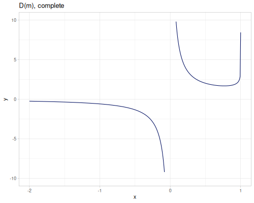</p></div></td><td><div class="clay-image"><p>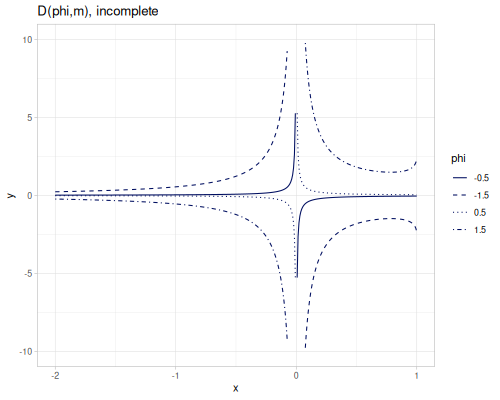</p></div></td></tr></tbody></table>
```

:::


::: {.sourceClojure}
```clojure
(special/elliptic-D 0.5) ;; => 2.013723185014787
(special/elliptic-D -0.5) ;; => -1.3441362690754461
(special/elliptic-D -0.2 -0.4) ;; => 0.006582403114287378
(special/elliptic-D 0.2 -0.4) ;; => -0.006582403114287378
```
:::


### Symmetric

Collection of Carlson, symmetric versions of elliptic intervals


* $R_f$ - symmetric elliptic intergral of the first kind.
* $R_d$ - symmetric elliptic intergral, symmetry first on two variables.
* $R_g$ - symmetric elliptic intergral of the second kind.
* $R_j$ - symmetric elliptic intergral of the third kind.
* $R_c$ - degenerate symmetric elliptic integral


::: {.sourceClojure}
```clojure
(special/elliptic-Rf 1 2 3) ;; => 0.7269459354689083
(special/elliptic-Rd 1 2 3) ;; => 0.29046028102899063
(special/elliptic-Rg 1 2 3) ;; => 1.4018470999908952
(special/elliptic-Rj 1 2 3 4) ;; => 0.23984809974956775
(special/elliptic-Rj 1 2 3 -4) ;; => -0.23786769472998162
(special/elliptic-Rc 1 2) ;; => 0.7853981633974482
(special/elliptic-Rc 1 -2) ;; => 0.3801729981504732
```
:::


## Jacobi

Collection of Jacobi functions and their inverses.

::: {.callout-tip title="Defined functions"}

* `jacobi-am`
* `jacobi-sn`, `jacobi-cn`, `jacobi-dn`
* `jacobi-ns`, `jacobi-cs`, `jacobi-ds`
* `jacobi-nc`, `jacobi-sc`, `jacobi-dc`
* `jacobi-nd`, `jacobi-sd`, `jacobi-cd`
* `jacobi-asn`, `jacobi-acn`, `jacobi-adn`
* `jacobi-ans`, `jacobi-acs`, `jacobi-ads`
* `jacobi-anc`, `jacobi-asc`, `jacobi-adc`
* `jacobi-and`, `jacobi-asd`, `jacobi-acd`

:::

`jacobi-am` is an inverse (in regards of the first argument) of incomplete elliptic integral of the first kind.

$$\phi=\operatorname{am}(u,m)\text{ such that }u=F(\phi,m)$$

::: {.clay-image}

:::


::: {.sourceClojure}
```clojure
(special/jacobi-am 1 0.5) ;; => 0.9323150798838539
(special/jacobi-am -1 0.5) ;; => -0.9323150798838539
(special/jacobi-am 1 0.99) ;; => 0.8670876269614121
(special/jacobi-am -1 0.99) ;; => -0.8670876269614121
(special/jacobi-am 10 0.5) ;; => 8.39183082303414
(special/jacobi-am -10 0.5) ;; => -8.39183082303414
(special/jacobi-am 10 0.99) ;; => 4.58130465216949
(special/jacobi-am -10 0.99) ;; => -4.58130465216949
```
:::


::: {.clay-table}

```{=html}
<table class="table table-hover table-responsive clay-table"><tbody><tr><td><div class="clay-image"><p></p></div></td><td><div class="clay-image"><p></p></div></td><td><div class="clay-image"><p></p></div></td></tr></tbody></table>
```

:::


::: {.callout-note}
## ERR
```
Apr 15, 2026 4:10:58 PM clojure.tools.logging$eval21120$fn__21123 invoke
INFO: [:clojisr.v1.session/gc-clean-r-objects {:objects-before 19543, :objects-after 7546}]

```
:::


::: {.clay-table}

```{=html}
<table class="table table-hover table-responsive clay-table"><tbody><tr><td><div class="clay-image"><p></p></div></td><td><div class="clay-image"><p></p></div></td><td><div class="clay-image"><p></p></div></td></tr><tr><td><div class="clay-image"><p></p></div></td><td><div class="clay-image"><p></p></div></td><td><div class="clay-image"><p></p></div></td></tr><tr><td><div class="clay-image"><p></p></div></td><td><div class="clay-image"><p></p></div></td><td><div class="clay-image"><p></p></div></td></tr><tr><td><div class="clay-image"><p></p></div></td><td><div class="clay-image"><p></p></div></td><td><div class="clay-image"><p></p></div></td></tr></tbody></table>
```

:::


::: {.sourceClojure}
```clojure
(special/jacobi-sn 1.5 2) ;; => 0.6943698520913071
(special/jacobi-sn 1.5 0.5) ;; => 0.9681760156756912
(special/jacobi-sn 1.5 -2) ;; => 0.852485104635653
(special/jacobi-cn 1.5 2) ;; => 0.7196183075121813
(special/jacobi-cn 1.5 0.5) ;; => 0.2502702592605514
(special/jacobi-cn 1.5 -2) ;; => -0.5227515149421756
(special/jacobi-dn 1.5 2) ;; => -0.18894712756057636
(special/jacobi-dn 1.5 0.5) ;; => 0.7289153595138271
(special/jacobi-dn 1.5 -2) ;; => 1.5663529957360571
(special/jacobi-sc 1.5 2) ;; => 0.9649141007707801
(special/jacobi-sc 1.5 0.5) ;; => 3.8685220470712918
(special/jacobi-sc 1.5 -2) ;; => -1.6307654406892556
(special/jacobi-sd 1.5 2) ;; => -3.6749426204888587
(special/jacobi-sd 1.5 0.5) ;; => 1.3282420284317324
(special/jacobi-sd 1.5 -2) ;; => 0.5442483954487252
(special/jacobi-cs 1.5 2) ;; => 1.0363616815229386
(special/jacobi-cs 1.5 0.5) ;; => 0.25849665268343536
(special/jacobi-cs 1.5 -2) ;; => -0.6132089723322456
(special/jacobi-cd 1.5 2) ;; => -3.808569713670148
(special/jacobi-cd 1.5 0.5) ;; => 0.34334611830305917
(special/jacobi-cd 1.5 -2) ;; => -0.33373799926658637
(special/jacobi-ds 1.5 2) ;; => -0.2721130921676745
(special/jacobi-ds 1.5 0.5) ;; => 0.752874836509058
(special/jacobi-ds 1.5 -2) ;; => 1.837396321904659
(special/jacobi-dc 1.5 2) ;; => -0.262565759636928
(special/jacobi-dc 1.5 0.5) ;; => 2.9125129037204847
(special/jacobi-dc 1.5 -2) ;; => -2.9963624226116683
(special/jacobi-ns 1.5 2) ;; => 1.4401546913193226
(special/jacobi-ns 1.5 0.5) ;; => 1.0328700399607593
(special/jacobi-ns 1.5 -2) ;; => 1.1730410238984692
(special/jacobi-nc 1.5 2) ;; => 1.3896255689452044
(special/jacobi-nc 1.5 0.5) ;; => 3.995680521347604
(special/jacobi-nc 1.5 -2) ;; => -1.9129547622843626
(special/jacobi-nd 1.5 2) ;; => -5.292485855226354
(special/jacobi-nd 1.5 0.5) ;; => 1.3719013969838436
(special/jacobi-nd 1.5 -2) ;; => 0.6384256950522715
```
:::


Inverses of Jacobi functions

::: {.clay-table}

```{=html}
<table class="table table-hover table-responsive clay-table"><tbody><tr><td><div class="clay-image"><p></p></div></td><td><div class="clay-image"><p></p></div></td><td><div class="clay-image"><p></p></div></td></tr><tr><td><div class="clay-image"><p></p></div></td><td><div class="clay-image"><p></p></div></td><td><div class="clay-image"><p></p></div></td></tr><tr><td><div class="clay-image"><p></p></div></td><td><div class="clay-image"><p></p></div></td><td><div class="clay-image"><p></p></div></td></tr><tr><td><div class="clay-image"><p></p></div></td><td><div class="clay-image"><p></p></div></td><td><div class="clay-image"><p></p></div></td></tr></tbody></table>
```

:::


::: {.sourceClojure}
```clojure
(special/jacobi-asn (special/jacobi-sn 0.15 0.5) 0.5) ;; => 0.14999999999999997
(special/jacobi-acn (special/jacobi-cn 0.15 0.5) 0.5) ;; => 0.14999999999999963
(special/jacobi-adn (special/jacobi-dn 0.15 0.5) 0.5) ;; => 0.1500000000000004
(special/jacobi-asc (special/jacobi-sc 0.15 0.5) 0.5) ;; => 0.14999999999999994
(special/jacobi-asd (special/jacobi-sd 0.15 0.5) 0.5) ;; => 0.14999999999999997
(special/jacobi-acs (special/jacobi-cs 0.15 0.5) 0.5) ;; => 0.14999999999999994
(special/jacobi-acd (special/jacobi-cd 0.15 0.5) 0.5) ;; => 0.15000000000000024
(special/jacobi-ads (special/jacobi-ds 0.15 0.5) 0.5) ;; => 0.14999999999999997
(special/jacobi-adc (special/jacobi-dc 0.15 0.5) 0.5) ;; => 0.14999999999999855
(special/jacobi-ans (special/jacobi-ns 0.15 0.5) 0.5) ;; => 0.14999999999999994
(special/jacobi-anc (special/jacobi-nc 0.15 0.5) 0.5) ;; => 0.15000000000000002
(special/jacobi-and (special/jacobi-nd 0.15 0.5) 0.5) ;; => 0.15000000000000027
```
:::


## Erf

::: {.callout-tip title="Defined functions"}

* `erf`, `erfc`
* `inv-erf`, `inv-erfc`
:::

Error functions

$$\operatorname{erf}(x)=\frac{2}{\sqrt\pi}\int_0^x e^{-t^2}\,dt$$
$$\operatorname{erfc}(x)=1-\operatorname{erf}(x)$$

::: {.clay-table}

```{=html}
<table class="table table-hover table-responsive clay-table"><tbody><tr><td><div class="clay-image"><p></p></div></td><td><div class="clay-image"><p></p></div></td></tr></tbody></table>
```

:::


When two arguments are passed, difference between erf of two values is calculated $\operatorname{erf}(x_2)-\operatorname{erf}(x_1)$

::: {.callout-note title="Examples"}


::: {.sourceClojure}
```clojure
(special/erf 0.4) ;; => 0.4283923550466685
(special/erfc 0.4) ;; => 0.5716076449533315
[(special/erf 0.5 0.4) (- (special/erf 0.4) (special/erf 0.5))] ;; => [-0.09210752276637812 -0.09210752276637812]
```
:::


:::

---

Inverse of error functions.


* `inv-erf` - inverse of `erf` defined on $(-1,1)$
* `inv-erfc`- inverse of `erfc` defined on $(0,2)$

::: {.clay-table}

```{=html}
<table class="table table-hover table-responsive clay-table"><tbody><tr><td><div class="clay-image"><p></p></div></td><td><div class="clay-image"><p></p></div></td></tr></tbody></table>
```

:::


::: {.callout-note title="Examples"}


::: {.sourceClojure}
```clojure
(special/inv-erf 0.42839235504666856) ;; => 0.4
(special/inv-erfc (- 1 0.42839235504666856)) ;; => 0.4000000000000001
```
:::


:::


## Airy

Airy functions and derivatives

::: {.callout-tip title="Defined functions"}

* `airy-Ai`, `airy-Bi`
* `airy-Ai'` `airy-Bi'`
:::

::: {.clay-table}

```{=html}
<table class="table table-hover table-responsive clay-table"><tbody><tr><td><div class="clay-image"><p></p></div></td><td><div class="clay-image"><p></p></div></td></tr></tbody></table>
```

:::


::: {.callout-note title="Examples"}


::: {.sourceClojure}
```clojure
(special/airy-Ai 2.3) ;; => 0.02183199318062265
(special/airy-Bi 2.3) ;; => 4.885061581835644
(special/airy-Ai' 2.3) ;; => -0.03517312272081809
(special/airy-Bi' 2.3) ;; => 6.709740812723825
```
:::


:::


## Integrals

Trigonometric, exponential and logarithmic integrals

::: {.callout-tip title="Defined functions"}

* `Si`, `si`, `Ci`, `Cin`
* `E0`, `E1`, `Ei`, `Ein`, `En`
* `li`, `Li` (offset)
:::


### Trigonometric

Sine and cosine integrals

$$\operatorname{Si}(x)=\int_0^x\frac{\sin t}{t}\, dt$$
$$\operatorname{si}(x)=-\int_x^\infty\frac{\sin t}{t}\, dt = \operatorname{Si}(x)-\frac{\pi}{2}$$
$$\operatorname{Ci}(x)=-\int_x^\infty\frac{\cos t}{t}\, dt$$
$$\operatorname{Cin}(x)=\int_0^x\frac{1-\cos t}{t}\, dt = \gamma + \ln x- \operatorname{Ci}(x)$$

::: {.clay-table}

```{=html}
<table class="table table-hover table-responsive clay-table"><tbody><tr><td><div class="clay-image"><p></p></div></td><td><div class="clay-image"><p></p></div></td></tr></tbody></table>
```

:::


::: {.callout-note title="Examples"}


::: {.sourceClojure}
```clojure
(special/Si 0.5) ;; => 0.49310741804306674
(special/si 0.5) ;; => -1.0776889087518298
(special/Ci 0.5) ;; => -0.17778407880661298
(special/Cin 0.5) ;; => 0.06185256314820056
```
:::


:::


### Exponential

Exponential integrals

$$E_0(x)=\frac{e^{-x}}{x}$$
$$E_1(x)=\int_x^\infty\frac{e^{-t}}{t}\,dt$$
$$E_i(x)=-\int_{-x}^\infty\frac{e^{-t}}{t}\,dt$$
$$E_{in}(x)=\int_0^x\frac{1-e^{-t}}{t}\,dt$$
$$E_n(x)=\int_1^\infty\frac{e^{-xt}}{t^n}\,dt$$

::: {.clay-table}

```{=html}
<table class="table table-hover table-responsive clay-table"><tbody><tr><td><div class="clay-image"><p></p></div></td><td><div class="clay-image"><p></p></div></td></tr><tr><td><div class="clay-image"><p></p></div></td><td><div class="clay-image"><p></p></div></td></tr></tbody></table>
```

:::


::: {.callout-note title="Examples"}


::: {.sourceClojure}
```clojure
(special/E0 0.6) ;; => 0.9146860601567108
(special/E1 0.6) ;; => 0.4543795031894021
(special/Ei 0.6) ;; => 0.7699269875786519
(special/Ein 0.6) ;; => 0.5207695443249443
(special/En 2 0.6) ;; => 0.2761839341803851
(special/En -2 0.6) ;; => 9.04522881710525
```
:::


:::


### Logarithmic

Logarithmic integrals

$$\operatorname{li}(x)=\int_0^x\frac{dt}{\ln t}$$
$$\operatorname{Li}(x)=\int_2^x\frac{dt}{\ln t}=\operatorname{li}(x)-\operatorname{li}(2)$$

::: {.clay-image}

:::


::: {.callout-note title="Examples"}


::: {.sourceClojure}
```clojure
(special/li 0.5) ;; => -0.378671043061088
(special/Li 0.5) ;; => -1.423834823178581
```
:::


:::


## Zeta

Zeta function and related

::: {.callout-tip title="Defined functions"}

* `zeta` - Riemann and Hurwitz zeta
* `xi` - Riemann (Landau) xi
* `eta` - Dirichlet eta
* `dirichlet-beta` - Dirichlet beta
:::


### Riemann zeta

$$\zeta(s)=\sum_{n=1}^\infty\frac{1}{n^s}\text{ for } s>1$$

$$\zeta(s) = 2^s \pi^{s-1} \sin\left(\frac{\pi s}{2}\right) \Gamma(1-s) \zeta(1-s)$$

::: {.clay-image}

:::


::: {.callout-note title="Examples"}


::: {.sourceClojure}
```clojure
(special/zeta 0.0) ;; => -0.5
(special/zeta 2.2) ;; => 1.4905432565068941
(special/zeta -2.2) ;; => 0.0048792123593036025
```
:::


:::


### Hurwitz zeta

$$\zeta(s,z)=\sum_{n=1}^\infty\frac{1}{(n+z)^s}$$

::: {.clay-table}

```{=html}
<table class="table table-hover table-responsive clay-table"><tbody><tr><td><div class="clay-image"><p></p></div></td><td><div class="clay-image"><p></p></div></td></tr></tbody></table>
```

:::


::: {.callout-note title="Examples"}


::: {.sourceClojure}
```clojure
(special/zeta 0.0 3) ;; => -2.5
(special/zeta 2.2 3) ;; => 0.27290561568286237
(special/zeta -2.2 3) ;; => -5.589914207628901
(special/zeta 2.2 -3) ;; => 2.7973744041931727
(special/zeta -2.2 -3) ;; => 16.811251088887037
(special/zeta 0.0 -3) ;; => 2.5
```
:::


:::


### xi

Landau's Xi function, symmetrical along $x=0.5$

$$\xi(s)=\frac{1}{2}s(s-1)\pi^{-\frac{s}{2}}\Gamma\left(\frac{s}{2}\right)\zeta(s)$$
$$\xi(s)=\xi(1-s)$$

::: {.clay-image}

:::


::: {.callout-note title="Examples"}


::: {.sourceClojure}
```clojure
(special/xi 0.0) ;; => 0.5
(special/xi 3.5) ;; => 0.6111280074951515
(special/xi (- 1.0 3.5)) ;; => 0.6111280074951515
```
:::


:::


### eta

Dirichlet eta function

$$\eta(s)=\sum_{n=1}^\infty\frac{(-1)^{n-1}}{n^s}=(1-2^{1-s})\zeta(s)$$

::: {.clay-image}

:::


::: {.callout-note title="Examples"}


::: {.sourceClojure}
```clojure
(special/eta 0.0) ;; => 0.5
(special/eta 3.5) ;; => 0.927553577773949
(special/eta -3.5) ;; => -0.09604760404512332
```
:::


:::


### beta

Dirichlet (Catalan) beta function

$$\beta(s)=\sum_{n=0}^\infty\frac{(-1)^n}{(2n+1)^s}$$

::: {.clay-image}

:::


::: {.callout-note title="Examples"}


::: {.sourceClojure}
```clojure
(special/dirichlet-beta 0.0) ;; => 0.5
(special/dirichlet-beta 3.5) ;; => 0.9814025112714404
(special/dirichlet-beta -3.5) ;; => 1.0708860161983005
```
:::


:::


## Hypergeometric

Selection of hypergeometric functions ${}_pF_q$

$${{}_{p}F_{q}}\left({a_{1},\dots,a_{p}\atop b_{1},\dots,b_{q}};x\right)=\sum_{k=0}^{\infty}\frac{{\left(a_{1}\right)_{k}}\cdots{\left(a_{p}\right)_{k}}}{{\left(b_{1}\right)_{k}}\cdots{\left(b_{q}\right)_{k}}}\frac{x^{k}}{k!}.$$

where $(a_p)_k$ and $(b_q)_k$ are k^th^ rising factorials

::: {.callout-tip title="Defined functions"}

* `hypergeometric-pFq`, `hypergeometric-pFq-ratio`, `hypergeometric-pFq-complex`
* `hypergeometric-0F0`, `hypergeometric-0F1`, `hypergeometric-0F2`
* `hypergeometric-1F0`, `hypergeometric-1F1`
* `hypergeometric-2F0`, `hypergeometric-2F1`
* `kummers-M`, `tricomis-U`, `tricomis-U-complex`
* `whittaker-M`, `whittaker-W`
:::

Functions are implemented using various recursive formulas, Maclaurin series and Weniger acceleration.


### ~p~F~q~, generalized

Two implementations of general ${}_pF_q$ hypergeometric functions using Maclaurin series. One implementation operates on doubles (`hypergeometric-pFq`), second on Clojure `ratio` type which is accurate but slow (`hypergeometric-pFq-ratio`), third on complex numbers..

::: {.callout-note title="Examples"}


::: {.sourceClojure}
```clojure
(special/hypergeometric-2F0 0.1 0.1 0.01) ;; => 1.0001006141146784
(special/hypergeometric-pFq [0.1 0.1] [] 0.01) ;; => 1.0001006141146787
(special/hypergeometric-pFq-ratio [0.1 0.1] [] 0.01) ;; => 1.000100614114679
(special/hypergeometric-pFq-complex [(complex/complex 0.2 0.2)] [1 (complex/complex -1 1)] 0.1) ;; => #vec2 [0.999390832208609, -0.020094590306120434]
```
:::


:::

Both functions accept optional `max-iters` parameter to control number of iterations.

Every implementation but ratio is unstable. Take a look at the example of ${}_1F_1(-50;3;19.5)$, only ratio version gives a valid result.

::: {.callout-note title="Examples"}


::: {.sourceClojure}
```clojure
(special/hypergeometric-1F1 -50 3 19.5) ;; => 864.8061702264724
(special/hypergeometric-pFq [-50] [3] 19.5) ;; => 1.0
(special/hypergeometric-pFq-ratio [-50] [3] 19.5) ;; => -1.195066852171838
```
:::


:::

Following plot shows stable (but slow) implementation `hypergeometric-pFq-ratio` vs unstable (but fast) `hypergeometric-1F1` and Maclaurin seriers `hypergeometric-pFq`.

::: {.clay-image}

:::


### ~0~F~0~, exp

${}_0F_0$ is simply exponential function.

$${}_0F_0(;;x)=\sum_{k=0}^\infty\frac{x^k}{k!}=e^x$$

::: {.callout-note title="Examples"}


::: {.sourceClojure}
```clojure
(special/hypergeometric-0F0 2.3) ;; => 9.97418245481472
(m/exp 2.3) ;; => 9.97418245481472
```
:::


:::


### ~0~F~1~

${}_0F_1$ is called confluent hypergeometric limit function.

$${}_0F_1(;a;x)=\sum_{k=0}^\infty\frac{x^k}{(a)_k k!}=
\begin{cases}
1.0 & x=0 \\
\frac{J_{a-1}\left(2\sqrt{|x|}\right)\Gamma(a)}{|x|^\frac{a-1}{2}} & x<0 \\
\frac{I_{a-1}\left(2\sqrt{|x|}\right)\Gamma(a)}{|x|^\frac{a-1}{2}} & x>0
\end{cases}
$$

::: {.clay-image}

:::


::: {.callout-note title="Examples"}


::: {.sourceClojure}
```clojure
(special/hypergeometric-pFq-ratio [] [-0.5] -2) ;; => -0.08000465565839093
(special/hypergeometric-0F1 -0.5 -2) ;; => -0.08000465565839159
```
:::


:::


### ~0~F~2~

$${}_0F_2(;a,b;x)=\sum_{k=0}^\infty\frac{x^k}{(a)_k(b)_k k!}$$

::: {.clay-image}

:::


::: {.callout-note title="Examples"}


::: {.sourceClojure}
```clojure
(special/hypergeometric-pFq-ratio [] [-0.5 0.5] -2) ;; => 0.1239850666953995
(special/hypergeometric-0F2 -0.5 0.5 -2) ;; => 0.12398506669539959
```
:::


:::


### ~1~F~0~

$${}_1F_0(a;;x)=\sum_{k=0}^\infty\frac{(a)_k x^k}{k!}=(1-x)^{-a}$$

::: {.clay-image}

:::


::: {.callout-note title="Examples"}


::: {.sourceClojure}
```clojure
(special/hypergeometric-pFq-ratio [0.5] [] -0.5) ;; => 0.8164965809277258
(special/hypergeometric-1F0 0.5 -0.5) ;; => 0.816496580927726
```
:::


:::


### ~1~F~1~, M

Confluent hypergeometric function of the first kind, Kummer's M.

$${}_1F_1(a;b;x)=M(a,b,x)=\sum_{k=0}^\infty\frac{(a)_k x^k}{(b)_k k!}$$

::: {.clay-image}

:::


::: {.callout-note title="Examples"}


::: {.sourceClojure}
```clojure
(special/hypergeometric-pFq-ratio [0.5] [1] -0.5) ;; => 0.7910171621397194
(special/hypergeometric-1F1 0.5 1 -0.5) ;; => 0.7910171621397188
(special/kummers-M 0.5 1 -0.5) ;; => 0.7910171621397188
```
:::


:::


### ~2~F~0~, U

${}_2F_0$ is related to the confluent hypergeometric function of the second kind, Tricomi's U

$${}_2F_0(a,b;;x)=\sum_{k=0}^\infty\frac{(a)_k (b)_k x^k}{k!}$$

::: {.clay-image}

:::


::: {.callout-note title="Examples"}


::: {.sourceClojure}
```clojure
(special/hypergeometric-pFq-ratio [0.1 -0.1] [] 0.01) ;; => 0.9998994982635961
(special/hypergeometric-2F0 0.1 -0.1 0.01) ;; => 0.9998994982635958
(special/hypergeometric-2F0 0.1 -0.1 1.2) ;; => 0.987133788261332
```
:::


:::

---

$$U(a,b,x) \sim x^{-a}{}_2F_0(a,b;;-\frac{1}{x})$$

::: {.clay-image}

:::


::: {.callout-note title="Examples"}


::: {.sourceClojure}
```clojure
(special/tricomis-U 0.5 0.2 0.1) ;; => 1.090844545544952
(special/tricomis-U -0.5 0.2 0.1) ;; => 0.5507462877526579
```
:::


:::

Complex variant accepts both complex numbers and real numbers as arguments.

::: {.clay-image}

:::


::: {.callout-note title="Examples"}


::: {.sourceClojure}
```clojure
(special/tricomis-U-complex 0.5 0.2 0.1) ;; => #vec2 [1.0908445455449323, 0.0]
(special/tricomis-U-complex (complex/complex -1 1) (complex/complex 1 -1) 1) ;; => #vec2 [4.5512079583556, 4.7303232509692466]
```
:::


:::


### ~2~F~1~, Gauss

Gauss' hypergeometric function ${}_2F_1$.

$${}_2F_1(a,b;c;x)=\sum_{k=0}^\infty\frac{(a)_k (b)_k x^k}{(c)_k k!}$$

::: {.clay-image}

:::


::: {.callout-note title="Examples"}


::: {.sourceClojure}
```clojure
(special/hypergeometric-pFq-ratio [1.1 -0.1] [0.2] 0.5) ;; => 0.5254580717634016
(special/hypergeometric-2F1 1.1 -0.1 0.2 0.5) ;; => 0.5254580717633999
```
:::


:::


### Whittaker M and W

Modified hypergeometric functions by Whittaker

$$M_{\kappa,\mu}\left(x\right)=e^{-\frac{1}{2}x}x^{\frac{1}{2}+\mu}M\left(\tfrac{1}{2}+\mu-\kappa,1+2\mu,x\right)$$
$$W_{\kappa,\mu}\left(x\right)=e^{-\frac{1}{2}x}x^{\frac{1}{2}+\mu}U\left(\tfrac{1}{2}+\mu-\kappa,1+2\mu,x\right)$$

::: {.clay-table}

```{=html}
<table class="table table-hover table-responsive clay-table"><tbody><tr><td><div class="clay-image"><p></p></div></td><td><div class="clay-image"><p></p></div></td></tr></tbody></table>
```

:::


::: {.callout-note title="Examples"}


::: {.sourceClojure}
```clojure
(special/whittaker-M 0.3 0.4 1.2) ;; => 1.0250053521045672
(special/whittaker-W 0.3 0.4 1.2) ;; => 0.6219095691834272
```
:::


:::


## Other

::: {.callout-tip title="Defined functions"}

* `lambert-W` ($W_0$), `lambert-W-1` ($W_{-1}$)
* `harmonic-number`
* `minkowski` - $?(x)$
* `owens-t`
:::


### Lambert W

Lambert W is a function for which $W(xe^x)=x$. There are two branches $W_0$ (`lambert-W`) and $W_{-1}$ (`lambert-W-1`).

$$
\begin{align}
W_0(xe^x)=x & \text{ for } x\ge -1 \\
W_{-1}(xe^x)=x & \text{ for } x\le -1
\end{align}
$$

domain of functions

$$
\begin{align}
W_0(t) & \text{ for } t\in(-1/e,\infty) \\
W_{-1}(t) & \text{ for } t\in(-1/e,0)
\end{align}
$$

::: {.clay-image}

:::


::: {.callout-note title="Examples"}


::: {.sourceClojure}
```clojure
(special/lambert-W m/E) ;; => 1.0
(special/lambert-W (* 2.3 (m/exp 2.3))) ;; => 2.3
(special/lambert-W-1 (* -2 (m/exp -2))) ;; => -2.0
```
:::


:::


### Harmonic H

Harmonic numbers

$$H_n=\int_0^1\frac{1-x^n}{1-x}\,dx=\operatorname{digamma}(x+1)+\gamma$$

For non-negative integers

$$H_n=\sum_{k=1}^n\frac{1}{k}$$

::: {.clay-image}

:::


::: {.callout-note title="Examples"}


::: {.sourceClojure}
```clojure
(special/harmonic-number 2) ;; => 1.5
(special/harmonic-number 2.5) ;; => 1.680372305546776
(special/harmonic-number 3) ;; => 1.8333333333333335
(special/harmonic-number -0.5) ;; => -1.3862943611198908
```
:::


:::

---

Generalized harmonic numbers for $m\neq0$ or $m\neq1$

$$H_{n,m}=\zeta(m)-\zeta(m,n+1)$$
$$H_{n,0}=n\text{, }H_{n,1}=H_n$$

For non-negative integer `n`

$$H_{n,m}=\sum_{k=1}^n\frac{1}{k^m}$$

::: {.clay-table}

```{=html}
<table class="table table-hover table-responsive clay-table"><tbody><tr><td><div class="clay-image"><p></p></div></td><td><div class="clay-image"><p></p></div></td></tr></tbody></table>
```

:::


::: {.callout-note title="Examples"}


::: {.sourceClojure}
```clojure
(special/harmonic-number 2.2 -0.5) ;; => 2.737173754376224
(special/harmonic-number 2.2 0.5) ;; => 1.8306098144389147
```
:::


:::


### Minowski

Minkowski's question mark $?(x)$ function.

::: {.clay-image}

:::


::: {.callout-note title="Examples"}


::: {.sourceClojure}
```clojure
(special/minkowski 0.5) ;; => 0.5
[(special/minkowski 0.2) (- 1.0 (special/minkowski 0.8))] ;; => [0.0625 0.0625]
[(special/minkowski (/ 0.5 1.5)) (/ (special/minkowski 0.5) 2)] ;; => [0.25 0.25]
```
:::


:::


### Owen's T

Owen's T function

$$T(h,a) = \frac{1}{2\pi } \int_{0}^{a} \frac{e^{-\frac{1}{2}h^2(1+x^2)}}{1+x^2}dx\quad(-\infty < h,a < +\infty)$$

::: {.callout-note title="Examples"}


::: {.sourceClojure}
```clojure
(special/owens-t 1 0) ;; => 0.0
(special/owens-t 0 1) ;; => 0.125
(special/owens-t 1 1) ;; => 0.06674188216570096
(special/owens-t -1 1) ;; => 0.06674188216570096
(special/owens-t 1 -1) ;; => -0.06674188216570096
(special/owens-t -1 -1) ;; => -0.06674188216570096
```
:::


:::

::: {.clay-image}

:::


::: {.clay-table}

```{=html}
<table class="table table-hover table-responsive clay-table"><tbody><tr><td><div class="clay-image"><p></p></div></td><td><div class="clay-image"><p></p></div></td></tr></tbody></table>
```

:::


## Reference

### fastmath.special

Special functions for real arguments and value.


  * Bessel J, Y, jinc
  * Modified Bessel I, K 
  * Spherical Bessel j, y
  * Modified spherical Bessel i1, i2, k
  * Elliptic K, E, Pi, Rf, Rd, Rj, Rg, Rc
  * Jacobi am, sn, cn, dn, sc, sd, cs, cd, ds, dc, ns, nc, nd
  * Gamma, log, digamma, trigamma, polygamma, regularized, lower/upper incomplete
  * Beta, log, regularized, incomplete
  * Erf, inverse
  * Airy A, B with derivatives
  * Zeta (Riemann, Hurwitz), Eta (Dirichlet), Xi (Landau), Beta (Dirichlet)
  * Integrals: Si, Ci, li/Li, Ei, En, Ein
  * Hypergeometric 0F0, 0F1, 1F0, 1F1, 2F1, 2F0, 0F2, pFq, Kummers M, Tricomis U, Whittaker M and W
  * Lambert W (0 and -1)
  * Minkowski
  * Harmonic H
  * Owen's T
  * Complex: (log)Gamma, Hypergeometric pFq, Tricomis U, (scaled) Bessel K of half-odd order.


```{=html}
<span id="#LOS-Ci"></span>
```


#### Ci


+ `(Ci x)`

Cosine integral


```{=html}
<div style="text-align: right"><small><a href="https://github.com/generateme/fastmath/tree/3.x/src/fastmath/special.clj#L1478">source</a></small><hr style="margin: 0" /></div>
```


```{=html}
<span id="#LOS-Cin"></span>
```


#### Cin


+ `(Cin x)`

Cosine integral, alternative definition


```{=html}
<div style="text-align: right"><small><a href="https://github.com/generateme/fastmath/tree/3.x/src/fastmath/special.clj#L1552">source</a></small><hr style="margin: 0" /></div>
```


```{=html}
<span id="#LOS-E0"></span>
```


#### E0


+ `(E0 x)`

Exponential integral E0


```{=html}
<div style="text-align: right"><small><a href="https://github.com/generateme/fastmath/tree/3.x/src/fastmath/special.clj#L1595">source</a></small><hr style="margin: 0" /></div>
```


```{=html}
<span id="#LOS-E1"></span>
```


#### E1


+ `(E1 x)`

Exponential integral E1 for positive real numbers


```{=html}
<div style="text-align: right"><small><a href="https://github.com/generateme/fastmath/tree/3.x/src/fastmath/special.clj#L1600">source</a></small><hr style="margin: 0" /></div>
```


```{=html}
<span id="#LOS-Ei"></span>
```


#### Ei


+ `(Ei x)`

Exponential integral


```{=html}
<div style="text-align: right"><small><a href="https://github.com/generateme/fastmath/tree/3.x/src/fastmath/special.clj#L1846">source</a></small><hr style="margin: 0" /></div>
```


```{=html}
<span id="#LOS-Ein"></span>
```


#### Ein


+ `(Ein x)`

Exponential integral, alternative definition


```{=html}
<div style="text-align: right"><small><a href="https://github.com/generateme/fastmath/tree/3.x/src/fastmath/special.clj#L1627">source</a></small><hr style="margin: 0" /></div>
```


```{=html}
<span id="#LOS-En"></span>
```


#### En


+ `(En n x)`

Generalized exponential integral En


```{=html}
<div style="text-align: right"><small><a href="https://github.com/generateme/fastmath/tree/3.x/src/fastmath/special.clj#L1812">source</a></small><hr style="margin: 0" /></div>
```


```{=html}
<span id="#LOS-Li"></span>
```


#### Li


+ `(Li x)`

Offset logarythmic integral


```{=html}
<div style="text-align: right"><small><a href="https://github.com/generateme/fastmath/tree/3.x/src/fastmath/special.clj#L1884">source</a></small><hr style="margin: 0" /></div>
```


```{=html}
<span id="#LOS-Si"></span>
```


#### Si


+ `(Si x)`

Sine integral


```{=html}
<div style="text-align: right"><small><a href="https://github.com/generateme/fastmath/tree/3.x/src/fastmath/special.clj#L1404">source</a></small><hr style="margin: 0" /></div>
```


```{=html}
<span id="#LOS-airy-Ai"></span>
```


#### airy-Ai


+ `(airy-Ai x)`

Airy Ai function


```{=html}
<div style="text-align: right"><small><a href="https://github.com/generateme/fastmath/tree/3.x/src/fastmath/special.clj#L1918">source</a></small><hr style="margin: 0" /></div>
```


```{=html}
<span id="#LOS-airy-Ai&apos;"></span>
```


#### airy-Ai'


+ `(airy-Ai' x)`

First derivative of the Airy Ai function


```{=html}
<div style="text-align: right"><small><a href="https://github.com/generateme/fastmath/tree/3.x/src/fastmath/special.clj#L1927">source</a></small><hr style="margin: 0" /></div>
```


```{=html}
<span id="#LOS-airy-Bi"></span>
```


#### airy-Bi


+ `(airy-Bi x)`

Airy Bi function


```{=html}
<div style="text-align: right"><small><a href="https://github.com/generateme/fastmath/tree/3.x/src/fastmath/special.clj#L1936">source</a></small><hr style="margin: 0" /></div>
```


```{=html}
<span id="#LOS-airy-Bi&apos;"></span>
```


#### airy-Bi'


+ `(airy-Bi' x)`

First derivative of the Airy Bi function


```{=html}
<div style="text-align: right"><small><a href="https://github.com/generateme/fastmath/tree/3.x/src/fastmath/special.clj#L1945">source</a></small><hr style="margin: 0" /></div>
```


```{=html}
<span id="#LOS-bessel-I"></span>
```


#### bessel-I


+ `(bessel-I order x)`

Modified Bessel function of the first kind of order v, I_v(x)


```{=html}
<div style="text-align: right"><small><a href="https://github.com/generateme/fastmath/tree/3.x/src/fastmath/special.clj#L1213">source</a></small><hr style="margin: 0" /></div>
```


```{=html}
<span id="#LOS-bessel-I0"></span>
```


#### bessel-I0


+ `(bessel-I0 x)`

Modified Bessel function of the first kind of order 0, I_0(x)


```{=html}
<div style="text-align: right"><small><a href="https://github.com/generateme/fastmath/tree/3.x/src/fastmath/special.clj#L1092">source</a></small><hr style="margin: 0" /></div>
```


```{=html}
<span id="#LOS-bessel-I1"></span>
```


#### bessel-I1


+ `(bessel-I1 x)`

Modified Bessel function of the first kind of order 1, I_0(x)


```{=html}
<div style="text-align: right"><small><a href="https://github.com/generateme/fastmath/tree/3.x/src/fastmath/special.clj#L1118">source</a></small><hr style="margin: 0" /></div>
```


```{=html}
<span id="#LOS-bessel-J"></span>
```


#### bessel-J


+ `(bessel-J order x)`

Bessel function of the first kind of order v, J_v(x)


```{=html}
<div style="text-align: right"><small><a href="https://github.com/generateme/fastmath/tree/3.x/src/fastmath/special.clj#L579">source</a></small><hr style="margin: 0" /></div>
```


```{=html}
<span id="#LOS-bessel-J0"></span>
```


#### bessel-J0


+ `(bessel-J0 x)`

Bessel function of the first kind of order 0, J_0(x)


```{=html}
<div style="text-align: right"><small><a href="https://github.com/generateme/fastmath/tree/3.x/src/fastmath/special.clj#L369">source</a></small><hr style="margin: 0" /></div>
```


```{=html}
<span id="#LOS-bessel-J1"></span>
```


#### bessel-J1


+ `(bessel-J1 x)`

Bessel function of the first kind of order 1, J_1(x)


```{=html}
<div style="text-align: right"><small><a href="https://github.com/generateme/fastmath/tree/3.x/src/fastmath/special.clj#L399">source</a></small><hr style="margin: 0" /></div>
```


```{=html}
<span id="#LOS-bessel-K"></span>
```


#### bessel-K


+ `(bessel-K order x)`

Modified Bessel function of the second kind and real order v, K_v(x)


```{=html}
<div style="text-align: right"><small><a href="https://github.com/generateme/fastmath/tree/3.x/src/fastmath/special.clj#L1061">source</a></small><hr style="margin: 0" /></div>
```


```{=html}
<span id="#LOS-bessel-K-half-odd"></span>
```


#### bessel-K-half-odd


+ `(bessel-K-half-odd odd-numerator x)`

Bessel K_a function for a = order/2

  Function accepts only odd integers for order


```{=html}
<div style="text-align: right"><small><a href="https://github.com/generateme/fastmath/tree/3.x/src/fastmath/special.clj#L796">source</a></small><hr style="margin: 0" /></div>
```


```{=html}
<span id="#LOS-bessel-K-half-odd-complex"></span>
```


#### bessel-K-half-odd-complex


+ `(bessel-K-half-odd-complex odd-numerator x)`

Bessel K_a function for a = order/2 for complex numbers

  Function accepts only odd integers for order


```{=html}
<div style="text-align: right"><small><a href="https://github.com/generateme/fastmath/tree/3.x/src/fastmath/special.clj#L2333">source</a></small><hr style="margin: 0" /></div>
```


```{=html}
<span id="#LOS-bessel-K-half-odd-scaled"></span>
```


#### bessel-K-half-odd-scaled


+ `(bessel-K-half-odd-scaled odd-numerator x)`

Bessel K_a function scaled by e^x for a = order/2

  Function accepts only odd integers for order


```{=html}
<div style="text-align: right"><small><a href="https://github.com/generateme/fastmath/tree/3.x/src/fastmath/special.clj#L813">source</a></small><hr style="margin: 0" /></div>
```


```{=html}
<span id="#LOS-bessel-K-half-odd-scaled-complex"></span>
```


#### bessel-K-half-odd-scaled-complex


+ `(bessel-K-half-odd-scaled-complex odd-numerator x)`

Bessel K_a function scaled by e^x for a = order/2 for complex numbers

  Function accepts only odd integers for order


```{=html}
<div style="text-align: right"><small><a href="https://github.com/generateme/fastmath/tree/3.x/src/fastmath/special.clj#L2350">source</a></small><hr style="margin: 0" /></div>
```


```{=html}
<span id="#LOS-bessel-K0"></span>
```


#### bessel-K0


+ `(bessel-K0 x)`

Modified Bessel function of the second kind of order 0, K_0(x)


```{=html}
<div style="text-align: right"><small><a href="https://github.com/generateme/fastmath/tree/3.x/src/fastmath/special.clj#L831">source</a></small><hr style="margin: 0" /></div>
```


```{=html}
<span id="#LOS-bessel-K1"></span>
```


#### bessel-K1


+ `(bessel-K1 x)`

Modified Bessel function of the second kind of order 1, K_1(x)


```{=html}
<div style="text-align: right"><small><a href="https://github.com/generateme/fastmath/tree/3.x/src/fastmath/special.clj#L869">source</a></small><hr style="margin: 0" /></div>
```


```{=html}
<span id="#LOS-bessel-Y"></span>
```


#### bessel-Y


+ `(bessel-Y order x)`

Bessel function of the second kind of order v, Y_v(x)


```{=html}
<div style="text-align: right"><small><a href="https://github.com/generateme/fastmath/tree/3.x/src/fastmath/special.clj#L774">source</a></small><hr style="margin: 0" /></div>
```


```{=html}
<span id="#LOS-bessel-Y0"></span>
```


#### bessel-Y0


+ `(bessel-Y0 x)`

Bessel function of the second kind of order 0, Y_0(x)


```{=html}
<div style="text-align: right"><small><a href="https://github.com/generateme/fastmath/tree/3.x/src/fastmath/special.clj#L600">source</a></small><hr style="margin: 0" /></div>
```


```{=html}
<span id="#LOS-bessel-Y1"></span>
```


#### bessel-Y1


+ `(bessel-Y1 x)`

Bessel function of the second kind of order 1, Y_1(x)


```{=html}
<div style="text-align: right"><small><a href="https://github.com/generateme/fastmath/tree/3.x/src/fastmath/special.clj#L652">source</a></small><hr style="margin: 0" /></div>
```


```{=html}
<span id="#LOS-beta"></span>
```


#### beta


+ `(beta p q)`

Beta function


```{=html}
<div style="text-align: right"><small><a href="https://github.com/generateme/fastmath/tree/3.x/src/fastmath/special.clj#L139">source</a></small><hr style="margin: 0" /></div>
```


```{=html}
<span id="#LOS-digamma"></span>
```


#### digamma


+ `(digamma x)`

First derivative of log of Gamma function.


```{=html}
<div style="text-align: right"><small><a href="https://github.com/generateme/fastmath/tree/3.x/src/fastmath/special.clj#L93">source</a></small><hr style="margin: 0" /></div>
```


```{=html}
<span id="#LOS-dirichlet-beta"></span>
```


#### dirichlet-beta


+ `(dirichlet-beta x)`

Dirichlet Beta function


```{=html}
<div style="text-align: right"><small><a href="https://github.com/generateme/fastmath/tree/3.x/src/fastmath/special.clj#L276">source</a></small><hr style="margin: 0" /></div>
```


```{=html}
<span id="#LOS-elliptic-D"></span>
```


#### elliptic-D


+ `(elliptic-D x)`
+ `(elliptic-D phi x)`

Elliptic D - complete and incomplete elliptic integral of Legendre’s type


```{=html}
<div style="text-align: right"><small><a href="https://github.com/generateme/fastmath/tree/3.x/src/fastmath/special.clj#L2388">source</a></small><hr style="margin: 0" /></div>
```


```{=html}
<span id="#LOS-elliptic-E"></span>
```


#### elliptic-E


+ `(elliptic-E m)`
+ `(elliptic-E phi m)`

Elliptic E - complete and incomplete elliptic integral of the second kind


```{=html}
<div style="text-align: right"><small><a href="https://github.com/generateme/fastmath/tree/3.x/src/fastmath/special.clj#L2378">source</a></small><hr style="margin: 0" /></div>
```


```{=html}
<span id="#LOS-elliptic-F"></span>
```


#### elliptic-F


+ `(elliptic-F phi m)`

Elliptic F - incomplete elliptic integral of the first kind.


```{=html}
<div style="text-align: right"><small><a href="https://github.com/generateme/fastmath/tree/3.x/src/fastmath/special.clj#L2374">source</a></small><hr style="margin: 0" /></div>
```


```{=html}
<span id="#LOS-elliptic-K"></span>
```


#### elliptic-K


+ `(elliptic-K m)`
+ `(elliptic-K phi m)`

Elliptic K - complete (K) and incomplete (F) elliptic integral of the first kind.


```{=html}
<div style="text-align: right"><small><a href="https://github.com/generateme/fastmath/tree/3.x/src/fastmath/special.clj#L2369">source</a></small><hr style="margin: 0" /></div>
```


```{=html}
<span id="#LOS-elliptic-PI"></span>
```


#### elliptic-PI


+ `(elliptic-PI n m)`
+ `(elliptic-PI n phi m)`

Elliptic PI - complete and incomplete elliptic integral of the third kind


```{=html}
<div style="text-align: right"><small><a href="https://github.com/generateme/fastmath/tree/3.x/src/fastmath/special.clj#L2383">source</a></small><hr style="margin: 0" /></div>
```


```{=html}
<span id="#LOS-elliptic-Rc"></span>
```


#### elliptic-Rc


+ `(elliptic-Rc x y)`

Rc elliptic intergral


```{=html}
<div style="text-align: right"><small><a href="https://github.com/generateme/fastmath/tree/3.x/src/fastmath/special.clj#L2417">source</a></small><hr style="margin: 0" /></div>
```


```{=html}
<span id="#LOS-elliptic-Rd"></span>
```


#### elliptic-Rd


+ `(elliptic-Rd x y z)`

Symmetric Rd elliptic intergral, symmetry on two variables.


```{=html}
<div style="text-align: right"><small><a href="https://github.com/generateme/fastmath/tree/3.x/src/fastmath/special.clj#L2402">source</a></small><hr style="margin: 0" /></div>
```


```{=html}
<span id="#LOS-elliptic-Rf"></span>
```


#### elliptic-Rf


+ `(elliptic-Rf x y z)`

Symmetric Rf elliptic intergral of the first kind.


```{=html}
<div style="text-align: right"><small><a href="https://github.com/generateme/fastmath/tree/3.x/src/fastmath/special.clj#L2397">source</a></small><hr style="margin: 0" /></div>
```


```{=html}
<span id="#LOS-elliptic-Rg"></span>
```


#### elliptic-Rg


+ `(elliptic-Rg x y z)`

Symmetric Rg elliptic intergral of the second kind


```{=html}
<div style="text-align: right"><small><a href="https://github.com/generateme/fastmath/tree/3.x/src/fastmath/special.clj#L2407">source</a></small><hr style="margin: 0" /></div>
```


```{=html}
<span id="#LOS-elliptic-Rj"></span>
```


#### elliptic-Rj


+ `(elliptic-Rj x y z p)`

Symmetric Rj elliptic intergral of the third kind


```{=html}
<div style="text-align: right"><small><a href="https://github.com/generateme/fastmath/tree/3.x/src/fastmath/special.clj#L2412">source</a></small><hr style="margin: 0" /></div>
```


```{=html}
<span id="#LOS-erf"></span>
```


#### erf


+ `(erf x)`
+ `(erf x1 x2)`

Error function.

  For two arguments returns a difference between `(erf x2)` and `(erf x1)`.


```{=html}
<div style="text-align: right"><small><a href="https://github.com/generateme/fastmath/tree/3.x/src/fastmath/special.clj#L39">source</a></small><hr style="margin: 0" /></div>
```


```{=html}
<span id="#LOS-erfc"></span>
```


#### erfc


+ `(erfc x)`

Complementary error function.


```{=html}
<div style="text-align: right"><small><a href="https://github.com/generateme/fastmath/tree/3.x/src/fastmath/special.clj#L49">source</a></small><hr style="margin: 0" /></div>
```


```{=html}
<span id="#LOS-eta"></span>
```


#### eta


+ `(eta x)`

Dirichlet Eta function


```{=html}
<div style="text-align: right"><small><a href="https://github.com/generateme/fastmath/tree/3.x/src/fastmath/special.clj#L261">source</a></small><hr style="margin: 0" /></div>
```


```{=html}
<span id="#LOS-gamma"></span>
```


#### gamma


+ `(gamma x)`

Gamma function $\Gamma(x)$. Extension of the factorial.


```{=html}
<div style="text-align: right"><small><a href="https://github.com/generateme/fastmath/tree/3.x/src/fastmath/special.clj#L69">source</a></small><hr style="margin: 0" /></div>
```


```{=html}
<span id="#LOS-gamma-complex"></span>
```


#### gamma-complex


+ `(gamma-complex z)`

Complex version of gamma function.


```{=html}
<div style="text-align: right"><small><a href="https://github.com/generateme/fastmath/tree/3.x/src/fastmath/special.clj#L2302">source</a></small><hr style="margin: 0" /></div>
```


```{=html}
<span id="#LOS-hankel-1"></span>
```


#### hankel-1


+ `(hankel-1 order x)`

Hankel function of the first kind, returns complex number.


```{=html}
<div style="text-align: right"><small><a href="https://github.com/generateme/fastmath/tree/3.x/src/fastmath/special.clj#L1366">source</a></small><hr style="margin: 0" /></div>
```


```{=html}
<span id="#LOS-hankel-2"></span>
```


#### hankel-2


+ `(hankel-2 order x)`

Hankel function of the second kind, returns complex number.


```{=html}
<div style="text-align: right"><small><a href="https://github.com/generateme/fastmath/tree/3.x/src/fastmath/special.clj#L1371">source</a></small><hr style="margin: 0" /></div>
```


```{=html}
<span id="#LOS-harmonic-number"></span>
```


#### harmonic-number


+ `(harmonic-number n)`
+ `(harmonic-number n m)`

Harmonic number H_n or generalized harmonic number H_n,m


```{=html}
<div style="text-align: right"><small><a href="https://github.com/generateme/fastmath/tree/3.x/src/fastmath/special.clj#L1956">source</a></small><hr style="margin: 0" /></div>
```


```{=html}
<span id="#LOS-hypergeometric-0F0"></span>
```


#### hypergeometric-0F0


+ `(hypergeometric-0F0 x)`

Hypergeometric ₀F₀ function, exp(x)


```{=html}
<div style="text-align: right"><small><a href="https://github.com/generateme/fastmath/tree/3.x/src/fastmath/special.clj#L2050">source</a></small><hr style="margin: 0" /></div>
```


```{=html}
<span id="#LOS-hypergeometric-0F1"></span>
```


#### hypergeometric-0F1


+ `(hypergeometric-0F1 a x)`

Confluent hypergeometric ₀F₁ limit function.


```{=html}
<div style="text-align: right"><small><a href="https://github.com/generateme/fastmath/tree/3.x/src/fastmath/special.clj#L2059">source</a></small><hr style="margin: 0" /></div>
```


```{=html}
<span id="#LOS-hypergeometric-0F2"></span>
```


#### hypergeometric-0F2


+ `(hypergeometric-0F2 a b x)`

Generalized hypergeometric ₀F₂ function.


```{=html}
<div style="text-align: right"><small><a href="https://github.com/generateme/fastmath/tree/3.x/src/fastmath/special.clj#L2078">source</a></small><hr style="margin: 0" /></div>
```


```{=html}
<span id="#LOS-hypergeometric-1F0"></span>
```


#### hypergeometric-1F0


+ `(hypergeometric-1F0 a x)`

Hypergeometric ₁F₀ function.


```{=html}
<div style="text-align: right"><small><a href="https://github.com/generateme/fastmath/tree/3.x/src/fastmath/special.clj#L2054">source</a></small><hr style="margin: 0" /></div>
```


```{=html}
<span id="#LOS-hypergeometric-1F1"></span>
```


#### hypergeometric-1F1


+ `(hypergeometric-1F1 a b x)`

Confluent hypergeometric ₁F₁ function of the first kind, Kummer's M.


```{=html}
<div style="text-align: right"><small><a href="https://github.com/generateme/fastmath/tree/3.x/src/fastmath/special.clj#L2073">source</a></small><hr style="margin: 0" /></div>
```


```{=html}
<span id="#LOS-hypergeometric-2F0"></span>
```


#### hypergeometric-2F0


+ `(hypergeometric-2F0 a b x)`

Generalized hypergeometric ₂F₀ function.


```{=html}
<div style="text-align: right"><small><a href="https://github.com/generateme/fastmath/tree/3.x/src/fastmath/special.clj#L2085">source</a></small><hr style="margin: 0" /></div>
```


```{=html}
<span id="#LOS-hypergeometric-2F1"></span>
```


#### hypergeometric-2F1


+ `(hypergeometric-2F1 a b c x)`

Gauss's hypergeometric ₂F₁ function.


```{=html}
<div style="text-align: right"><small><a href="https://github.com/generateme/fastmath/tree/3.x/src/fastmath/special.clj#L2109">source</a></small><hr style="margin: 0" /></div>
```


```{=html}
<span id="#LOS-hypergeometric-pFq"></span>
```


#### hypergeometric-pFq


+ `(hypergeometric-pFq ps qs x)`
+ `(hypergeometric-pFq ps qs x max-iters)`

Hypergeometric-pFq using MacLaurin series or Weniger acceleration.

  `max-iters` is set to 10000 by default.


```{=html}
<div style="text-align: right"><small><a href="https://github.com/generateme/fastmath/tree/3.x/src/fastmath/special.clj#L2116">source</a></small><hr style="margin: 0" /></div>
```


```{=html}
<span id="#LOS-hypergeometric-pFq-complex"></span>
```


#### hypergeometric-pFq-complex


+ `(hypergeometric-pFq-complex ps qs z)`
+ `(hypergeometric-pFq-complex ps qs z max-iters)`

Hypergeometric-pFq using MacLaurin series or Weniger acceleration on complex numbers.

  `max-iters` is set to 10000 by default.


```{=html}
<div style="text-align: right"><small><a href="https://github.com/generateme/fastmath/tree/3.x/src/fastmath/special.clj#L2212">source</a></small><hr style="margin: 0" /></div>
```


```{=html}
<span id="#LOS-hypergeometric-pFq-ratio"></span>
```


#### hypergeometric-pFq-ratio


+ `(hypergeometric-pFq-ratio ps qs z)`
+ `(hypergeometric-pFq-ratio ps qs z max-iters)`

Hypergeometric-pFq using MacLaurin series on ratios. Can be very slow.

  `max-iters` is set to 10000 by default.


```{=html}
<div style="text-align: right"><small><a href="https://github.com/generateme/fastmath/tree/3.x/src/fastmath/special.clj#L2136">source</a></small><hr style="margin: 0" /></div>
```


```{=html}
<span id="#LOS-incomplete-beta"></span>
```


#### incomplete-beta


+ `(incomplete-beta x a b)`

Incomplete Beta B(x,a,b)


```{=html}
<div style="text-align: right"><small><a href="https://github.com/generateme/fastmath/tree/3.x/src/fastmath/special.clj#L155">source</a></small><hr style="margin: 0" /></div>
```


```{=html}
<span id="#LOS-inv-erf"></span>
```


#### inv-erf


+ `(inv-erf x)`

Inverse of [erf](#LOS-erf) function.


```{=html}
<div style="text-align: right"><small><a href="https://github.com/generateme/fastmath/tree/3.x/src/fastmath/special.clj#L55">source</a></small><hr style="margin: 0" /></div>
```


```{=html}
<span id="#LOS-inv-erfc"></span>
```


#### inv-erfc


+ `(inv-erfc x)`

Inverse of [erfc](#LOS-erfc) function.


```{=html}
<div style="text-align: right"><small><a href="https://github.com/generateme/fastmath/tree/3.x/src/fastmath/special.clj#L61">source</a></small><hr style="margin: 0" /></div>
```


```{=html}
<span id="#LOS-inv-gamma-1pm1"></span>
```


#### inv-gamma-1pm1


+ `(inv-gamma-1pm1 x)`

$\frac{1}{\Gamma(1+x)}-1$ for $-0.5≤x≤1.5$.


```{=html}
<div style="text-align: right"><small><a href="https://github.com/generateme/fastmath/tree/3.x/src/fastmath/special.clj#L87">source</a></small><hr style="margin: 0" /></div>
```


```{=html}
<span id="#LOS-jacobi-acd"></span>
```


#### jacobi-acd


+ `(jacobi-acd x k)`

Jacobi arccd(u,m)


```{=html}
<div style="text-align: right"><small><a href="https://github.com/generateme/fastmath/tree/3.x/src/fastmath/special.clj#L2454">source</a></small><hr style="margin: 0" /></div>
```


```{=html}
<span id="#LOS-jacobi-acn"></span>
```


#### jacobi-acn


+ `(jacobi-acn x k)`

Jacobi arccn(u,m)


```{=html}
<div style="text-align: right"><small><a href="https://github.com/generateme/fastmath/tree/3.x/src/fastmath/special.clj#L2449">source</a></small><hr style="margin: 0" /></div>
```


```{=html}
<span id="#LOS-jacobi-acs"></span>
```


#### jacobi-acs


+ `(jacobi-acs x k)`

Jacobi arccs(u,m)


```{=html}
<div style="text-align: right"><small><a href="https://github.com/generateme/fastmath/tree/3.x/src/fastmath/special.clj#L2453">source</a></small><hr style="margin: 0" /></div>
```


```{=html}
<span id="#LOS-jacobi-adc"></span>
```


#### jacobi-adc


+ `(jacobi-adc x k)`

Jacobi arcdc(u,m)


```{=html}
<div style="text-align: right"><small><a href="https://github.com/generateme/fastmath/tree/3.x/src/fastmath/special.clj#L2456">source</a></small><hr style="margin: 0" /></div>
```


```{=html}
<span id="#LOS-jacobi-adn"></span>
```


#### jacobi-adn


+ `(jacobi-adn x k)`

Jacobi arcdn(u,m)


```{=html}
<div style="text-align: right"><small><a href="https://github.com/generateme/fastmath/tree/3.x/src/fastmath/special.clj#L2450">source</a></small><hr style="margin: 0" /></div>
```


```{=html}
<span id="#LOS-jacobi-ads"></span>
```


#### jacobi-ads


+ `(jacobi-ads x k)`

Jacobi arcds(u,m)


```{=html}
<div style="text-align: right"><small><a href="https://github.com/generateme/fastmath/tree/3.x/src/fastmath/special.clj#L2455">source</a></small><hr style="margin: 0" /></div>
```


```{=html}
<span id="#LOS-jacobi-am"></span>
```


#### jacobi-am


+ `(jacobi-am u m)`

Amplitude phi=am(u,m) such that u=F(phi,m)

  Inverse of the elliptic incomplete intergral of the first kind.


```{=html}
<div style="text-align: right"><small><a href="https://github.com/generateme/fastmath/tree/3.x/src/fastmath/special.clj#L2424">source</a></small><hr style="margin: 0" /></div>
```


```{=html}
<span id="#LOS-jacobi-anc"></span>
```


#### jacobi-anc


+ `(jacobi-anc x k)`

Jacobi arcnc(u,m)


```{=html}
<div style="text-align: right"><small><a href="https://github.com/generateme/fastmath/tree/3.x/src/fastmath/special.clj#L2458">source</a></small><hr style="margin: 0" /></div>
```


```{=html}
<span id="#LOS-jacobi-and"></span>
```


#### jacobi-and


+ `(jacobi-and x k)`

Jacobi arcnd(u,m)


```{=html}
<div style="text-align: right"><small><a href="https://github.com/generateme/fastmath/tree/3.x/src/fastmath/special.clj#L2459">source</a></small><hr style="margin: 0" /></div>
```


```{=html}
<span id="#LOS-jacobi-ans"></span>
```


#### jacobi-ans


+ `(jacobi-ans x k)`

Jacobi arcns(u,m)


```{=html}
<div style="text-align: right"><small><a href="https://github.com/generateme/fastmath/tree/3.x/src/fastmath/special.clj#L2457">source</a></small><hr style="margin: 0" /></div>
```


```{=html}
<span id="#LOS-jacobi-asc"></span>
```


#### jacobi-asc


+ `(jacobi-asc x k)`

Jacobi arcsc(u,m)


```{=html}
<div style="text-align: right"><small><a href="https://github.com/generateme/fastmath/tree/3.x/src/fastmath/special.clj#L2451">source</a></small><hr style="margin: 0" /></div>
```


```{=html}
<span id="#LOS-jacobi-asd"></span>
```


#### jacobi-asd


+ `(jacobi-asd x k)`

Jacobi arcsd(u,m)


```{=html}
<div style="text-align: right"><small><a href="https://github.com/generateme/fastmath/tree/3.x/src/fastmath/special.clj#L2452">source</a></small><hr style="margin: 0" /></div>
```


```{=html}
<span id="#LOS-jacobi-asn"></span>
```


#### jacobi-asn


+ `(jacobi-asn x k)`

Jacobi arcsn(u,m)


```{=html}
<div style="text-align: right"><small><a href="https://github.com/generateme/fastmath/tree/3.x/src/fastmath/special.clj#L2448">source</a></small><hr style="margin: 0" /></div>
```


```{=html}
<span id="#LOS-jacobi-cd"></span>
```


#### jacobi-cd


+ `(jacobi-cd u k)`

Jacobi cd(u,m)


```{=html}
<div style="text-align: right"><small><a href="https://github.com/generateme/fastmath/tree/3.x/src/fastmath/special.clj#L2439">source</a></small><hr style="margin: 0" /></div>
```


```{=html}
<span id="#LOS-jacobi-cn"></span>
```


#### jacobi-cn


+ `(jacobi-cn u k)`

Jacobi cn(u,m)


```{=html}
<div style="text-align: right"><small><a href="https://github.com/generateme/fastmath/tree/3.x/src/fastmath/special.clj#L2434">source</a></small><hr style="margin: 0" /></div>
```


```{=html}
<span id="#LOS-jacobi-cs"></span>
```


#### jacobi-cs


+ `(jacobi-cs u k)`

Jacobi cs(u,m)


```{=html}
<div style="text-align: right"><small><a href="https://github.com/generateme/fastmath/tree/3.x/src/fastmath/special.clj#L2438">source</a></small><hr style="margin: 0" /></div>
```


```{=html}
<span id="#LOS-jacobi-dc"></span>
```


#### jacobi-dc


+ `(jacobi-dc u k)`

Jacobi dc(u,m)


```{=html}
<div style="text-align: right"><small><a href="https://github.com/generateme/fastmath/tree/3.x/src/fastmath/special.clj#L2441">source</a></small><hr style="margin: 0" /></div>
```


```{=html}
<span id="#LOS-jacobi-dn"></span>
```


#### jacobi-dn


+ `(jacobi-dn u k)`

Jacobi dn(u,m)


```{=html}
<div style="text-align: right"><small><a href="https://github.com/generateme/fastmath/tree/3.x/src/fastmath/special.clj#L2435">source</a></small><hr style="margin: 0" /></div>
```


```{=html}
<span id="#LOS-jacobi-ds"></span>
```


#### jacobi-ds


+ `(jacobi-ds u k)`

Jacobi ds(u,m)


```{=html}
<div style="text-align: right"><small><a href="https://github.com/generateme/fastmath/tree/3.x/src/fastmath/special.clj#L2440">source</a></small><hr style="margin: 0" /></div>
```


```{=html}
<span id="#LOS-jacobi-nc"></span>
```


#### jacobi-nc


+ `(jacobi-nc u k)`

Jacobi nc(u,m)


```{=html}
<div style="text-align: right"><small><a href="https://github.com/generateme/fastmath/tree/3.x/src/fastmath/special.clj#L2443">source</a></small><hr style="margin: 0" /></div>
```


```{=html}
<span id="#LOS-jacobi-nd"></span>
```


#### jacobi-nd


+ `(jacobi-nd u k)`

Jacobi nd(u,m)


```{=html}
<div style="text-align: right"><small><a href="https://github.com/generateme/fastmath/tree/3.x/src/fastmath/special.clj#L2444">source</a></small><hr style="margin: 0" /></div>
```


```{=html}
<span id="#LOS-jacobi-ns"></span>
```


#### jacobi-ns


+ `(jacobi-ns u k)`

Jacobi ns(u,m)


```{=html}
<div style="text-align: right"><small><a href="https://github.com/generateme/fastmath/tree/3.x/src/fastmath/special.clj#L2442">source</a></small><hr style="margin: 0" /></div>
```


```{=html}
<span id="#LOS-jacobi-sc"></span>
```


#### jacobi-sc


+ `(jacobi-sc u k)`

Jacobi sc(u,m)


```{=html}
<div style="text-align: right"><small><a href="https://github.com/generateme/fastmath/tree/3.x/src/fastmath/special.clj#L2436">source</a></small><hr style="margin: 0" /></div>
```


```{=html}
<span id="#LOS-jacobi-sd"></span>
```


#### jacobi-sd


+ `(jacobi-sd u k)`

Jacobi sd(u,m)


```{=html}
<div style="text-align: right"><small><a href="https://github.com/generateme/fastmath/tree/3.x/src/fastmath/special.clj#L2437">source</a></small><hr style="margin: 0" /></div>
```


```{=html}
<span id="#LOS-jacobi-sn"></span>
```


#### jacobi-sn


+ `(jacobi-sn u k)`

Jacobi sn(u,m)


```{=html}
<div style="text-align: right"><small><a href="https://github.com/generateme/fastmath/tree/3.x/src/fastmath/special.clj#L2433">source</a></small><hr style="margin: 0" /></div>
```


```{=html}
<span id="#LOS-jinc"></span>
```


#### jinc


+ `(jinc x)`

Besselj1 devided by `x`


```{=html}
<div style="text-align: right"><small><a href="https://github.com/generateme/fastmath/tree/3.x/src/fastmath/special.clj#L433">source</a></small><hr style="margin: 0" /></div>
```


```{=html}
<span id="#LOS-kummers-M"></span>
```


#### kummers-M


+ `(kummers-M a b x)`

Kummer's (confluent hypergeometric, 1F1) function for real arguments.


```{=html}
<div style="text-align: right"><small><a href="https://github.com/generateme/fastmath/tree/3.x/src/fastmath/special.clj#L2015">source</a></small><hr style="margin: 0" /></div>
```


```{=html}
<span id="#LOS-lambert-W"></span>
```


#### lambert-W


+ `(lambert-W x)`

Lambert W_0 function. W(xe^x)=x for x>=-1.0.


```{=html}
<div style="text-align: right"><small><a href="https://github.com/generateme/fastmath/tree/3.x/src/fastmath/special.clj#L1985">source</a></small><hr style="margin: 0" /></div>
```


```{=html}
<span id="#LOS-lambert-W-1"></span>
```


#### lambert-W-1


+ `(lambert-W-1 x)`

Lambert W_1 function. W_1(xe^x)=x for x<=-1.0.


```{=html}
<div style="text-align: right"><small><a href="https://github.com/generateme/fastmath/tree/3.x/src/fastmath/special.clj#L2001">source</a></small><hr style="margin: 0" /></div>
```


```{=html}
<span id="#LOS-li"></span>
```


#### li


+ `(li x)`

Logarythmic integral


```{=html}
<div style="text-align: right"><small><a href="https://github.com/generateme/fastmath/tree/3.x/src/fastmath/special.clj#L1879">source</a></small><hr style="margin: 0" /></div>
```


```{=html}
<span id="#LOS-log-beta"></span>
```


#### log-beta


+ `(log-beta p q)`

Logarithm of Beta function.


```{=html}
<div style="text-align: right"><small><a href="https://github.com/generateme/fastmath/tree/3.x/src/fastmath/special.clj#L133">source</a></small><hr style="margin: 0" /></div>
```


```{=html}
<span id="#LOS-log-gamma"></span>
```


#### log-gamma


+ `(log-gamma x)`

Log of Gamma function $\log\Gamma(x)$.


```{=html}
<div style="text-align: right"><small><a href="https://github.com/generateme/fastmath/tree/3.x/src/fastmath/special.clj#L75">source</a></small><hr style="margin: 0" /></div>
```


```{=html}
<span id="#LOS-log-gamma-1p"></span>
```


#### log-gamma-1p


+ `(log-gamma-1p x)`

$\ln\Gamma(1+x)$ for $-0.5≤x≤1.5$.


```{=html}
<div style="text-align: right"><small><a href="https://github.com/generateme/fastmath/tree/3.x/src/fastmath/special.clj#L81">source</a></small><hr style="margin: 0" /></div>
```


```{=html}
<span id="#LOS-log-gamma-complex"></span>
```


#### log-gamma-complex


+ `(log-gamma-complex z)`

Logarithm of complex gamma function.


```{=html}
<div style="text-align: right"><small><a href="https://github.com/generateme/fastmath/tree/3.x/src/fastmath/special.clj#L2243">source</a></small><hr style="margin: 0" /></div>
```


```{=html}
<span id="#LOS-lower-incomplete-gamma"></span>
```


#### lower-incomplete-gamma


+ `(lower-incomplete-gamma s x)`

Lower incomplete gamma function


```{=html}
<div style="text-align: right"><small><a href="https://github.com/generateme/fastmath/tree/3.x/src/fastmath/special.clj#L1898">source</a></small><hr style="margin: 0" /></div>
```


```{=html}
<span id="#LOS-minkowski"></span>
```


#### minkowski


+ `(minkowski x)`

Minkowski's question mark function ?(x)


```{=html}
<div style="text-align: right"><small><a href="https://github.com/generateme/fastmath/tree/3.x/src/fastmath/special.clj#L1389">source</a></small><hr style="margin: 0" /></div>
```


```{=html}
<span id="#LOS-owens-t"></span>
```


#### owens-t


+ `(owens-t h a)`

Owens' T function


```{=html}
<div style="text-align: right"><small><a href="https://github.com/generateme/fastmath/tree/3.x/src/fastmath/special.clj#L2162">source</a></small><hr style="margin: 0" /></div>
```


```{=html}
<span id="#LOS-polygamma"></span>
```


#### polygamma


+ `(polygamma m x)`

Polygamma function of order `m` and real argument.


```{=html}
<div style="text-align: right"><small><a href="https://github.com/generateme/fastmath/tree/3.x/src/fastmath/special.clj#L349">source</a></small><hr style="margin: 0" /></div>
```


```{=html}
<span id="#LOS-regularized-beta"></span>
```


#### regularized-beta


+ `(regularized-beta x a b)`

Regularized Beta I_x(a,b)


```{=html}
<div style="text-align: right"><small><a href="https://github.com/generateme/fastmath/tree/3.x/src/fastmath/special.clj#L146">source</a></small><hr style="margin: 0" /></div>
```


```{=html}
<span id="#LOS-regularized-gamma-p"></span>
```


#### regularized-gamma-p


+ `(regularized-gamma-p a x)`

Regularized gamma P(a,x)


```{=html}
<div style="text-align: right"><small><a href="https://github.com/generateme/fastmath/tree/3.x/src/fastmath/special.clj#L1902">source</a></small><hr style="margin: 0" /></div>
```


```{=html}
<span id="#LOS-regularized-gamma-q"></span>
```


#### regularized-gamma-q


+ `(regularized-gamma-q a x)`

Regularized gamma Q(a,x)


```{=html}
<div style="text-align: right"><small><a href="https://github.com/generateme/fastmath/tree/3.x/src/fastmath/special.clj#L1909">source</a></small><hr style="margin: 0" /></div>
```


```{=html}
<span id="#LOS-si"></span>
```


#### si


+ `(si x)`

Sine integral, Si shifted by -pi/2


```{=html}
<div style="text-align: right"><small><a href="https://github.com/generateme/fastmath/tree/3.x/src/fastmath/special.clj#L1467">source</a></small><hr style="margin: 0" /></div>
```


```{=html}
<span id="#LOS-spherical-bessel-1-i"></span>
```


#### spherical-bessel-1-i


+ `(spherical-bessel-1-i order x)`

First modified spherical Bessel function of the first kind.


```{=html}
<div style="text-align: right"><small><a href="https://github.com/generateme/fastmath/tree/3.x/src/fastmath/special.clj#L1310">source</a></small><hr style="margin: 0" /></div>
```


```{=html}
<span id="#LOS-spherical-bessel-1-i0"></span>
```


#### spherical-bessel-1-i0


+ `(spherical-bessel-1-i0 x)`

First modified spherical Bessel function of the first kind and order 0.


```{=html}
<div style="text-align: right"><small><a href="https://github.com/generateme/fastmath/tree/3.x/src/fastmath/special.clj#L1290">source</a></small><hr style="margin: 0" /></div>
```


```{=html}
<span id="#LOS-spherical-bessel-1-i1"></span>
```


#### spherical-bessel-1-i1


+ `(spherical-bessel-1-i1 x)`

First modified spherical Bessel function of the first kind and order 1.


```{=html}
<div style="text-align: right"><small><a href="https://github.com/generateme/fastmath/tree/3.x/src/fastmath/special.clj#L1296">source</a></small><hr style="margin: 0" /></div>
```


```{=html}
<span id="#LOS-spherical-bessel-1-i2"></span>
```


#### spherical-bessel-1-i2


+ `(spherical-bessel-1-i2 x)`

First modified spherical Bessel function of the first kind and order 2.


```{=html}
<div style="text-align: right"><small><a href="https://github.com/generateme/fastmath/tree/3.x/src/fastmath/special.clj#L1302">source</a></small><hr style="margin: 0" /></div>
```


```{=html}
<span id="#LOS-spherical-bessel-2-i"></span>
```


#### spherical-bessel-2-i


+ `(spherical-bessel-2-i order x)`

Second modified spherical Bessel function of the first kind.


```{=html}
<div style="text-align: right"><small><a href="https://github.com/generateme/fastmath/tree/3.x/src/fastmath/special.clj#L1333">source</a></small><hr style="margin: 0" /></div>
```


```{=html}
<span id="#LOS-spherical-bessel-2-i0"></span>
```


#### spherical-bessel-2-i0


+ `(spherical-bessel-2-i0 x)`

Second modified spherical Bessel function of the first kind and order 0.


```{=html}
<div style="text-align: right"><small><a href="https://github.com/generateme/fastmath/tree/3.x/src/fastmath/special.clj#L1319">source</a></small><hr style="margin: 0" /></div>
```


```{=html}
<span id="#LOS-spherical-bessel-2-i1"></span>
```


#### spherical-bessel-2-i1


+ `(spherical-bessel-2-i1 x)`

Second modified spherical Bessel function of the first kind and order 1.


```{=html}
<div style="text-align: right"><small><a href="https://github.com/generateme/fastmath/tree/3.x/src/fastmath/special.clj#L1323">source</a></small><hr style="margin: 0" /></div>
```


```{=html}
<span id="#LOS-spherical-bessel-2-i2"></span>
```


#### spherical-bessel-2-i2


+ `(spherical-bessel-2-i2 x)`

Second modified spherical Bessel function of the first kind and order 2.


```{=html}
<div style="text-align: right"><small><a href="https://github.com/generateme/fastmath/tree/3.x/src/fastmath/special.clj#L1327">source</a></small><hr style="margin: 0" /></div>
```


```{=html}
<span id="#LOS-spherical-bessel-j"></span>
```


#### spherical-bessel-j


+ `(spherical-bessel-j order x)`

Spherical Bessel function of the first kind.


```{=html}
<div style="text-align: right"><small><a href="https://github.com/generateme/fastmath/tree/3.x/src/fastmath/special.clj#L1251">source</a></small><hr style="margin: 0" /></div>
```


```{=html}
<span id="#LOS-spherical-bessel-j0"></span>
```


#### spherical-bessel-j0


+ `(spherical-bessel-j0 x)`

Spherical Bessel function of the first kind and order 0.


```{=html}
<div style="text-align: right"><small><a href="https://github.com/generateme/fastmath/tree/3.x/src/fastmath/special.clj#L1230">source</a></small><hr style="margin: 0" /></div>
```


```{=html}
<span id="#LOS-spherical-bessel-j1"></span>
```


#### spherical-bessel-j1


+ `(spherical-bessel-j1 x)`

Spherical Bessel function of the first kind and order 1.


```{=html}
<div style="text-align: right"><small><a href="https://github.com/generateme/fastmath/tree/3.x/src/fastmath/special.clj#L1236">source</a></small><hr style="margin: 0" /></div>
```


```{=html}
<span id="#LOS-spherical-bessel-j2"></span>
```


#### spherical-bessel-j2


+ `(spherical-bessel-j2 x)`

Spherical Bessel function of the first kind and order 2.


```{=html}
<div style="text-align: right"><small><a href="https://github.com/generateme/fastmath/tree/3.x/src/fastmath/special.clj#L1243">source</a></small><hr style="margin: 0" /></div>
```


```{=html}
<span id="#LOS-spherical-bessel-k"></span>
```


#### spherical-bessel-k


+ `(spherical-bessel-k order x)`

Modified spherical Bessel function of the second kind.


```{=html}
<div style="text-align: right"><small><a href="https://github.com/generateme/fastmath/tree/3.x/src/fastmath/special.clj#L1355">source</a></small><hr style="margin: 0" /></div>
```


```{=html}
<span id="#LOS-spherical-bessel-k0"></span>
```


#### spherical-bessel-k0


+ `(spherical-bessel-k0 x)`

Modified spherical Bessel function of the second kind and order 0.


```{=html}
<div style="text-align: right"><small><a href="https://github.com/generateme/fastmath/tree/3.x/src/fastmath/special.clj#L1342">source</a></small><hr style="margin: 0" /></div>
```


```{=html}
<span id="#LOS-spherical-bessel-k1"></span>
```


#### spherical-bessel-k1


+ `(spherical-bessel-k1 x)`

Modified spherical Bessel function of the second kind and order 1.


```{=html}
<div style="text-align: right"><small><a href="https://github.com/generateme/fastmath/tree/3.x/src/fastmath/special.clj#L1346">source</a></small><hr style="margin: 0" /></div>
```


```{=html}
<span id="#LOS-spherical-bessel-k2"></span>
```


#### spherical-bessel-k2


+ `(spherical-bessel-k2 x)`

Modified spherical Bessel function of the second kind and order 2.


```{=html}
<div style="text-align: right"><small><a href="https://github.com/generateme/fastmath/tree/3.x/src/fastmath/special.clj#L1350">source</a></small><hr style="margin: 0" /></div>
```


```{=html}
<span id="#LOS-spherical-bessel-y"></span>
```


#### spherical-bessel-y


+ `(spherical-bessel-y order x)`

Spherical Bessel function of the second kind.


```{=html}
<div style="text-align: right"><small><a href="https://github.com/generateme/fastmath/tree/3.x/src/fastmath/special.clj#L1281">source</a></small><hr style="margin: 0" /></div>
```


```{=html}
<span id="#LOS-spherical-bessel-y0"></span>
```


#### spherical-bessel-y0


+ `(spherical-bessel-y0 x)`

Spherical Bessel function of the second kind and order 0.


```{=html}
<div style="text-align: right"><small><a href="https://github.com/generateme/fastmath/tree/3.x/src/fastmath/special.clj#L1260">source</a></small><hr style="margin: 0" /></div>
```


```{=html}
<span id="#LOS-spherical-bessel-y1"></span>
```


#### spherical-bessel-y1


+ `(spherical-bessel-y1 x)`

Spherical Bessel function of the second kind and order 1.


```{=html}
<div style="text-align: right"><small><a href="https://github.com/generateme/fastmath/tree/3.x/src/fastmath/special.clj#L1266">source</a></small><hr style="margin: 0" /></div>
```


```{=html}
<span id="#LOS-spherical-bessel-y2"></span>
```


#### spherical-bessel-y2


+ `(spherical-bessel-y2 x)`

Spherical Bessel function of the second kind and order 2.


```{=html}
<div style="text-align: right"><small><a href="https://github.com/generateme/fastmath/tree/3.x/src/fastmath/special.clj#L1273">source</a></small><hr style="margin: 0" /></div>
```


```{=html}
<span id="#LOS-spherical-hankel-1"></span>
```


#### spherical-hankel-1


+ `(spherical-hankel-1 order x)`

Spherical Hankel function of the first kind, returns complex number.


```{=html}
<div style="text-align: right"><small><a href="https://github.com/generateme/fastmath/tree/3.x/src/fastmath/special.clj#L1376">source</a></small><hr style="margin: 0" /></div>
```


```{=html}
<span id="#LOS-spherical-hankel-2"></span>
```


#### spherical-hankel-2


+ `(spherical-hankel-2 order x)`

Spherical Hankel function of the second kind, returns complex number.


```{=html}
<div style="text-align: right"><small><a href="https://github.com/generateme/fastmath/tree/3.x/src/fastmath/special.clj#L1381">source</a></small><hr style="margin: 0" /></div>
```


```{=html}
<span id="#LOS-tricomis-U"></span>
```


#### tricomis-U


+ `(tricomis-U a b x)`

Confluent hypergeometric function U of the second kind.


```{=html}
<div style="text-align: right"><small><a href="https://github.com/generateme/fastmath/tree/3.x/src/fastmath/special.clj#L2090">source</a></small><hr style="margin: 0" /></div>
```


```{=html}
<span id="#LOS-tricomis-U-complex"></span>
```


#### tricomis-U-complex


+ `(tricomis-U-complex a b z)`

Complex version of Tricomi's confluent hypergeometric function U(a,b,z) of the second kind.

  Arguments `a`, `b` and `z` can be real or complex numbers; plain numbers are promoted to
  complex automatically via `ensure-complex`.


  - Input: `a`, `b`, `z` — real or complex numbers (scalars or [Vec2](#LOS-Vec2) complex pairs)
  - Returns: [Vec2](#LOS-Vec2) complex number

  See also the real-valued [tricomis-U](#LOS-tricomis-U).


```{=html}
<div style="text-align: right"><small><a href="https://github.com/generateme/fastmath/tree/3.x/src/fastmath/special.clj#L2306">source</a></small><hr style="margin: 0" /></div>
```


```{=html}
<span id="#LOS-trigamma"></span>
```


#### trigamma


+ `(trigamma x)`

Second derivative of log of Gamma function.


```{=html}
<div style="text-align: right"><small><a href="https://github.com/generateme/fastmath/tree/3.x/src/fastmath/special.clj#L113">source</a></small><hr style="margin: 0" /></div>
```


```{=html}
<span id="#LOS-upper-incomplete-gamma"></span>
```


#### upper-incomplete-gamma


+ `(upper-incomplete-gamma s x)`

Upper incomplete gamma function


```{=html}
<div style="text-align: right"><small><a href="https://github.com/generateme/fastmath/tree/3.x/src/fastmath/special.clj#L1891">source</a></small><hr style="margin: 0" /></div>
```


```{=html}
<span id="#LOS-whittaker-M"></span>
```


#### whittaker-M


+ `(whittaker-M kappa mu x)`

Whittaker's M


```{=html}
<div style="text-align: right"><small><a href="https://github.com/generateme/fastmath/tree/3.x/src/fastmath/special.clj#L2043">source</a></small><hr style="margin: 0" /></div>
```


```{=html}
<span id="#LOS-whittaker-W"></span>
```


#### whittaker-W


+ `(whittaker-W kappa mu x)`

Whittaker's W


```{=html}
<div style="text-align: right"><small><a href="https://github.com/generateme/fastmath/tree/3.x/src/fastmath/special.clj#L2102">source</a></small><hr style="margin: 0" /></div>
```


```{=html}
<span id="#LOS-xi"></span>
```


#### xi


+ `(xi s)`

Riemann (Landau's) Xi function


```{=html}
<div style="text-align: right"><small><a href="https://github.com/generateme/fastmath/tree/3.x/src/fastmath/special.clj#L282">source</a></small><hr style="margin: 0" /></div>
```


```{=html}
<span id="#LOS-zeta"></span>
```


#### zeta


+ `(zeta s)`
+ `(zeta s z)`

Riemann and Hurwitz zeta functions for real arguments


```{=html}
<div style="text-align: right"><small><a href="https://github.com/generateme/fastmath/tree/3.x/src/fastmath/special.clj#L220">source</a></small><hr style="margin: 0" /></div>
```


```{=html}
<div style="background-color:grey;height:2px;width:100%;"></div>
```


```{=html}
<div><pre><small><small>source: <a href="https://github.com/generateme/fastmath//blob/master/clay/special.clj">clay/special.clj</a></small></small></pre></div>
```