---
format:
  html:
    toc: true
    toc-depth: 5
    theme: [cosmo, ../../clay/custom.scss]
    toc-location: right
    anchor-sections: true
    reference-location: margin
    fontsize: 1.0em
code-block-background: true

---
<style></style><style>.printedClojure .sourceCode {
  background-color: transparent;
  border-style: none;
}
</style><style>.clay-limit-image-width .clay-image {max-width: 100%}
.clay-side-by-side .sourceCode {margin: 0}
.clay-side-by-side {margin: 1em 0}
</style>
<script src="https://code.jquery.com/jquery-3.6.0.min.js" type="text/javascript"></script><script src="https://code.jquery.com/ui/1.13.1/jquery-ui.min.js" type="text/javascript"></script>

# Transforms {.unnumbered}


## Transformer factory

::: {.callout-tip title="Defined functions"}

* `transformer`
:::

All transforms are created via a single multimethod `transformer`, dispatching on the transform family keyword and an optional subtype.


### Forward and inverse transforms

::: {.callout-tip title="Defined functions"}

* `forward-1d`, `reverse-1d`
* `forward-2d`, `reverse-2d`
:::

Collection of 1d and 2d transforms:


* Discrete Fourier Transform, real and complex
* Discrete Sine and Cosine Transforms
* Discrete Hadamard Transform
* Discrete Hartley Transform
* Discrete Wavelet Transform and Wavelet Packet Transform

All transforms can be created with `transformer` function and then used in `forward-` and `reverse-` functions.


::: {.sourceClojure}
```clojure
(def fft-trans (t/transformer :real :fft))
```
:::


::: {.callout-note title="Examples"}


::: {.sourceClojure}
```clojure
(seq (t/forward-1d fft-trans [1 2 -10 1])) ;; => (-6.0 -12.0 11.0 -1.0)
(seq (t/reverse-1d fft-trans [-6 -12 11 -1])) ;; => (1.0 2.0 -10.0 1.0)
(m/double-double-array->seq (t/forward-2d fft-trans [[2 3] [-10 1]])) ;; => ((-4.0 -12.0) (14.0 10.0))
(m/double-double-array->seq (t/reverse-2d fft-trans [[-4 -12] [14 10]])) ;; => ((2.0 3.0) (-10.0 1.0))
```
:::


:::

Some of the transforms has its own dedicated function. For example `fft` and `ifft` for 1d DFT transform.

::: {.callout-note title="Examples"}


::: {.sourceClojure}
```clojure
(t/fft [1 2 -10 1]) ;; => [#vec2 [-6.0, 0.0] #vec2 [11.0, -1.0] #vec2 [-12.0, 0.0]]
(t/ifft [[-6 0] [11 -1] [-12 0]]) ;; => (1.0 2.0 -10.0 1.0)
```
:::


:::

See the table below with a list of all possible transforms.

::: {.clay-table}

```{=html}
<table class="table table-hover table-responsive clay-table"><thead><tr><th>transform</th><th>type</th><th>subtype</th><th>comment</th></tr></thead><tbody><tr><td>Real DFT, FFT algorithm</td><td><div><p><code>:real</code></p></div></td><td><div><p><code>:fft</code></p></div></td><td>Real input, complex output, half of the spectrum with Nyquist for even signal sizes.</td></tr><tr><td>Real DFT, naive implementation</td><td><div><p><code>:real</code></p></div></td><td><div><p><code>:dft</code></p></div></td><td>Only 1d transform for signals of power of 2 sizes, half of the spectrum, no Nyquist component.</td></tr><tr><td>Complex DFT</td><td><div><p><code>:complex</code></p></div></td><td><div><p><code>:fft</code></p></div></td><td>Complex input and output</td></tr><tr><td>Complex DFT</td><td><div><p><code>:complex</code></p></div></td><td><div><p><code>:rfft</code> or <code>:fftr</code></p></div></td><td>Real input, complex output (whole spectrum)</td></tr><tr><td>Cosine</td><td><div><p><code>:real</code></p></div></td><td><div><p><code>:dct</code></p></div></td><td>DCT-II/III</td></tr><tr><td>Cosine</td><td><div><p><code>:real</code></p></div></td><td><div><p><code>:cosine</code></p></div></td><td>DCT-I, signal size should be power of 2 plus 1.</td></tr><tr><td>Sine</td><td><div><p><code>:real</code></p></div></td><td><div><p><code>:dst</code></p></div></td><td>DST-II/III</td></tr><tr><td>Sine</td><td><div><p><code>:real</code></p></div></td><td><div><p><code>:sine</code></p></div></td><td>DST-I, signal size should be power of 2, first element must be 0.0.</td></tr><tr><td>Hartley</td><td><div><p><code>:real</code></p></div></td><td><div><p><code>:dht</code></p></div></td><td></td></tr><tr><td>Hadamard</td><td><div><p><code>:real</code></p></div></td><td><div><p><code>:hadamard</code></p></div></td><td></td></tr><tr><td>Wavelet</td><td><div><p><code>:dwt</code></p></div></td><td>name as a string</td><td>Native implementation</td></tr><tr><td>Wavelet</td><td><div><p><code>:dwt</code></p></div></td><td>name as a keyword</td><td>JWave implementation</td></tr><tr><td>Wavelet Packet</td><td><div><p><code>:wpt</code> or <code>:wpd</code></p></div></td><td>name as a string</td><td>Native implementation</td></tr><tr><td>Wavelet Packet</td><td><div><p><code>:wpt</code> or <code>:wpd</code></p></div></td><td>name as a keyword</td><td>JWave implementation</td></tr></tbody></table>
```

:::


The following singal will be used as an illustration of coefficients.


::: {.sourceClojure}
```clojure
(def signal (let [s1 (signal/waveform :sine {:f 28 :amplitude 12})
                s2 (signal/waveform :sine {:f 29 :amplitude 6})
                s3 (signal/waveform :sine {:f 117 :amplitude 8})
                s4 (signal/waveform :square {:f 50 :amplitude 2})]
            (-> (signal/add-waveforms s1 s2 s3 s4)
                (signal/sample-waveform 256 1.0))))
```
:::


::: {.clay-image}
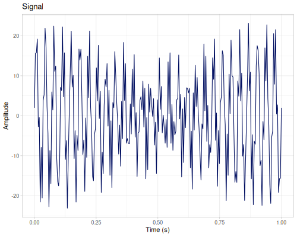
:::


## Fourier Transform (FFT)

Real and complex Fast Fourier Transform.

::: {.callout-tip title="Defined functions"}

* `fft`, `ifft`
* `transformer` cases: `:real` `:fft`, `:complex` `:fftr`, `:complex` `:fft`
:::


### `transformer`

When `transformer` is used directly we have following methods:


* `:real` `:fft` - real input, complex output, half of the spectrum, packed (see below)
* `:complex` `:fftr` - real input, complex output, full spectrum
* `:complex` `:fft` - complex input and output

Reverse transform also accepts `scale?` option (default `true`) to indicate if the result should be divided by number of elements or not.

---

`:real` `:fft`


::: {.sourceClojure}
```clojure
(def real-fft (t/transformer :real :fft))
```
:::


This transofmer accepts real signal and returns half of the spectrum with the following layout:

**Even signal length** Nyquist component exists

::: {.callout-note title="Examples"}


::: {.sourceClojure}
```clojure
(seq (t/forward-1d real-fft [2 1 4 -10 -2 0 2 0])) ;; => (-3.0 15.0 11.778174593052023 4.363961030678928 -6.0 -11.0 -3.778174593052023 8.363961030678928)
```
:::


:::


* first element - real part of DC, here `-3.0`
* second element - real part of Nyquist, here `15.0`
* the rest of the result - interleaved real and imaginary parts from the first half of the spectrum, here: `11.78+4.36i`, `-6-11i` and `-3.78+8.36i`

**Odd signal length**  - Nyquist component doesn't exist

::: {.callout-note title="Examples"}


::: {.sourceClojure}
```clojure
(seq (t/forward-1d real-fft [2 1 4 -10 -2 0 2])) ;; => (-3.0 11.360632966444271 13.792012084579973 0.35318974668120173 -9.753315895783421 -3.544188991092187 4.461303811203443)
```
:::


:::


* first element - real part of DC, here `-3.0`
* second element - imaginary part of the last spectrum component, here `11.36i`
* the rest of the result - interleaved real and imaginary parts from the first half of the spectrum, last element is real part only and should be combined with second element, here: `13.79+0.35i`, `-9.75-3.54i` and real part `4.46`

For 2d signals, only sizes of power of two are accepted. Layout is complicated, please refer [JTransform](https://javadoc.io/static/com.github.wendykierp/JTransforms/3.2/org/jtransforms/fft/DoubleFFT_2D.html#realForward(double%5B%5D%5B%5D)) documentation.


::: {.sourceClojure}
```clojure
(m/double-double-array->seq (t/forward-2d real-fft [[1 2 3 4]
                                                    [-1 0 -1 2]
                                                    [-1 1 1 -1]
                                                    [1 1 1 1]]))
```
:::


::: {.printedClojure}
```clojure
((14.0 -6.0 -4.0 2.0)
 (10.0 4.0 2.0 4.0)
 (6.0 2.0 -4.0 -2.0)
 (-4.0 -2.0 -2.0 4.0))

```
:::


---

`:complex` `:fftr`

To get full spectrum without encoding DC and Nyquist components for real inputs we can use complex transformer


::: {.sourceClojure}
```clojure
(def complex-fftr (t/transformer :complex :fftr))
```
:::


::: {.callout-note title="Examples"}


::: {.sourceClojure}
```clojure
(seq (t/forward-1d complex-fftr [2 1 4 -10 -2 0 2 0])) ;; => (-3.0 0.0 11.778174593052023 4.363961030678928 -6.0 -11.0 -3.778174593052023 8.363961030678928 15.0 0.0 -3.778174593052023 -8.363961030678928 -6.0 11.0 11.778174593052023 -4.363961030678928)
(seq (t/forward-1d complex-fftr [2 1 4 -10 -2 0 2])) ;; => (-3.0 0.0 13.792012084579973 0.35318974668120173 -9.753315895783421 -3.544188991092187 4.461303811203443 11.360632966444271 4.461303811203443 -11.360632966444271 -9.753315895783421 3.544188991092187 13.792012084579973 -0.35318974668120173)
```
:::


:::


::: {.sourceClojure}
```clojure
(m/double-double-array->seq (t/forward-2d complex-fftr [[1 2 3 4]
                                                        [-1 0 -1 2]
                                                        [-1 1 1 -1]
                                                        [1 1 1 1]]))
```
:::


::: {.printedClojure}
```clojure
((14.0 0.0 -4.0 2.0 -6.0 -0.0 -4.0 -2.0)
 (10.0 4.0 2.0 4.0 -2.0 4.0 -2.0 -4.0)
 (6.0 0.0 -4.0 -2.0 2.0 0.0 -4.0 2.0)
 (10.0 -4.0 -2.0 4.0 -2.0 -4.0 2.0 -4.0))

```
:::


---

`:complex` `:fft`

Complex transform for complex input. Layout for input should contain interleaved real and imaginary parts.


::: {.sourceClojure}
```clojure
(def complex-fft (t/transformer :complex :fftr))
```
:::


::: {.callout-note title="Examples"}


::: {.sourceClojure}
```clojure
(seq (t/forward-1d complex-fft (mapcat identity [[1 2] [3 4] [10 -1]]))) ;; => (19.0 0.0 -9.0 3.464101615137755 -2.0 -8.660254037844387 9.0 0.0 -2.0 8.660254037844387 -9.0 -3.464101615137755)
```
:::


:::


### `fft`, `ifft`

`fft` and `ifft` are helper functions for 1d case. Result of `fft` is used in `fastmath.signal` functions.

For `fft`


* input can be any sequence of numbers (for `real` case) or pairs (for `complex` case)
* output is always a sequence of complex numbers, output sequence contains metadata which allows to perform proper reverse transform.
* there is one option: `spectrum` which indicates if returned sequences should contain whole spectrum (`:double-sided`, default for `complex` input) or half of the spectrum (`:single-sided`, default for `real` input)
* **NOTE:** real input with even data size always contains Nyquist component

See the following cases:

Real input, even data size, last element is Nyquist component


::: {.sourceClojure}
```clojure
(let [result (t/fft [2 1 4 -10 -2 0 2 0])]
  {:meta (meta result)
   :result result})
```
:::


::: {.printedClojure}
```clojure
{:meta #:fastmath.transform{:fft {:kind :real, :nyquist? true}},
 :result
 [[-3.0 0.0]
  [11.778174593052023 4.363961030678928]
  [-6.0 -11.0]
  [-3.778174593052023 8.363961030678928]
  [15.0 0.0]]}

```
:::


Real input, odd data size, no Nyquist component


::: {.sourceClojure}
```clojure
(let [result (t/fft [2 1 4 -10 -2 0 2])]
  {:meta (meta result)
   :result result})
```
:::


::: {.printedClojure}
```clojure
{:meta #:fastmath.transform{:fft {:kind :real, :nyquist? false}},
 :result
 [[-3.0 0.0]
  [13.792012084579973 0.35318974668120173]
  [-9.753315895783421 -3.544188991092187]
  [4.461303811203443 11.360632966444271]]}

```
:::


Real input, full spectrum


::: {.sourceClojure}
```clojure
(let [result (t/fft [2 1 4 -10 -2 0 2 0] {:spectrum :double-sided})]
  {:meta (meta result)
   :result result})
```
:::


::: {.printedClojure}
```clojure
{:meta #:fastmath.transform{:fft {:kind :complex, :real? true}},
 :result
 [[-3.0 0.0]
  [11.778174593052023 4.363961030678928]
  [-6.0 -11.0]
  [-3.778174593052023 8.363961030678928]
  [15.0 0.0]
  [-3.778174593052023 -8.363961030678928]
  [-6.0 11.0]
  [11.778174593052023 -4.363961030678928]]}

```
:::


Complex input, full spectrum


::: {.sourceClojure}
```clojure
(let [result (t/fft [[2 1] [4 -10] [-2 0] [2 0]])]
  {:meta (meta result)
   :result result})
```
:::


::: {.printedClojure}
```clojure
{:meta #:fastmath.transform{:fft {:kind :complex, :real? false}},
 :result [[6.0 -9.0] [-6.0 -1.0] [-6.0 11.0] [14.0 3.0]]}

```
:::


For `ifft`:


* input is always a sequence of complex numbers (or pairs), preferably the result of `fft` function (which contains metadata about the type of the input).
* if input doesn't contain metadata, they can be provided as options:
  * `:kind` - the type of transform to perform: `:real` (default) or `:complex`.
  * `:even?` - for `:real` transforms, indicates if the original time-domain signal had an even length (crucial for correctly placing the Nyquist frequency).
  * `:real?` - for `:complex` transforms, indicates if the output should be narrowed to real numbers (doubles).
* additionaly, `:scale?` option indicates if result should be returned scaled (default: `true`) or not.

Reverse transform relies on meta data, however they can be overwriten when provieded in options. Let's construct result for odd input size.


::: {.sourceClojure}
```clojure
(def fft-result-odd-signal (t/fft [2 1 4 -10 0]))
```
:::


Reverse transform properly reads metadata and return original signal. However when metadata are stripped off, result of `ifft` is can be unexpected. To fix it, we can add proper information in options.

Reverse transform can be returned unscaled.

::: {.callout-note title="Examples"}


::: {.sourceClojure}
```clojure
(t/ifft fft-result-odd-signal) ;; => (1.9999999999999998 1.0000000000000004 4.0 -10.0 -3.552713678800501E-16)
(t/ifft (with-meta fft-result-odd-signal nil)) ;; => (2.6657797401561574 4.005804764351048 -4.497339220468474 -5.174245284038731)
(t/ifft (with-meta fft-result-odd-signal nil) {:even? false}) ;; => (2.6657797401561574 4.005804764351048 -4.497339220468474 -5.174245284038731)
(t/ifft fft-result-odd-signal {:scale? false}) ;; => (9.999999999999998 5.000000000000002 20.0 -50.0 -1.7763568394002505E-15)
```
:::


:::

---

Let's see coefficients of the example signal. Later in Signal Processing section we will show how to calculate amplitude, magnitude and other power spectrum values.


::: {.sourceClojure}
```clojure
(take 10 (t/fft signal))
```
:::


::: {.printedClojure}
```clojure
([11.999999999998707 0.0]
 [1.9725429588095125 -0.5297313325779669]
 [2.0091592251241615 -1.0338162219952274]
 [2.076736637889006 -1.4498157610580549]
 [2.204854251509623 -1.4732162575551868]
 [8.219165401003782 61.737075676792045]
 [2.1877116883132786 -5.38452707833185]
 [2.410074951649932 -5.449999104846434]
 [2.6504787272622323 -5.9977279841531015]
 [3.0365393046805167 -6.718142926068168])

```
:::


::: {.clay-image}
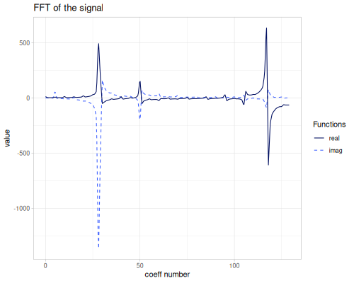
:::


## Discrete Cosine Transform (DCT)

DCT-I, DCT-II and DCT-III are implemented.

::: {.callout-tip title="Defined functions"}

* `dct`, `idct`
* `transformer` cases: `:real` `:dct` (DCT-II/III), `:real` `:cosine` (DCT-I)
:::


### `transformer`

When `transformer` is used directly we have following methods:


* `:real` `:dct` — DCT-II (forward) and DCT-III (inverse)
* `:real` `:cosine` — DCT-I; input should have size of power of 2 plus one ($N=2^p+1$)

Options:


* `:scale?`, for `:dct` — forward and reverse results can be scaled (default: `true`)
* `:normalization`, for `:cosine` — `:standard` or `:orthogonal` (default)


::: {.sourceClojure}
```clojure
(def real-dct (t/transformer :real :dct))
```
:::


::: {.sourceClojure}
```clojure
(def real-cosine (t/transformer :real :cosine))
```
:::


::: {.callout-note title="Examples"}


::: {.sourceClojure}
```clojure
(seq (t/forward-1d real-dct [1 2 -1 -2 0])) ;; => (0.0 2.0884930928482834 1.1441228056353687 -2.0342557855699983 -0.437016024448821)
(seq (t/forward-1d real-dct [1 2 -1 -2 0] {:scale? false})) ;; => (0.0 6.6043950509300915 3.618033988749895 -6.432881625776282 -1.3819660112501049)
(seq (t/forward-1d real-cosine [1 2 -1 -2 0])) ;; => (-0.3535533905932738 2.353553390593274 1.0606601717798214 -1.6464466094067258 -0.3535533905932738)
(seq (t/forward-1d real-cosine [1 2 -1 -2 0] {:normalization :standard})) ;; => (-0.5 3.3284271247461903 1.5 -2.3284271247461894 -0.5)
```
:::


:::

DCT-II and DCT-III can be used as their own inverses mutually. DCT-I is it's own inverse (forward and reverse are the same functions)

::: {.callout-note title="Examples"}


::: {.sourceClojure}
```clojure
(seq (t/forward-1d real-dct (t/reverse-1d real-dct [1 -2 3]))) ;; => (0.9999999999999996 -1.9999999999999998 3.0000000000000004)
(seq (t/reverse-1d real-dct (t/forward-1d real-dct [1 -2 3]))) ;; => (1.0 -2.0 3.0)
(seq (t/forward-1d real-cosine [1 -2 3])) ;; => (0.0 -1.0 4.0)
(seq (t/reverse-1d real-cosine [1 -2 3])) ;; => (0.0 -1.0 4.0)
(seq (t/forward-1d real-cosine (t/forward-1d real-cosine [1 -2 3]))) ;; => (1.0 -2.0 3.0)
```
:::


:::


### `dct`, `idct`

`dct` and `idct` are helper functions that work without constructing a transformer explicitly.

For `dct` options are:


* `:method` — `:DCT-I`, `:DCT-II` (default) or `:DCT-III`
* `:pad?` — for `:DCT-I`, left-pad with zeros so the size satisfies $N=2^p+1$ (default: `true`)
* `:scale?`

`idct` reads the `::dct` metadata attached by `dct` to determine the correct inverse type automatically.

---

Let's see coefficients for all transforms for example signal.

::: {.callout-note title="Examples"}


::: {.sourceClojure}
```clojure
(take 10 (t/dct signal {:method :DCT-I})) ;; => (0.9722718241314011 4.092868491536606 0.08475988294616346 4.040183024319199 0.08450033401844764 3.895113705704706 0.0852465454917997 3.485864946250326 0.09279334279139839 1.2774335659917881)
(take 10 (t/dct signal {:method :DCT-II})) ;; => (0.7499999999999185 4.007914482601815 0.17376210566146916 3.9549066343429935 0.1752902670200884 3.8087172679946657 0.17871820874450461 3.395523311720974 0.18825932386837993 1.1624617656099663)
(take 10 (t/dct signal {:method :DCT-III})) ;; => (2.5913135570820676 1.8978077124512147 2.0546529675854384 2.03724161047817 1.8796876179690474 2.043518042611337 1.6338819177070243 1.8508394112022564 0.9005150164481122 -0.610431697777948)
```
:::


:::


::: {.printedClojure}
```clojure
#'transform/sine-cosine-coeffs-plot

```
:::


::: {.clay-table}

```{=html}
<table class="table table-hover table-responsive clay-table"><tbody><tr><td><div class="clay-image"><p>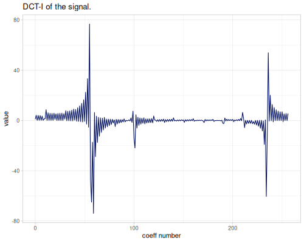</p></div></td><td><div class="clay-image"><p>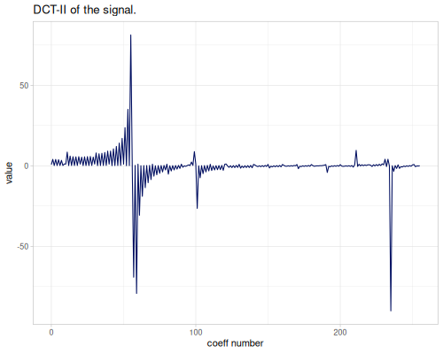</p></div></td><td><div class="clay-image"><p>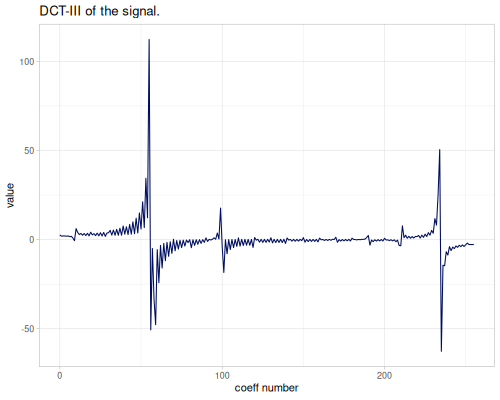</p></div></td></tr></tbody></table>
```

:::


## Discrete Sine Transform (DST)

DST-I, DST-II and DST-III are implemented.

::: {.callout-tip title="Defined functions"}

* `dst`, `idst`
* `transformer` cases: `:real` `:dst` (DST-II/III), `:real` `:sine` (DST-I)
:::


### `transformer`


* `:real` `:dst` — DST-II (forward) and DST-III (inverse)
* `:real` `:sine` — DST-I; input must have even size ($2^p$) and first element must be `0.0`

Options: `:scale?` and `:normalization` (`:standard` or `:orthogonal`)


### `dst`, `idst`

`dst` and `idst` are convenience helpers. Options for `dst`:


* `:method` — `:DST-I`, `:DST-II` (default) or `:DST-III`
* `:pad?` — for `:DST-I`, left-pad with a zero to satisfy the size requirement (default: `true`)
* `:scale?`

`idst` reads the `::dst` metadata attached by `dst` to choose the correct inverse automatically.

---

Coefficients for all variants. Note that the DST-I result is longer due to left-padding with a zero.

::: {.callout-note title="Examples"}


::: {.sourceClojure}
```clojure
(take 10 (t/dst signal {:method :DST-I})) ;; => (0.0 1.8689470407450468 -0.36968612380305643 -1.3785643552140634 0.03310820828612312 1.489470698716413 -0.04231708157560893 -1.4771590100361944 0.06461351387470268 1.3657515135299834)
(take 10 (t/dst signal {:method :DST-II})) ;; => (0.5474175360327573 0.04895809197062661 0.1326647647315007 0.0957079715866399 0.006506781722959605 0.13481629406595044 -0.118423153608528 0.1396207772675064 -0.5137314340373736 -5.402020761079225)
(take 10 (t/dst signal {:method :DST-III})) ;; => (-1.3964528877912088 2.1763075873310807 -1.7982260476135274 2.062555566107647 -1.7677510163026606 1.955501342907134 -1.6345950366356325 1.621045825383551 -1.145223622878356 -1.6937276664259748)
```
:::


:::

::: {.clay-table}

```{=html}
<table class="table table-hover table-responsive clay-table"><tbody><tr><td><div class="clay-image"><p>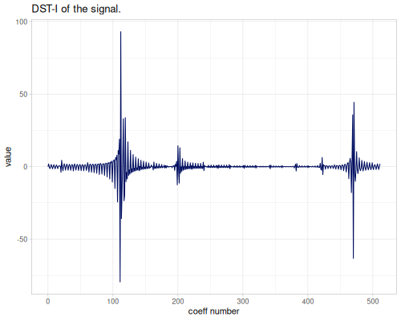</p></div></td><td><div class="clay-image"><p>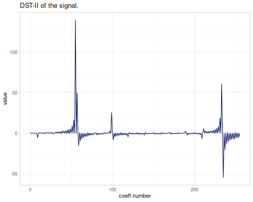</p></div></td><td><div class="clay-image"><p>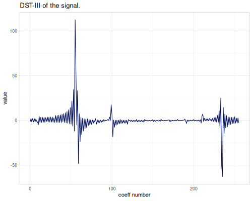</p></div></td></tr></tbody></table>
```

:::


## Discrete Hartley Transform (DHT)

::: {.callout-tip title="Defined functions"}

* `dht`, `idht`
* `transformer` cases: `:real` `:dht`
:::


### `transformer`


* `:real` `:dht` — Hartley transform (self-inverse up to scaling)

Options: `:scale?` (default `true`)


### `dht`, `idht`

`dht` and `idht` are convenience helpers. `idht` accepts `:scale?` option.

::: {.clay-image}
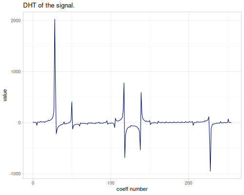
:::


## Fast Hadamard Transform (FHT)

::: {.callout-tip title="Defined functions"}

* `hadamard`, `ihadamard`
* `transformer` cases: `:real` `:hadamard`
:::


### `transformer`


* `:real` `:hadamard` — input length must be a power of 2; output is a `double-array`


### `hadamard`, `ihadamard`

`hadamard` and `ihadamard` are convenience helpers.

::: {.clay-image}
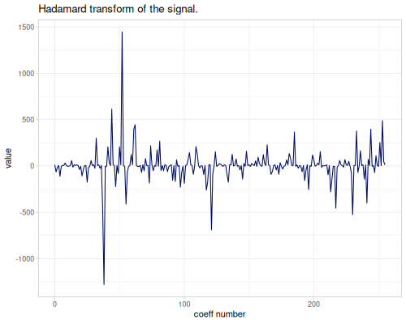
:::


## Wavelet Transforms

::: {.callout-tip title="Defined functions"}

* `dwt`, `idwt`
* `wpt`, `iwpt`
* `wpd`
* `transformer` cases: `:dwt`, `:wpt`, `:wpd` + wavelet name (string = built-in, keyword = JWave)
:::


### Wavelet families catalogue

There are two sources of wavelets: [JWave](https://github.com/graetz23/JWave) (keyword names) and a built-in Matlab-compatible library (string names).

`keyword` based names are for `JWave` wavelets, `string` based are for Matlab (built-in).

::: {.callout-caution}
JWave wavelets have some issues with coefficients: some of them are not reversible or have reversed coefficients.
:::


##### Haar

::: {.callout-tip title="Wavelets"}

* `"haar"`, `"db1"`
* `:haar`, `:haar-orthogonal`
:::


Haar (step, or Daubechies 1, db1) wavelet. `:haar-orthogonal` is not normalized version of a wavelet.

::: {.clay-table}

```{=html}
<table class="table table-hover table-responsive clay-table"><thead><tr><th>Built-in</th><th>JWave</th></tr></thead><tbody><tr><td><div><pre><code class="sourceCode language-clojure printed-clojure">[&quot;haar&quot; &quot;db1&quot;]
</code></pre></div></td><td><div><pre><code class="sourceCode language-clojure printed-clojure">[:haar :haar-orthogonal]
</code></pre></div></td></tr></tbody></table>
```

:::


::: {.clay-table}

```{=html}
<table class="table table-hover table-responsive clay-table"><tbody><tr><td><div class="clay-image"><p></p></div></td><td><div class="clay-image"><p>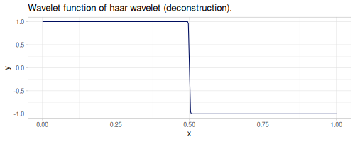</p></div></td></tr><tr><td><div class="clay-image"><p>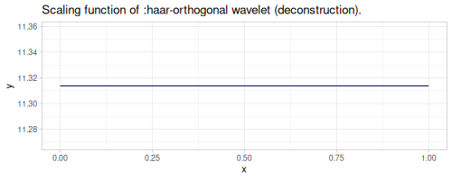</p></div></td><td><div class="clay-image"><p></p></div></td></tr></tbody></table>
```

:::


#### Daubechies

Daubechies, extremal phase,  wavelets.

::: {.clay-table}

```{=html}
<table class="table table-hover table-responsive clay-table"><thead><tr><th>Built-in</th><th>JWave</th></tr></thead><tbody><tr><td><div><pre><code class="sourceCode language-clojure printed-clojure">[&quot;db2&quot;
 &quot;db3&quot;
 &quot;db4&quot;
 &quot;db5&quot;
 &quot;db6&quot;
 &quot;db7&quot;
 &quot;db8&quot;
 &quot;db9&quot;
 &quot;db10&quot;
 &quot;db11&quot;
 &quot;db12&quot;
 &quot;db13&quot;
 &quot;db14&quot;
 &quot;db15&quot;
 &quot;db16&quot;
 &quot;db17&quot;
 &quot;db18&quot;
 &quot;db19&quot;
 &quot;db20&quot;
 &quot;db21&quot;
 &quot;db22&quot;
 &quot;db23&quot;
 &quot;db24&quot;
 &quot;db25&quot;
 &quot;db26&quot;
 &quot;db27&quot;
 &quot;db28&quot;
 &quot;db29&quot;
 &quot;db30&quot;
 &quot;db31&quot;
 &quot;db32&quot;
 &quot;db33&quot;
 &quot;db34&quot;
 &quot;db35&quot;
 &quot;db36&quot;
 &quot;db37&quot;
 &quot;db38&quot;
 &quot;db39&quot;
 &quot;db40&quot;
 &quot;db41&quot;
 &quot;db42&quot;
 &quot;db43&quot;
 &quot;db44&quot;
 &quot;db45&quot;]
</code></pre></div></td><td><div><pre><code class="sourceCode language-clojure printed-clojure">[:daubechies-2
 :daubechies-3
 :daubechies-4
 :daubechies-5
 :daubechies-6
 :daubechies-7
 :daubechies-8
 :daubechies-9
 :daubechies-10
 :daubechies-11
 :daubechies-12
 :daubechies-13
 :daubechies-14
 :daubechies-15
 :daubechies-16
 :daubechies-17
 :daubechies-18
 :daubechies-19
 :daubechies-20]
</code></pre></div></td></tr></tbody></table>
```

:::


::: {.clay-table}

```{=html}
<table class="table table-hover table-responsive clay-table"><tbody><tr><td><div class="clay-image"><p>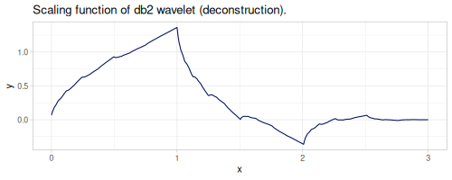</p></div></td><td><div class="clay-image"><p></p></div></td></tr><tr><td><div class="clay-image"><p></p></div></td><td><div class="clay-image"><p></p></div></td></tr><tr><td><div class="clay-image"><p>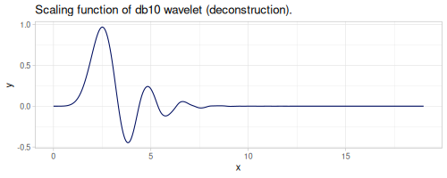</p></div></td><td><div class="clay-image"><p>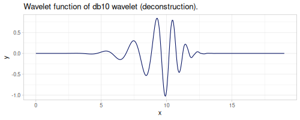</p></div></td></tr></tbody></table>
```

:::


#### Symlet

Symlet, least asymmetric, wavelets.

Symlet 2 and 3 are the same as Daubechies. Wavelets starting with `la` are defined in `wavelets` R package and are the same as symlets ("sym4"="la8", "sym5"="la10", etc.).

::: {.clay-table}

```{=html}
<table class="table table-hover table-responsive clay-table"><thead><tr><th>Built-in</th><th>JWave</th></tr></thead><tbody><tr><td><div><pre><code class="sourceCode language-clojure printed-clojure">[&quot;sym2&quot;
 &quot;sym3&quot;
 &quot;sym4&quot;
 &quot;sym5&quot;
 &quot;sym6&quot;
 &quot;sym7&quot;
 &quot;sym8&quot;
 &quot;sym9&quot;
 &quot;sym10&quot;
 &quot;sym11&quot;
 &quot;sym12&quot;
 &quot;sym13&quot;
 &quot;sym14&quot;
 &quot;sym15&quot;
 &quot;sym16&quot;
 &quot;sym17&quot;
 &quot;sym18&quot;
 &quot;sym19&quot;
 &quot;sym20&quot;
 &quot;sym21&quot;
 &quot;sym22&quot;
 &quot;sym23&quot;
 &quot;sym24&quot;
 &quot;sym25&quot;
 &quot;sym26&quot;
 &quot;sym27&quot;
 &quot;sym28&quot;
 &quot;sym29&quot;
 &quot;sym30&quot;
 &quot;sym31&quot;
 &quot;sym32&quot;
 &quot;sym33&quot;
 &quot;sym34&quot;
 &quot;sym35&quot;
 &quot;sym36&quot;
 &quot;sym37&quot;
 &quot;sym38&quot;
 &quot;sym39&quot;
 &quot;sym40&quot;
 &quot;sym41&quot;
 &quot;sym42&quot;
 &quot;sym43&quot;
 &quot;sym44&quot;
 &quot;sym45&quot;
 &quot;la8&quot;
 &quot;la10&quot;
 &quot;la12&quot;
 &quot;la14&quot;
 &quot;la16&quot;
 &quot;la18&quot;
 &quot;la20&quot;]
</code></pre></div></td><td><div><pre><code class="sourceCode language-clojure printed-clojure">[:symlet-2
 :symlet-3
 :symlet-4
 :symlet-5
 :symlet-6
 :symlet-7
 :symlet-8
 :symlet-9
 :symlet-10
 :symlet-11
 :symlet-12
 :symlet-13
 :symlet-14
 :symlet-15
 :symlet-16
 :symlet-17
 :symlet-18
 :symlet-19
 :symlet-20]
</code></pre></div></td></tr></tbody></table>
```

:::


::: {.clay-table}

```{=html}
<table class="table table-hover table-responsive clay-table"><tbody><tr><td><div class="clay-image"><p>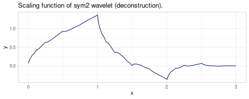</p></div></td><td><div class="clay-image"><p></p></div></td></tr><tr><td><div class="clay-image"><p>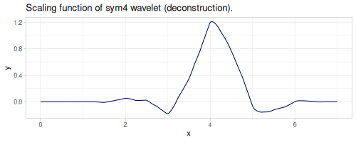</p></div></td><td><div class="clay-image"><p></p></div></td></tr><tr><td><div class="clay-image"><p>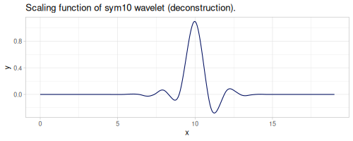</p></div></td><td><div class="clay-image"><p></p></div></td></tr></tbody></table>
```

:::


#### Coiflet

Coiflet wavelets.

::: {.clay-table}

```{=html}
<table class="table table-hover table-responsive clay-table"><thead><tr><th>Built-in</th><th>JWave</th></tr></thead><tbody><tr><td><div><pre><code class="sourceCode language-clojure printed-clojure">[&quot;coif1&quot; &quot;coif2&quot; &quot;coif3&quot; &quot;coif4&quot; &quot;coif5&quot;]
</code></pre></div></td><td><div><pre><code class="sourceCode language-clojure printed-clojure">[:coiflet-1 :coiflet-2 :coiflet-3 :coiflet-4 :coiflet-5]
</code></pre></div></td></tr></tbody></table>
```

:::


::: {.clay-table}

```{=html}
<table class="table table-hover table-responsive clay-table"><tbody><tr><td><div class="clay-image"><p>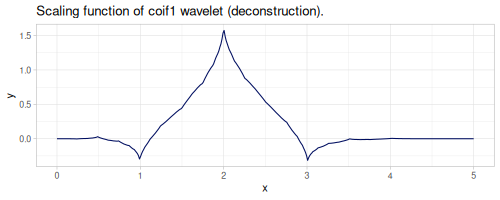</p></div></td><td><div class="clay-image"><p></p></div></td></tr><tr><td><div class="clay-image"><p></p></div></td><td><div class="clay-image"><p></p></div></td></tr><tr><td><div class="clay-image"><p>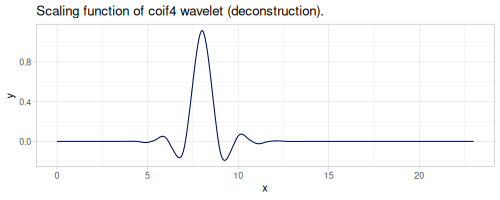</p></div></td><td><div class="clay-image"><p></p></div></td></tr></tbody></table>
```

:::


#### Best-localized Daubechies

::: {.clay-table}

```{=html}
<table class="table table-hover table-responsive clay-table"><thead><tr><th>Built-in</th><th>JWave</th></tr></thead><tbody><tr><td><div><pre><code class="sourceCode language-clojure printed-clojure">[&quot;bl7&quot; &quot;bl9&quot; &quot;bl10&quot;]
</code></pre></div></td><td>-</td></tr></tbody></table>
```

:::


::: {.clay-table}

```{=html}
<table class="table table-hover table-responsive clay-table"><tbody><tr><td><div class="clay-image"><p>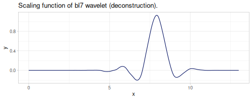</p></div></td><td><div class="clay-image"><p></p></div></td></tr><tr><td><div class="clay-image"><p>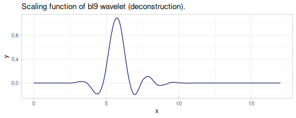</p></div></td><td><div class="clay-image"><p>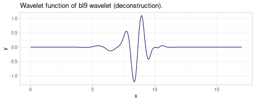</p></div></td></tr><tr><td><div class="clay-image"><p>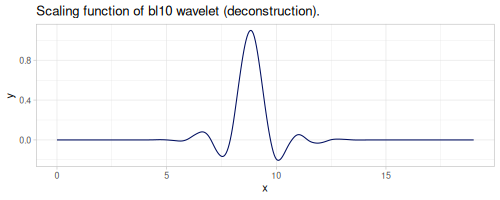</p></div></td><td><div class="clay-image"><p>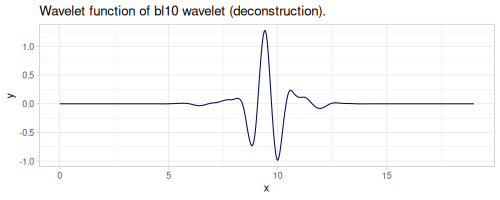</p></div></td></tr></tbody></table>
```

:::


#### Fejér-Korovkin

::: {.clay-table}

```{=html}
<table class="table table-hover table-responsive clay-table"><thead><tr><th>Built-in</th><th>JWave</th></tr></thead><tbody><tr><td><div><pre><code class="sourceCode language-clojure printed-clojure">[&quot;fk4&quot; &quot;fk6&quot; &quot;fk8&quot; &quot;fk14&quot; &quot;fk18&quot; &quot;fk22&quot;]
</code></pre></div></td><td>-</td></tr></tbody></table>
```

:::


::: {.clay-table}

```{=html}
<table class="table table-hover table-responsive clay-table"><tbody><tr><td><div class="clay-image"><p></p></div></td><td><div class="clay-image"><p></p></div></td></tr><tr><td><div class="clay-image"><p></p></div></td><td><div class="clay-image"><p>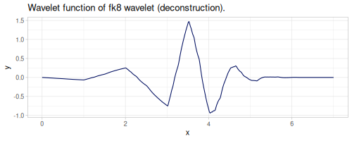</p></div></td></tr><tr><td><div class="clay-image"><p></p></div></td><td><div class="clay-image"><p>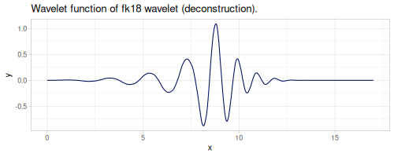</p></div></td></tr></tbody></table>
```

:::


#### Morris minimum-bandwidth

::: {.clay-table}

```{=html}
<table class="table table-hover table-responsive clay-table"><thead><tr><th>Built-in</th><th>JWave</th></tr></thead><tbody><tr><td><div><pre><code class="sourceCode language-clojure printed-clojure">[&quot;mb4.2&quot;
 &quot;mb8.2&quot;
 &quot;mb8.3&quot;
 &quot;mb8.4&quot;
 &quot;mb10.3&quot;
 &quot;mb12.3&quot;
 &quot;mb14.3&quot;
 &quot;mb16.3&quot;
 &quot;mb18.3&quot;
 &quot;mb24.3&quot;
 &quot;mb32.3&quot;]
</code></pre></div></td><td>-</td></tr></tbody></table>
```

:::


::: {.clay-table}

```{=html}
<table class="table table-hover table-responsive clay-table"><tbody><tr><td><div class="clay-image"><p>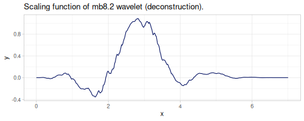</p></div></td><td><div class="clay-image"><p>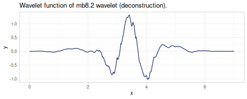</p></div></td></tr><tr><td><div class="clay-image"><p></p></div></td><td><div class="clay-image"><p></p></div></td></tr><tr><td><div class="clay-image"><p></p></div></td><td><div class="clay-image"><p></p></div></td></tr></tbody></table>
```

:::


#### Han linear-phase moments

::: {.clay-table}

```{=html}
<table class="table table-hover table-responsive clay-table"><thead><tr><th>Built-in</th><th>JWave</th></tr></thead><tbody><tr><td><div><pre><code class="sourceCode language-clojure printed-clojure">[&quot;han2.3&quot; &quot;han3.3&quot; &quot;han4.5&quot; &quot;han5.5&quot;]
</code></pre></div></td><td>-</td></tr></tbody></table>
```

:::


::: {.clay-table}

```{=html}
<table class="table table-hover table-responsive clay-table"><tbody><tr><td><div class="clay-image"><p>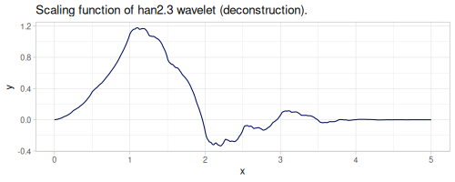</p></div></td><td><div class="clay-image"><p></p></div></td></tr><tr><td><div class="clay-image"><p></p></div></td><td><div class="clay-image"><p></p></div></td></tr><tr><td><div class="clay-image"><p></p></div></td><td><div class="clay-image"><p>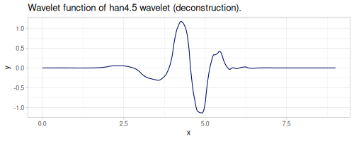</p></div></td></tr></tbody></table>
```

:::


#### Beylkin

::: {.clay-table}

```{=html}
<table class="table table-hover table-responsive clay-table"><thead><tr><th>Built-in</th><th>JWave</th></tr></thead><tbody><tr><td><div><pre><code class="sourceCode language-clojure printed-clojure">[&quot;beyl&quot;]
</code></pre></div></td><td>-</td></tr></tbody></table>
```

:::


::: {.clay-table}

```{=html}
<table class="table table-hover table-responsive clay-table"><tbody><tr><td><div class="clay-image"><p>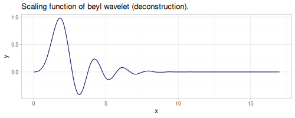</p></div></td><td><div class="clay-image"><p>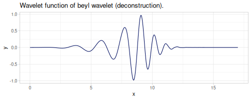</p></div></td></tr></tbody></table>
```

:::


#### Discrete Meyer

There is a difference in number of coefficients.

::: {.clay-table}

```{=html}
<table class="table table-hover table-responsive clay-table"><thead><tr><th>Built-in</th><th>JWave</th></tr></thead><tbody><tr><td><div><pre><code class="sourceCode language-clojure printed-clojure">[&quot;dmey&quot;]
</code></pre></div></td><td><div><pre><code class="sourceCode language-clojure printed-clojure">[:discrete-mayer]
</code></pre></div></td></tr></tbody></table>
```

:::


::: {.clay-table}

```{=html}
<table class="table table-hover table-responsive clay-table"><tbody><tr><td><div class="clay-image"><p>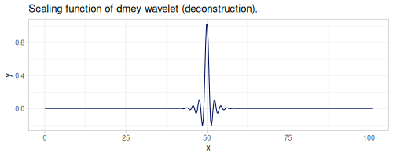</p></div></td><td><div class="clay-image"><p>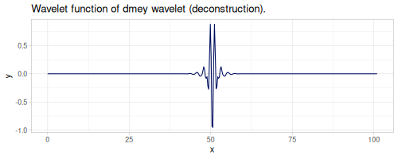</p></div></td></tr><tr><td><div class="clay-image"><p></p></div></td><td><div class="clay-image"><p></p></div></td></tr></tbody></table>
```

:::


#### Vaidyanathan

::: {.clay-table}

```{=html}
<table class="table table-hover table-responsive clay-table"><thead><tr><th>Built-in</th><th>JWave</th></tr></thead><tbody><tr><td><div><pre><code class="sourceCode language-clojure printed-clojure">[&quot;vaid&quot;]
</code></pre></div></td><td>-</td></tr></tbody></table>
```

:::


::: {.clay-table}

```{=html}
<table class="table table-hover table-responsive clay-table"><tbody><tr><td><div class="clay-image"><p></p></div></td><td><div class="clay-image"><p>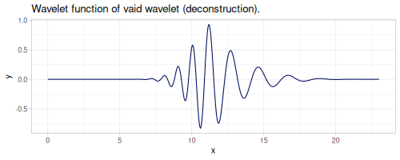</p></div></td></tr></tbody></table>
```

:::


#### Bi-orthogonal

::: {.clay-table}

```{=html}
<table class="table table-hover table-responsive clay-table"><thead><tr><th>Built-in</th><th>JWave</th></tr></thead><tbody><tr><td><div><pre><code class="sourceCode language-clojure printed-clojure">[&quot;bior1.1&quot;
 &quot;bior1.3&quot;
 &quot;bior1.5&quot;
 &quot;bior2.2&quot;
 &quot;bior2.4&quot;
 &quot;bior2.6&quot;
 &quot;bior2.8&quot;
 &quot;bior3.1&quot;
 &quot;bior3.3&quot;
 &quot;bior3.5&quot;
 &quot;bior3.7&quot;
 &quot;bior3.9&quot;
 &quot;bior4.4&quot;
 &quot;bior5.5&quot;
 &quot;bior6.8&quot;
 &quot;rbio1.1&quot;
 &quot;rbio1.3&quot;
 &quot;rbio1.5&quot;
 &quot;rbio2.2&quot;
 &quot;rbio2.4&quot;
 &quot;rbio2.6&quot;
 &quot;rbio2.8&quot;
 &quot;rbio3.1&quot;
 &quot;rbio3.3&quot;
 &quot;rbio3.5&quot;
 &quot;rbio3.7&quot;
 &quot;rbio3.9&quot;
 &quot;rbio4.4&quot;
 &quot;rbio5.5&quot;
 &quot;rbio6.8&quot;]
</code></pre></div></td><td><div><pre><code class="sourceCode language-clojure printed-clojure">[:biorthogonal-11
 :biorthogonal-13
 :biorthogonal-15
 :biorthogonal-22
 :biorthogonal-24
 :biorthogonal-26
 :biorthogonal-28
 :biorthogonal-31
 :biorthogonal-33
 :biorthogonal-35
 :biorthogonal-37
 :biorthogonal-39
 :biorthogonal-44
 :biorthogonal-55
 :biorthogonal-68]
</code></pre></div></td></tr></tbody></table>
```

:::


::: {.clay-table}

```{=html}
<table class="table table-hover table-responsive clay-table"><tbody><tr><td><div class="clay-image"><p>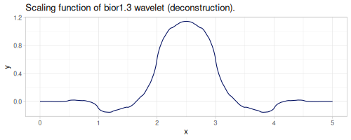</p></div></td><td><div class="clay-image"><p></p></div></td></tr><tr><td><div class="clay-image"><p>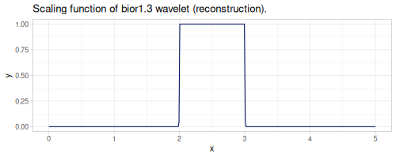</p></div></td><td><div class="clay-image"><p>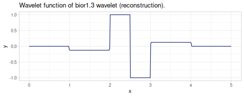</p></div></td></tr><tr><td><div class="clay-image"><p>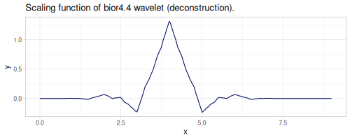</p></div></td><td><div class="clay-image"><p></p></div></td></tr><tr><td><div class="clay-image"><p></p></div></td><td><div class="clay-image"><p>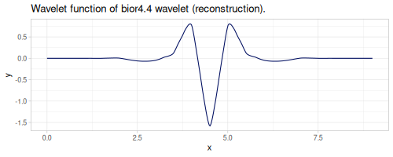</p></div></td></tr></tbody></table>
```

:::


#### Other

All below (but `:legendre-1`) are not orthogonal (nor bi-orthogonal) and probably are defined with wrong coefficients. Listing them for the reference only.

::: {.clay-table}

```{=html}
<table class="table table-hover table-responsive clay-table"><thead><tr><th>Built-in</th><th>JWave</th></tr></thead><tbody><tr><td>-</td><td><div><pre><code class="sourceCode language-clojure printed-clojure">[:legendre-1 :legendre-2 :legendre-3 :cdf-53 :cdf-97 :battle-23]
</code></pre></div></td></tr></tbody></table>
```

:::


::: {.clay-table}

```{=html}
<table class="table table-hover table-responsive clay-table"><tbody><tr><td><div class="clay-image"><p>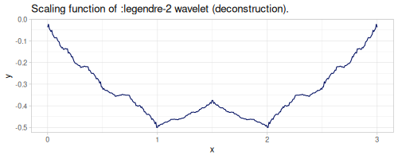</p></div></td><td><div class="clay-image"><p></p></div></td></tr><tr><td><div class="clay-image"><p></p></div></td><td><div class="clay-image"><p></p></div></td></tr><tr><td><div class="clay-image"><p></p></div></td><td><div class="clay-image"><p>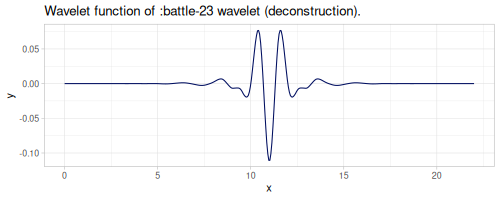</p></div></td></tr></tbody></table>
```

:::


::: {.sourceClojure}
```clojure
(def sig (map (fn [id]
              (let [p (/ id 256.0)]
                (+ (m/* 12 (m/sin (* m/TWO_PI p 28)))
                   (m/* 6 (m/sin (* m/TWO_PI p 29)))
                   (m/* 8 (m/sin (* m/TWO_PI p 117)))
                   (m/* 2 (if (> (m/frac (m/* m/PI 50 p)) 0.5) -1.0 1.0))))) (range 256)))
```
:::


::: {.clay-table}

```{=html}
<table class="table table-hover table-responsive clay-table"><tbody><tr><td><div class="clay-image"><p></p></div></td><td><div class="clay-image"><p>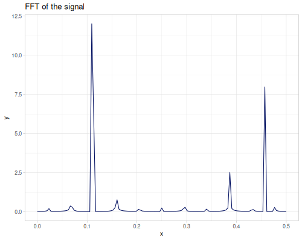</p></div></td></tr></tbody></table>
```

:::


### Windows

A collection of window functions used in spectral analysis. A `fastmath.kernel/window` function allows to generate window coefficients for selected window type and optional parameters. Namespace `fastmath.kernel.window` contains implementations of all window functions.

Most of windows are based on continuous functions which are later sampled to get discrete coefficients.

`k/window` common options are:


* `:symmetric?` (default: `true`)
    * `true` (default) - window coefficients are symmetric
    * `false` - periodic window (last coefficient is skipped)
* `:normalize?` (default: `true`), for continuous window functions
    * `true` - maximum value is `1`
    * `false` - intergral of function is `1`

::: {.callout-note title="Examples"}


::: {.sourceClojure}
```clojure
(k/window :welch 5) ;; => (0.0 0.75 1.0 0.75 0.0)
(k/window :welch 4 {:symmetric? false}) ;; => (0.0 0.75 1.0 0.75)
(k/window :welch 5 {:normalize? false}) ;; => (0.0 1.125 1.5 1.125 0.0)
```
:::


:::

Each window is illustrated by 4 charts:


* a window function
* FFT of a signal after applying a window
* FFT of a window (padded by zeros for interpolation)
* main- and side-lobes 


#### Rectangular

There are two rectangular windows: `:rectangular` and `:rectangular05`. The latter has values `0.5` at both ends.


::: {.sourceClojure}
```clojure
(k/window :rectangular 8)
```
:::


::: {.printedClojure}
```clojure
(1.0 1.0 1.0 1.0 1.0 1.0 1.0 1.0)

```
:::


::: {.clay-table}

```{=html}
<table class="table table-hover table-responsive clay-table"><tbody><tr><td><div class="clay-image"><p></p></div></td><td><div class="clay-image"><p></p></div></td></tr><tr><td><div class="clay-image"><p>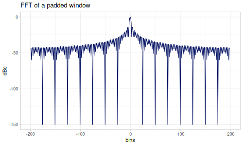</p></div></td><td><div class="clay-image"><p>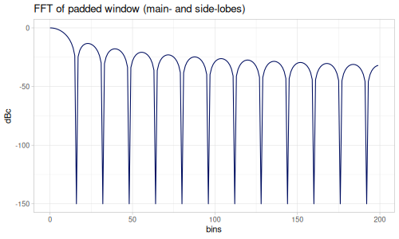</p></div></td></tr></tbody></table>
```

:::


::: {.sourceClojure}
```clojure
(k/window :rectangular05 8)
```
:::


::: {.printedClojure}
```clojure
(0.5 1.0 1.0 1.0 1.0 1.0 1.0 0.5)

```
:::


::: {.clay-table}

```{=html}
<table class="table table-hover table-responsive clay-table"><tbody><tr><td><div class="clay-image"><p></p></div></td><td><div class="clay-image"><p></p></div></td></tr><tr><td><div class="clay-image"><p>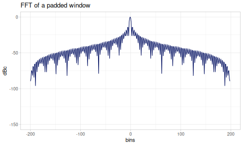</p></div></td><td><div class="clay-image"><p>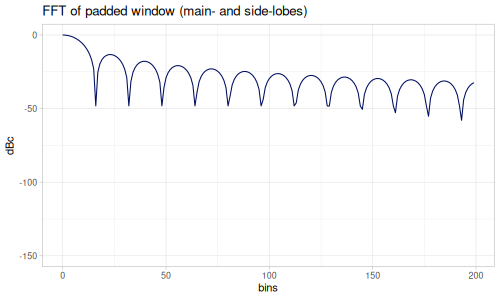</p></div></td></tr></tbody></table>
```

:::


#### Triangular

Triangular window has a `:shift` parameter, which shifts both ends of the triangle to a non-zero value. By default `:shift` is set to `2` (which results in the same coefficients as in Scipy).

$$w(n) = 1 - \left|\frac{n - \frac{N}{2}}{\frac{N+shift}{2}}\right|,\quad 0\le n \le N$$

:::: {.grid}
::: {.g-col-6}


::: {.sourceClojure}
```clojure
(k/window :triangular 5 {:shift 0})
```
:::


::: {.printedClojure}
```clojure
(0.0 0.5 1.0 0.5 0.0)

```
:::


:::
::: {.g-col-6}


::: {.sourceClojure}
```clojure
(k/window :triangular 8 {:shift 0})
```
:::


::: {.printedClojure}
```clojure
(0.0
 0.2857142857142857
 0.5714285714285714
 0.8571428571428571
 0.8571428571428572
 0.5714285714285714
 0.2857142857142858
 0.0)

```
:::


:::
::::

::: {.clay-table}

```{=html}
<table class="table table-hover table-responsive clay-table"><tbody><tr><td><div class="clay-image"><p>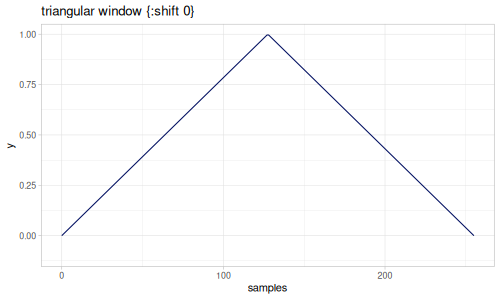</p></div></td><td><div class="clay-image"><p></p></div></td></tr><tr><td><div class="clay-image"><p>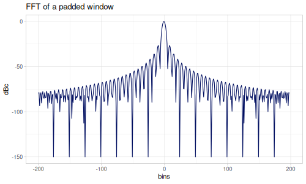</p></div></td><td><div class="clay-image"><p></p></div></td></tr></tbody></table>
```

:::


:::: {.grid}
::: {.g-col-6}


::: {.sourceClojure}
```clojure
(k/window :triangular 5)
```
:::


::: {.printedClojure}
```clojure
(0.33333333333333337
 0.6666666666666667
 1.0
 0.6666666666666667
 0.33333333333333337)

```
:::


:::
::: {.g-col-6}


::: {.sourceClojure}
```clojure
(k/window :triangular 8)
```
:::


::: {.printedClojure}
```clojure
(0.125 0.375 0.625 0.875 0.875 0.625 0.375 0.125)

```
:::


:::
::::

::: {.clay-table}

```{=html}
<table class="table table-hover table-responsive clay-table"><tbody><tr><td><div class="clay-image"><p></p></div></td><td><div class="clay-image"><p></p></div></td></tr><tr><td><div class="clay-image"><p></p></div></td><td><div class="clay-image"><p></p></div></td></tr></tbody></table>
```

:::


#### Parzen

There are two Parzen window definitions, based on continuous function and discrete formulation ([wikipedia](https://en.wikipedia.org/wiki/Window_function#Parzen_window)) when `:discrete?` option is set to `true` (default).

Again, the difference is in shifted ends of the window. Continuous version has ends set to `0.0`.

:::: {.grid}
::: {.g-col-6}


::: {.sourceClojure}
```clojure
(k/window :parzen 5)
```
:::


::: {.printedClojure}
```clojure
(0.01599999999999999
 0.42399999999999993
 1.0
 0.42399999999999993
 0.01599999999999999)

```
:::


:::
::: {.g-col-6}


::: {.sourceClojure}
```clojure
(k/window :parzen 8)
```
:::


::: {.printedClojure}
```clojure
(0.00390625
 0.10546875
 0.47265625
 0.91796875
 0.91796875
 0.47265625
 0.10546875
 0.00390625)

```
:::


:::
::::

::: {.clay-table}

```{=html}
<table class="table table-hover table-responsive clay-table"><tbody><tr><td><div class="clay-image"><p></p></div></td><td><div class="clay-image"><p></p></div></td></tr><tr><td><div class="clay-image"><p></p></div></td><td><div class="clay-image"><p></p></div></td></tr></tbody></table>
```

:::


:::: {.grid}
::: {.g-col-6}


::: {.sourceClojure}
```clojure
(k/window :parzen 5 {:discrete? false})
```
:::


::: {.printedClojure}
```clojure
(0.0 0.24999999999999994 1.0 0.24999999999999994 0.0)

```
:::


:::
::: {.g-col-6}


::: {.sourceClojure}
```clojure
(k/window :parzen 8 {:discrete? false})
```
:::


::: {.printedClojure}
```clojure
(0.0
 0.046647230320699284
 0.3702623906705538
 0.8950437317784256
 0.8950437317784256
 0.3702623906705538
 0.04664723032069995
 0.0)

```
:::


:::
::::

::: {.clay-table}

```{=html}
<table class="table table-hover table-responsive clay-table"><tbody><tr><td><div class="clay-image"><p></p></div></td><td><div class="clay-image"><p></p></div></td></tr><tr><td><div class="clay-image"><p></p></div></td><td><div class="clay-image"><p></p></div></td></tr></tbody></table>
```

:::


#### B-spline

B-spline family is a generalization of above windows. `:order` parameter controls number of convolutions of rectangle window.

Order:


* `1` - rectangular window (with the first coefficient set to `0.0`)
* `2` - triangular window
* `4` - Parzen window

By default, `:order` is set to a value of `3`.

:::: {.grid}
::: {.g-col-6}


::: {.sourceClojure}
```clojure
(k/window :b-spline 5)
```
:::


::: {.printedClojure}
```clojure
(0.0 0.375 1.0 0.37500000000000067 4.996003610813204E-16)

```
:::


:::
::: {.g-col-6}


::: {.sourceClojure}
```clojure
(k/window :b-spline 8)
```
:::


::: {.printedClojure}
```clojure
(0.0
 0.12244897959183672
 0.48979591836734687
 0.9387755102040816
 0.9387755102040816
 0.48979591836734726
 0.12244897959183773
 4.996003610813204E-16)

```
:::


:::
::::

::: {.clay-table}

```{=html}
<table class="table table-hover table-responsive clay-table"><tbody><tr><td><div class="clay-image"><p></p></div></td><td><div class="clay-image"><p></p></div></td></tr><tr><td><div class="clay-image"><p></p></div></td><td><div class="clay-image"><p></p></div></td></tr></tbody></table>
```

:::


:::: {.grid}
::: {.g-col-6}


::: {.sourceClojure}
```clojure
(k/window :b-spline 5 {:order 5})
```
:::


::: {.printedClojure}
```clojure
(0.0 0.1684782608695652 1.0 0.16847826086956086 0.0)

```
:::


:::
::: {.g-col-6}


::: {.sourceClojure}
```clojure
(k/window :b-spline 8 {:order 5})
```
:::


::: {.printedClojure}
```clojure
(0.0
 0.018108396863625656
 0.27800010865038105
 0.8736939318762108
 0.8736939318762118
 0.2780001086503848
 0.018108396863633053
 0.0)

```
:::


:::
::::

::: {.clay-table}

```{=html}
<table class="table table-hover table-responsive clay-table"><tbody><tr><td><div class="clay-image"><p></p></div></td><td><div class="clay-image"><p></p></div></td></tr><tr><td><div class="clay-image"><p></p></div></td><td><div class="clay-image"><p></p></div></td></tr></tbody></table>
```

:::


#### Welch

Polynomial window, inverted parabola.

:::: {.grid}
::: {.g-col-6}


::: {.sourceClojure}
```clojure
(k/window :welch 5)
```
:::


::: {.printedClojure}
```clojure
(0.0 0.75 1.0 0.75 0.0)

```
:::


:::
::: {.g-col-6}


::: {.sourceClojure}
```clojure
(k/window :welch 8)
```
:::


::: {.printedClojure}
```clojure
(0.0
 0.48979591836734687
 0.8163265306122449
 0.9795918367346937
 0.9795918367346937
 0.8163265306122449
 0.48979591836734704
 0.0)

```
:::


:::
::::

::: {.clay-table}

```{=html}
<table class="table table-hover table-responsive clay-table"><tbody><tr><td><div class="clay-image"><p></p></div></td><td><div class="clay-image"><p></p></div></td></tr><tr><td><div class="clay-image"><p></p></div></td><td><div class="clay-image"><p></p></div></td></tr></tbody></table>
```

:::


#### Connes

Polynomial family, square of inverted parabola. 

:::: {.grid}
::: {.g-col-6}


::: {.sourceClojure}
```clojure
(k/window :connes 5)
```
:::


::: {.printedClojure}
```clojure
(0.0 0.5625 1.0 0.5625 0.0)

```
:::


:::
::: {.g-col-6}


::: {.sourceClojure}
```clojure
(k/window :connes 8)
```
:::


::: {.printedClojure}
```clojure
(0.0
 0.23990004164931278
 0.6663890045814245
 0.9596001665972511
 0.9596001665972511
 0.6663890045814245
 0.2399000416493129
 0.0)

```
:::


:::
::::

::: {.clay-table}

```{=html}
<table class="table table-hover table-responsive clay-table"><tbody><tr><td><div class="clay-image"><p></p></div></td><td><div class="clay-image"><p></p></div></td></tr><tr><td><div class="clay-image"><p></p></div></td><td><div class="clay-image"><p></p></div></td></tr></tbody></table>
```

:::


:::: {.grid}
::: {.g-col-6}


::: {.sourceClojure}
```clojure
(k/window :connes 5 {:alpha 1.1})
```
:::


::: {.printedClojure}
```clojure
(0.03012089338159966
 0.6294652004644492
 1.0
 0.6294652004644492
 0.03012089338159966)

```
:::


:::
::: {.g-col-6}


::: {.sourceClojure}
```clojure
(k/window :connes 8 {:alpha 1.1})
```
:::


::: {.printedClojure}
```clojure
(0.03012089338159966
 0.3344814748743929
 0.7194495918575011
 0.9665519691454291
 0.9665519691454291
 0.7194495918575011
 0.33448147487439295
 0.03012089338159966)

```
:::


:::
::::

::: {.clay-table}

```{=html}
<table class="table table-hover table-responsive clay-table"><tbody><tr><td><div class="clay-image"><p></p></div></td><td><div class="clay-image"><p></p></div></td></tr><tr><td><div class="clay-image"><p></p></div></td><td><div class="clay-image"><p></p></div></td></tr></tbody></table>
```

:::


#### Parzen algebraic

Algebraic family

$$w(x)=1-\gamma\left|2x\right|^u$$

Parameters:


* `:gamma` - $0<\gamma\le 1.0$, default: `1.0`
* `:u` - $u>0$, default: `3.0`

:::: {.grid}
::: {.g-col-6}


::: {.sourceClojure}
```clojure
(k/window :parzen-algebraic 5)
```
:::


::: {.printedClojure}
```clojure
(0.0 0.8749999999999999 1.0 0.8749999999999999 0.0)

```
:::


:::
::: {.g-col-6}


::: {.sourceClojure}
```clojure
(k/window :parzen-algebraic 8)
```
:::


::: {.printedClojure}
```clojure
(0.0
 0.6355685131195334
 0.9212827988338192
 0.9970845481049563
 0.9970845481049563
 0.9212827988338192
 0.6355685131195337
 0.0)

```
:::


:::
::::

::: {.clay-table}

```{=html}
<table class="table table-hover table-responsive clay-table"><tbody><tr><td><div class="clay-image"><p></p></div></td><td><div class="clay-image"><p></p></div></td></tr><tr><td><div class="clay-image"><p></p></div></td><td><div class="clay-image"><p></p></div></td></tr></tbody></table>
```

:::


:::: {.grid}
::: {.g-col-6}


::: {.sourceClojure}
```clojure
(k/window :parzen-algebraic 5 {:gamma 0.9 :u 1.5})
```
:::


::: {.printedClojure}
```clojure
(0.09999999999999998
 0.6818019484660536
 1.0
 0.6818019484660536
 0.09999999999999998)

```
:::


:::
::: {.g-col-6}


::: {.sourceClojure}
```clojure
(k/window :parzen-algebraic 8 {:gamma 0.9 :u 1.5})
```
:::


::: {.printedClojure}
```clojure
(0.09999999999999998
 0.45668655053166796
 0.7474907270126374
 0.9514045677559565
 0.9514045677559565
 0.7474907270126374
 0.4566865505316681
 0.09999999999999998)

```
:::


:::
::::

::: {.clay-table}

```{=html}
<table class="table table-hover table-responsive clay-table"><tbody><tr><td><div class="clay-image"><p></p></div></td><td><div class="clay-image"><p></p></div></td></tr><tr><td><div class="clay-image"><p></p></div></td><td><div class="clay-image"><p></p></div></td></tr></tbody></table>
```

:::


#### Singla and Singh

Family of desired order continuous polynomial time window functions, see [paper](https://www.eng.buffalo.edu/Research/code/jrnl/Window.pdf).

Parameter `:order`, default `1`.

:::: {.grid}
::: {.g-col-6}


::: {.sourceClojure}
```clojure
(k/window :singla-singh 5)
```
:::


::: {.printedClojure}
```clojure
(0.0 0.5 1.0 0.5 0.0)

```
:::


:::
::: {.g-col-6}


::: {.sourceClojure}
```clojure
(k/window :singla-singh 8)
```
:::


::: {.printedClojure}
```clojure
(0.0
 0.19825072886297368
 0.6064139941690961
 0.9446064139941691
 0.9446064139941691
 0.6064139941690961
 0.19825072886297368
 0.0)

```
:::


:::
::::

::: {.clay-table}

```{=html}
<table class="table table-hover table-responsive clay-table"><tbody><tr><td><div class="clay-image"><p></p></div></td><td><div class="clay-image"><p></p></div></td></tr><tr><td><div class="clay-image"><p></p></div></td><td><div class="clay-image"><p></p></div></td></tr></tbody></table>
```

:::


:::: {.grid}
::: {.g-col-6}


::: {.sourceClojure}
```clojure
(k/window :singla-singh 5 {:order 4})
```
:::


::: {.printedClojure}
```clojure
(3.552713678800501E-15
 0.49999999999999956
 1.0
 0.49999999999999956
 3.552713678800501E-15)

```
:::


:::
::: {.g-col-6}


::: {.sourceClojure}
```clojure
(k/window :singla-singh 8 {:order 4})
```
:::


::: {.printedClojure}
```clojure
(3.552713678800501E-15
 0.08225366322271421
 0.671085090361315
 0.9954702686181188
 0.9954702686181188
 0.671085090361315
 0.08225366322271865
 3.552713678800501E-15)

```
:::


:::
::::

::: {.clay-table}

```{=html}
<table class="table table-hover table-responsive clay-table"><tbody><tr><td><div class="clay-image"><p></p></div></td><td><div class="clay-image"><p></p></div></td></tr><tr><td><div class="clay-image"><p></p></div></td><td><div class="clay-image"><p></p></div></td></tr></tbody></table>
```

:::


#### Sinc Lobe

:::: {.grid}
::: {.g-col-6}


::: {.sourceClojure}
```clojure
(k/window :sinc 5)
```
:::


::: {.printedClojure}
```clojure
(3.898171832295186E-17
 0.6366197723675815
 1.0
 0.6366197723675815
 3.898171832295186E-17)

```
:::


:::
::: {.g-col-6}


::: {.sourceClojure}
```clojure
(k/window :sinc 8)
```
:::


::: {.printedClojure}
```clojure
(3.898171832295186E-17
 0.3484105662790241
 0.7241014497826596
 0.9667663853085523
 0.9667663853085524
 0.7241014497826596
 0.3484105662790243
 3.898171832295186E-17)

```
:::


:::
::::

::: {.clay-table}

```{=html}
<table class="table table-hover table-responsive clay-table"><tbody><tr><td><div class="clay-image"><p></p></div></td><td><div class="clay-image"><p></p></div></td></tr><tr><td><div class="clay-image"><p></p></div></td><td><div class="clay-image"><p></p></div></td></tr></tbody></table>
```

:::


#### Fejer

:::: {.grid}
::: {.g-col-6}


::: {.sourceClojure}
```clojure
(k/window :fejer 5)
```
:::


::: {.printedClojure}
```clojure
(1.519574363409961E-33
 0.40528473456935116
 1.0
 0.40528473456935116
 1.519574363409961E-33)

```
:::


:::
::: {.g-col-6}


::: {.sourceClojure}
```clojure
(k/window :fejer 8)
```
:::


::: {.printedClojure}
```clojure
(1.519574363409961E-33
 0.12138992269487026
 0.5243229095773494
 0.934637243762564
 0.9346372437625642
 0.5243229095773494
 0.12138992269487037
 1.519574363409961E-33)

```
:::


:::
::::

::: {.clay-table}

```{=html}
<table class="table table-hover table-responsive clay-table"><tbody><tr><td><div class="clay-image"><p></p></div></td><td><div class="clay-image"><p></p></div></td></tr><tr><td><div class="clay-image"><p></p></div></td><td><div class="clay-image"><p></p></div></td></tr></tbody></table>
```

:::


#### de la Vallee Poussin

:::: {.grid}
::: {.g-col-6}


::: {.sourceClojure}
```clojure
(k/window :de-la-vallee-poussin 5)
```
:::


::: {.printedClojure}
```clojure
(2.3091062459327878E-66
 0.16425571607494943
 1.0
 0.16425571607494943
 2.3091062459327878E-66)

```
:::


:::
::: {.g-col-6}


::: {.sourceClojure}
```clojure
(k/window :de-la-vallee-poussin 8)
```
:::


::: {.printedClojure}
```clojure
(2.3091062459327878E-66
 0.014735513331866576
 0.27491451350765733
 0.8735467774280824
 0.8735467774280828
 0.27491451350765733
 0.014735513331866604
 2.3091062459327878E-66)

```
:::


:::
::::

::: {.clay-table}

```{=html}
<table class="table table-hover table-responsive clay-table"><tbody><tr><td><div class="clay-image"><p></p></div></td><td><div class="clay-image"><p></p></div></td></tr><tr><td><div class="clay-image"><p></p></div></td><td><div class="clay-image"><p></p></div></td></tr></tbody></table>
```

:::


#### Lanczos

Lanczos family, power of sinc function with parameter `:L` (power, default: `3.0`).

:::: {.grid}
::: {.g-col-6}


::: {.sourceClojure}
```clojure
(k/window :lanczos 5)
```
:::


::: {.printedClojure}
```clojure
(5.923561980522598E-50
 0.25801227546559596
 1.0
 0.25801227546559596
 5.923561980522598E-50)

```
:::


:::
::: {.g-col-6}


::: {.sourceClojure}
```clojure
(k/window :lanczos 8)
```
:::


::: {.printedClojure}
```clojure
(5.923561980522598E-50
 0.042293531706686704
 0.37966297897922097
 0.9035758697270821
 0.9035758697270825
 0.37966297897922097
 0.04229353170668677
 5.923561980522598E-50)

```
:::


:::
::::

::: {.clay-table}

```{=html}
<table class="table table-hover table-responsive clay-table"><tbody><tr><td><div class="clay-image"><p></p></div></td><td><div class="clay-image"><p></p></div></td></tr><tr><td><div class="clay-image"><p></p></div></td><td><div class="clay-image"><p></p></div></td></tr></tbody></table>
```

:::


:::: {.grid}
::: {.g-col-6}


::: {.sourceClojure}
```clojure
(k/window :lanczos 5 {:L 5})
```
:::


::: {.printedClojure}
```clojure
(9.001292925672074E-83
 0.10456843657770835
 1.0
 0.10456843657770835
 9.001292925672074E-83)

```
:::


:::
::: {.g-col-6}


::: {.sourceClojure}
```clojure
(k/window :lanczos 8 {:L 5})
```
:::


::: {.printedClojure}
```clojure
(9.001292925672074E-83
 0.005134008544367743
 0.19906599779718923
 0.8445156604120817
 0.8445156604120821
 0.19906599779718923
 0.005134008544367755
 9.001292925672074E-83)

```
:::


:::
::::

::: {.clay-table}

```{=html}
<table class="table table-hover table-responsive clay-table"><tbody><tr><td><div class="clay-image"><p></p></div></td><td><div class="clay-image"><p></p></div></td></tr><tr><td><div class="clay-image"><p></p></div></td><td><div class="clay-image"><p></p></div></td></tr></tbody></table>
```

:::


#### Hamming

Two Hamming windows:


* `:hamming` - raised cosine window with rounded alpha, $\alpha=0.54$
* `:hamming-exact` - raised cosine window with $\alpha=\frac{25}{46}$

:::: {.grid}
::: {.g-col-6}


::: {.sourceClojure}
```clojure
(k/window :hamming 5)
```
:::


::: {.printedClojure}
```clojure
(0.08000000000000006 0.54 1.0 0.54 0.08000000000000006)

```
:::


:::
::: {.g-col-6}


::: {.sourceClojure}
```clojure
(k/window :hamming 8)
```
:::


::: {.printedClojure}
```clojure
(0.08000000000000006
 0.25319469114498266
 0.6423596296199048
 0.9544456792351127
 0.9544456792351128
 0.6423596296199048
 0.25319469114498283
 0.08000000000000006)

```
:::


:::
::::

::: {.clay-table}

```{=html}
<table class="table table-hover table-responsive clay-table"><tbody><tr><td><div class="clay-image"><p></p></div></td><td><div class="clay-image"><p></p></div></td></tr><tr><td><div class="clay-image"><p></p></div></td><td><div class="clay-image"><p></p></div></td></tr></tbody></table>
```

:::


:::: {.grid}
::: {.g-col-6}


::: {.sourceClojure}
```clojure
(k/window :hamming-exact 5)
```
:::


::: {.printedClojure}
```clojure
(0.08695652173913046
 0.5434782608695653
 1.0
 0.5434782608695653
 0.08695652173913046)

```
:::


:::
::: {.g-col-6}


::: {.sourceClojure}
```clojure
(k/window :hamming-exact 8)
```
:::


::: {.printedClojure}
```clojure
(0.08695652173913046
 0.2588416121949261
 0.6450639046322306
 0.9547901353467567
 0.9547901353467567
 0.6450639046322306
 0.25884161219492624
 0.08695652173913046)

```
:::


:::
::::

::: {.clay-table}

```{=html}
<table class="table table-hover table-responsive clay-table"><tbody><tr><td><div class="clay-image"><p></p></div></td><td><div class="clay-image"><p></p></div></td></tr><tr><td><div class="clay-image"><p></p></div></td><td><div class="clay-image"><p></p></div></td></tr></tbody></table>
```

:::


#### Hann

Raised cosine window with $\alpha=0.5$

:::: {.grid}
::: {.g-col-6}


::: {.sourceClojure}
```clojure
(k/window :hann 5)
```
:::


::: {.printedClojure}
```clojure
(0.0 0.5 1.0 0.5 0.0)

```
:::


:::
::: {.g-col-6}


::: {.sourceClojure}
```clojure
(k/window :hann 8)
```
:::


::: {.printedClojure}
```clojure
(0.0
 0.18825509907063326
 0.6112604669781573
 0.9504844339512095
 0.9504844339512096
 0.6112604669781573
 0.18825509907063348
 0.0)

```
:::


:::
::::

::: {.clay-table}

```{=html}
<table class="table table-hover table-responsive clay-table"><tbody><tr><td><div class="clay-image"><p></p></div></td><td><div class="clay-image"><p></p></div></td></tr><tr><td><div class="clay-image"><p></p></div></td><td><div class="clay-image"><p></p></div></td></tr></tbody></table>
```

:::


#### Raised Cosine

Raised Cosine family with parameter `:alpha`, $1/2\leq\alpha\leq 1$

For `:alpha`


* `0.5` - Hann window (default)
* `0.54` - Hamming
* `25/46` - Hammin exact
* `1` - Rectangular

:::: {.grid}
::: {.g-col-6}


::: {.sourceClojure}
```clojure
(k/window :raised-cosine 5 {:alpha 0.75})
```
:::


::: {.printedClojure}
```clojure
(0.5 0.75 1.0 0.75 0.5)

```
:::


:::
::: {.g-col-6}


::: {.sourceClojure}
```clojure
(k/window :raised-cosine 8 {:alpha 0.75})
```
:::


::: {.printedClojure}
```clojure
(0.5
 0.5941275495353167
 0.8056302334890786
 0.9752422169756048
 0.9752422169756049
 0.8056302334890786
 0.5941275495353167
 0.5)

```
:::


:::
::::

::: {.clay-table}

```{=html}
<table class="table table-hover table-responsive clay-table"><tbody><tr><td><div class="clay-image"><p></p></div></td><td><div class="clay-image"><p></p></div></td></tr><tr><td><div class="clay-image"><p></p></div></td><td><div class="clay-image"><p></p></div></td></tr></tbody></table>
```

:::


#### Webseter-Hamming

Generalized Hamming window, parameter `:v` (default: `1.0`). $v\geq 0.0$.

:::: {.grid}
::: {.g-col-6}


::: {.sourceClojure}
```clojure
(k/window :webster-hamming 5)
```
:::


::: {.printedClojure}
```clojure
(1.1133152718881109E-17
 0.4178358252465963
 1.0
 0.4178358252465963
 1.1133152718881109E-17)

```
:::


:::
::: {.g-col-6}


::: {.sourceClojure}
```clojure
(k/window :webster-hamming 8)
```
:::


::: {.printedClojure}
```clojure
(1.1133152718881109E-17
 0.14571771953359372
 0.5331624598709777
 0.9354309151949111
 0.9354309151949113
 0.5331624598709777
 0.1457177195335939
 1.1133152718881109E-17)

```
:::


:::
::::

::: {.clay-table}

```{=html}
<table class="table table-hover table-responsive clay-table"><tbody><tr><td><div class="clay-image"><p></p></div></td><td><div class="clay-image"><p></p></div></td></tr><tr><td><div class="clay-image"><p></p></div></td><td><div class="clay-image"><p></p></div></td></tr></tbody></table>
```

:::


:::: {.grid}
::: {.g-col-6}


::: {.sourceClojure}
```clojure
(k/window :webster-hamming 5 {:v 0.5})
```
:::


::: {.printedClojure}
```clojure
(1.0574472406686653E-9
 0.4772655329818381
 1.0
 0.4772655329818381
 1.0574472406686653E-9)

```
:::


:::
::: {.g-col-6}


::: {.sourceClojure}
```clojure
(k/window :webster-hamming 8 {:v 0.5})
```
:::


::: {.printedClojure}
```clojure
(1.0574472406686653E-9
 0.19625945824353835
 0.5869338246695304
 0.945100360602446
 0.9451003606024462
 0.5869338246695304
 0.19625945824353852
 1.0574472406686653E-9)

```
:::


:::
::::

::: {.clay-table}

```{=html}
<table class="table table-hover table-responsive clay-table"><tbody><tr><td><div class="clay-image"><p></p></div></td><td><div class="clay-image"><p></p></div></td></tr><tr><td><div class="clay-image"><p></p></div></td><td><div class="clay-image"><p></p></div></td></tr></tbody></table>
```

:::


#### Power of Cosine

Cosine lobe raised to a power of parameter `:m`, default `1.0`.

For `:m`:


* `0.0` - Rectangular window
* `1.0` - Cosine lobe (default)
* `2.0` - Hann window

:::: {.grid}
::: {.g-col-6}


::: {.sourceClojure}
```clojure
(k/window :power-of-cosine 5)
```
:::


::: {.printedClojure}
```clojure
(6.12323399538461E-17
 0.7071067811865476
 1.0
 0.7071067811865476
 6.12323399538461E-17)

```
:::


:::
::: {.g-col-6}


::: {.sourceClojure}
```clojure
(k/window :power-of-cosine 8)
```
:::


::: {.printedClojure}
```clojure
(6.12323399538461E-17
 0.43388373911755823
 0.7818314824680298
 0.9749279121818236
 0.9749279121818236
 0.7818314824680298
 0.4338837391175584
 6.12323399538461E-17)

```
:::


:::
::::

::: {.clay-table}

```{=html}
<table class="table table-hover table-responsive clay-table"><tbody><tr><td><div class="clay-image"><p></p></div></td><td><div class="clay-image"><p></p></div></td></tr><tr><td><div class="clay-image"><p></p></div></td><td><div class="clay-image"><p></p></div></td></tr></tbody></table>
```

:::


:::: {.grid}
::: {.g-col-6}


::: {.sourceClojure}
```clojure
(k/window :power-of-cosine 5 {:m 4.0})
```
:::


::: {.printedClojure}
```clojure
(1.4057996282328156E-65 0.25 1.0 0.25 1.4057996282328156E-65)

```
:::


:::
::: {.g-col-6}


::: {.sourceClojure}
```clojure
(k/window :power-of-cosine 8 {:m 4.0})
```
:::


::: {.printedClojure}
```clojure
(1.4057996282328156E-65
 0.03543998232609395
 0.3736393584903548
 0.9034206591835507
 0.9034206591835513
 0.3736393584903548
 0.03543998232609402
 1.4057996282328156E-65)

```
:::


:::
::::

::: {.clay-table}

```{=html}
<table class="table table-hover table-responsive clay-table"><tbody><tr><td><div class="clay-image"><p></p></div></td><td><div class="clay-image"><p></p></div></td></tr><tr><td><div class="clay-image"><p></p></div></td><td><div class="clay-image"><p></p></div></td></tr></tbody></table>
```

:::


#### Raised Power of Cosine

Combinatin of raised cosine and power of cosine windows. Two parameters `:alpha` (default: `0.05`) and `:m` (power, default `1.0`)

:::: {.grid}
::: {.g-col-6}


::: {.sourceClojure}
```clojure
(k/window :raised-power-of-cosine 5)
```
:::


::: {.printedClojure}
```clojure
(0.050000000000000065
 0.7217514421272202
 1.0
 0.7217514421272202
 0.050000000000000065)

```
:::


:::
::: {.g-col-6}


::: {.sourceClojure}
```clojure
(k/window :raised-power-of-cosine 8)
```
:::


::: {.printedClojure}
```clojure
(0.050000000000000065
 0.4621895521616803
 0.7927399083446284
 0.9761815165727323
 0.9761815165727324
 0.7927399083446284
 0.46218955216168045
 0.050000000000000065)

```
:::


:::
::::

::: {.clay-table}

```{=html}
<table class="table table-hover table-responsive clay-table"><tbody><tr><td><div class="clay-image"><p></p></div></td><td><div class="clay-image"><p></p></div></td></tr><tr><td><div class="clay-image"><p></p></div></td><td><div class="clay-image"><p></p></div></td></tr></tbody></table>
```

:::


:::: {.grid}
::: {.g-col-6}


::: {.sourceClojure}
```clojure
(k/window :raised-power-of-cosine 5 {:m 4.0 :alpha 0.1})
```
:::


::: {.printedClojure}
```clojure
(0.09999999999999999
 0.32500000000000007
 1.0
 0.32500000000000007
 0.09999999999999999)

```
:::


:::
::: {.g-col-6}


::: {.sourceClojure}
```clojure
(k/window :raised-power-of-cosine 8 {:m 4.0 :alpha 0.1})
```
:::


::: {.printedClojure}
```clojure
(0.09999999999999999
 0.13189598409348458
 0.43627542264131935
 0.9130785932651957
 0.9130785932651961
 0.43627542264131935
 0.13189598409348463
 0.09999999999999999)

```
:::


:::
::::

::: {.clay-table}

```{=html}
<table class="table table-hover table-responsive clay-table"><tbody><tr><td><div class="clay-image"><p></p></div></td><td><div class="clay-image"><p></p></div></td></tr><tr><td><div class="clay-image"><p></p></div></td><td><div class="clay-image"><p></p></div></td></tr></tbody></table>
```

:::


#### Parzen Cosine

Parzen Cosine family. Parameters `:gamma` (default: `1.0`) and `:m` (default `2.0`)

$$w(x) = 1+\cos(\pi\gamma\left|2x\right|^m)$$

:::: {.grid}
::: {.g-col-6}


::: {.sourceClojure}
```clojure
(k/window :parzen-cosine 5)
```
:::


::: {.printedClojure}
```clojure
(0.0 0.8535533905932736 1.0 0.8535533905932736 0.0)

```
:::


:::
::: {.g-col-6}


::: {.sourceClojure}
```clojure
(k/window :parzen-cosine 8)
```
:::


::: {.printedClojure}
```clojure
(0.0
 0.4839742112141724
 0.9190440524459201
 0.9989726963751681
 0.9989726963751681
 0.9190440524459201
 0.4839742112141726
 0.0)

```
:::


:::
::::

::: {.clay-table}

```{=html}
<table class="table table-hover table-responsive clay-table"><tbody><tr><td><div class="clay-image"><p></p></div></td><td><div class="clay-image"><p></p></div></td></tr><tr><td><div class="clay-image"><p></p></div></td><td><div class="clay-image"><p></p></div></td></tr></tbody></table>
```

:::


:::: {.grid}
::: {.g-col-6}


::: {.sourceClojure}
```clojure
(k/window :parzen-cosine 5 {:m 4.0 :gamma 0.9})
```
:::


::: {.printedClojure}
```clojure
(0.024471741852423238
 0.9922132840449459
 1.0
 0.9922132840449459
 0.024471741852423238)

```
:::


:::
::: {.g-col-6}


::: {.sourceClojure}
```clojure
(k/window :parzen-cosine 8 {:m 4.0 :gamma 0.9})
```
:::


::: {.printedClojure}
```clojure
(0.024471741852423238
 0.8705785182031588
 0.9977270955475109
 0.9999996533107283
 0.9999996533107283
 0.9977270955475109
 0.8705785182031588
 0.024471741852423238)

```
:::


:::
::::

::: {.clay-table}

```{=html}
<table class="table table-hover table-responsive clay-table"><tbody><tr><td><div class="clay-image"><p></p></div></td><td><div class="clay-image"><p></p></div></td></tr><tr><td><div class="clay-image"><p></p></div></td><td><div class="clay-image"><p></p></div></td></tr></tbody></table>
```

:::


#### Bohman

Cosine lobe convolved with itself.

:::: {.grid}
::: {.g-col-6}


::: {.sourceClojure}
```clojure
(k/window :bohman 5)
```
:::


::: {.printedClojure}
```clojure
(3.898171832295186E-17
 0.3183098861837907
 1.0
 0.3183098861837907
 3.898171832295186E-17)

```
:::


:::
::: {.g-col-6}


::: {.sourceClojure}
```clojure
(k/window :bohman 8)
```
:::


::: {.printedClojure}
```clojure
(3.898171832295186E-17
 0.07072474681109339
 0.43748401216760524
 0.9103685132461523
 0.9103685132461525
 0.43748401216760524
 0.0707247468110935
 3.898171832295186E-17)

```
:::


:::
::::

::: {.clay-table}

```{=html}
<table class="table table-hover table-responsive clay-table"><tbody><tr><td><div class="clay-image"><p></p></div></td><td><div class="clay-image"><p></p></div></td></tr><tr><td><div class="clay-image"><p></p></div></td><td><div class="clay-image"><p></p></div></td></tr></tbody></table>
```

:::


#### Trapezoid

Trapezoid window. Combination of Triangular and Rectangular windows.

Parameter `:alpha` controls flatness of trapezoid (default: `0.25`).

For `:alpha`:


* `0.0` - Triangular window
* `0.5` - Rectangular window

:::: {.grid}
::: {.g-col-6}


::: {.sourceClojure}
```clojure
(k/window :trapezoid 5)
```
:::


::: {.printedClojure}
```clojure
(0.0 1.0 1.0 1.0 0.0)

```
:::


:::
::: {.g-col-6}


::: {.sourceClojure}
```clojure
(k/window :trapezoid 8)
```
:::


::: {.printedClojure}
```clojure
(0.0 0.5714285714285714 1.0 1.0 1.0 1.0 0.5714285714285716 0.0)

```
:::


:::
::::

::: {.clay-table}

```{=html}
<table class="table table-hover table-responsive clay-table"><tbody><tr><td><div class="clay-image"><p></p></div></td><td><div class="clay-image"><p></p></div></td></tr><tr><td><div class="clay-image"><p></p></div></td><td><div class="clay-image"><p></p></div></td></tr></tbody></table>
```

:::


#### Tukey

Tukey window family, combination of Rectangular and Hann windows.

For `:alpha`:


* `0.0` - Rectangular window
* `1.0` - Hann window

:::: {.grid}
::: {.g-col-6}


::: {.sourceClojure}
```clojure
(k/window :tukey 5)
```
:::


::: {.printedClojure}
```clojure
(0.0 1.0 1.0 1.0 0.0)

```
:::


:::
::: {.g-col-6}


::: {.sourceClojure}
```clojure
(k/window :tukey 8)
```
:::


::: {.printedClojure}
```clojure
(0.0 0.6112604669781573 1.0 1.0 1.0 1.0 0.6112604669781576 0.0)

```
:::


:::
::::

::: {.clay-table}

```{=html}
<table class="table table-hover table-responsive clay-table"><tbody><tr><td><div class="clay-image"><p></p></div></td><td><div class="clay-image"><p></p></div></td></tr><tr><td><div class="clay-image"><p></p></div></td><td><div class="clay-image"><p></p></div></td></tr></tbody></table>
```

:::


#### Bartlett-Hann

Combination of Triangular and Hann windows.

:::: {.grid}
::: {.g-col-6}


::: {.sourceClojure}
```clojure
(k/window :bartlett-hann 5)
```
:::


::: {.printedClojure}
```clojure
(0.0 0.5 1.0 0.5 0.0)

```
:::


:::
::: {.g-col-6}


::: {.sourceClojure}
```clojure
(k/window :bartlett-hann 8)
```
:::


::: {.printedClojure}
```clojure
(0.0
 0.21164530386510985
 0.6017008120462566
 0.9280824555172049
 0.9280824555172051
 0.6017008120462566
 0.21164530386511007
 0.0)

```
:::


:::
::::

::: {.clay-table}

```{=html}
<table class="table table-hover table-responsive clay-table"><tbody><tr><td><div class="clay-image"><p></p></div></td><td><div class="clay-image"><p></p></div></td></tr><tr><td><div class="clay-image"><p></p></div></td><td><div class="clay-image"><p></p></div></td></tr></tbody></table>
```

:::


#### Blackman-Harris, Nutall

A collection of Blackman-Harris family, a weighted sum of cosines.

$$w(x)=\sum_{l=0}^{L-1}\alpha_l\cos(2\pi l x)$$

A `:blackman-harris-family` accepts `:coeffs` parameter as a list of coefficients.

:::: {.grid}
::: {.g-col-6}


::: {.sourceClojure}
```clojure
(k/window :blackman-harris-family 5 {:coeffs [0.4 0.5 0.1]})
```
:::


::: {.printedClojure}
```clojure
(2.7755575615628914E-17
 0.30000000000000004
 1.0
 0.30000000000000004
 2.7755575615628914E-17)

```
:::


:::
::: {.g-col-6}


::: {.sourceClojure}
```clojure
(k/window :blackman-harris-family 8 {:coeffs [0.4 0.5 0.1]})
```
:::


::: {.printedClojure}
```clojure
(2.7755575615628914E-17
 0.06600300567500185
 0.4211635801879154
 0.9128334141370829
 0.9128334141370831
 0.4211635801879154
 0.06600300567500197
 2.7755575615628914E-17)

```
:::


:::
::::

::: {.clay-table}

```{=html}
<table class="table table-hover table-responsive clay-table"><tbody><tr><td><div class="clay-image"><p></p></div></td><td><div class="clay-image"><p></p></div></td></tr><tr><td><div class="clay-image"><p></p></div></td><td><div class="clay-image"><p></p></div></td></tr></tbody></table>
```

:::


There is a predefined collection of the following windows from the family:


* `:blackman`
* `:blackman-exact`
* `:blackman-harris` - three-term, minimum side-lobe
* `:blackman-harris-61db` - -61dB, three-term
* `:blackman-harris-67db` - -67dB, three-term
* `:blackman-harris-74db` - -74dB, four-term
* `:blackman-harris-92db` - -92dB, four-term
* `:nutall-3-1st` - three-term Nutall, continuous 1st derivative
* `:nutall-3-3rd` - three-term Nutall, continuous 3rd derivative
* `:blackman-nutall` - four-term, minimum side-lobe
* `:nutall-1st` - four-term Nutall, continuous 1st derivative
* `:nutall-3rd` - four-term Nutall, continuous 3rd derivative
* `:nutall-5th` - four-term Nutall, continuous 5th derivative
* `:mottaghi-kashtiban-shayesteh`  - four-term

:::: {.grid}
::: {.g-col-6}


::: {.sourceClojure}
```clojure
(k/window :blackman 5)
```
:::


::: {.printedClojure}
```clojure
(0.0 0.33999999999999997 1.0 0.33999999999999997 0.0)

```
:::


:::
::: {.g-col-6}


::: {.sourceClojure}
```clojure
(k/window :blackman 8)
```
:::


::: {.printedClojure}
```clojure
(0.0
 0.09045342435412812
 0.4591829575459637
 0.9203636180999081
 0.9203636180999084
 0.4591829575459637
 0.09045342435412826
 0.0)

```
:::


:::
::::

::: {.clay-table}

```{=html}
<table class="table table-hover table-responsive clay-table"><tbody><tr><td><div class="clay-image"><p></p></div></td><td><div class="clay-image"><p></p></div></td></tr><tr><td><div class="clay-image"><p></p></div></td><td><div class="clay-image"><p></p></div></td></tr></tbody></table>
```

:::


:::: {.grid}
::: {.g-col-6}


::: {.sourceClojure}
```clojure
(k/window :blackman-exact 5)
```
:::


::: {.printedClojure}
```clojure
(0.006878761822871904
 0.3497420464316424
 1.0
 0.3497420464316424
 0.006878761822871904)

```
:::


:::
::: {.g-col-6}


::: {.sourceClojure}
```clojure
(k/window :blackman-exact 8)
```
:::


::: {.printedClojure}
```clojure
(0.006878761822871904
 0.09988979445764049
 0.4678475896741126
 0.9218907328071981
 0.9218907328071982
 0.4678475896741126
 0.09988979445764058
 0.006878761822871904)

```
:::


:::
::::

::: {.clay-table}

```{=html}
<table class="table table-hover table-responsive clay-table"><tbody><tr><td><div class="clay-image"><p></p></div></td><td><div class="clay-image"><p></p></div></td></tr><tr><td><div class="clay-image"><p></p></div></td><td><div class="clay-image"><p></p></div></td></tr></tbody></table>
```

:::


:::: {.grid}
::: {.g-col-6}


::: {.sourceClojure}
```clojure
(k/window :blackman-harris 5)
```
:::


::: {.printedClojure}
```clojure
(0.005318799999999958
 0.34610080000000004
 1.0
 0.34610080000000004
 0.005318799999999958)

```
:::


:::
::: {.g-col-6}


::: {.sourceClojure}
```clojure
(k/window :blackman-harris 8)
```
:::


::: {.printedClojure}
```clojure
(0.005318799999999958
 0.09687452490424982
 0.4645215825052
 0.9212748425905501
 0.9212748425905503
 0.4645215825052
 0.09687452490424998
 0.005318799999999958)

```
:::


:::
::::

::: {.clay-table}

```{=html}
<table class="table table-hover table-responsive clay-table"><tbody><tr><td><div class="clay-image"><p></p></div></td><td><div class="clay-image"><p></p></div></td></tr><tr><td><div class="clay-image"><p></p></div></td><td><div class="clay-image"><p></p></div></td></tr></tbody></table>
```

:::


:::: {.grid}
::: {.g-col-6}


::: {.sourceClojure}
```clojure
(k/window :blackman-harris-61db 5)
```
:::


::: {.printedClojure}
```clojure
(0.012719999999999967
 0.39282000000000006
 1.0
 0.39282000000000006
 0.012719999999999967)

```
:::


:::
::: {.g-col-6}


::: {.sourceClojure}
```clojure
(k/window :blackman-harris-61db 8)
```
:::


::: {.printedClojure}
```clojure
(0.012719999999999967
 0.12917798078975481
 0.5082872312073747
 0.9297397880028703
 0.9297397880028707
 0.5082872312073747
 0.12917798078975498
 0.012719999999999967)

```
:::


:::
::::

::: {.clay-table}

```{=html}
<table class="table table-hover table-responsive clay-table"><tbody><tr><td><div class="clay-image"><p></p></div></td><td><div class="clay-image"><p></p></div></td></tr><tr><td><div class="clay-image"><p></p></div></td><td><div class="clay-image"><p></p></div></td></tr></tbody></table>
```

:::


:::: {.grid}
::: {.g-col-6}


::: {.sourceClojure}
```clojure
(k/window :blackman-harris-67db 5)
```
:::


::: {.printedClojure}
```clojure
(0.0049000000000000024
 0.3440100000000001
 1.0
 0.3440100000000001
 0.0049000000000000024)

```
:::


:::
::: {.g-col-6}


::: {.sourceClojure}
```clojure
(k/window :blackman-harris-67db 8)
```
:::


::: {.printedClojure}
```clojure
(0.0049000000000000024
 0.09538454069716795
 0.4625705369747347
 0.9208999223280976
 0.9208999223280978
 0.4625705369747347
 0.0953845406971681
 0.0049000000000000024)

```
:::


:::
::::

::: {.clay-table}

```{=html}
<table class="table table-hover table-responsive clay-table"><tbody><tr><td><div class="clay-image"><p></p></div></td><td><div class="clay-image"><p></p></div></td></tr><tr><td><div class="clay-image"><p></p></div></td><td><div class="clay-image"><p></p></div></td></tr></tbody></table>
```

:::


:::: {.grid}
::: {.g-col-6}


::: {.sourceClojure}
```clojure
(k/window :blackman-harris-74db 5)
```
:::


::: {.printedClojure}
```clojure
(0.0021799999999999944
 0.30325000000000013
 1.0
 0.30325000000000013
 0.0021799999999999944)

```
:::


:::
::: {.g-col-6}


::: {.sourceClojure}
```clojure
(k/window :blackman-harris-74db 8)
```
:::


::: {.printedClojure}
```clojure
(0.0021799999999999944
 0.07195891446685167
 0.4224735785639053
 0.9120725069692431
 0.9120725069692435
 0.4224735785639053
 0.07195891446685178
 0.0021799999999999944)

```
:::


:::
::::

::: {.clay-table}

```{=html}
<table class="table table-hover table-responsive clay-table"><tbody><tr><td><div class="clay-image"><p></p></div></td><td><div class="clay-image"><p></p></div></td></tr><tr><td><div class="clay-image"><p></p></div></td><td><div class="clay-image"><p></p></div></td></tr></tbody></table>
```

:::


:::: {.grid}
::: {.g-col-6}


::: {.sourceClojure}
```clojure
(k/window :blackman-harris-92db 5)
```
:::


::: {.printedClojure}
```clojure
(6.0000000000001025E-5
 0.21747000000000005
 1.0
 0.21747000000000005
 6.0000000000001025E-5)

```
:::


:::
::: {.g-col-6}


::: {.sourceClojure}
```clojure
(k/window :blackman-harris-92db 8)
```
:::


::: {.printedClojure}
```clojure
(6.0000000000001025E-5
 0.03339172347815123
 0.33283350429856506
 0.8893697722232837
 0.8893697722232842
 0.33283350429856506
 0.033391723478151336
 6.0000000000001025E-5)

```
:::


:::
::::

::: {.clay-table}

```{=html}
<table class="table table-hover table-responsive clay-table"><tbody><tr><td><div class="clay-image"><p></p></div></td><td><div class="clay-image"><p></p></div></td></tr><tr><td><div class="clay-image"><p></p></div></td><td><div class="clay-image"><p></p></div></td></tr></tbody></table>
```

:::


:::: {.grid}
::: {.g-col-6}


::: {.sourceClojure}
```clojure
(k/window :nutall-3-1st 5)
```
:::


::: {.printedClojure}
```clojure
(0.0 0.31794000000000006 1.0 0.31794000000000006 0.0)

```
:::


:::
::: {.g-col-6}


::: {.sourceClojure}
```clojure
(k/window :nutall-3-1st 8)
```
:::


::: {.printedClojure}
```clojure
(0.0
 0.07696901845258997
 0.438215270933
 0.9162107106144102
 0.9162107106144102
 0.438215270933
 0.0769690184525901
 0.0)

```
:::


:::
::::

::: {.clay-table}

```{=html}
<table class="table table-hover table-responsive clay-table"><tbody><tr><td><div class="clay-image"><p></p></div></td><td><div class="clay-image"><p></p></div></td></tr><tr><td><div class="clay-image"><p></p></div></td><td><div class="clay-image"><p></p></div></td></tr></tbody></table>
```

:::


:::: {.grid}
::: {.g-col-6}


::: {.sourceClojure}
```clojure
(k/window :nutall-3-3rd 5)
```
:::


::: {.printedClojure}
```clojure
(0.0 0.25 1.0 0.25 0.0)

```
:::


:::
::: {.g-col-6}


::: {.sourceClojure}
```clojure
(k/window :nutall-3-3rd 8)
```
:::


::: {.printedClojure}
```clojure
(0.0
 0.035439982326093966
 0.3736393584903549
 0.9034206591835512
 0.9034206591835513
 0.3736393584903549
 0.03543998232609408
 0.0)

```
:::


:::
::::

::: {.clay-table}

```{=html}
<table class="table table-hover table-responsive clay-table"><tbody><tr><td><div class="clay-image"><p></p></div></td><td><div class="clay-image"><p></p></div></td></tr><tr><td><div class="clay-image"><p></p></div></td><td><div class="clay-image"><p></p></div></td></tr></tbody></table>
```

:::


:::: {.grid}
::: {.g-col-6}


::: {.sourceClojure}
```clojure
(k/window :blackman-nutall 5)
```
:::


::: {.printedClojure}
```clojure
(3.628000000000381E-4
 0.22698240000000008
 1.0
 0.22698240000000008
 3.628000000000381E-4)

```
:::


:::
::: {.g-col-6}


::: {.sourceClojure}
```clojure
(k/window :blackman-nutall 8)
```
:::


::: {.printedClojure}
```clojure
(3.628000000000381E-4
 0.03777576895352031
 0.3427276199688196
 0.8918518610776603
 0.8918518610776603
 0.3427276199688196
 0.03777576895352042
 3.628000000000381E-4)

```
:::


:::
::::

::: {.clay-table}

```{=html}
<table class="table table-hover table-responsive clay-table"><tbody><tr><td><div class="clay-image"><p></p></div></td><td><div class="clay-image"><p></p></div></td></tr><tr><td><div class="clay-image"><p></p></div></td><td><div class="clay-image"><p></p></div></td></tr></tbody></table>
```

:::


:::: {.grid}
::: {.g-col-6}


::: {.sourceClojure}
```clojure
(k/window :nutall-1st 5)
```
:::


::: {.printedClojure}
```clojure
(0.0 0.211536 1.0 0.211536 0.0)

```
:::


:::
::: {.g-col-6}


::: {.sourceClojure}
```clojure
(k/window :nutall-1st 8)
```
:::


::: {.printedClojure}
```clojure
(0.0
 0.031142736797915665
 0.3264168059086426
 0.8876284572934415
 0.8876284572934418
 0.3264168059086426
 0.031142736797915772
 0.0)

```
:::


:::
::::

::: {.clay-table}

```{=html}
<table class="table table-hover table-responsive clay-table"><tbody><tr><td><div class="clay-image"><p></p></div></td><td><div class="clay-image"><p></p></div></td></tr><tr><td><div class="clay-image"><p></p></div></td><td><div class="clay-image"><p></p></div></td></tr></tbody></table>
```

:::


:::: {.grid}
::: {.g-col-6}


::: {.sourceClojure}
```clojure
(k/window :nutall-3rd 5)
```
:::


::: {.printedClojure}
```clojure
(4.163336342344337E-17
 0.17789200000000008
 1.0
 0.17789200000000008
 4.163336342344337E-17)

```
:::


:::
::: {.g-col-6}


::: {.sourceClojure}
```clojure
(k/window :nutall-3rd 8)
```
:::


::: {.printedClojure}
```clojure
(4.163336342344337E-17
 0.018844629013017335
 0.28985079139246317
 0.8776155795945195
 0.8776155795945199
 0.28985079139246317
 0.018844629013017433
 4.163336342344337E-17)

```
:::


:::
::::

::: {.clay-table}

```{=html}
<table class="table table-hover table-responsive clay-table"><tbody><tr><td><div class="clay-image"><p></p></div></td><td><div class="clay-image"><p></p></div></td></tr><tr><td><div class="clay-image"><p></p></div></td><td><div class="clay-image"><p></p></div></td></tr></tbody></table>
```

:::


:::: {.grid}
::: {.g-col-6}


::: {.sourceClojure}
```clojure
(k/window :nutall-5th 5)
```
:::


::: {.printedClojure}
```clojure
(0.0 0.12500000000000006 1.0 0.12500000000000006 0.0)

```
:::


:::
::: {.g-col-6}


::: {.sourceClojure}
```clojure
(k/window :nutall-5th 8)
```
:::


::: {.printedClojure}
```clojure
(0.0
 0.006671757383860341
 0.22839096875223347
 0.8586872738639062
 0.8586872738639066
 0.22839096875223347
 0.006671757383860427
 0.0)

```
:::


:::
::::

::: {.clay-table}

```{=html}
<table class="table table-hover table-responsive clay-table"><tbody><tr><td><div class="clay-image"><p></p></div></td><td><div class="clay-image"><p></p></div></td></tr><tr><td><div class="clay-image"><p></p></div></td><td><div class="clay-image"><p></p></div></td></tr></tbody></table>
```

:::


:::: {.grid}
::: {.g-col-6}


::: {.sourceClojure}
```clojure
(k/window :mottaghi-kashtiban-shayesteh 5)
```
:::


::: {.printedClojure}
```clojure
(0.002599999999999939 0.5013 1.0 0.5013 0.002599999999999939)

```
:::


:::
::: {.g-col-6}


::: {.sourceClojure}
```clojure
(k/window :mottaghi-kashtiban-shayesteh 8)
```
:::


::: {.printedClojure}
```clojure
(0.03259999999999997
 0.22081581751997523
 0.6205493328114091
 0.9493848496686157
 0.9493848496686157
 0.6205493328114091
 0.22081581751997542
 0.03259999999999997)

```
:::


:::
::::

::: {.clay-table}

```{=html}
<table class="table table-hover table-responsive clay-table"><tbody><tr><td><div class="clay-image"><p></p></div></td><td><div class="clay-image"><p></p></div></td></tr><tr><td><div class="clay-image"><p></p></div></td><td><div class="clay-image"><p></p></div></td></tr></tbody></table>
```

:::


### Discrete Wavelet Transform (DWT)

The Discrete Wavelet Transform (DWT) provides a time–frequency (or time–scale) representation of a signal, analogous to the Short-Time Fourier Transform (STFT). Unlike the STFT, however, the DWT offers multi-resolution analysis, meaning that time and frequency resolutions vary across the spectrum:


* At low frequencies, the DWT provides higher frequency resolution and lower time resolution.
* At high frequencies, it provides higher time resolution and lower frequency resolution.

In the DWT, the signal is successively passed through a pair of filters: a low-pass filter, producing the approximation coefficients, and a high-pass filter, producing the detail coefficients. After filtering, each output is downsampled by a factor of two. The approximation coefficients are then recursively decomposed in the same manner, yielding multiple levels of detail.

The resulting representation consists of detail coefficients at different decomposition levels, each corresponding to a progressively narrower frequency band. At each level, the number of coefficients is halved, while the associated frequency range becomes smaller, collectively capturing both coarse and fine signal structures across scales.

DWT works only on a singal which length is the power of 2.

DWT can be applied to desired level with a `{:level n}` option. Maximum number of levels can be calculated by applying $log_2()$ to the length of the signal. For example signal of the length of 8192 will contain 13 levels. 


::: {.sourceClojure}
```clojure
(m/round (m/log2 8192))
```
:::


::: {.printedClojure}
```clojure
13

```
:::


Layout of the coefficients after full DWT goes as follows:


* Id 0 - zero frequency term (approximation)
* Id 1 - last level N (detail), lowest time resolution, lowest frequencies, narrowest band
* Ids 2 and 3 - level N-1 (detail)
* ids from 4 to 7 - level N-2 (detail)
* ...
* ids from $2^{N-1}$ to $2^N-1$ - Level 1 (detail), highest time resolution, highest frequencies, widest band (half of the spectrum)

Let's see how signal is decomposed into lower and higher frequencies using different wavelets. First define three wavelet transforms:


::: {.sourceClojure}
```clojure
(def haar (t/transformer :dwt "haar"))
```
:::


::: {.sourceClojure}
```clojure
(def daubechies-2 (t/transformer :dwt "db2"))
```
:::


::: {.sourceClojure}
```clojure
(def coiflet-1 (t/transformer :dwt :coiflet-1))
```
:::


::: {.sourceClojure}
```clojure
(def biorthogonal-39 (t/transformer :dwt "bior3.9"))
```
:::


::: {.callout-note title="Examples"}


::: {.sourceClojure}
```clojure
(seq (t/forward-1d haar (range 8))) ;; => (9.899494936611685 5.656854249492391 2.0000000000000027 2.0000000000000027 0.707106781186548 0.7071067811865481 0.7071067811865479 0.7071067811865479)
(seq (t/forward-1d daubechies-2 (range 8))) ;; => (9.899494936611667 -2.9671278329846853 1.3660254037834763 -4.830127018920185 9.919842725025774E-13 9.940936962493652E-13 9.95759030786303E-13 2.8284271247432224)
(seq (t/forward-1d coiflet-1 (range 8))) ;; => (9.899494936611667 -0.9932994188645519 -3.7797375096555634 2.7797375096555643 8.326672684688674E-17 2.220446049250313E-16 1.3243992251527368 -4.152826349898926)
(seq (t/forward-1d biorthogonal-39 (range 8))) ;; => (9.89949493661166 -9.222771649929241 -1.6303710937500027 1.6303710937500018 0.0 1.1102230246251565E-16 -2.220446049250313E-16 2.828427124746192)
```
:::


:::

First we construct a linear chrip signal with added low frequency square wave to the second half of a chirp.


::: {.sourceClojure}
```clojure
(defn chirp+sin
  [^long levels]
  (let [size (m/exp2 levels)
        s4 (m// size 4.0)
        s2 (m// size 2.0)
        square (m/- levels 4)]
    (map (fn [^long x] (m/+ (m/sin (m/* m/TWO_PI (m/cb (m// x s4))))
                           (if (m/> x s2)
                             (if (m/even? (m/>> x square)) -0.75 0.75)
                             0.0))) (range size))))
```
:::


::: {.sourceClojure}
```clojure
(def chirp+sin11 (chirp+sin 11))
```
:::


Length of the signal


::: {.sourceClojure}
```clojure
(count chirp+sin11)
```
:::


::: {.printedClojure}
```clojure
2048

```
:::


::: {.clay-image}

:::


Scaleogram shows time-frequency coefficients (L1, normalized to be comparable) for each level. You can see that first level is most detailed but covers half of the band, while last level contains only one coefficient and represents the lowest frequency. Level 0 (DC) is not shown.

You can see the pattern of orange stripes representing raising frequencies over the time. Also, low frequency is recognized at level 8 (especially when HAAR and BiOrthogonal 3.9 wavelets are used). Dark region at top-left means thare are no higher frequencies at the beginning of the signal.

::: {.clay-table}

```{=html}
<table class="table table-hover table-responsive clay-table"><tbody><tr><td><div class="clay-image"><p></p></div></td><td><div class="clay-image"><p></p></div></td></tr><tr><td><div class="clay-image"><p></p></div></td><td><div class="clay-image"><p></p></div></td></tr></tbody></table>
```

:::


Each level (band) can be reconstructed and analyzed separately. To do this it's enough to set all other bands to zero value and reverse DWT. Lowest frequencies reveal the shape of the wavelet.


::: {.sourceClojure}
```clojure
(defn dwt-band
  "Return detail band at given level"
  [coeffs level]
  (let [N (count coeffs)
        target (double-array N)
        rlevel (int (m/exp2 (m/- (m/round (m/log2 N)) level)))]
    (System/arraycopy coeffs rlevel target rlevel rlevel) ;; copy given level
    target))
```
:::


Daubechies 2

::: {.clay-table}

```{=html}
<table class="table table-hover table-responsive clay-table"><tbody><tr><td><div class="clay-image"><p></p></div></td><td><div class="clay-image"><p></p></div></td><td><div class="clay-image"><p></p></div></td></tr><tr><td><div class="clay-image"><p></p></div></td><td><div class="clay-image"><p></p></div></td><td><div class="clay-image"><p></p></div></td></tr><tr><td><div class="clay-image"><p></p></div></td><td><div class="clay-image"><p></p></div></td><td><div class="clay-image"><p></p></div></td></tr></tbody></table>
```

:::


HAAR

::: {.clay-table}

```{=html}
<table class="table table-hover table-responsive clay-table"><tbody><tr><td><div class="clay-image"><p></p></div></td><td><div class="clay-image"><p></p></div></td><td><div class="clay-image"><p></p></div></td></tr><tr><td><div class="clay-image"><p></p></div></td><td><div class="clay-image"><p></p></div></td><td><div class="clay-image"><p></p></div></td></tr><tr><td><div class="clay-image"><p></p></div></td><td><div class="clay-image"><p></p></div></td><td><div class="clay-image"><p></p></div></td></tr></tbody></table>
```

:::


### Wavelet Packet Transform (WPT)

Wavelet Packet Transform (or Decomposition) applies filters also on high frequencies (on details). This way the whole band is splitted evenly into 2^N bands at level N. There is no reason to perform full transform. For the best result it's better to stop early. Let's see how it works.


::: {.sourceClojure}
```clojure
(def haar-wpt (t/transformer :wpt :haar))
```
:::


::: {.sourceClojure}
```clojure
(def coiflet-1-wpt (t/transformer :wpt :coiflet-1))
```
:::


::: {.sourceClojure}
```clojure
(defn wpt-bands
  "Return all bands at given level"
  [coeffs level]
  (let [N (count coeffs)
        cnt (m/round (m/exp2 level))
        len (m// N cnt)]
    (map (fn [band]
           (let [target (double-array N)
                 pos (m/* band len)]
             (System/arraycopy coeffs pos target pos len)
             target)) (range cnt))))
```
:::


HAAR WPT at level 2 (4 bands)

::: {.clay-table}

```{=html}
<table class="table table-hover table-responsive clay-table"><tbody><tr><td><div class="clay-image"><p></p></div></td><td><div class="clay-image"><p></p></div></td><td><div class="clay-image"><p></p></div></td><td><div class="clay-image"><p></p></div></td></tr></tbody></table>
```

:::


Coiflet-1 WPT at level 4 (16 bands)

::: {.clay-table}

```{=html}
<table class="table table-hover table-responsive clay-table"><tbody><tr><td><div class="clay-image"><p></p></div></td><td><div class="clay-image"><p></p></div></td><td><div class="clay-image"><p></p></div></td><td><div class="clay-image"><p></p></div></td></tr><tr><td><div class="clay-image"><p></p></div></td><td><div class="clay-image"><p></p></div></td><td><div class="clay-image"><p></p></div></td><td><div class="clay-image"><p></p></div></td></tr><tr><td><div class="clay-image"><p></p></div></td><td><div class="clay-image"><p></p></div></td><td><div class="clay-image"><p></p></div></td><td><div class="clay-image"><p></p></div></td></tr><tr><td><div class="clay-image"><p></p></div></td><td><div class="clay-image"><p></p></div></td><td><div class="clay-image"><p></p></div></td><td><div class="clay-image"><p></p></div></td></tr></tbody></table>
```

:::


### Wavelet Packet Decomposition (WPD)

`wpd` performs a full multi-level wavelet packet decomposition, returning coefficients for every level as a sequence of arrays.

::: {.callout-note title="Examples"}


::: {.sourceClojure}
```clojure
(count (t/wpd chirp+sin11 "db2")) ;; => 12
(count (first (t/wpd chirp+sin11 "db2"))) ;; => 1
```
:::


:::


## Signal Padding

::: {.callout-tip title="Defined functions"}

* `pad`
:::

Padding adds samples around a signal before transforms or analysis. `pad` supports eight methods (`:zero`, `:edge`, `:linear`, `:periodic`, `:symmetric`, `:antisymmetric`, `:reflect`, `:antireflect`) and three side options (`:left`, `:right`, `:both`).


::: {.sourceClojure}
```clojure
(def partial-signal (m/sample m/sin 0.25 2.5 20))
```
:::


::: {.sourceClojure}
```clojure
(defn padding-chart
  [signal pad-method]
  (let [len (count signal)
        start (pad/pad-position :both 90 len)]
    (gg/scatters [[(name pad-method) (range) (signal/pad signal 90 pad-method)]
                  ["orignal" (range start (+ start len)) signal]]
                 {:legend-name "Padding" :size 3 :palette [(last gg/palette-blue-0) gg/color-main]
                  :title (str "Padding: " (name pad-method))})))
```
:::


::: {.clay-table}

```{=html}
<table class="table table-hover table-responsive clay-table"><tbody><tr><td><div class="clay-image"><p></p></div></td><td><div class="clay-image"><p></p></div></td></tr><tr><td><div class="clay-image"><p></p></div></td><td><div class="clay-image"><p></p></div></td></tr><tr><td><div class="clay-image"><p></p></div></td><td><div class="clay-image"><p></p></div></td></tr><tr><td><div class="clay-image"><p></p></div></td><td><div class="clay-image"><p></p></div></td></tr></tbody></table>
```

:::


DWT HAAR decomposition for zero and perioding padding (4x original size).

::: {.clay-table}

```{=html}
<table class="table table-hover table-responsive clay-table"><tbody><tr><td><div class="clay-image"><p></p></div></td><td><div class="clay-image"><p></p></div></td></tr></tbody></table>
```

:::


----

::: {.clay-image}

:::


::: {.clay-image}

:::


::: {.sourceClojure}
```clojure
(gg/function2d (fn [[x y]] (m/sin (m/* x (m/cos y)))) {:x [m/-TWO_PI m/TWO_PI]
                                                      :y [m/-TWO_PI m/TWO_PI]
                                                      :title "sin(x*cos(y))"
                                                      :legend-name "value"})
```
:::


::: {.printedClojure}
```clojure


```
:::


::: {.sourceClojure}
```clojure
(gg/function m/tan {:x [m/-TWO_PI m/TWO_PI]
                    :title "tan(x)"
                    :ylab "y=tan(x)"
                    :ylim [-2 2] ;; we need to limit y axis
                    :steps 500})
```
:::


::: {.printedClojure}
```clojure


```
:::


::: {.sourceClojure}
```clojure
(let [xs (repeatedly 2000 r/grand)
      ys (map (fn [x] (+ (r/grand (+ 0.1 (* x 0.5))) (m/sin (* 2 x)))) xs)]
  (gg/scatter xs ys {:title "Scatter"}))
```
:::


::: {.printedClojure}
```clojure


```
:::


::: {.sourceClojure}
```clojure
(let [xy (take 1000 (r/sequence-generator :r2 2))]
  (gg/scatter xy nil {:title "R2 low-discrepancy sequence generator"}))
```
:::


::: {.printedClojure}
```clojure


```
:::


::: {.sourceClojure}
```clojure
(gg/functions [["tan" m/tan]
               ["cot" m/cot]
               ["sin" m/sin]
               ["cos" m/cos]]
              {:x [m/-TWO_PI m/TWO_PI]
               :title "Basic trigonometric functions"
               :ylim [-2 2]
               :steps 500
               :palette gg/palette-blue-1})
```
:::


::: {.printedClojure}
```clojure


```
:::


::: {.clay-image}

:::


# Signal Processing {.unnumbered}


## Utilities

::: {.callout-tip title="Defined functions"}

* `db->linear`, `linear->db`
:::

Helpers for converting between linear amplitude and decibels.

::: {.callout-note title="Examples"}


::: {.sourceClojure}
```clojure
(signal/db->linear 0.0) ;; => 1.0
(signal/db->linear -6.0) ;; => 0.5011872336272722
(signal/linear->db 1.0) ;; => 0.0
(signal/linear->db 0.5) ;; => -6.020599913279624
```
:::


:::


## Waveforms and Oscillators

::: {.callout-tip title="Defined functions"}

* `waveform`
* `add-waveforms`, `gain-waveform`
* `sample-waveform`
:::

::: {.clay-table}

```{=html}
<table class="table table-hover table-responsive clay-table"><tbody><tr><td><div class="clay-image"><p></p></div></td><td><div class="clay-image"><p></p></div></td></tr></tbody></table>
```

:::


```{=html}
<audio controls=""><source src="transform_files/audio342.wav" /></audio>
```


::: {.clay-table}

```{=html}
<table class="table table-hover table-responsive clay-table"><tbody><tr><td><div class="clay-image"><p></p></div></td><td><div class="clay-image"><p></p></div></td></tr></tbody></table>
```

:::


```{=html}
<audio controls=""><source src="transform_files/audio345.wav" /></audio>
```


::: {.clay-table}

```{=html}
<table class="table table-hover table-responsive clay-table"><tbody><tr><td><div class="clay-image"><p></p></div></td><td><div class="clay-image"><p></p></div></td></tr></tbody></table>
```

:::


```{=html}
<audio controls=""><source src="transform_files/audio348.wav" /></audio>
```


::: {.clay-table}

```{=html}
<table class="table table-hover table-responsive clay-table"><tbody><tr><td><div class="clay-image"><p></p></div></td><td><div class="clay-image"><p></p></div></td></tr></tbody></table>
```

:::


```{=html}
<audio controls=""><source src="transform_files/audio351.wav" /></audio>
```


::: {.clay-table}

```{=html}
<table class="table table-hover table-responsive clay-table"><tbody><tr><td><div class="clay-image"><p></p></div></td><td><div class="clay-image"><p></p></div></td></tr></tbody></table>
```

:::


```{=html}
<audio controls=""><source src="transform_files/audio354.wav" /></audio>
```


::: {.clay-table}

```{=html}
<table class="table table-hover table-responsive clay-table"><tbody><tr><td><div class="clay-image"><p></p></div></td><td><div class="clay-image"><p></p></div></td></tr></tbody></table>
```

:::


```{=html}
<audio controls=""><source src="transform_files/audio357.wav" /></audio>
```


### Analog

::: {.clay-table}

```{=html}
<table class="table table-hover table-responsive clay-table"><tbody><tr><td><div class="clay-image"><p></p></div></td><td><div class="clay-image"><p></p></div></td></tr></tbody></table>
```

:::


```{=html}
<audio controls=""><source src="transform_files/audio360.wav" /></audio>
```


::: {.clay-table}

```{=html}
<table class="table table-hover table-responsive clay-table"><tbody><tr><td><div class="clay-image"><p></p></div></td><td><div class="clay-image"><p></p></div></td></tr></tbody></table>
```

:::


```{=html}
<audio controls=""><source src="transform_files/audio363.wav" /></audio>
```


::: {.clay-table}

```{=html}
<table class="table table-hover table-responsive clay-table"><tbody><tr><td><div class="clay-image"><p></p></div></td><td><div class="clay-image"><p></p></div></td></tr></tbody></table>
```

:::


```{=html}
<audio controls=""><source src="transform_files/audio366.wav" /></audio>
```


::: {.clay-table}

```{=html}
<table class="table table-hover table-responsive clay-table"><tbody><tr><td><div class="clay-image"><p></p></div></td><td><div class="clay-image"><p></p></div></td></tr></tbody></table>
```

:::


```{=html}
<audio controls=""><source src="transform_files/audio369.wav" /></audio>
```


### Band-limited

::: {.clay-table}

```{=html}
<table class="table table-hover table-responsive clay-table"><tbody><tr><td><div class="clay-image"><p></p></div></td><td><div class="clay-image"><p></p></div></td></tr></tbody></table>
```

:::


```{=html}
<audio controls=""><source src="transform_files/audio372.wav" /></audio>
```


::: {.clay-table}

```{=html}
<table class="table table-hover table-responsive clay-table"><tbody><tr><td><div class="clay-image"><p></p></div></td><td><div class="clay-image"><p></p></div></td></tr></tbody></table>
```

:::


```{=html}
<audio controls=""><source src="transform_files/audio375.wav" /></audio>
```


::: {.clay-table}

```{=html}
<table class="table table-hover table-responsive clay-table"><tbody><tr><td><div class="clay-image"><p></p></div></td><td><div class="clay-image"><p></p></div></td></tr></tbody></table>
```

:::


```{=html}
<audio controls=""><source src="transform_files/audio378.wav" /></audio>
```


::: {.clay-table}

```{=html}
<table class="table table-hover table-responsive clay-table"><tbody><tr><td><div class="clay-image"><p></p></div></td><td><div class="clay-image"><p></p></div></td></tr></tbody></table>
```

:::


```{=html}
<audio controls=""><source src="transform_files/audio381.wav" /></audio>
```


::: {.clay-table}

```{=html}
<table class="table table-hover table-responsive clay-table"><tbody><tr><td><div class="clay-image"><p></p></div></td><td><div class="clay-image"><p></p></div></td></tr></tbody></table>
```

:::


```{=html}
<audio controls=""><source src="transform_files/audio384.wav" /></audio>
```


::: {.clay-table}

```{=html}
<table class="table table-hover table-responsive clay-table"><tbody><tr><td><div class="clay-image"><p></p></div></td><td><div class="clay-image"><p></p></div></td></tr></tbody></table>
```

:::


```{=html}
<audio controls=""><source src="transform_files/audio387.wav" /></audio>
```


## Chirp Signals

::: {.callout-tip title="Defined functions"}

* `chirp`
:::

A chirp is a sinusoid whose instantaneous frequency changes over time. Five sweep types are supported.


### Linear

::: {.clay-table}

```{=html}
<table class="table table-hover table-responsive clay-table"><tbody><tr><td><div class="clay-image"><p></p></div></td><td><div class="clay-image"><p></p></div></td></tr></tbody></table>
```

:::


### Quadratic up

::: {.clay-table}

```{=html}
<table class="table table-hover table-responsive clay-table"><tbody><tr><td><div class="clay-image"><p></p></div></td><td><div class="clay-image"><p></p></div></td></tr></tbody></table>
```

:::


### Quadratic down

::: {.clay-table}

```{=html}
<table class="table table-hover table-responsive clay-table"><tbody><tr><td><div class="clay-image"><p></p></div></td><td><div class="clay-image"><p></p></div></td></tr></tbody></table>
```

:::


### Logarithmic

::: {.clay-table}

```{=html}
<table class="table table-hover table-responsive clay-table"><tbody><tr><td><div class="clay-image"><p></p></div></td><td><div class="clay-image"><p></p></div></td></tr></tbody></table>
```

:::


### Hyperbolic

::: {.clay-table}

```{=html}
<table class="table table-hover table-responsive clay-table"><tbody><tr><td><div class="clay-image"><p></p></div></td><td><div class="clay-image"><p></p></div></td></tr></tbody></table>
```

:::


## Spectral Analysis

::: {.callout-tip title="Defined functions"}

* `spectrum`
* `fft-energy`, `fft-magnitude`, `fft-amplitude`, `fft-power`
* `fft-frequencies`
:::

`spectrum` is the main entry point. It calls `fft` internally and returns a map with `:freqs` and `:spectrum` keys. Available `:method` values:


* `:magnitude` — raw absolute values
* `:amplitude` (default) — normalized by N
* `:energy` — magnitude squared
* `:power` — normalized by N²
* `:psd` — Power Spectral Density
* `:asd` — Amplitude Spectral Density
* `:phase` — angle in radians
* `:real`, `:imag`, `:complex` — raw FFT components

`fft-frequencies` returns the frequency axis for N FFT bins at a given sampling rate `fs`.


## Periodogram

::: {.callout-tip title="Defined functions"}

* `periodogram`
:::

Welch's method: divide the signal into overlapping windowed frames, compute the FFT of each, and average the resulting power spectra. Options: `:method`, `:average` (`:mean`/`:median`/`:umedian`), `:window`, `:overlap`, `:fs`.


::: {.sourceClojure}
```clojure
(def chirp-log (-> (signal/chirp :logarithmic {:f0 180 :f1 20 :time 30})
                 (signal/sample-waveform 400 30)))
```
:::


first 100 samples

::: {.clay-image}

:::


::: {.sourceClojure}
```clojure
(def spectrum (-> chirp-log
                (t/fft)
                (signal/spectrum {:method :amplitude})
                (:spectrum)))
```
:::


See the Spectral Analysis section above for all available `:method` options.


::: {.sourceClojure}
```clojure
(def freqs (signal/fft-frequencies 400 (count chirp-log)))
```
:::


first 100 coefficients

::: {.clay-image}

:::


::: {.sourceClojure}
```clojure
(def periodogram (-> chirp-log
                   (signal/periodogram {:fs 400
                                        :window (k/window :blackman-harris-92db 512)
                                        :overlap 0.75})))
```
:::


::: {.clay-image}

:::


## Short-Time Fourier Transform (STFT)

::: {.callout-tip title="Defined functions"}

* `stft`
:::

STFT slides a window over the signal and computes the FFT of each frame, producing a time–frequency map. Options: `:window`, `:overlap`, `:fs`, `:method`, `:db?`. The result map contains `:N`, `:spectrum`, `:freqs`, `:times`.


::: {.sourceClojure}
```clojure
(def stft (-> chirp-log
            (signal/stft {:fs 400
                          :method :power
                          :window (k/window :blackman-harris-92db 512)
                          :overlap 0.75
                          :db? true})))
```
:::


::: {.clay-image}

:::


::: {.clay-image}

:::


::: {.clay-image}

:::


```{=html}
<audio controls=""><source src="transform_files/audio404.wav" /></audio>
```


::: {.sourceClojure}
```clojure
(v/mn (-> (signal/chirp :linear {:f1 50 :f0 440 :time 5 :amplitude 0.5})
          (signal/sample-waveform 10000.0 5)))
```
:::


::: {.printedClojure}
```clojure
-0.49999999999709294

```
:::


::: {.sourceClojure}
```clojure
(v/mx (-> (signal/waveform :band-limited-square {:f 440 :amplitude 0.5})
          (signal/sample-waveform 10000.0 5)))
```
:::


::: {.printedClojure}
```clojure
0.591164104225469

```
:::


## Convolution and Correlation

::: {.callout-tip title="Defined functions"}

* `convolve`, `fft-convolve`
* `correlate`, `fft-correlate`
:::

Both direct (O(N·M)) and FFT-based (O(N log N)) implementations are provided. Output size is controlled by `:mode` — `:full` (default), `:same`, `:first`, `:last`.

::: {.callout-note title="Examples"}


::: {.sourceClojure}
```clojure
(signal/convolve [1 2 3] [0 1 0.5]) ;; => #object["[D" 0x61901a75 "[D@61901a75"]
(signal/fft-convolve [1 2 3] [0 1 0.5]) ;; => (2.220446049250313E-16 1.0 2.5 4.0 1.4999999999999998)
(signal/correlate [1 2 3] [1 0]) ;; => #object["[D" 0x40bc49ab "[D@40bc49ab"]
(signal/fft-correlate [1 2 3] [1 0]) ;; => (0.0 1.0 2.0 3.0)
```
:::


:::


## Analytic Signal and Instantaneous Quantities

::: {.callout-tip title="Defined functions"}

* `hilbert`
* `amplitude-envelope`
* `instantaneous-phase`, `instantaneous-frequency`
* `zero-phase`
* `resample`
:::

The Hilbert transform converts a real signal into its analytic (complex) form. The magnitude gives the amplitude envelope; the angle gives the instantaneous phase; its time derivative gives the instantaneous frequency.

`zero-phase` zeroes out the phase component in the FFT domain (keeps magnitude only). `resample` changes the signal length using FFT-based interpolation.

Instantaneous envelope, phase and frequency for a hyperbolic chirp with amplitude modulation:


::: {.sourceClojure}
```clojure
(let [s (-> (signal/chirp :hyperbolic {:f0 20 :f1 100})
            (->envelope)
            (signal/sample-waveform 400))]
  [(gg/->image (gg/lines [["envelope" (range) (signal/amplitude-envelope s)]
                          ["signal"   (range) s]]) {:width 800})
   (gg/->image (gg/line (signal/instantaneous-phase s) {:title "Instantaneous phase"}))
   (gg/->image (gg/line (signal/instantaneous-frequency s 400) {:title "Instantaneous frequency"}))])
```
:::


::: {.callout-note}
## ERR
```
Apr 15, 2026 4:12:35 PM clojure.tools.logging$eval21120$fn__21123 invoke
SEVERE: [:clojisr.v1.impl.rserve.call/try-eval-catching-errors {:message "Error in R evaluating expression: .MEM$x7ff0f7429b9c4c49 <- {.MEM$xfc407f19a84f4524(.MEM$x7bc13aef166a440b)}; 'ok'. R exception: Error in find_global(scale_name, env, mode = \"function\")() : \n  Discrete value supplied to a continuous scale.\nℹ Example values: \"Instantaneous phase\" and \"title\".\n"}]
Apr 15, 2026 4:12:35 PM clojure.tools.logging$eval21120$fn__21123 invoke
WARNING: [:clojisr.v1.applications.plotting/plot->file {:message "Evaluation plotting function failed.", :exception {:via [{:type java.lang.Exception, :message "Error in R evaluating expression:\n .MEM$x7ff0f7429b9c4c49 <- {.MEM$xfc407f19a84f4524(.MEM$x7bc13aef166a440b)}; 'ok'.\nR exception: Error in find_global(scale_name, env, mode = \"function\")() : \n  Discrete value supplied to a continuous scale.\nℹ Example values: \"Instantaneous phase\" and \"title\".\n", :at [clojisr.v1.impl.rserve.call$try_eval_catching_errors invokeStatic "call.clj" 43]}], :cause "Error in R evaluating expression:\n .MEM$x7ff0f7429b9c4c49 <- {.MEM$xfc407f19a84f4524(.MEM$x7bc13aef166a440b)}; 'ok'.\nR exception: Error in find_global(scale_name, env, mode = \"function\")() : \n  Discrete value supplied to a continuous scale.\nℹ Example values: \"Instantaneous phase\" and \"title\".\n"}}]
Apr 15, 2026 4:12:35 PM clojure.tools.logging$eval21120$fn__21123 invoke
SEVERE: [:clojisr.v1.impl.rserve.call/try-eval-catching-errors {:message "Error in R evaluating expression: .MEM$xb62391060aac41f1 <- {.MEM$xfc407f19a84f4524(.MEM$x699107a432b3425d)}; 'ok'. R exception: Error in find_global(scale_name, env, mode = \"function\")() : \n  Discrete value supplied to a continuous scale.\nℹ Example values: \"Instantaneous frequency\" and \"title\".\n"}]
Apr 15, 2026 4:12:35 PM clojure.tools.logging$eval21120$fn__21123 invoke
WARNING: [:clojisr.v1.applications.plotting/plot->file {:message "Evaluation plotting function failed.", :exception {:via [{:type java.lang.Exception, :message "Error in R evaluating expression:\n .MEM$xb62391060aac41f1 <- {.MEM$xfc407f19a84f4524(.MEM$x699107a432b3425d)}; 'ok'.\nR exception: Error in find_global(scale_name, env, mode = \"function\")() : \n  Discrete value supplied to a continuous scale.\nℹ Example values: \"Instantaneous frequency\" and \"title\".\n", :at [clojisr.v1.impl.rserve.call$try_eval_catching_errors invokeStatic "call.clj" 43]}], :cause "Error in R evaluating expression:\n .MEM$xb62391060aac41f1 <- {.MEM$xfc407f19a84f4524(.MEM$x699107a432b3425d)}; 'ok'.\nR exception: Error in find_global(scale_name, env, mode = \"function\")() : \n  Discrete value supplied to a continuous scale.\nℹ Example values: \"Instantaneous frequency\" and \"title\".\n"}}]

```
:::


```{=html}
<div><p>[</p><div class="clay-sequential" style="margin-left:10%;width:110%;"><div class="clay-image"><p></p></div><div class="clay-image"><p></p></div><div class="clay-image"><p></p></div></div><p>]</p></div>
```


Same for the chirp+sin signal used in the DWT examples:


::: {.sourceClojure}
```clojure
(let [s chirp+sin11]
  [(gg/->image (gg/lines [["envelope" (range) (signal/amplitude-envelope s)]
                          ["signal"   (range) s]]) {:width 800})
   (gg/->image (gg/line (signal/instantaneous-phase s) {:title "Instantaneous phase"}))
   (gg/->image (gg/line (signal/instantaneous-frequency s 400) {:title "Instantaneous frequency"}))])
```
:::


::: {.callout-note}
## ERR
```
Apr 15, 2026 4:12:35 PM clojure.tools.logging$eval21120$fn__21123 invoke
SEVERE: [:clojisr.v1.impl.rserve.call/try-eval-catching-errors {:message "Error in R evaluating expression: .MEM$x94445c37b0284c66 <- {.MEM$xfc407f19a84f4524(.MEM$x7a4871830231456e)}; 'ok'. R exception: Error in find_global(scale_name, env, mode = \"function\")() : \n  Discrete value supplied to a continuous scale.\nℹ Example values: \"Instantaneous phase\" and \"title\".\n"}]
Apr 15, 2026 4:12:35 PM clojure.tools.logging$eval21120$fn__21123 invoke
WARNING: [:clojisr.v1.applications.plotting/plot->file {:message "Evaluation plotting function failed.", :exception {:via [{:type java.lang.Exception, :message "Error in R evaluating expression:\n .MEM$x94445c37b0284c66 <- {.MEM$xfc407f19a84f4524(.MEM$x7a4871830231456e)}; 'ok'.\nR exception: Error in find_global(scale_name, env, mode = \"function\")() : \n  Discrete value supplied to a continuous scale.\nℹ Example values: \"Instantaneous phase\" and \"title\".\n", :at [clojisr.v1.impl.rserve.call$try_eval_catching_errors invokeStatic "call.clj" 43]}], :cause "Error in R evaluating expression:\n .MEM$x94445c37b0284c66 <- {.MEM$xfc407f19a84f4524(.MEM$x7a4871830231456e)}; 'ok'.\nR exception: Error in find_global(scale_name, env, mode = \"function\")() : \n  Discrete value supplied to a continuous scale.\nℹ Example values: \"Instantaneous phase\" and \"title\".\n"}}]
Apr 15, 2026 4:12:35 PM clojure.tools.logging$eval21120$fn__21123 invoke
SEVERE: [:clojisr.v1.impl.rserve.call/try-eval-catching-errors {:message "Error in R evaluating expression: .MEM$x21ff810d7e604c49 <- {.MEM$xfc407f19a84f4524(.MEM$x949e67decba94157)}; 'ok'. R exception: Error in find_global(scale_name, env, mode = \"function\")() : \n  Discrete value supplied to a continuous scale.\nℹ Example values: \"Instantaneous frequency\" and \"title\".\n"}]
Apr 15, 2026 4:12:35 PM clojure.tools.logging$eval21120$fn__21123 invoke
WARNING: [:clojisr.v1.applications.plotting/plot->file {:message "Evaluation plotting function failed.", :exception {:via [{:type java.lang.Exception, :message "Error in R evaluating expression:\n .MEM$x21ff810d7e604c49 <- {.MEM$xfc407f19a84f4524(.MEM$x949e67decba94157)}; 'ok'.\nR exception: Error in find_global(scale_name, env, mode = \"function\")() : \n  Discrete value supplied to a continuous scale.\nℹ Example values: \"Instantaneous frequency\" and \"title\".\n", :at [clojisr.v1.impl.rserve.call$try_eval_catching_errors invokeStatic "call.clj" 43]}], :cause "Error in R evaluating expression:\n .MEM$x21ff810d7e604c49 <- {.MEM$xfc407f19a84f4524(.MEM$x949e67decba94157)}; 'ok'.\nR exception: Error in find_global(scale_name, env, mode = \"function\")() : \n  Discrete value supplied to a continuous scale.\nℹ Example values: \"Instantaneous frequency\" and \"title\".\n"}}]

```
:::


```{=html}
<div><p>[</p><div class="clay-sequential" style="margin-left:10%;width:110%;"><div class="clay-image"><p></p></div><div class="clay-image"><p></p></div><div class="clay-image"><p></p></div></div><p>]</p></div>
```


## Denoising


::: {.sourceClojure}
```clojure
(require '[fastmath.signal.test-signals :as tsignal])
```
:::


::: {.sourceClojure}
```clojure
(def noisy-signal
  (v/add (signal/sample-waveform tsignal/blocks 8192)
         (r/->seq (r/distribution :normal {:sd 0.2}) 8192)))
```
:::


::: {.clay-image}

:::


::: {.sourceClojure}
```clojure
(def noisy-coeffs (t/dwt noisy-signal "db2"))
```
:::


::: {.clay-image}

:::


methods: `:hard`, `:soft`, `:garrote` and `:hyperbole`


* `:visu` - based on median absolute deviation estimate (default)
* `:universal` - based on standard deviation estimate
* `:sure` or `:rigrsure` - based on SURE estimator
* `:hybrid` or `:heursure` - hybrid SURE estimator
* `:avg` - abs coefficients average
* `:peaksavg` - mid point between min and max absolute value of coefficents
* `:topn` - keep top n/N largest coefficients
* `:minfdr`, `minfdr-robust` - keep top n/N coefficients based on p-values (robust - uses MAD for sigma estimation)


::: {.sourceClojure}
```clojure
(denoise/threshold noisy-coeffs)
```
:::


::: {.printedClojure}
```clojure
0.8600541772824678

```
:::


::: {.clay-table}

```{=html}
<table class="table table-hover table-responsive clay-table"><tbody><tr><td><div class="clay-image"><p></p></div></td><td><div class="clay-image"><p></p></div></td></tr></tbody></table>
```

:::


## Filtering

::: {.callout-tip title="Defined functions"}

* `filter-signal`, `filter-signal-1`
* `filter-filter-signal`
* `reset-IIR!`
:::

`filter-signal` applies either FIR coefficients (a `double-array`) or a stateful IIR cascade (`Cascade` from `fastmath.signal.iir`) to a full signal. `filter-signal-1` processes a single sample (or returns a curried function). `filter-filter-signal` applies the filter forward then backward for zero phase. `reset-IIR!` resets internal IIR state.


### IIR filter frequency response

::: {.clay-image}

:::


### FIR gammatone filter

::: {.clay-image}

:::


### Arbitrary-gain FIR filter

::: {.clay-image}

:::


## Smoothing

::: {.callout-tip title="Defined functions"}

* `savgol-filter`
* `moving-average-filter`
* `kernel-smoothing-filter`
:::

Each function returns a filtering function `(fn [signal] ...)` that can be applied to any sequence.


### Savitzky-Golay

`savgol-filter` fits a local polynomial of given `:order` inside a sliding window of `:window-size` samples. Optional `:derivative` returns the n-th derivative instead of the smoothed value.


### Moving average

`moving-average-filter` computes the unweighted mean over a sliding window. Options: `:window-size`, `:side` (`:left`, `:right`, `:center`).


### Kernel smoother

`kernel-smoothing-filter` applies Nadaraya-Watson kernel-weighted averaging. Options: `:kernel`, `:bandwidth`.


## Effects and DSP Effects Chain

::: {.callout-tip title="Defined functions"}

* `effect`, `effects-list`
* `compose-effects`, `reset-effects`
* `single-pass`, `apply-effects`
:::

DSP effects are stateful processors. Build a chain with `effect` and `compose-effects`, then apply it over a sequence with `apply-effects`.


### Building an effects chain

::: {.clay-table}

```{=html}
<table class="table table-hover table-responsive clay-table"><tbody><tr><td><div class="clay-image"><p></p></div></td><td><div class="clay-image"><p></p></div></td></tr><tr><td><audio controls=""><source src="transform_files/audio420.wav" /></audio></td><td><audio controls=""><source src="transform_files/audio421.wav" /></audio></td></tr></tbody></table>
```

:::


### All available effects

::: {.callout-tip title="Effect keywords"}

* `:simple-lowpass`, `:simple-highpass`
* `:biquad-eq`, `:biquad-hs`, `:biquad-ls`
* `:biquad-lp`, `:biquad-hp`, `:biquad-bp`
* `:dj-eq`, `:phaser-allpass`
* `:divider`, `:fm`, `:bandwidth-limit`
* `:distort`, `:foverdrive`, `:decimator`
* `:basstreble`, `:echo`, `:vcf303`
* `:slew-limit`, `:mda-thru-zero`
:::

::: {.callout-note title="Examples"}


::: {.sourceClojure}
```clojure
signal/effects-list ;; => (:bandwidth-limit :basstreble :biquad-bp :biquad-eq :biquad-hp :biquad-hs :biquad-lp :biquad-ls :clipping :decimator :distort :divider :dj-eq :echo :fm :foverdrive :gain :iir :mda-thru-zero :phaser-allpass :simple-highpass :simple-lowpass :slew-limit :svf1 :svf2 :svf3 :vcf303)
```
:::


:::


## File I/O

::: {.callout-tip title="Defined functions"}

* `save-signal`, `load-signal`
:::

Signals are stored as 16-bit signed big-endian raw binary files.

::: {.callout-note title="Examples"}


::: {.sourceClojure}
```clojure
(= (mapv int s) (mapv int (signal/load-signal (.getPath f)))) ;; => true
```
:::


:::


## Reference

### fastmath.transform

Transforms.

  See [transformer](#LOS-transformer) and [TransformProto](#LOS-TransformProto) for details.
  
  ### Wavelet
  
  Based on [JWave](https://github.com/cscheiblich/JWave/) library.

  Be aware that some of the wavelet types doesn't work properly. `:battle-23`, `:cdf-53`, `:cdf-97`.

  ### Cos/Sin/Hadamard

  Orthogonal or standard fast sine/cosine/hadamard 1d transforms.

  ### Fourier

  DFT, FFT, DHT.


```{=html}
<span id="#LOS-compress"></span>
```


#### compress ^~DEPRECATED~^

*Deprecated: Use `fastmath.signal.denoise/denoise` with `:avg` threshold.*


+ `(compress trans xs mag)`
+ `(compress xs mag)`

Compress transformed signal `xs` with given magnitude `mag`.


```{=html}
<div style="text-align: right"><small><a href="https://github.com/generateme/fastmath/tree/3.x/src/fastmath/transform.clj#L342">source</a></small><hr style="margin: 0" /></div>
```


```{=html}
<span id="#LOS-compress-peaks-average"></span>
```


#### compress-peaks-average ^~DEPRECATED~^

*Deprecated: Use `fastmath.signal.denoise/denoise` with `:peakavg` threshold.*


+ `(compress-peaks-average trans xs)`
+ `(compress-peaks-average xs)`

Compress transformed signal `xs` with peaks average as a magnitude


```{=html}
<div style="text-align: right"><small><a href="https://github.com/generateme/fastmath/tree/3.x/src/fastmath/transform.clj#L356">source</a></small><hr style="margin: 0" /></div>
```


```{=html}
<span id="#LOS-dct"></span>
```


#### dct


+ `(dct xs)`
+ `(dct xs {:keys [method pad? scale?], :or {method :DCT-II, pad? true, scale? true}, :as options})`

Compute the Discrete Cosine Transform (DCT) of a 1D signal.

  The DCT transforms a time-domain signal into the frequency domain using a sum of cosine functions. 

  Input parameters:

  * `xs` - Sequence of real numbers (doubles) representing the input signal.
  * `options` - A map of configuration keys:
      * `:method` - Specifies the DCT variant: `:DCT-I`, `:DCT-II` (standard forward DCT, default), or `:DCT-III` (often used as the inverse for DCT-II).
      * `:pad?` - Boolean (default `true`). When using `:DCT-I`, it automatically pads the signal with zeros to the nearest $2^k+1$ size if necessary.
      * `:scale?` - Boolean (default `true`). Indicates whether the transform should be normalized (for `:DCT-I` sets `:orthogonal` normalization when `true`)

  Returns a vector of doubles representing the frequency coefficients. The result includes metadata (under the `::dct` key) storing the `:method` and the number of `:padded` elements required to correctly reverse the transform using [idct](#LOS-idct).


```{=html}
<div style="text-align: right"><small><a href="https://github.com/generateme/fastmath/tree/3.x/src/fastmath/transform.clj#L485">source</a></small><hr style="margin: 0" /></div>
```


```{=html}
<span id="#LOS-denoise"></span>
```


#### denoise ^~DEPRECATED~^

*Deprecated: Use `fastmath.signal.denoise/denoise`*


```{=html}
<div style="text-align: right"><small><a href="https://github.com/generateme/fastmath/tree/3.x/src/fastmath/transform.clj#L373">source</a></small><hr style="margin: 0" /></div>
```


```{=html}
<span id="#LOS-denoise-threshold"></span>
```


#### denoise-threshold ^~DEPRECATED~^

*Deprecated: Use `fastmath.signal.denoise/threshold`*


```{=html}
<div style="text-align: right"><small><a href="https://github.com/generateme/fastmath/tree/3.x/src/fastmath/transform.clj#L372">source</a></small><hr style="margin: 0" /></div>
```


```{=html}
<span id="#LOS-dht"></span>
```


#### dht


+ `(dht xs)`

Compute the Discrete Hartley Transform (DHT) of a 1D signal.

  Input parameters:

  * `xs` - Input signal as a sequence or array of real numbers (doubles).

  Returns a sequence of doubles representing the Hartley coefficients in the frequency domain.


```{=html}
<div style="text-align: right"><small><a href="https://github.com/generateme/fastmath/tree/3.x/src/fastmath/transform.clj#L595">source</a></small><hr style="margin: 0" /></div>
```


```{=html}
<span id="#LOS-dst"></span>
```


#### dst


+ `(dst xs)`
+ `(dst xs {:keys [method pad? scale?], :or {method :DST-II, pad? true, scale? true}, :as options})`

Compute the Discrete Sine Transform (DST) of a 1D signal.

  The DST transforms a time-domain signal into the frequency domain using a sum of sine functions. 

  Input parameters:

  * `xs` - Sequence of real numbers (doubles) representing the input signal.
  * `options` - A map of configuration keys:
      * `:method` - Specifies the DST variant: `:DST-I`, `:DST-II` (standard forward DST, default), or `:DST-III` (often used as the inverse for DST-II).
      * `:pad?` - Boolean (default `true`). When using `:DST-I`, it automatically pads the signal with zeros to the nearest $2^k$ size if necessary, also prepends with 0.0 if necessary.
      * `:scale?` - Boolean (default `true`). Indicates whether the transform should be normalized (for `:DST-I` sets `:orthogonal` normalization when `true`)

  Returns a vector of doubles representing the frequency coefficients. The result includes metadata (under the `::dst` key) storing the `:method` and the number of `:padded` elements required to correctly reverse the transform using [idst](#LOS-idst).


```{=html}
<div style="text-align: right"><small><a href="https://github.com/generateme/fastmath/tree/3.x/src/fastmath/transform.clj#L546">source</a></small><hr style="margin: 0" /></div>
```


```{=html}
<span id="#LOS-dwt"></span>
```


#### dwt


+ `(dwt xs wavelet)`
+ `(dwt xs wavelet {:keys [level decompose? pad?], :or {pad? true}, :as opts})`

Compute the Discrete Wavelet Transform (DWT) of a 1D signal.

  Performs a multi-resolution analysis by decomposing the input signal into approximation and detail coefficients. This allows for the analysis of signal features at different scales and positions, providing a time-frequency representation where the frequency resolution is high for low-frequency components and time resolution is high for high-frequency components.

  Input parameters:

  * `xs` - Input signal as a sequence. The length must typically be a power of 2.
  * `wavelet` - The wavelet to use for decomposition. Can be a string for built-in wavelets (e.g., "haar", "db4", "sym5") or a keyword for JWave-based wavelets (e.g., :haar, :daubechies-4). See [fastmath.transform.wavelets/wavelet-names](#LOS-fastmath.transform.wavelets/wavelet-names) for all supported names.
  * `options` - A map of configuration keys:
      * `:level` - The number of decomposition levels to perform.
      * `:decompose?` - Boolean (default `false`). If `true`, the resulting flat coefficient array is restructured into a sequence of bands (approximation followed by details from coarsest to finest) using [fastmath.transform.wavelets/decompose-dwt](#LOS-fastmath.transform.wavelets/decompose-dwt)
      * `:pad?` - Boolean (default `true`). When true, automatically pads the signal with zeros to the nearest power of 2 size..

  Returns a double array of wavelet coefficients. If `:decompose?` is set to `true`, returns a sequence of sequences representing the structured decomposition levels. The result includes metadata (under the `::dwt` key) storing the number of `:padded` elements required to correctly reverse the transform using [idwt](#LOS-idwt).


```{=html}
<div style="text-align: right"><small><a href="https://github.com/generateme/fastmath/tree/3.x/src/fastmath/transform.clj#L654">source</a></small><hr style="margin: 0" /></div>
```


```{=html}
<span id="#LOS-fft"></span>
```


#### fft


+ `(fft xs)`
+ `(fft xs {:keys [spectrum], :or {spectrum :single-sided}})`

Compute the Fast Fourier Transform of a 1D signal.

  This function converts a time-domain signal into its frequency-domain representation. It automatically detects the input type: real-valued signals (sequence of numbers) are processed using an efficient Real FFT, while complex-valued signals (sequence of Complex numbers, see `fastmath.complex`) use a Complex FFT.

  For real signals, it defaults to a single-sided spectrum, exploiting Hermitian symmetry to save memory and computation.

  Input parameters:

  * `xs` - Input signal as a sequence of doubles (real) or a sequence of complex objects (`Vec2` type).
  * `options` - A map of configuration options:
      * `:spectrum` - Determines the output format for real-valued inputs. Options are `:single-sided` (default), which returns `(N/2)+1` coefficients, or `:double-sided`, which returns the full `N` length complex spectrum.

  Returns a sequence of `fastmath.vector.Vec2` representing complex coefficients in the frequency domain. The result includes metadata (e.g., `:kind`, `:nyquist?`) required by [ifft](#LOS-ifft) to correctly perform the inverse transform.

  These are:


  * `:kind` - can be `:real` or `:complex`
  * `:nyquist?` - `true`, when real signal length was even and contained nyquist frequency
  * `:real?` - `true` when complex fft was performed

  Returned sequence contains Nyquist frequency coefficient for real and even signals.


```{=html}
<div style="text-align: right"><small><a href="https://github.com/generateme/fastmath/tree/3.x/src/fastmath/transform.clj#L405">source</a></small><hr style="margin: 0" /></div>
```


```{=html}
<span id="#LOS-forward-1d"></span>
```


#### forward-1d


+ `(forward-1d t xs)`
+ `(forward-1d t xs options)`

Forward transform of sequence or array.


```{=html}
<div style="text-align: right"><small><a href="https://github.com/generateme/fastmath/tree/3.x/src/fastmath/transform.clj#L320">source</a></small><hr style="margin: 0" /></div>
```


```{=html}
<span id="#LOS-forward-2d"></span>
```


#### forward-2d


+ `(forward-2d t xss)`

Forward transform of sequence or array.


```{=html}
<div style="text-align: right"><small><a href="https://github.com/generateme/fastmath/tree/3.x/src/fastmath/transform.clj#L330">source</a></small><hr style="margin: 0" /></div>
```


```{=html}
<span id="#LOS-hadamard"></span>
```


#### hadamard


+ `(hadamard xs)`

Compute the Fast Hadamard Transform (FHT) of a 1D signal.

  Input parameters:

  * `xs` - Input signal as a sequence or array of real numbers (doubles). The length of the input must be a power of 2.

  Returns a double array of Hadamard coefficients.


```{=html}
<div style="text-align: right"><small><a href="https://github.com/generateme/fastmath/tree/3.x/src/fastmath/transform.clj#L620">source</a></small><hr style="margin: 0" /></div>
```


```{=html}
<span id="#LOS-idct"></span>
```


#### idct


+ `(idct xs)`
+ `(idct xs options)`

Compute the Inverse Discrete Cosine Transform (IDCT) of a 1D signal.

  Converts frequency-domain coefficients back into the original time domain. This function is the inverse operation of [dct](#LOS-dct) and utilizes metadata (such as the specific transform method and any padding applied) attached to the input sequence to ensure the signal is restored with its original dimensions and scaling.

  Input parameters:

  * `xs` - Sequence of real numbers (frequency coefficients), typically the result of the [dct](#LOS-dct) function.
  * `options` - An optional map of configuration keys (usually inferred from `xs` metadata):
    * `:method` - The DCT variant was used for a transform: `:DCT-I`, `:DCT-II`, or `:DCT-III`.
    * `:padded` - The number of elements to drop from the beginning of the result to reverse padding added during the forward transform.
    * `:scale?` - Boolean (default `true`). Indicates whether the transform should be normalized. For `:DCT-I` sets `:orthogonal` normalization when `true`.

  Returns a sequence of doubles representing the reconstructed signal in the time/spatial domain.


```{=html}
<div style="text-align: right"><small><a href="https://github.com/generateme/fastmath/tree/3.x/src/fastmath/transform.clj#L509">source</a></small><hr style="margin: 0" /></div>
```


```{=html}
<span id="#LOS-idht"></span>
```


#### idht


+ `(idht xs)`
+ `(idht xs options)`

Compute the Inverse Discrete Hartley Transform (IDHT) of a 1D signal.

  Input parameters:

  * `xs` - Sequence or array of real numbers representing the Hartley coefficients.
  * `options` - An optional map of configuration keys:
      * `:scale?` - Boolean (default `true`). When true, the resulting signal is divided by the signal length $N$ to ensure the inverse mapping returns the data to its original scale.

  Returns a sequence of doubles representing the reconstructed signal in the time/spatial domain.


```{=html}
<div style="text-align: right"><small><a href="https://github.com/generateme/fastmath/tree/3.x/src/fastmath/transform.clj#L605">source</a></small><hr style="margin: 0" /></div>
```


```{=html}
<span id="#LOS-idst"></span>
```


#### idst


+ `(idst xs)`
+ `(idst xs options)`

Compute the Inverse Discrete Sine Transform (IDST) of a 1D signal.

  Converts frequency-domain coefficients back into the original time domain. This function is the inverse operation of [dst](#LOS-dst) and utilizes metadata (such as the specific transform method and any padding applied) attached to the input sequence to ensure the signal is restored with its original dimensions and scaling.

  Input parameters:

  * `xs` - Sequence of real numbers (frequency coefficients), typically the result of the [dst](#LOS-dst) function.
  * `options` - An optional map of configuration keys (usually inferred from `xs` metadata):
    * `:method` - The DST variant was used for a transform: `:DST-I`, `:DST-II`, or `:DST-III`.
    * `:padded` - The number of elements to drop from the beginning of the result to reverse padding added during the forward transform.
    * `:scale?` - Boolean (default `true`). Indicates whether the transform should be normalized. For `:DST-I` sets `:orthogonal` normalization when `true`.

  Returns a sequence of doubles representing the reconstructed signal in the time/spatial domain.


```{=html}
<div style="text-align: right"><small><a href="https://github.com/generateme/fastmath/tree/3.x/src/fastmath/transform.clj#L570">source</a></small><hr style="margin: 0" /></div>
```


```{=html}
<span id="#LOS-idwt"></span>
```


#### idwt


+ `(idwt coeffs wavelet)`
+ `(idwt coeffs wavelet options)`

Compute the Inverse Discrete Wavelet Transform (IDWT) to reconstruct a signal from its wavelet coefficients.

  Reverses the multi-resolution decomposition performed by [dwt](#LOS-dwt).

  Input parameters:

  * `coeffs` - A sequence or array of wavelet coefficients. It supports both flat representations (concatenated coefficients) and structured sequences of bands (nested sequences as returned by [dwt](#LOS-dwt) with the `:decompose?` option).
  * `wavelet` - The wavelet used for reconstruction. This must match the wavelet used in the forward transform. Can be a string for built-in wavelets (e.g., "haar", "db4") or a keyword for JWave-based wavelets (e.g., :haar, :daubechies-4).
  * `options` - An optional map of configuration keys:
      * `:level` - The number of reconstruction levels to perform.
      * `:padded` - The number of leading elements to drop from the result (usually inferred from `::dwt` metadata attached to `coeffs` by the [dwt](#LOS-dwt) function).

  Returns a sequence of doubles representing the reconstructed signal in the time domain.


```{=html}
<div style="text-align: right"><small><a href="https://github.com/generateme/fastmath/tree/3.x/src/fastmath/transform.clj#L680">source</a></small><hr style="margin: 0" /></div>
```


```{=html}
<span id="#LOS-ifft"></span>
```


#### ifft


+ `(ifft xs)`
+ `(ifft xs opts)`

Compute the Inverse Fast Fourier Transform (IFFT).

  Converts a frequency-domain signal (spectrum) back into its original time-domain representation. This function is the inverse operation of [fft](#LOS-fft) and automatically handles the reconstruction logic based on the type of the input spectrum. It utilizes metadata (such as signal symmetry and original length parity) attached to the input sequence by [fft](#LOS-fft) to ensure the resulting signal is restored with the correct dimensions and data type.

  Input parameters:

  * `xs` - A sequence of complex coefficients, typically as `fastmath.vector.Vec2` objects.
  * `options` - An optional map of configuration keys (usually inferred from `xs` metadata):
    * `:kind` - The type of transform to perform: `:real` (default) or `:complex`.
    * `:nyquist?` - For `:real` transforms, indicates if the original time-domain signal had an even length (crucial for correctly placing the Nyquist frequency).
    * `:real?` - For `:complex` transforms, indicates if the output should be narrowed to real numbers (doubles).
    * `:scale?` - For scaling the output, default: `true`.

  Output:
  Returns a sequence representing the time-domain signal. For `:real` kind, it returns a sequence of doubles. For `:complex` kind, it returns a sequence of `Vec2` (complex numbers) unless `:real?` is set to true.


```{=html}
<div style="text-align: right"><small><a href="https://github.com/generateme/fastmath/tree/3.x/src/fastmath/transform.clj#L435">source</a></small><hr style="margin: 0" /></div>
```


```{=html}
<span id="#LOS-ihadamard"></span>
```


#### ihadamard


+ `(ihadamard xs)`

Compute the Inverse Fast Hadamard Transform (IFHT) of a 1D signal.

  Input parameters:

  * `xs` - Sequence or array of real numbers (doubles) representing the Hadamard coefficients. The length of the input must be a power of 2.

  Returns a sequence of doubles representing the reconstructed signal.


```{=html}
<div style="text-align: right"><small><a href="https://github.com/generateme/fastmath/tree/3.x/src/fastmath/transform.clj#L630">source</a></small><hr style="margin: 0" /></div>
```


```{=html}
<span id="#LOS-iwpt"></span>
```


#### iwpt


+ `(iwpt coeffs wavelet)`
+ `(iwpt coeffs wavelet options)`

Compute the Inverse Wavelet Packet Transform (IWPT) to reconstruct a signal.

  Reverses the full decomposition tree performed by [wpt](#LOS-wpt), transforming wavelet packet coefficients back into the time domain.

  Input parameters:

  * `coeffs` - A sequence or array of wavelet packet coefficients. It supports both flat representations and structured sequences of frequency bands (as returned by [wpt](#LOS-wpt) with the `:decompose?` option).
  * `wavelet` - The wavelet used for reconstruction. This must match the wavelet used in the forward transform. Can be a string (e.g., "db4") or a keyword (e.g., :daubechies-4). See [fastmath.transform.wavelets/wavelet-names](#LOS-fastmath.transform.wavelets/wavelet-names) for supported names.
  * `options` - An optional map of configuration keys:
    * `:level` - The number of decomposition levels to perform during reconstruction.
    * `:padded` - The number of leading elements to drop from the result to reverse padding added during the forward transform (usually inferred from metadata attached to `coeffs`).

  Returns a sequence of doubles representing the reconstructed signal in the time domain.


```{=html}
<div style="text-align: right"><small><a href="https://github.com/generateme/fastmath/tree/3.x/src/fastmath/transform.clj#L726">source</a></small><hr style="margin: 0" /></div>
```


```{=html}
<span id="#LOS-reverse-1d"></span>
```


#### reverse-1d


+ `(reverse-1d t xs)`
+ `(reverse-1d t xs options)`

Forward transform of sequence or array.


```{=html}
<div style="text-align: right"><small><a href="https://github.com/generateme/fastmath/tree/3.x/src/fastmath/transform.clj#L325">source</a></small><hr style="margin: 0" /></div>
```


```{=html}
<span id="#LOS-reverse-2d"></span>
```


#### reverse-2d


+ `(reverse-2d t xss)`

Forward transform of sequence or array.


```{=html}
<div style="text-align: right"><small><a href="https://github.com/generateme/fastmath/tree/3.x/src/fastmath/transform.clj#L334">source</a></small><hr style="margin: 0" /></div>
```


```{=html}
<span id="#LOS-sc-acm-reify"></span>
```


#### sc-acm-reify


+ `(sc-acm-reify kind)`


```{=html}
<div style="text-align: right"><small><a href="https://github.com/generateme/fastmath/tree/3.x/src/fastmath/transform.clj#L120">source</a></small><hr style="margin: 0" /></div>
```


```{=html}
<span id="#LOS-transformer"></span>
```


#### transformer

Create transform object for given wavelet.

  #### Wavelets


  * `:dwt` or `:fast` for 1d or 2d Fast Wavelet Transform. Size of data should be power of `2`.
  * `:wpt` or `:packet` for 1d or 2d Wavelet Packet Transform. Size of data should be power of `2`.
  * `:decomposed-fast` for 1d Fast Wavelet Transform. Data can have any size (Ancient Egyptian Decomposition is used).
  * `:decomposed-packet` for 1d Wavelet Packet Transform. Data can have any size (Ancient Egyptian Decomposition is used).

  Second argument is wavelet name as key. See [wavelets-list](#LOS-wavelets-list) for all supported names.

  #### Sine/Cosine/Hadamard


  * `:standard` for 1d `:sine`, `:cosine`, `:hadamard`.
  * `:orthogonal` for 1d `:sine`, `:cosine`.

  Note that `:sine` and `:cosine` require first element to be equal `0`. Size of data should be power of 2.

  #### Fourier


  * `:standard` `:dft` - 1d Discrete Fourier Transform - returns double-array where even elements are real part, odd elements are imaginary part.


```{=html}
<div style="text-align: right"><small><a href="https://github.com/generateme/fastmath/tree/3.x/src/fastmath/transform.clj#L40">source</a></small><hr style="margin: 0" /></div>
```


```{=html}
<span id="#LOS-wpd"></span>
```


#### wpd


+ `(wpd xs wavelet)`
+ `(wpd xs wavelet {:keys [decompose? pad?], :or {decompose? true, pad? true}})`

Compute the full Wavelet Packet Decomposition (WPD) for all levels of a 1D signal.

  This function performs a comprehensive decomposition by recursively applying high-pass and low-pass filters to both approximation and detail coefficients at every possible scale. While [wpt](#LOS-wpt) typically targets a specific level, `wpd` returns the coefficients for every level from 0 (the original or padded signal) to the maximum depth, providing a complete hierarchical view of the signal's frequency structure across all resolutions.

  Input parameters:

  * `xs` - Input signal as a sequence or array of real numbers.
  * `wavelet` - The wavelet used for decomposition. Can be a string for built-in wavelets (e.g., "db4") or a keyword for JWave-based wavelets (e.g., :daubechies-4).
  * `options` - A map of configuration keys:
      * `:decompose?` - Boolean (default `true`). If `true`, restructures the flat coefficient array of each level into a sequence of equal-width frequency bands using [fastmath.transform.wavelets/decompose-wpt](#LOS-fastmath.transform.wavelets/decompose-wpt).
      * `:pad?` - Boolean (default `true`). When `true`, automatically pads the signal with zeros to the nearest power of 2.

  Returns a sequence of levels, where each level contains the corresponding wavelet packet coefficients. If `:decompose?` is `true`, each level is returned as a sequence of sequences representing frequency sub-bands. The result includes metadata (under the `::wpd` key) storing the number of `:padded` elements used during the transform.


```{=html}
<div style="text-align: right"><small><a href="https://github.com/generateme/fastmath/tree/3.x/src/fastmath/transform.clj#L746">source</a></small><hr style="margin: 0" /></div>
```


```{=html}
<span id="#LOS-wpt"></span>
```


#### wpt


+ `(wpt xs wavelet)`
+ `(wpt xs wavelet {:keys [level decompose? pad?], :or {pad? true}, :as options})`

Compute the Wavelet Packet Transform (WPT) of a 1D signal.

  Performs a full decomposition of the signal by recursively applying low-pass and high-pass filters to both approximation and detail coefficients at each level.

  Input parameters:

  * `xs` - Input signal as a sequence or array. The length must be a power of 2.
  * `wavelet` - The wavelet to use for decomposition. Can be a string for built-in wavelets (e.g., "haar", "db4") or a keyword for JWave-based wavelets (e.g., :haar, :daubechies-4). See [fastmath.transform.wavelets/wavelet-names](#LOS-fastmath.transform.wavelets/wavelet-names) for all supported names.
  * `options` - A map of configuration keys:
      * `:level` - The number of decomposition levels to perform.
      * `:decompose?` - Boolean (default `false`). If `true`, the resulting flat coefficient array is restructured into a sequence of $2^{level}$ equal-width frequency bands using [fastmath.transform.wavelets/decompose-wpt](#LOS-fastmath.transform.wavelets/decompose-wpt).
      * `:pad?` - Boolean (default `true`). When `true`, automatically pads the signal with zeros to the nearest power of 2.

  Returns a double array of wavelet packet coefficients. If `:decompose?` is `true`, it returns a sequence of sequences representing the structured frequency sub-bands. The result includes metadata (under the `::wpt` key) containing the number of `:padded` elements to facilitate correct reconstruction via [iwpt](#LOS-iwpt).


```{=html}
<div style="text-align: right"><small><a href="https://github.com/generateme/fastmath/tree/3.x/src/fastmath/transform.clj#L700">source</a></small><hr style="margin: 0" /></div>
```


### fastmath.signal

Signal processing (effect) and generation (oscillators).

  Singal is any sequence with double values.

  ## Signal processing

  To process signal use [apply-effects](#LOS-apply-effects) or [apply-effects-raw](#LOS-apply-effects-raw) (operates on `double-array` only) function.

  Effect is signal filter, created by [effect](#LOS-effect) multimethod. Effects can be composed with [compose-effects](#LOS-compose-effects). Effect can be treated as function and can be called for given sample.

  Each effect has it's own parametrization which should be passed during creation.
  
  List of all available effects is under [effects-list](#LOS-effects-list) value.

  ### Effects parametrization

  Each effect has its own parameters.

  #### :simple-lowpass, :simple-highpass


  * `:rate` - sample rate (default 44100.0)
  * `:cutoff` - cutoff frequency (default 2000.0)

  #### :biquad-eq

  Biquad equalizer
  

  * `:fc` - center frequency
  * `:gain` - gain
  * `:bw` - bandwidth (default: 1.0)
  * `:fs` - sampling rate (defatult: 44100.0)

  #### :biquad-hs, :biquad-ls

  Biquad highpass and lowpass shelf filters
  

  * `:fc` - center frequency
  * `:gain` - gain
  * `:slope` - shelf slope (default 1.5)
  * `:fs` - sampling rate (default 44100.0)

  #### :biquad-lp, :biquad-hp, :biquad-bp

  Biquad lowpass, highpass and bandpass filters
  

  * `:fc` - cutoff/center frequency
  * `:bw` - bandwidth (default 1.0)
  * `:fs` - sampling rate (default 44100.0)

  #### :dj-eq


  * `:high` - high frequency gain (10000Hz)
  * `:mid` - mid frequency gain (1000Hz)
  * `:low` - low frequency gain (100Hz)
  * `:shelf-slope` - shelf slope for high frequency (default 1.5)
  * `:peak-bw` - peak bandwidth for mid and low frequencies (default 1.0)
  * `:rate` - sampling rate (default 44100.0)

  #### :phaser-allpass


  * `:delay` - delay factor (default: 0.5)

  #### :divider


  * `:denom` (long, default 2.0)

  #### :fm

  Modulate and demodulate signal using frequency


   * `:quant` - quantization value (0.0 - if no quantization, default 10)
   * `:omega` - carrier factor (default 0.014)
   * `:phase` - deviation factor (default 0.00822)

  #### :bandwidth-limit

  https://searchcode.com/file/18573523/cmt/src/lofi.cpp#


  * `:rate` - sample rate (default 44100.0)
  * `:freq` - cutoff frequency (default 1000.0)

  #### :distort


  * `:factor` - distortion factor (default 1.0)

  #### :foverdrive

  Fast overdrive
  

  * `:drive` - drive (default 2.0)

  #### :decimator


  * `:bits` - bit depth (default 2)
  * `:fs` - decimator sample rate (default 4410.0)
  * `:rate` - input sample rate (default 44100.0)

  #### :basstreble


  * `:bass` - bass gain (default 1.0)
  * `:treble` - treble gain (default 1.0)
  * `:gain` - gain (default 0.0)
  * `:rate` - sample rate (default 44100.0)
  * `:slope` - slope for both (default 0.4)
  * `:bass-freq` - bass freq (default 250.0)
  * `:treble-freq` - treble freq (default 4000.0)

  #### :echo


  * `:delay` - delay time in seconds (default 0.5)
  * `:decay` - decay (amount echo in signal, default 0.5)
  * `:rate` - sample rate (default 44100.0)
  
  _Warning! Echo filter uses mutable array as a internal state, don't use the same filter in paraller processing._

  #### :vcf303


  * `:rate` - sample rate (default 44100.0)
  * `:trigger` - boolean, trigger some action (default `false`), set true when you reset filter every line
  * `:cutoff` - cutoff frequency (values 0-1, default 0.8)
  * `:resonance` - resonance (values 0-1, default 0.8)
  * `:env-mod` - envelope modulation (values 0-1, default 0.5)
  * `:decay` - decay (values 0-1, default 1.0)
  * `:gain` - gain output signal (default: 1.0)
  
  #### :slew-limit

  http://git.drobilla.net/cgit.cgi/omins.lv2.git/tree/src/slew_limiter.c


  * `:rate` - sample rate
  * `:maxrise` - maximum change for rising signal (in terms of 1/rate steps, default 500)
  * `:maxfall` - maximum change for falling singal (default 500)

  #### :mda-thru-zero


  * `:rate` - sample rate
  * `:speed` - effect rate
  * `:depth`
  * `:mix`
  * `:depth-mod`
  * `:feedback`
  
  _Warning: internal state is kept in doubles array._
  
  ## Oscillators

  [oscillator](#LOS-oscillator) creates function which generates signal value for given time.

  To sample generated wave to signal, call [oscillator->signal](#LOS-oscillator->signal) with following parameters:


  * `f` - oscillator
  * `samplerate` - sample rate (samples per second)
  * `seconds` - duration

  To convert signal to oscillator (using interpolation) use [signal->oscillator](#LOS-signal->oscillator) passing signal and duration.

  Add oscillators using [oscillators-sum](#LOS-oscillators-sum).

  ## Smoothing filter

  Savitzky-Golay smoothing filter [savgol-filter](#LOS-savgol-filter).
  
  ## File operations

  You can [save-signal](#LOS-save-signal) or [load-signal](#LOS-load-signal). Representation is 16 bit signed, big endian. Use Audacity or SoX to convert to/from audio files.


```{=html}
<span id="#LOS--&gt;EffectsList"></span>
```


#### ->EffectsList


+ `(->EffectsList effect-name sample effect state next)`

Positional factory function for class fastmath.signal.EffectsList.


```{=html}
<div style="text-align: right"><small><a href="https://github.com/generateme/fastmath/tree/3.x/src/fastmath/signal.clj#L203">source</a></small><hr style="margin: 0" /></div>
```


```{=html}
<span id="#LOS--&gt;SVF1State"></span>
```


#### ->SVF1State


+ `(->SVF1State h b l p n)`

Positional factory function for class fastmath.signal.SVF1State.


```{=html}
<div style="text-align: right"><small><a href="https://github.com/generateme/fastmath/tree/3.x/src/fastmath/signal.clj#L735">source</a></small><hr style="margin: 0" /></div>
```


```{=html}
<span id="#LOS--&gt;SVF2State"></span>
```


#### ->SVF2State


+ `(->SVF2State state1 state2 lp bp bpn hp)`

Positional factory function for class fastmath.signal.SVF2State.


```{=html}
<div style="text-align: right"><small><a href="https://github.com/generateme/fastmath/tree/3.x/src/fastmath/signal.clj#L818">source</a></small><hr style="margin: 0" /></div>
```


```{=html}
<span id="#LOS--&gt;SVF3State"></span>
```


#### ->SVF3State


+ `(->SVF3State ic1 ic2)`

Positional factory function for class fastmath.signal.SVF3State.


```{=html}
<div style="text-align: right"><small><a href="https://github.com/generateme/fastmath/tree/3.x/src/fastmath/signal.clj#L856">source</a></small><hr style="margin: 0" /></div>
```


```{=html}
<span id="#LOS--&gt;SampleAndState"></span>
```


#### ->SampleAndState


+ `(->SampleAndState sample state)`

Positional factory function for class fastmath.signal.SampleAndState.


```{=html}
<div style="text-align: right"><small><a href="https://github.com/generateme/fastmath/tree/3.x/src/fastmath/signal.clj#L198">source</a></small><hr style="margin: 0" /></div>
```


```{=html}
<span id="#LOS--&gt;StateBassTreble"></span>
```


#### ->StateBassTreble


+ `(->StateBassTreble xn1Bass xn2Bass yn1Bass yn2Bass xn1Treble xn2Treble yn1Treble yn2Treble)`

Positional factory function for class fastmath.signal.StateBassTreble.


```{=html}
<div style="text-align: right"><small><a href="https://github.com/generateme/fastmath/tree/3.x/src/fastmath/signal.clj#L537">source</a></small><hr style="margin: 0" /></div>
```


```{=html}
<span id="#LOS--&gt;StateBiquad"></span>
```


#### ->StateBiquad


+ `(->StateBiquad x2 x1 y2 y1)`

Positional factory function for class fastmath.signal.StateBiquad.


```{=html}
<div style="text-align: right"><small><a href="https://github.com/generateme/fastmath/tree/3.x/src/fastmath/signal.clj#L335">source</a></small><hr style="margin: 0" /></div>
```


```{=html}
<span id="#LOS--&gt;StateDecimator"></span>
```


#### ->StateDecimator


+ `(->StateDecimator count last)`

Positional factory function for class fastmath.signal.StateDecimator.


```{=html}
<div style="text-align: right"><small><a href="https://github.com/generateme/fastmath/tree/3.x/src/fastmath/signal.clj#L512">source</a></small><hr style="margin: 0" /></div>
```


```{=html}
<span id="#LOS--&gt;StateDivider"></span>
```


#### ->StateDivider


+ `(->StateDivider out amp count lamp last zeroxs)`

Positional factory function for class fastmath.signal.StateDivider.


```{=html}
<div style="text-align: right"><small><a href="https://github.com/generateme/fastmath/tree/3.x/src/fastmath/signal.clj#L416">source</a></small><hr style="margin: 0" /></div>
```


```{=html}
<span id="#LOS--&gt;StateEcho"></span>
```


#### ->StateEcho


+ `(->StateEcho buffer position)`

Positional factory function for class fastmath.signal.StateEcho.


```{=html}
<div style="text-align: right"><small><a href="https://github.com/generateme/fastmath/tree/3.x/src/fastmath/signal.clj#L593">source</a></small><hr style="margin: 0" /></div>
```


```{=html}
<span id="#LOS--&gt;StateFm"></span>
```


#### ->StateFm


+ `(->StateFm pre integral t lp)`

Positional factory function for class fastmath.signal.StateFm.


```{=html}
<div style="text-align: right"><small><a href="https://github.com/generateme/fastmath/tree/3.x/src/fastmath/signal.clj#L442">source</a></small><hr style="margin: 0" /></div>
```


```{=html}
<span id="#LOS--&gt;StateMdaThruZero"></span>
```


#### ->StateMdaThruZero


+ `(->StateMdaThruZero buffer ph bp f)`

Positional factory function for class fastmath.signal.StateMdaThruZero.


```{=html}
<div style="text-align: right"><small><a href="https://github.com/generateme/fastmath/tree/3.x/src/fastmath/signal.clj#L675">source</a></small><hr style="margin: 0" /></div>
```


```{=html}
<span id="#LOS--&gt;StateVcf303"></span>
```


#### ->StateVcf303


+ `(->StateVcf303 d1 d2 c0 env-pos abc)`

Positional factory function for class fastmath.signal.StateVcf303.


```{=html}
<div style="text-align: right"><small><a href="https://github.com/generateme/fastmath/tree/3.x/src/fastmath/signal.clj#L610">source</a></small><hr style="margin: 0" /></div>
```


```{=html}
<span id="#LOS-add-waveforms"></span>
```


#### add-waveforms


+ `(add-waveforms w)`
+ `(add-waveforms w1 w2)`
+ `(add-waveforms w1 w2 w3)`
+ `(add-waveforms w1 w2 w3 w4)`
+ `(add-waveforms w1 w2 w3 w4 w5)`
+ `(add-waveforms w1 w2 w3 w4 w5 & r)`

Adds two or more waveforms.


```{=html}
<div style="text-align: right"><small><a href="https://github.com/generateme/fastmath/tree/3.x/src/fastmath/signal.clj#L1407">source</a></small><hr style="margin: 0" /></div>
```


```{=html}
<span id="#LOS-amplitude-envelope"></span>
```


#### amplitude-envelope


+ `(amplitude-envelope xs)`

Calculate envelope of the signal.


```{=html}
<div style="text-align: right"><small><a href="https://github.com/generateme/fastmath/tree/3.x/src/fastmath/signal.clj#L1498">source</a></small><hr style="margin: 0" /></div>
```


```{=html}
<span id="#LOS-apply-effects"></span>
```


#### apply-effects


+ `(apply-effects in effects reset)`
+ `(apply-effects in effects)`

Apply effects to signal as any sequence.

  If `reset` is positive, reinit state each `reset` number of samples.

  Returns new signal.


```{=html}
<div style="text-align: right"><small><a href="https://github.com/generateme/fastmath/tree/3.x/src/fastmath/signal.clj#L269">source</a></small><hr style="margin: 0" /></div>
```


```{=html}
<span id="#LOS-apply-effects-raw"></span>
```


#### apply-effects-raw


+ `(apply-effects-raw in effects reset)`
+ `(apply-effects-raw in effects)`

Apply effects to signal as `double-array`.

  If `reset` is positive, reinit state each `reset` number of samples.

  Returns new signal as `double-array`.


```{=html}
<div style="text-align: right"><small><a href="https://github.com/generateme/fastmath/tree/3.x/src/fastmath/signal.clj#L246">source</a></small><hr style="margin: 0" /></div>
```


```{=html}
<span id="#LOS-chirp"></span>
```


#### chirp


+ `(chirp chirp-type)`
+ `(chirp chirp-type options)`

Create a frequency-swept sine wave (chirp) oscillator.

  Generates a signal where the instantaneous frequency changes over a specified time interval according to a defined modulation profile. Chirps are essential in radar, sonar, and system identification to analyze frequency-dependent responses and impulse behavior.

  Input parameters:

  * `chirp-type` - A keyword specifying the sweep profile:
      * `:linear` - Frequency changes linearly with time.
      * `:quadratic-up` - Frequency increases quadratically.
      * `:quadratic-down` - Frequency decreases quadratically.
      * `:logarithmic` - Frequency changes exponentially (geometric sweep).
      * `:hyperbolic` - Frequency follows a hyperbolic curve.
  * `options` - A map of configuration keys:
      * `:f0` - Starting frequency in Hz at $t=0$.
      * `:f1` - Ending frequency in Hz at $t=time$.
      * `:time` - The time duration (in seconds) over which the sweep from `:f0` to `:f1` occurs.
      * `:amplitude` - Peak amplitude. Can be a number or a modulation function `(fn [t])`.
      * `:phase` - Initial phase offset in cycles [0.0 to 1.0].

  Returns a stateless function `(fn [t])` that accepts time `t` as a double and returns the signal value as a double.


```{=html}
<div style="text-align: right"><small><a href="https://github.com/generateme/fastmath/tree/3.x/src/fastmath/signal.clj#L1377">source</a></small><hr style="margin: 0" /></div>
```


```{=html}
<span id="#LOS-compose-effects"></span>
```


#### compose-effects


+ `(compose-effects e & es)`

Compose effects.


```{=html}
<div style="text-align: right"><small><a href="https://github.com/generateme/fastmath/tree/3.x/src/fastmath/signal.clj#L225">source</a></small><hr style="margin: 0" /></div>
```


```{=html}
<span id="#LOS-convolve"></span>
```


#### convolve


+ `(convolve sig1 sig2)`
+ `(convolve sig1 sig2 mode)`

Perform direct convolution with zero padding.


```{=html}
<div style="text-align: right"><small><a href="https://github.com/generateme/fastmath/tree/3.x/src/fastmath/signal.clj#L956">source</a></small><hr style="margin: 0" /></div>
```


```{=html}
<span id="#LOS-correlate"></span>
```


#### correlate


+ `(correlate sig1 sig2)`
+ `(correlate sig1 sig2 mode)`

Perform direct correlation with zero padding


```{=html}
<div style="text-align: right"><small><a href="https://github.com/generateme/fastmath/tree/3.x/src/fastmath/signal.clj#L976">source</a></small><hr style="margin: 0" /></div>
```


```{=html}
<span id="#LOS-db-&gt;linear"></span>
```


#### db->linear


+ `(db->linear x)`

DB to Linear (power)


```{=html}
<div style="text-align: right"><small><a href="https://github.com/generateme/fastmath/tree/3.x/src/fastmath/signal.clj#L280">source</a></small><hr style="margin: 0" /></div>
```


```{=html}
<span id="#LOS-effect"></span>
```


#### effect

Create effect for given name (as keyword) and optional parameters.

  List of all possible effects is under [effects-list](#LOS-effects-list).

  Effect is a custom type which contains: name, sample (result of last call), effect function and current state.

  Effect can be considered as function: call with sample to effect with next state or call without parameter to obtain latest result. Effects are also composable with [compose-effects](#LOS-compose-effects).


```{=html}
<div style="text-align: right"><small><a href="https://github.com/generateme/fastmath/tree/3.x/src/fastmath/signal.clj#L292">source</a></small><hr style="margin: 0" /></div>
```


```{=html}
<span id="#LOS-effect-node"></span>
```


#### effect-node


+ `(effect-node effect-name f)`

Create `EffectsList` node from effect function and initial state.


```{=html}
<div style="text-align: right"><small><a href="https://github.com/generateme/fastmath/tree/3.x/src/fastmath/signal.clj#L213">source</a></small><hr style="margin: 0" /></div>
```


```{=html}
<span id="#LOS-effects-list"></span>
```


#### effects-list

List of effects.


```{=html}
<div style="text-align: right"><small><a href="https://github.com/generateme/fastmath/tree/3.x/src/fastmath/signal.clj#L910">source</a></small><hr style="margin: 0" /></div>
```


```{=html}
<span id="#LOS-fft-amplitude"></span>
```


#### fft-amplitude


+ `(fft-amplitude txs options)`

Returns the amplitude spectrum of a transformed signal.

  Computes the peak amplitude for each frequency bin by normalizing the magnitude spectrum. In Fourier analysis, raw FFT coefficients are proportional to the signal length $N$; this function divides the magnitudes by $N$ (and accounts for single-sided scaling in real signals) so that the resulting values correspond to the actual amplitudes of the sinusoidal components in the original time-domain signal.

  Input parameters:


  * `txs` - A sequence of complex coefficients (frequency domain), typically `Vec2` objects produced by `fastmath.transform/fft`.
  * `options` - A map of configuration keys to override or provide metadata:
    * `:kind` - The type of the input spectrum: `:real` (default) or `:complex`.
    * `:nyquist?` - For real signals, a boolean indicating if the original time-domain signal length was even (required to correctly calculate the normalization factor $N$).

  Output:
  Returns a sequence of doubles representing the normalized peak amplitude for each frequency bin.


```{=html}
<div style="text-align: right"><small><a href="https://github.com/generateme/fastmath/tree/3.x/src/fastmath/signal.clj#L1156">source</a></small><hr style="margin: 0" /></div>
```


```{=html}
<span id="#LOS-fft-convolve"></span>
```


#### fft-convolve


+ `(fft-convolve sig1 sig2)`
+ `(fft-convolve sig1 sig2 mode)`

Perform convolution using fft method.


```{=html}
<div style="text-align: right"><small><a href="https://github.com/generateme/fastmath/tree/3.x/src/fastmath/signal.clj#L964">source</a></small><hr style="margin: 0" /></div>
```


```{=html}
<span id="#LOS-fft-correlate"></span>
```


#### fft-correlate


+ `(fft-correlate sig1 sig2)`
+ `(fft-correlate sig1 sig2 mode)`

Perform correlation using fft method


```{=html}
<div style="text-align: right"><small><a href="https://github.com/generateme/fastmath/tree/3.x/src/fastmath/signal.clj#L982">source</a></small><hr style="margin: 0" /></div>
```


```{=html}
<span id="#LOS-fft-energy"></span>
```


#### fft-energy


+ `(fft-energy txs options)`

Returns the energy spectrum (magnitude squared) of a transformed signal.

  Computes the energy for each frequency bin in a signal's Fourier representation. For real-valued signals, this function automatically accounts for energy conservation in single-sided spectra by doubling the energy of all bins except the DC component and the Nyquist frequency.

  Input parameters:


  * `txs` - A sequence of complex coefficients (frequency domain), typically `Vec2` objects produced by `fastmath.transform/fft`.
  * `options` - A map of configuration keys to override or provide metadata:
    * `:kind` - The type of the input spectrum: `:real` (default) or `:complex`.
    * `:nyquist?` - For real signals, a boolean indicating if the original time-domain signal length was even (required to correctly identify the Nyquist bin).

  Output:
  Returns a sequence of doubles representing the energy (squared magnitude) for each frequency bin.


```{=html}
<div style="text-align: right"><small><a href="https://github.com/generateme/fastmath/tree/3.x/src/fastmath/signal.clj#L1106">source</a></small><hr style="margin: 0" /></div>
```


```{=html}
<span id="#LOS-fft-frequencies"></span>
```


#### fft-frequencies


+ `(fft-frequencies fs N)`

Returns a sequence of frequency values corresponding to FFT bins.

  Generates the frequency axis for a signal's Fourier representation. It maps discrete bin indices to their physical frequency values based on the sampling rate and the signal length, facilitating the interpretation of the spectrum in Hertz (or the reciprocal units of the sampling interval).

  Input parameters:


  * `fs` - Sampling frequency (samples per second) of the original time-domain signal.
  * `N` - Total number of points in the FFT (typically the signal or window length).

  Output:
  Returns a sequence of `N` doubles representing the center frequency of each bin, starting from 0 (DC) up to the sampling frequency.


```{=html}
<div style="text-align: right"><small><a href="https://github.com/generateme/fastmath/tree/3.x/src/fastmath/signal.clj#L1190">source</a></small><hr style="margin: 0" /></div>
```


```{=html}
<span id="#LOS-fft-magnitude"></span>
```


#### fft-magnitude


+ `(fft-magnitude txs options)`

Returns the magnitude spectrum of a transformed signal.

  Computes the absolute value (magnitude) for each frequency bin in a signal's Fourier representation. For real-valued signals, this function accounts for the single-sided spectrum representation by scaling coefficients (except DC and Nyquist) to ensure the magnitude correctly reflects the amplitude of the signal components.

  Input parameters:


  * `txs` - A sequence of complex coefficients (frequency domain), typically `Vec2` objects produced by `fastmath.transform/fft`.
  * `options` - A map of configuration keys to override or provide metadata:
    * `:kind` - The type of the input spectrum: `:real` (default) or `:complex`.
    * `:nyquist?` - For real signals, a boolean indicating if the original time-domain signal length was even (required to correctly identify the Nyquist bin).

  Output:
  Returns a sequence of doubles representing the magnitude (absolute value) for each frequency bin.


```{=html}
<div style="text-align: right"><small><a href="https://github.com/generateme/fastmath/tree/3.x/src/fastmath/signal.clj#L1130">source</a></small><hr style="margin: 0" /></div>
```


```{=html}
<span id="#LOS-fft-power"></span>
```


#### fft-power


+ `(fft-power txs options)`

Returns the power spectrum of a transformed signal.

  Computes the power distribution for each frequency bin by normalizing the energy spectrum by the square of the signal length $N$. This representation describes how much power (mean square amplitude) is contained in each frequency component. For real-valued signals, it automatically accounts for the single-sided spectrum scaling before normalization.

  Input parameters:


  * `txs` - A sequence of complex coefficients (frequency domain), typically `Vec2` objects produced by `fastmath.transform/fft`.
  * `options` - A map of configuration keys to override or provide metadata:
    * `:kind` - The type of the input spectrum: `:real` (default) or `:complex`.
    * `:nyquist?` - For real signals, a boolean indicating if the original time-domain signal length was even (required to correctly calculate the normalization factor $N$).

  Output:
  Returns a sequence of doubles representing the power (mean square) for each frequency bin.


```{=html}
<div style="text-align: right"><small><a href="https://github.com/generateme/fastmath/tree/3.x/src/fastmath/signal.clj#L1173">source</a></small><hr style="margin: 0" /></div>
```


```{=html}
<span id="#LOS-filter-filter-signal"></span>
```


#### filter-filter-signal


+ `(filter-filter-signal FIR-or-IIR xs)`

Apply filter twice (forward and backward) to align phase.


```{=html}
<div style="text-align: right"><small><a href="https://github.com/generateme/fastmath/tree/3.x/src/fastmath/signal.clj#L1017">source</a></small><hr style="margin: 0" /></div>
```


```{=html}
<span id="#LOS-filter-signal"></span>
```


#### filter-signal


+ `(filter-signal FIR-or-IIR xs)`

Apply FIR coefficients or IIR filter to a signal.


```{=html}
<div style="text-align: right"><small><a href="https://github.com/generateme/fastmath/tree/3.x/src/fastmath/signal.clj#L990">source</a></small><hr style="margin: 0" /></div>
```


```{=html}
<span id="#LOS-filter-signal-1"></span>
```


#### filter-signal-1


+ `(filter-signal-1 IIR)`
+ `(filter-signal-1 IIR x)`

Apply IIR filter to a value


```{=html}
<div style="text-align: right"><small><a href="https://github.com/generateme/fastmath/tree/3.x/src/fastmath/signal.clj#L999">source</a></small><hr style="margin: 0" /></div>
```


```{=html}
<span id="#LOS-gain-waveform"></span>
```


#### gain-waveform


+ `(gain-waveform w gain)`

Scale amplitude with given `gain` value. Returns waveform function.


```{=html}
<div style="text-align: right"><small><a href="https://github.com/generateme/fastmath/tree/3.x/src/fastmath/signal.clj#L1418">source</a></small><hr style="margin: 0" /></div>
```


```{=html}
<span id="#LOS-hilbert"></span>
```


#### hilbert


+ `(hilbert xs)`

Calculates analytical signal.


```{=html}
<div style="text-align: right"><small><a href="https://github.com/generateme/fastmath/tree/3.x/src/fastmath/signal.clj#L1483">source</a></small><hr style="margin: 0" /></div>
```


```{=html}
<span id="#LOS-instantaneous-frequency"></span>
```


#### instantaneous-frequency


+ `(instantaneous-frequency xs)`
+ `(instantaneous-frequency xs fs)`

Calculate instantaneous phase.


```{=html}
<div style="text-align: right"><small><a href="https://github.com/generateme/fastmath/tree/3.x/src/fastmath/signal.clj#L1510">source</a></small><hr style="margin: 0" /></div>
```


```{=html}
<span id="#LOS-instantaneous-phase"></span>
```


#### instantaneous-phase


+ `(instantaneous-phase xs)`
+ `(instantaneous-phase xs unwrap?)`

Calculate instantaneous phase.


```{=html}
<div style="text-align: right"><small><a href="https://github.com/generateme/fastmath/tree/3.x/src/fastmath/signal.clj#L1503">source</a></small><hr style="margin: 0" /></div>
```


```{=html}
<span id="#LOS-kernel-smoothing-filter"></span>
```


#### kernel-smoothing-filter


+ `(kernel-smoothing-filter kernel)`
+ `(kernel-smoothing-filter kernel length)`
+ `(kernel-smoothing-filter kernel length step)`

Creates Nadaraya-Watson kernel-weighted average

  Arguments:


  * kernel - [kernel](#LOS-kernel) function (default `gaussian`)
  * length - length of the kernel (default: 5)
  * step - distance between consecutive samples (default: 1.0)

  Returns filtering function. See also [savgol-filter](#LOS-savgol-filter).


```{=html}
<div style="text-align: right"><small><a href="https://github.com/generateme/fastmath/tree/3.x/src/fastmath/signal.clj#L1077">source</a></small><hr style="margin: 0" /></div>
```


```{=html}
<span id="#LOS-linear-&gt;db"></span>
```


#### linear->db


+ `(linear->db x)`

Linear (power) to DB


```{=html}
<div style="text-align: right"><small><a href="https://github.com/generateme/fastmath/tree/3.x/src/fastmath/signal.clj#L285">source</a></small><hr style="margin: 0" /></div>
```


```{=html}
<span id="#LOS-load-signal"></span>
```


#### load-signal


+ `(load-signal filename)`

Read signal from file

  Expected representation is 16 bit signed, big endian file.


```{=html}
<div style="text-align: right"><small><a href="https://github.com/generateme/fastmath/tree/3.x/src/fastmath/signal.clj#L931">source</a></small><hr style="margin: 0" /></div>
```


```{=html}
<span id="#LOS-moving-average-filter"></span>
```


#### moving-average-filter


+ `(moving-average-filter)`
+ `(moving-average-filter length)`

Creates moving average filter.

  Arguments:


  * length - length of the kernel (default: 5)

  Returns filtering function. See also [savgol-filter](#LOS-savgol-filter).


```{=html}
<div style="text-align: right"><small><a href="https://github.com/generateme/fastmath/tree/3.x/src/fastmath/signal.clj#L1066">source</a></small><hr style="margin: 0" /></div>
```


```{=html}
<span id="#LOS-oscillator"></span>
```


#### oscillator ^~DEPRECATED~^

*Deprecated: Use `waveform` and `chirp` functions.*

Create oscillator.

  Parameters are:


  * oscilator name (see `oscillators` variable)
  * frequency
  * amplitude
  * phase (0-1)
  
  Multimethod creates oscillator function accepting `double` (as time) and returns `double` from [-1.0 1.0] range.

  To convert `oscillator` to signal, call [signal-from-oscillator](#LOS-signal-from-oscillator).

  To add oscillators, call [sum-oscillators](#LOS-sum-oscillators).


```{=html}
<div style="text-align: right"><small><a href="https://github.com/generateme/fastmath/tree/3.x/src/fastmath/signal.clj#L1564">source</a></small><hr style="margin: 0" /></div>
```


```{=html}
<span id="#LOS-oscillator-&gt;signal"></span>
```


#### oscillator->signal ^~DEPRECATED~^

*Deprecated: Use `sample-waveform`*


+ `(oscillator->signal f samplerate seconds)`

Create signal from oscillator.

  Parameters are:


  * f - oscillator
  * samplerate - in Hz
  * seconds - duration

  Returns sampled signal as double array.


```{=html}
<div style="text-align: right"><small><a href="https://github.com/generateme/fastmath/tree/3.x/src/fastmath/signal.clj#L1636">source</a></small><hr style="margin: 0" /></div>
```


```{=html}
<span id="#LOS-oscillator-gain"></span>
```


#### oscillator-gain ^~DEPRECATED~^

*Deprecated: Use `gain-waveform`.*


+ `(oscillator-gain fs gain)`


```{=html}
<div style="text-align: right"><small><a href="https://github.com/generateme/fastmath/tree/3.x/src/fastmath/signal.clj#L1630">source</a></small><hr style="margin: 0" /></div>
```


```{=html}
<span id="#LOS-oscillators"></span>
```


#### oscillators ^~DEPRECATED~^

List of oscillator names used with [oscillator](#LOS-oscillator)


```{=html}
<div style="text-align: right"><small><a href="https://github.com/generateme/fastmath/tree/3.x/src/fastmath/signal.clj#L1620">source</a></small><hr style="margin: 0" /></div>
```


```{=html}
<span id="#LOS-oscillators-sum"></span>
```


#### oscillators-sum ^~DEPRECATED~^

*Deprecated: Use `add-waveforms`.*


+ `(oscillators-sum & fs)`

Create oscillator which is sum of all oscillators.


```{=html}
<div style="text-align: right"><small><a href="https://github.com/generateme/fastmath/tree/3.x/src/fastmath/signal.clj#L1624">source</a></small><hr style="margin: 0" /></div>
```


```{=html}
<span id="#LOS-pad"></span>
```


#### pad


+ `(pad signal)`
+ `(pad signal N)`
+ `(pad signal N pad-method)`
+ `(pad signal N pad-method side)`

Pad a 1D signal to a specified length using various boundary conditions.

  Extends a signal to a target length `N`, which is a common preprocessing step for transforms that require power-of-two input sizes (like FFT or DWT) or to mitigate edge artifacts during filtering and convolution. The function supports multiple padding strategies to maintain signal continuity or satisfy specific boundary assumptions.

  Parameters:


  * `signal` - A sequence or array of real numbers representing the input signal.
  * `N` - The desired target length (must be greater than or equal to the current signal length). If not provided, defaults to the smallest power of two greater than or equal to the signal length.
  * `pad-method` - A keyword specifying the padding strategy (default is `:periodic`):
      * `:zero` - Appends zeros.
      * `:edge` - Repeats the last/first value.
      * `:linear` - Linear ramp between the edge and zero.
      * `:periodic` - Circular padding (repeats the signal).
      * `:symmetric` - Mirroring at the edge (repeats edge values).
      * `:antisymmetric` - Mirroring with sign inversion.
      * `:reflect` - Mirroring at the edge (does not repeat edge values).
      * `:antireflect` - Anti-mirroring at the edge.
  * `side` - A keyword specifying where to apply the padding: `:left`, `:right`, or `:both` (default).

  Returns a double array of length `N` containing the padded signal.


```{=html}
<div style="text-align: right"><small><a href="https://github.com/generateme/fastmath/tree/3.x/src/fastmath/signal.clj#L1440">source</a></small><hr style="margin: 0" /></div>
```


```{=html}
<span id="#LOS-periodogram"></span>
```


#### periodogram


+ `(periodogram xs)`
+ `(periodogram xs {:keys [method average], :or {method :psd, average :mean}, :as options})`

Estimate the spectral density of a signal using windowed averaging.

  Calculates the periodogram (an estimate of the spectral density) of a 1D signal by dividing the data into overlapping segments, computing the spectrum for each segment, and aggregating the results. This technique, based on Welch's method, reduces the noise and variance of the spectral estimate compared to a single FFT of the entire signal.

  Input parameters:

  * `xs` - Input time-domain signal (sequence of doubles).
  * `options` - A map of configuration keys:
    * `:method` - The type of spectral values to calculate for segments: `:psd` (Power Spectral Density, default), `:power`, `:magnitude`, `:amplitude`, `:energy`, or `:phase`.
    * `:average` - Aggregation method for segments: `:mean` (default), `:median` (more robust to outliers) or `:umedian` (unbiased median, like in SciPy).
    * `:window` - A sequence of coefficients for the window function.
    * `:overlap` - Fraction of overlap between segments.
    * `:fs` - Sampling frequency of the signal.

  Returns a map containing:

  * `:freqs` - A sequence of frequency values (bins).
  * `:spectrum` - A sequence of aggregated spectral values corresponding to the frequencies.


```{=html}
<div style="text-align: right"><small><a href="https://github.com/generateme/fastmath/tree/3.x/src/fastmath/signal.clj#L1316">source</a></small><hr style="margin: 0" /></div>
```


```{=html}
<span id="#LOS-resample"></span>
```


#### resample


+ `(resample xs nsize)`

Resample signal using FFT interpolation.


```{=html}
<div style="text-align: right"><small><a href="https://github.com/generateme/fastmath/tree/3.x/src/fastmath/signal.clj#L1529">source</a></small><hr style="margin: 0" /></div>
```


```{=html}
<span id="#LOS-reset-IIR!"></span>
```


#### reset-IIR!


+ `(reset-IIR! IIR)`

Reset internal state of the IIR filter. Reset always to reuse on different signal.


```{=html}
<div style="text-align: right"><small><a href="https://github.com/generateme/fastmath/tree/3.x/src/fastmath/signal.clj#L1006">source</a></small><hr style="margin: 0" /></div>
```


```{=html}
<span id="#LOS-reset-effects"></span>
```


#### reset-effects


+ `(reset-effects e)`

Resets effects state to initial one.


```{=html}
<div style="text-align: right"><small><a href="https://github.com/generateme/fastmath/tree/3.x/src/fastmath/signal.clj#L230">source</a></small><hr style="margin: 0" /></div>
```


```{=html}
<span id="#LOS-sample-waveform"></span>
```


#### sample-waveform


+ `(sample-waveform waveform-fn fs)`
+ `(sample-waveform waveform-fn fs time)`

Discretize a continuous waveform function into a sequence of samples.

  Evaluates a time-dependent function at regular intervals to produce a discrete-time signal.

  Input parameters:

  * `waveform-fn` - A function `(fn [t])` that accepts time as a double and returns the signal amplitude. Usually created via [waveform](#LOS-waveform) or [chirp](#LOS-chirp).
  * `fs` - Sampling frequency in Hz (samples per second).
  * `time` - The total duration of the signal to generate in seconds. Defaults to `1.0`.

  Returns a sequence of doubles representing the sampled signal in the time domain.


```{=html}
<div style="text-align: right"><small><a href="https://github.com/generateme/fastmath/tree/3.x/src/fastmath/signal.clj#L1423">source</a></small><hr style="margin: 0" /></div>
```


```{=html}
<span id="#LOS-save-signal"></span>
```


#### save-signal


+ `(save-signal sig filename)`

Save signal to file.

  Representation is: 16 bit signed, big endian file
  You can use Audacity/SOX utilities to convert files to audio.


```{=html}
<div style="text-align: right"><small><a href="https://github.com/generateme/fastmath/tree/3.x/src/fastmath/signal.clj#L915">source</a></small><hr style="margin: 0" /></div>
```


```{=html}
<span id="#LOS-savgol-filter"></span>
```


#### savgol-filter


+ `(savgol-filter)`
+ `(savgol-filter length)`
+ `(savgol-filter length order)`
+ `(savgol-filter length order derivative)`

Creates Savitzky-Golay smoothing filter.

  Arguments:


  * length - length of the kernel (default: 5)
  * order - polynomial order (default: 2)
  * derivative - signal derivative (default: 0)

  Boundary rule is to pad with zeros.  

  Returns filtering function which accepts collection of numbers and returns filtered signal.


```{=html}
<div style="text-align: right"><small><a href="https://github.com/generateme/fastmath/tree/3.x/src/fastmath/signal.clj#L1034">source</a></small><hr style="margin: 0" /></div>
```


```{=html}
<span id="#LOS-signal-&gt;oscillator"></span>
```


#### signal->oscillator ^~DEPRECATED~^


+ `(signal->oscillator sig seconds)`
+ `(signal->oscillator sig seconds interpolator)`

Create oscillator from signal.

  Parameters:


  * sig - signal as sequence
  * seconds - duration
  * interpolator - interpolation (see [fastmath.interpolation](#LOS-fastmath.interpolation)). Default: [linear-smile](#LOS-linear-smile).


```{=html}
<div style="text-align: right"><small><a href="https://github.com/generateme/fastmath/tree/3.x/src/fastmath/signal.clj#L1654">source</a></small><hr style="margin: 0" /></div>
```


```{=html}
<span id="#LOS-single-pass"></span>
```


#### single-pass


+ `(single-pass e sample)`

Process on sample using effects, returns `EffectsList` with result and new effect states.


```{=html}
<div style="text-align: right"><small><a href="https://github.com/generateme/fastmath/tree/3.x/src/fastmath/signal.clj#L236">source</a></small><hr style="margin: 0" /></div>
```


```{=html}
<span id="#LOS-spectrum"></span>
```


#### spectrum


+ `(spectrum xs)`
+ `(spectrum xs {:keys [method db? fs domain], :or {method :amplitude, db? false, fs 1.0, domain :time}, :as options})`

Returns the frequency spectrum of a signal using FFT.

  Analyzes the frequency content of a time-domain signal or processes existing Fourier coefficients to produce various spectral representations. The function handles the necessary normalization and scaling to ensure the output reflects physical quantities such as peak amplitude, power, or spectral density.

  Input parameters:


  * `xs` - Input signal. Can be a sequence of doubles (time-domain) or a sequence of `fastmath.vector.Vec2` complex coefficients (frequency-domain).
  * `options` - A map of configuration keys:
    * `:method` - The type of spectral values to return. Options: `:magnitude`, `:amplitude` (default), `:energy`, `:power`, `:psd` (Power Spectral Density), `:asd` (Amplitude Spectral Density), `:phase` (angle in radians), `:real` (real part only), `:imag` (imaginary part only) or `:complex` (transformed data).
    * `:db?` - Boolean flag; if true, converts the resulting spectrum values to decibels using $10\log_{10}(x)$. Default is `false`.
    * `:fs` - The sampling frequency of the signal. Default is `1.0`.
    * `:domain` - Specifies if the input `xs` is in the `:time` domain (requires performing an FFT) or already in the `:frequency` domain. Default is `:time`.

  Returns a map containing:


  * `:N` - The number of samples in the original signal.
  * `:spectrum` - A sequence of doubles representing the calculated spectral values.
  * `:freqs` - A sequence of frequency values (in the same units as `:fs`) corresponding to each bin in the spectrum.


```{=html}
<div style="text-align: right"><small><a href="https://github.com/generateme/fastmath/tree/3.x/src/fastmath/signal.clj#L1263">source</a></small><hr style="margin: 0" /></div>
```


```{=html}
<span id="#LOS-stft"></span>
```


#### stft


+ `(stft xs {:keys [window overlap fs method db?], :or {overlap 0.5, fs 1.0, method :power}, :as options})`

Computes the Short-Time Fourier Transform (STFT) of a 1D signal.

  The STFT provides a time-frequency representation of a signal by performing Fourier transforms over short, overlapping windowed segments of the data. This process captures how the frequency content of a non-stationary signal evolves over time, providing the underlying data structure for spectrograms.

  Input parameters:


  * `xs` - Input time-domain signal (sequence of doubles).
  * `options` - A map of configuration keys:
    * `:window` - A sequence of coefficients representing the window function (e.g., from `fastmath.kernel/window`). If not provided, a Gaussian window is automatically generated.
    * `:overlap` - The fraction of overlap between adjacent segments, typically between 0.0 and 1.0. Default is `0.5`.
    * `:fs` - The sampling frequency of the original signal. Default is `1.0`.
    * `:method` - The type of spectral values to return for each segment: `:magnitude`, `:amplitude`, `:energy`, `:power`, `:psd` (Power Spectral Density), `:phase`, or `nil` (returns raw `Vec2` complex coefficients). Default is `:power`.

  Returns a map containing:


  * `:N` - The total number of samples in the input signal.
  * `:spectrum` - A sequence of sequences, where each inner sequence represents the frequency spectrum of a time-localized window.
  * `:freqs` - A sequence of frequency values corresponding to the bins in the spectrum.
  * `:times` - A sequence of time values corresponding to the center of each windowed segment.


```{=html}
<div style="text-align: right"><small><a href="https://github.com/generateme/fastmath/tree/3.x/src/fastmath/signal.clj#L1213">source</a></small><hr style="margin: 0" /></div>
```


```{=html}
<span id="#LOS-waveform"></span>
```


#### waveform


+ `(waveform wave-type)`
+ `(waveform wave-type options)`

Create a waveform function (oscillator) for signal generation.

  This function returns a stateless oscillator that maps time (as a double) to a signal value. It supports a variety of wave shapes, including standard geometric oscillators, 'analog-style' approximations, and additive band-limited synthesis to reduce aliasing. Parameters such as frequency, amplitude, and phase can be provided as constant numbers or as functions of time, enabling complex modulations (FM/AM).

  Input parameters:

  * `wave-type` - A keyword selecting the waveform shape:
      * Basic: `:sine`, `:square`, `:saw`, `:triangle`.
      * Analog-style: `:analog-sine`, `:analog-saw`, `:analog-triangle`.
      * Band-limited: `:band-limited-square`, `:band-limited-saw`, `:band-limited-triangle`.
  * `options` - A map of configuration keys:
      * `:f` - Frequency in Hz. Can be a number or a function `(fn [t])` for frequency modulation. Default: `1.0`.
      * `:phase` - Phase offset in cycles [0.0 to 1.0]. Can be a number or a function `(fn [t])`. Default: `0.0`.
      * `:amplitude` - Peak amplitude. Can be a number or a function `(fn [t])` for amplitude modulation. Default: `1.0`.
      * `:duty` - Duty cycle for `:square` waves, ranging from 0.0 to 1.0 or `(fn [t])` for modulation. Default: `0.5`.
      * `:up?` - Boolean for `:saw` and `:analog-saw` waves. Set to `true` (default) for a rising ramp, `false` for a falling ramp.
      * `:bands` - Number of harmonics for `:band-limited-*` types. Increasing this value improves shape accuracy but increases computation. Default: `5`.

  Returns a function `(fn [t])` that accepts time `t` as a double and returns the signal value as a double.


```{=html}
<div style="text-align: right"><small><a href="https://github.com/generateme/fastmath/tree/3.x/src/fastmath/signal.clj#L1344">source</a></small><hr style="margin: 0" /></div>
```


```{=html}
<span id="#LOS-zero-phase"></span>
```


#### zero-phase


+ `(zero-phase xs)`

Set phase to zero


```{=html}
<div style="text-align: right"><small><a href="https://github.com/generateme/fastmath/tree/3.x/src/fastmath/signal.clj#L1521">source</a></small><hr style="margin: 0" /></div>
```


::: {.clay-image}

:::


::: {.clay-image}

:::


::: {.sourceClojure}
```clojure
(reduce m/min
        (->> (wave/polyblep-hyptri {:fs 2000 :f 1 :phase 0.4})
             (take 200000)))
```
:::


::: {.printedClojure}
```clojure
-0.999787793415404

```
:::


```{=html}
<div style="background-color:grey;height:2px;width:100%;"></div>
```


```{=html}
<div><pre><small><small>source: <a href="https://github.com/generateme/fastmath//blob/master/clay/transform.clj">clay/transform.clj</a></small></small></pre></div>
```