---
format:
  html:
    toc: true
    toc-depth: 5
    theme: [cosmo, ../../clay/custom.scss]
    toc-location: right
    anchor-sections: true
    reference-location: margin
    fontsize: 0.9em
    output-file: transform.html
code-block-background: true

---
<style></style><style>.printedClojure .sourceCode {
  background-color: transparent;
  border-style: none;
}
</style><style>.clay-limit-image-width .clay-image {max-width: 100%}
.clay-side-by-side .sourceCode {margin: 0}
.clay-side-by-side {margin: 1em 0}
</style>
<script src="transform_files/md-default332.js" type="text/javascript"></script><script src="transform_files/md-default333.js" type="text/javascript"></script>

# Transforms {.unnumbered}

::: {.callout-tip title="Defined functions"}
* `transformer`
* `forward-1d`, `forward-2d`
* `reverse-1d`, `reverse-2d`
:::

Collection of 1d and 2d transforms for signal processing, including:

* DFT - Discrete Fourier Transform, real and complex
* DST/DCT - Discrete Sine and Cosine Transforms
* DHT - Discrete Hadamard Transform
* DWT/WPT - Discrete Wavelet Transform and Wavelet Packet Transform


## Fast Fourier


::: {.sourceClojure}
```clojure
(def fft-real (t/transformer :real :fft))
```
:::


::: {.callout-note title="Examples"}


::: {.sourceClojure}
```clojure
(seq (t/forward-1d fft-real [1 2 -10 1])) ;; => (-6.0 -12.0 11.0 -1.0)
(seq (t/reverse-1d fft-real [-6 -12 11 -1])) ;; => (1.0 2.0 -10.0 1.0)
```
:::


:::


::: {.sourceClojure}
```clojure
(defn magnitudes
  [xs]
  (-> (->> (t/forward-1d fft-real xs)
           (partition 2)
           (map v/mag))
      (v/div (count xs))
      (v/mult 2)))
```
:::


::: {.sourceClojure}
```clojure
(def sig (map (fn [id]
              (let [p (/ id 256.0)]
                (+ (m/* 12 (m/sin (* m/TWO_PI p 28)))
                   (m/* 6 (m/sin (* m/TWO_PI p 29)))
                   (m/* 8 (m/sin (* m/TWO_PI p 117)))
                   (m/* 2 (if (> (m/frac (m/* m/PI 50 p)) 0.5) -1.0 1.0))))) (range 256)))
```
:::


::: {.clay-table}

```{=html}
<table class="table table-hover table-responsive clay-table"><tbody><tr><td>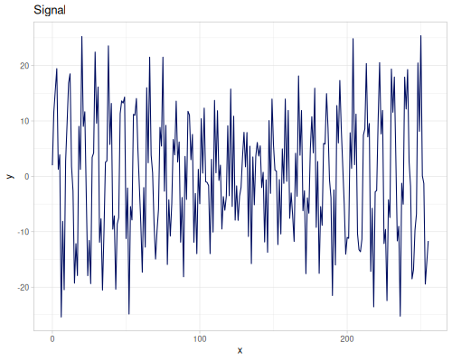</td><td>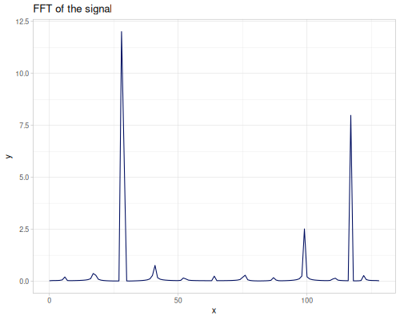</td></tr></tbody></table>
```

:::


### Windows

A collection of window functions used in spectral analysis. A `fastmath.kernel/window` function allows to generate window coefficients for selected window type and optional parameters. Namespace `fastmath.kernel.window` contains implementations of all window functions.

Most of windows are based on continuous functions which are later sampled to get discrete coefficients.

`k/window` common options are:

* `:symmetric?` (default: `true`)
    * `true` (default) - window coefficients are symmetric
    * `false` - periodic window (last coefficient is skipped)
* `:normalize?` (default: `true`), for continuous window functions
    * `true` - maximum value is `1`
    * `false` - intergral of function is `1`


::: {.sourceClojure}
```clojure
(k/window :welch 5) ;; => (0.0 0.75 1.0 0.75 0.0)
(k/window :welch 4 {:symmetric? false}) ;; => (0.0 0.75 1.0 0.75)
(k/window :welch 5 {:normalize? false}) ;; => (0.0 1.125 1.5 1.125 0.0)
```
:::


Each window is illustrated by 4 charts:

* a window function
* FFT of a signal after applying a window
* FFT of a window (padded by zeros for interpolation)
* main- and side-lobes 


#### Rectangular

There are two rectangular windows: `:rectangular` and `:rectangular05`. The latter has values `0.5` at both ends.


::: {.sourceClojure}
```clojure
(k/window :rectangular 8)
```
:::


::: {.printedClojure}
```clojure
(1.0 1.0 1.0 1.0 1.0 1.0 1.0 1.0)

```
:::


::: {.clay-table}

```{=html}
<table class="table table-hover table-responsive clay-table"><tbody><tr><td>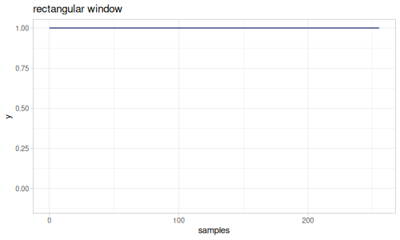</td><td></td></tr><tr><td></td><td></td></tr></tbody></table>
```

:::


::: {.sourceClojure}
```clojure
(k/window :rectangular05 8)
```
:::


::: {.printedClojure}
```clojure
(0.5 1.0 1.0 1.0 1.0 1.0 1.0 0.5)

```
:::


::: {.clay-table}

```{=html}
<table class="table table-hover table-responsive clay-table"><tbody><tr><td>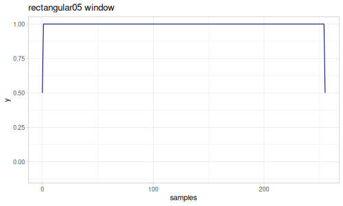</td><td>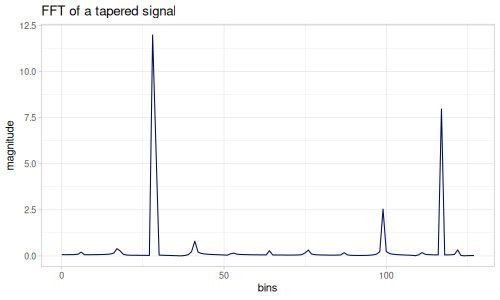</td></tr><tr><td></td><td></td></tr></tbody></table>
```

:::


#### Triangular

Triangular window has a `:shift` parameter, which shifts both ends of the triangle to a non-zero value. By default `:shift` is set to `2` (which results in the same coefficients as in Scipy).

$$w(n) = 1 - \left|\frac{n - \frac{N}{2}}{\frac{N+shift}{2}}\right|,\quad 0\le n \le N$$

:::: {.grid}
::: {.g-col-6}


::: {.sourceClojure}
```clojure
(k/window :triangular 5 {:shift 0})
```
:::


::: {.printedClojure}
```clojure
(0.0 0.5 1.0 0.5 0.0)

```
:::


:::
::: {.g-col-6}


::: {.sourceClojure}
```clojure
(k/window :triangular 8 {:shift 0})
```
:::


::: {.printedClojure}
```clojure
(0.0 0.33333333333333326 0.6666666666666665 0.9999999999999998 1.0 0.6666666666666665 0.3333333333333334 0.0)

```
:::


:::
::::

::: {.clay-table}

```{=html}
<table class="table table-hover table-responsive clay-table"><tbody><tr><td></td><td>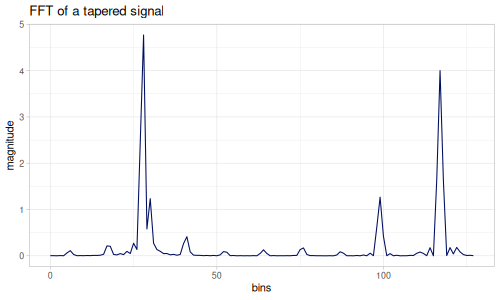</td></tr><tr><td></td><td>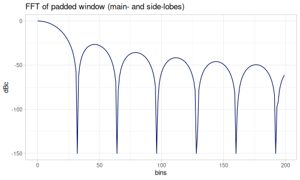</td></tr></tbody></table>
```

:::


:::: {.grid}
::: {.g-col-6}


::: {.sourceClojure}
```clojure
(k/window :triangular 5)
```
:::


::: {.printedClojure}
```clojure
(0.33333333333333337 0.6666666666666667 1.0 0.6666666666666667 0.33333333333333337)

```
:::


:::
::: {.g-col-6}


::: {.sourceClojure}
```clojure
(k/window :triangular 8)
```
:::


::: {.printedClojure}
```clojure
(0.125 0.375 0.625 0.875 0.875 0.625 0.375 0.125)

```
:::


:::
::::

::: {.clay-table}

```{=html}
<table class="table table-hover table-responsive clay-table"><tbody><tr><td></td><td></td></tr><tr><td></td><td></td></tr></tbody></table>
```

:::


#### Parzen

There are two Parzen window definitions, based on continuous function and discrete formulation ([wikipedia](https://en.wikipedia.org/wiki/Window_function#Parzen_window)) when `:discrete?` option is set to `true` (default).

Again, the difference is in shifted ends of the window. Continuous version has ends set to `0.0`.

:::: {.grid}
::: {.g-col-6}


::: {.sourceClojure}
```clojure
(k/window :parzen 5)
```
:::


::: {.printedClojure}
```clojure
(0.01599999999999999 0.42399999999999993 1.0 0.42399999999999993 0.01599999999999999)

```
:::


:::
::: {.g-col-6}


::: {.sourceClojure}
```clojure
(k/window :parzen 8)
```
:::


::: {.printedClojure}
```clojure
(0.00390625 0.10546875 0.47265625 0.91796875 0.91796875 0.47265625 0.10546875 0.00390625)

```
:::


:::
::::

::: {.clay-table}

```{=html}
<table class="table table-hover table-responsive clay-table"><tbody><tr><td>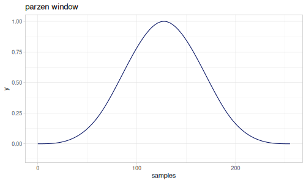</td><td></td></tr><tr><td></td><td></td></tr></tbody></table>
```

:::


:::: {.grid}
::: {.g-col-6}


::: {.sourceClojure}
```clojure
(k/window :parzen 5 {:discrete? false})
```
:::


::: {.printedClojure}
```clojure
(0.0 0.24999999999999994 1.0 0.24999999999999994 0.0)

```
:::


:::
::: {.g-col-6}


::: {.sourceClojure}
```clojure
(k/window :parzen 8 {:discrete? false})
```
:::


::: {.printedClojure}
```clojure
(0.0 0.05211726384364774 0.4136807817589575 0.9999999999999999 0.9999999999999999 0.4136807817589575 0.05211726384364848 0.0)

```
:::


:::
::::

::: {.clay-table}

```{=html}
<table class="table table-hover table-responsive clay-table"><tbody><tr><td>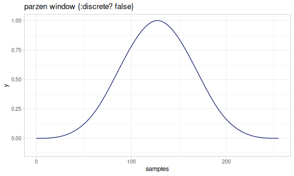</td><td></td></tr><tr><td></td><td></td></tr></tbody></table>
```

:::


#### B-spline

B-spline family is a generalization of above windows. `:order` parameter controls number of convolutions of rectangle window.

Order:

* `1` - rectangular window (with the first coefficient set to `0.0`)
* `2` - triangular window
* `4` - Parzen window

By default, `:order` is set to a value of `3`.

:::: {.grid}
::: {.g-col-6}


::: {.sourceClojure}
```clojure
(k/window :b-spline 5)
```
:::


::: {.printedClojure}
```clojure
(0.0 0.375 1.0 0.37500000000000067 4.996003610813204E-16)

```
:::


:::
::: {.g-col-6}


::: {.sourceClojure}
```clojure
(k/window :b-spline 8)
```
:::


::: {.printedClojure}
```clojure
(0.0 0.13043478260869565 0.5217391304347826 1.0 1.0 0.521739130434783 0.13043478260869673 5.321829933257544E-16)

```
:::


:::
::::

::: {.clay-table}

```{=html}
<table class="table table-hover table-responsive clay-table"><tbody><tr><td>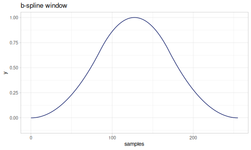</td><td></td></tr><tr><td>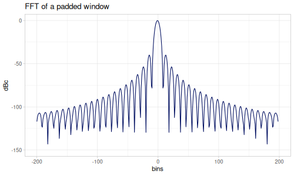</td><td>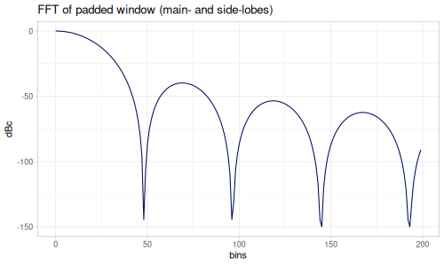</td></tr></tbody></table>
```

:::


:::: {.grid}
::: {.g-col-6}


::: {.sourceClojure}
```clojure
(k/window :b-spline 5 {:order 5})
```
:::


::: {.printedClojure}
```clojure
(0.0 0.1684782608695652 1.0 0.16847826086956086 0.0)

```
:::


:::
::: {.g-col-6}


::: {.sourceClojure}
```clojure
(k/window :b-spline 8 {:order 5})
```
:::


::: {.printedClojure}
```clojure
(0.0 0.020726247720112726 0.31818935499917056 0.999999999999999 1.0 0.31818935499917483 0.020726247720121188 0.0)

```
:::


:::
::::

::: {.clay-table}

```{=html}
<table class="table table-hover table-responsive clay-table"><tbody><tr><td>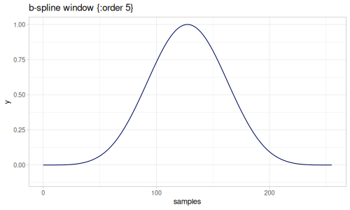</td><td></td></tr><tr><td>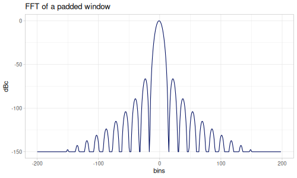</td><td>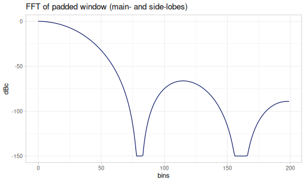</td></tr></tbody></table>
```

:::


#### Welch

Polynomial window, inverted parabola.

:::: {.grid}
::: {.g-col-6}


::: {.sourceClojure}
```clojure
(k/window :welch 5)
```
:::


::: {.printedClojure}
```clojure
(0.0 0.75 1.0 0.75 0.0)

```
:::


:::
::: {.g-col-6}


::: {.sourceClojure}
```clojure
(k/window :welch 8)
```
:::


::: {.printedClojure}
```clojure
(0.0 0.49999999999999994 0.8333333333333334 0.9999999999999999 0.9999999999999999 0.8333333333333334 0.5000000000000001 0.0)

```
:::


:::
::::

::: {.clay-table}

```{=html}
<table class="table table-hover table-responsive clay-table"><tbody><tr><td></td><td></td></tr><tr><td></td><td></td></tr></tbody></table>
```

:::


#### Connes

Polynomial family, square of inverted parabola. 

:::: {.grid}
::: {.g-col-6}


::: {.sourceClojure}
```clojure
(k/window :connes 5)
```
:::


::: {.printedClojure}
```clojure
(0.0 0.5625 1.0 0.5625 0.0)

```
:::


:::
::: {.g-col-6}


::: {.sourceClojure}
```clojure
(k/window :connes 8)
```
:::


::: {.printedClojure}
```clojure
(0.0 0.24999999999999997 0.6944444444444445 0.9999999999999999 0.9999999999999999 0.6944444444444445 0.2500000000000001 0.0)

```
:::


:::
::::

::: {.clay-table}

```{=html}
<table class="table table-hover table-responsive clay-table"><tbody><tr><td>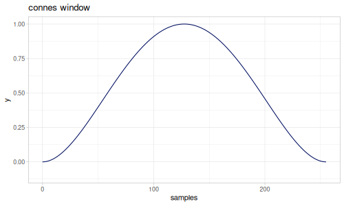</td><td></td></tr><tr><td></td><td>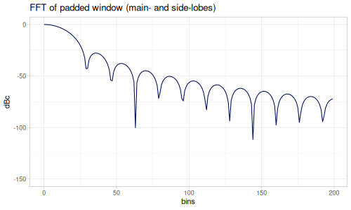</td></tr></tbody></table>
```

:::


:::: {.grid}
::: {.g-col-6}


::: {.sourceClojure}
```clojure
(k/window :connes 5 {:alpha 1.1})
```
:::


::: {.printedClojure}
```clojure
(0.03012089338159966 0.6294652004644492 1.0 0.6294652004644492 0.03012089338159966)

```
:::


:::
::: {.g-col-6}


::: {.sourceClojure}
```clojure
(k/window :connes 8 {:alpha 1.1})
```
:::


::: {.printedClojure}
```clojure
(0.031163242477516093 0.3460563793275623 0.7443465171289216 1.0 1.0 0.7443465171289216 0.34605637932756234 0.031163242477516093)

```
:::


:::
::::

::: {.clay-table}

```{=html}
<table class="table table-hover table-responsive clay-table"><tbody><tr><td></td><td></td></tr><tr><td>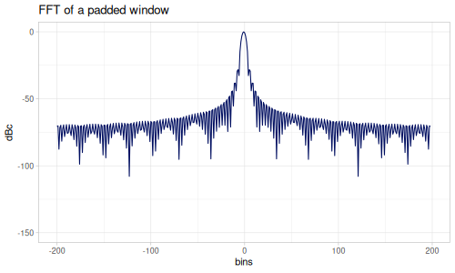</td><td></td></tr></tbody></table>
```

:::


#### Parzen algebraic

Algebraic family

$$w(x)=1-\gamma\left|2x\right|^u$$

Parameters:

* `:gamma` - $0<\gamma\le 1.0$, default: `1.0`
* `:u` - $u>0$, default: `3.0`

:::: {.grid}
::: {.g-col-6}


::: {.sourceClojure}
```clojure
(k/window :parzen-algebraic 5)
```
:::


::: {.printedClojure}
```clojure
(0.0 0.8749999999999999 1.0 0.8749999999999999 0.0)

```
:::


:::
::: {.g-col-6}


::: {.sourceClojure}
```clojure
(k/window :parzen-algebraic 8)
```
:::


::: {.printedClojure}
```clojure
(0.0 0.6374269005847951 0.9239766081871343 1.0 1.0 0.9239766081871343 0.6374269005847955 0.0)

```
:::


:::
::::

::: {.clay-table}

```{=html}
<table class="table table-hover table-responsive clay-table"><tbody><tr><td>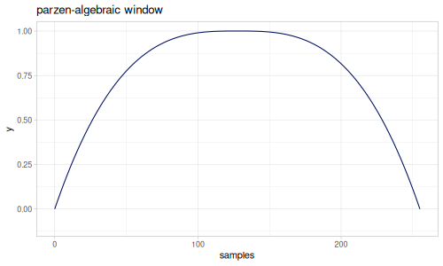</td><td>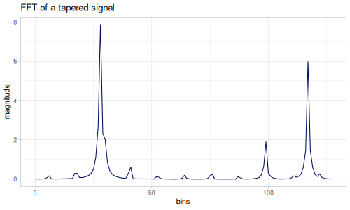</td></tr><tr><td></td><td></td></tr></tbody></table>
```

:::


:::: {.grid}
::: {.g-col-6}


::: {.sourceClojure}
```clojure
(k/window :parzen-algebraic 5 {:gamma 0.9 :u 1.5})
```
:::


::: {.printedClojure}
```clojure
(0.09999999999999998 0.6818019484660536 1.0 0.6818019484660536 0.09999999999999998)

```
:::


:::
::: {.g-col-6}


::: {.sourceClojure}
```clojure
(k/window :parzen-algebraic 8 {:gamma 0.9 :u 1.5})
```
:::


::: {.printedClojure}
```clojure
(0.1051077568776723 0.48001298922585367 0.7856707360315882 1.0 1.0 0.7856707360315882 0.48001298922585384 0.1051077568776723)

```
:::


:::
::::

::: {.clay-table}

```{=html}
<table class="table table-hover table-responsive clay-table"><tbody><tr><td></td><td>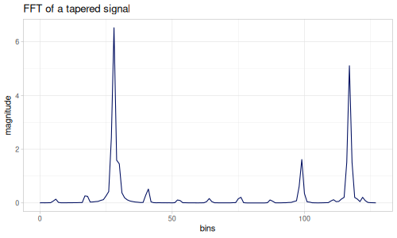</td></tr><tr><td>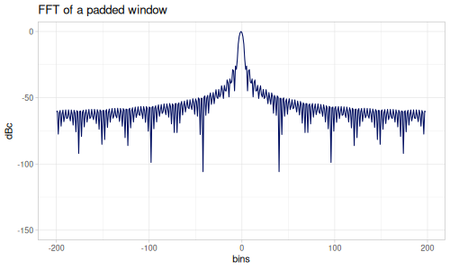</td><td>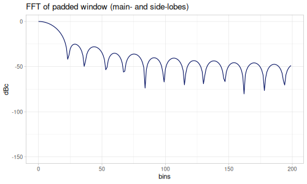</td></tr></tbody></table>
```

:::


#### Singla and Singh

Family of desired order continuous polynomial time window functions, see [paper](https://www.eng.buffalo.edu/Research/code/jrnl/Window.pdf).

Parameter `:order`, default `1`.

:::: {.grid}
::: {.g-col-6}


::: {.sourceClojure}
```clojure
(k/window :singla-singh 5)
```
:::


::: {.printedClojure}
```clojure
(0.0 0.5 1.0 0.5 0.0)

```
:::


:::
::: {.g-col-6}


::: {.sourceClojure}
```clojure
(k/window :singla-singh 8)
```
:::


::: {.printedClojure}
```clojure
(0.0 0.20987654320987648 0.6419753086419753 1.0 1.0 0.6419753086419753 0.20987654320987648 0.0)

```
:::


:::
::::

::: {.clay-table}

```{=html}
<table class="table table-hover table-responsive clay-table"><tbody><tr><td></td><td></td></tr><tr><td></td><td></td></tr></tbody></table>
```

:::


:::: {.grid}
::: {.g-col-6}


::: {.sourceClojure}
```clojure
(k/window :singla-singh 5 {:order 4})
```
:::


::: {.printedClojure}
```clojure
(3.552713678800501E-15 0.49999999999999956 1.0 0.49999999999999956 3.552713678800501E-15)

```
:::


:::
::: {.g-col-6}


::: {.sourceClojure}
```clojure
(k/window :singla-singh 8 {:order 4})
```
:::


::: {.printedClojure}
```clojure
(3.568879745381315E-15 0.08262794562101408 0.6741387578484836 1.0 1.0 0.6741387578484836 0.08262794562101855 3.568879745381315E-15)

```
:::


:::
::::

::: {.clay-table}

```{=html}
<table class="table table-hover table-responsive clay-table"><tbody><tr><td></td><td></td></tr><tr><td>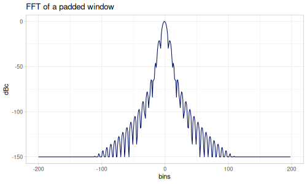</td><td>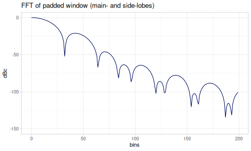</td></tr></tbody></table>
```

:::


#### Sinc Lobe

:::: {.grid}
::: {.g-col-6}


::: {.sourceClojure}
```clojure
(k/window :sinc 5)
```
:::


::: {.printedClojure}
```clojure
(3.898171832295186E-17 0.6366197723675815 1.0 0.6366197723675815 3.898171832295186E-17)

```
:::


:::
::: {.g-col-6}


::: {.sourceClojure}
```clojure
(k/window :sinc 8)
```
:::


::: {.printedClojure}
```clojure
(4.032175602641634E-17 0.36038754716096766 0.7489932012391556 0.9999999999999999 1.0 0.7489932012391556 0.36038754716096777 4.032175602641634E-17)

```
:::


:::
::::

::: {.clay-table}

```{=html}
<table class="table table-hover table-responsive clay-table"><tbody><tr><td>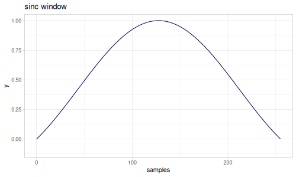</td><td>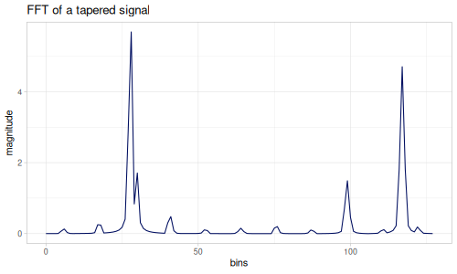</td></tr><tr><td>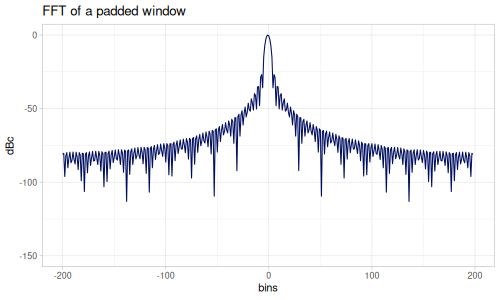</td><td>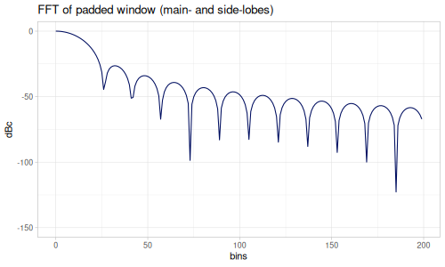</td></tr></tbody></table>
```

:::


#### Fejer

:::: {.grid}
::: {.g-col-6}


::: {.sourceClojure}
```clojure
(k/window :fejer 5)
```
:::


::: {.printedClojure}
```clojure
(1.519574363409961E-33 0.40528473456935116 1.0 0.40528473456935116 1.519574363409961E-33)

```
:::


:::
::: {.g-col-6}


::: {.sourceClojure}
```clojure
(k/window :fejer 8)
```
:::


::: {.printedClojure}
```clojure
(1.6258440090538427E-33 0.1298791841486987 0.5609908155024782 0.9999999999999998 1.0 0.5609908155024782 0.1298791841486988 1.6258440090538427E-33)

```
:::


:::
::::

::: {.clay-table}

```{=html}
<table class="table table-hover table-responsive clay-table"><tbody><tr><td></td><td></td></tr><tr><td></td><td>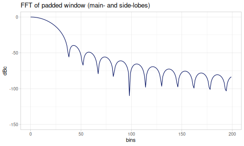</td></tr></tbody></table>
```

:::


#### de la Vallee Poussin

:::: {.grid}
::: {.g-col-6}


::: {.sourceClojure}
```clojure
(k/window :de-la-vallee-poussin 5)
```
:::


::: {.printedClojure}
```clojure
(2.3091062459327878E-66 0.16425571607494943 1.0 0.16425571607494943 2.3091062459327878E-66)

```
:::


:::
::: {.g-col-6}


::: {.sourceClojure}
```clojure
(k/window :de-la-vallee-poussin 8)
```
:::


::: {.printedClojure}
```clojure
(2.6433687417762715E-66 0.016868602475131583 0.3147106950781356 0.9999999999999996 1.0 0.3147106950781356 0.016868602475131615 2.6433687417762715E-66)

```
:::


:::
::::

::: {.clay-table}

```{=html}
<table class="table table-hover table-responsive clay-table"><tbody><tr><td>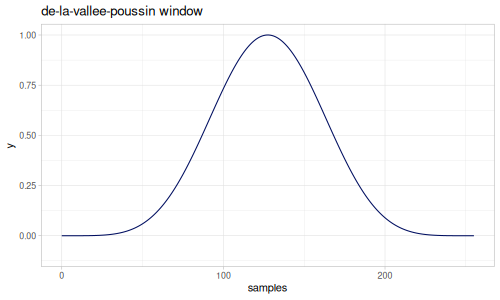</td><td></td></tr><tr><td></td><td>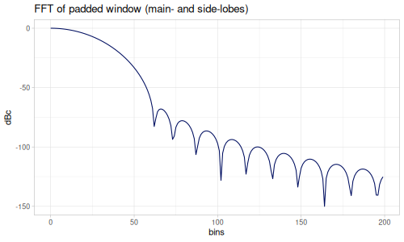</td></tr></tbody></table>
```

:::


#### Lanczos

Lanczos family, power of sinc function with parameter `:L` (power, default: `3.0`).

:::: {.grid}
::: {.g-col-6}


::: {.sourceClojure}
```clojure
(k/window :lanczos 5)
```
:::


::: {.printedClojure}
```clojure
(5.923561980522598E-50 0.25801227546559596 1.0 0.25801227546559596 5.923561980522598E-50)

```
:::


:::
::: {.g-col-6}


::: {.sourceClojure}
```clojure
(k/window :lanczos 8)
```
:::


::: {.printedClojure}
```clojure
(6.555688547007967E-50 0.046806840602617146 0.4201783067689656 0.9999999999999996 1.0 0.4201783067689656 0.046806840602617215 6.555688547007967E-50)

```
:::


:::
::::

::: {.clay-table}

```{=html}
<table class="table table-hover table-responsive clay-table"><tbody><tr><td>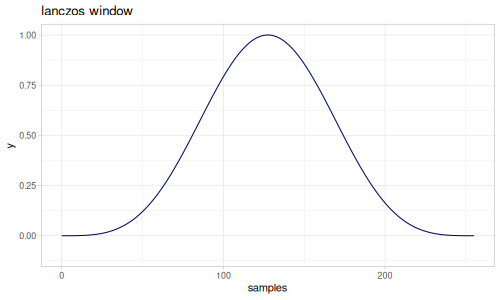</td><td></td></tr><tr><td>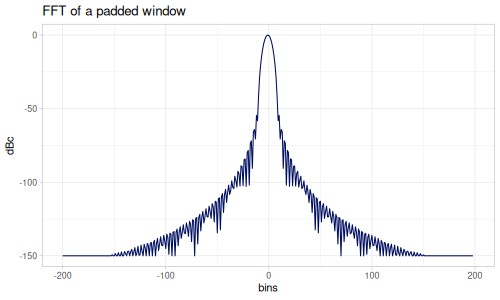</td><td></td></tr></tbody></table>
```

:::


:::: {.grid}
::: {.g-col-6}


::: {.sourceClojure}
```clojure
(k/window :lanczos 5 {:L 5})
```
:::


::: {.printedClojure}
```clojure
(9.001292925672074E-83 0.10456843657770835 1.0 0.10456843657770835 9.001292925672074E-83)

```
:::


:::
::: {.g-col-6}


::: {.sourceClojure}
```clojure
(k/window :lanczos 8 {:L 5})
```
:::


::: {.printedClojure}
```clojure
(1.0658526949375796E-82 0.006079234270046099 0.23571617097077255 0.9999999999999996 1.0 0.23571617097077255 0.006079234270046113 1.0658526949375796E-82)

```
:::


:::
::::

::: {.clay-table}

```{=html}
<table class="table table-hover table-responsive clay-table"><tbody><tr><td>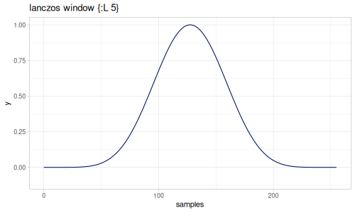</td><td></td></tr><tr><td></td><td></td></tr></tbody></table>
```

:::


#### Hamming

Two Hamming windows:

* `:hamming` - raised cosine window with rounded alpha, $\alpha=0.54$
* `:hamming-exact` - raised cosine window with $\alpha=\frac{25}{46}$

:::: {.grid}
::: {.g-col-6}


::: {.sourceClojure}
```clojure
(k/window :hamming 5)
```
:::


::: {.printedClojure}
```clojure
(0.08000000000000006 0.54 1.0 0.54 0.08000000000000006)

```
:::


:::
::: {.g-col-6}


::: {.sourceClojure}
```clojure
(k/window :hamming 8)
```
:::


::: {.printedClojure}
```clojure
(0.08381828504280263 0.26527930992143145 0.6730185316933782 0.9999999999999999 1.0 0.6730185316933782 0.2652793099214316 0.08381828504280263)

```
:::


:::
::::

::: {.clay-table}

```{=html}
<table class="table table-hover table-responsive clay-table"><tbody><tr><td>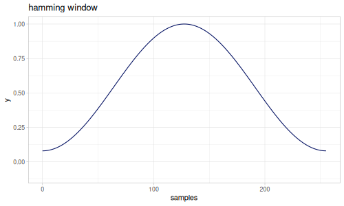</td><td></td></tr><tr><td></td><td>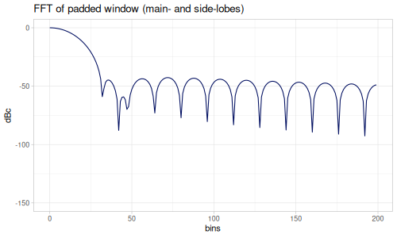</td></tr></tbody></table>
```

:::


:::: {.grid}
::: {.g-col-6}


::: {.sourceClojure}
```clojure
(k/window :hamming-exact 5)
```
:::


::: {.printedClojure}
```clojure
(0.08695652173913046 0.5434782608695653 1.0 0.5434782608695653 0.08695652173913046)

```
:::


:::
::: {.g-col-6}


::: {.sourceClojure}
```clojure
(k/window :hamming-exact 8)
```
:::


::: {.printedClojure}
```clojure
(0.0910739632930434 0.2710979121091579 0.6756080532796445 0.9999999999999999 0.9999999999999999 0.6756080532796445 0.2710979121091581 0.0910739632930434)

```
:::


:::
::::

::: {.clay-table}

```{=html}
<table class="table table-hover table-responsive clay-table"><tbody><tr><td></td><td></td></tr><tr><td>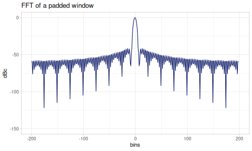</td><td></td></tr></tbody></table>
```

:::


#### Hann

Raised cosine window with $\alpha=0.5$

:::: {.grid}
::: {.g-col-6}


::: {.sourceClojure}
```clojure
(k/window :hann 5)
```
:::


::: {.printedClojure}
```clojure
(0.0 0.5 1.0 0.5 0.0)

```
:::


:::
::: {.g-col-6}


::: {.sourceClojure}
```clojure
(k/window :hann 8)
```
:::


::: {.printedClojure}
```clojure
(0.0 0.19806226419516174 0.6431041321077906 0.9999999999999999 1.0 0.6431041321077906 0.19806226419516199 0.0)

```
:::


:::
::::

::: {.clay-table}

```{=html}
<table class="table table-hover table-responsive clay-table"><tbody><tr><td></td><td></td></tr><tr><td></td><td></td></tr></tbody></table>
```

:::


#### Raised Cosine

Raised Cosine family with parameter `:alpha`, $1/2\leq\alpha\leq 1$

For `:alpha`

* `0.5` - Hann window (default)
* `0.54` - Hamming
* `25/46` - Hammin exact
* `1` - Rectangular

:::: {.grid}
::: {.g-col-6}


::: {.sourceClojure}
```clojure
(k/window :raised-cosine 5 {:alpha 0.75})
```
:::


::: {.printedClojure}
```clojure
(0.5 0.75 1.0 0.75 0.5)

```
:::


:::
::: {.g-col-6}


::: {.sourceClojure}
```clojure
(k/window :raised-cosine 8 {:alpha 0.75})
```
:::


::: {.printedClojure}
```clojure
(0.5126931456583029 0.6092102445870413 0.8260821972898975 0.9999999999999999 1.0 0.8260821972898975 0.6092102445870414 0.5126931456583029)

```
:::


:::
::::

::: {.clay-table}

```{=html}
<table class="table table-hover table-responsive clay-table"><tbody><tr><td></td><td>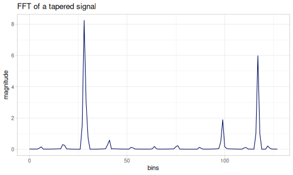</td></tr><tr><td>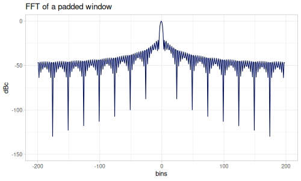</td><td></td></tr></tbody></table>
```

:::


#### Webseter-Hamming

Generalized Hamming window, parameter `:v` (default: `1.0`). $v\geq 0.0$.

:::: {.grid}
::: {.g-col-6}


::: {.sourceClojure}
```clojure
(k/window :webster-hamming 5)
```
:::


::: {.printedClojure}
```clojure
(1.1133152718881109E-17 0.4178358252465963 1.0 0.4178358252465963 1.1133152718881109E-17)

```
:::


:::
::: {.g-col-6}


::: {.sourceClojure}
```clojure
(k/window :webster-hamming 8)
```
:::


::: {.printedClojure}
```clojure
(1.190163008089309E-17 0.155776035585943 0.5699645491830738 0.9999999999999998 1.0 0.5699645491830738 0.15577603558594316 1.190163008089309E-17)

```
:::


:::
::::

::: {.clay-table}

```{=html}
<table class="table table-hover table-responsive clay-table"><tbody><tr><td></td><td></td></tr><tr><td></td><td></td></tr></tbody></table>
```

:::


:::: {.grid}
::: {.g-col-6}


::: {.sourceClojure}
```clojure
(k/window :webster-hamming 5 {:v 0.5})
```
:::


::: {.printedClojure}
```clojure
(1.0574472406686653E-9 0.4772655329818381 1.0 0.4772655329818381 1.0574472406686653E-9)

```
:::


:::
::: {.g-col-6}


::: {.sourceClojure}
```clojure
(k/window :webster-hamming 8 {:v 0.5})
```
:::


::: {.printedClojure}
```clojure
(1.1188729628614304E-9 0.20765991256043373 0.6210280401283461 0.9999999999999998 1.0 0.6210280401283461 0.2076599125604339 1.1188729628614304E-9)

```
:::


:::
::::

::: {.clay-table}

```{=html}
<table class="table table-hover table-responsive clay-table"><tbody><tr><td></td><td>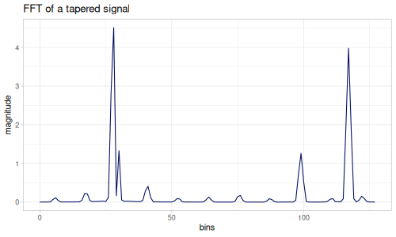</td></tr><tr><td></td><td></td></tr></tbody></table>
```

:::


#### Power of Cosine

Cosine lobe raised to a power of parameter `:m`, default `1.0`.

For `:m`:

* `0.0` - Rectangular window
* `1.0` - Cosine lobe (default)
* `2.0` - Hann window

:::: {.grid}
::: {.g-col-6}


::: {.sourceClojure}
```clojure
(k/window :power-of-cosine 5)
```
:::


::: {.printedClojure}
```clojure
(6.12323399538461E-17 0.7071067811865476 1.0 0.7071067811865476 6.12323399538461E-17)

```
:::


:::
::: {.g-col-6}


::: {.sourceClojure}
```clojure
(k/window :power-of-cosine 8)
```
:::


::: {.printedClojure}
```clojure
(6.28070436682977E-17 0.4450418679126289 0.8019377358048383 1.0 1.0 0.8019377358048383 0.4450418679126291 6.28070436682977E-17)

```
:::


:::
::::

::: {.clay-table}

```{=html}
<table class="table table-hover table-responsive clay-table"><tbody><tr><td></td><td></td></tr><tr><td></td><td></td></tr></tbody></table>
```

:::


:::: {.grid}
::: {.g-col-6}


::: {.sourceClojure}
```clojure
(k/window :power-of-cosine 5 {:m 4.0})
```
:::


::: {.printedClojure}
```clojure
(1.4057996282328156E-65 0.25 1.0 0.25 1.4057996282328156E-65)

```
:::


:::
::: {.g-col-6}


::: {.sourceClojure}
```clojure
(k/window :power-of-cosine 8 {:m 4.0})
```
:::


::: {.printedClojure}
```clojure
(1.556085322980415E-65 0.03922866049811407 0.41358292473411445 0.9999999999999994 1.0 0.41358292473411445 0.039228660498114146 1.556085322980415E-65)

```
:::


:::
::::

::: {.clay-table}

```{=html}
<table class="table table-hover table-responsive clay-table"><tbody><tr><td>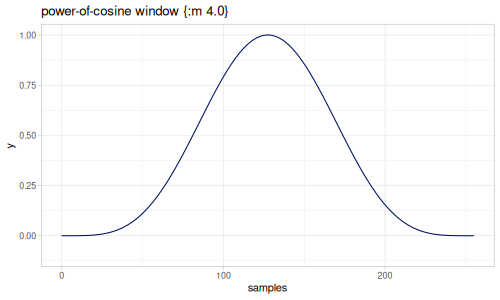</td><td></td></tr><tr><td>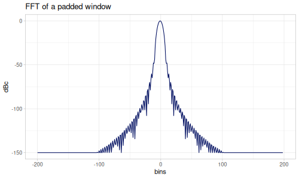</td><td>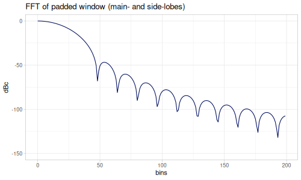</td></tr></tbody></table>
```

:::


#### Raised Power of Cosine

Combinatin of raised cosine and power of cosine windows. Two parameters `:alpha` (default: `0.05`) and `:m` (power, default `1.0`)

:::: {.grid}
::: {.g-col-6}


::: {.sourceClojure}
```clojure
(k/window :raised-power-of-cosine 5)
```
:::


::: {.printedClojure}
```clojure
(0.050000000000000065 0.7217514421272202 1.0 0.7217514421272202 0.050000000000000065)

```
:::


:::
::: {.g-col-6}


::: {.sourceClojure}
```clojure
(k/window :raised-power-of-cosine 8)
```
:::


::: {.printedClojure}
```clojure
(0.05121998229954676 0.47346681361513354 0.8120824814711227 0.9999999999999999 1.0 0.8120824814711227 0.47346681361513376 0.05121998229954676)

```
:::


:::
::::

::: {.clay-table}

```{=html}
<table class="table table-hover table-responsive clay-table"><tbody><tr><td></td><td></td></tr><tr><td>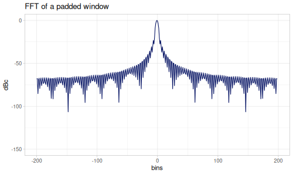</td><td>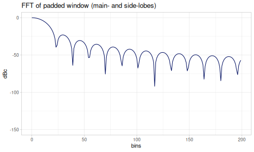</td></tr></tbody></table>
```

:::


:::: {.grid}
::: {.g-col-6}


::: {.sourceClojure}
```clojure
(k/window :raised-power-of-cosine 5 {:m 4.0 :alpha 0.1})
```
:::


::: {.printedClojure}
```clojure
(0.09999999999999999 0.32500000000000007 1.0 0.32500000000000007 0.09999999999999999)

```
:::


:::
::: {.g-col-6}


::: {.sourceClojure}
```clojure
(k/window :raised-power-of-cosine 8 {:m 4.0 :alpha 0.1})
```
:::


::: {.printedClojure}
```clojure
(0.10951959747779984 0.1444519508685672 0.4778070867713429 0.9999999999999996 1.0 0.4778070867713429 0.14445195086856727 0.10951959747779984)

```
:::


:::
::::

::: {.clay-table}

```{=html}
<table class="table table-hover table-responsive clay-table"><tbody><tr><td></td><td></td></tr><tr><td>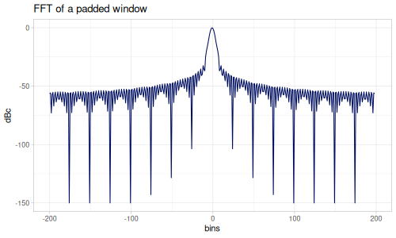</td><td>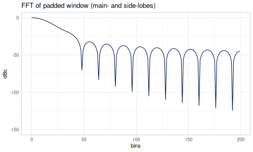</td></tr></tbody></table>
```

:::


#### Parzen Cosine

Parzen Cosine family. Parameters `:gamma` (default: `1.0`) and `:m` (default `2.0`)

$$w(x) = 1+\cos(\pi\gamma\left|2x\right|^m)$$

:::: {.grid}
::: {.g-col-6}


::: {.sourceClojure}
```clojure
(k/window :parzen-cosine 5)
```
:::


::: {.printedClojure}
```clojure
(0.0 0.8535533905932736 1.0 0.8535533905932736 0.0)

```
:::


:::
::: {.g-col-6}


::: {.sourceClojure}
```clojure
(k/window :parzen-cosine 8)
```
:::


::: {.printedClojure}
```clojure
(0.0 0.4844719109644354 0.9199891606454573 1.0 1.0 0.9199891606454573 0.48447191096443565 0.0)

```
:::


:::
::::

::: {.clay-table}

```{=html}
<table class="table table-hover table-responsive clay-table"><tbody><tr><td>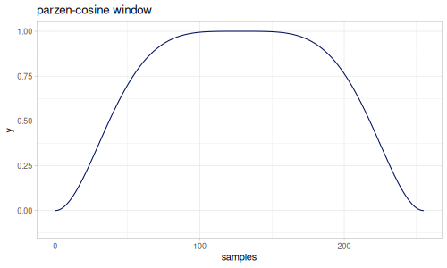</td><td></td></tr><tr><td></td><td></td></tr></tbody></table>
```

:::


:::: {.grid}
::: {.g-col-6}


::: {.sourceClojure}
```clojure
(k/window :parzen-cosine 5 {:m 4.0 :gamma 0.9})
```
:::


::: {.printedClojure}
```clojure
(0.024471741852423238 0.9922132840449459 1.0 0.9922132840449459 0.024471741852423238)

```
:::


:::
::: {.g-col-6}


::: {.sourceClojure}
```clojure
(k/window :parzen-cosine 8 {:m 4.0 :gamma 0.9})
```
:::


::: {.printedClojure}
```clojure
(0.024471750336516537 0.8705788200234958 0.997727441448911 1.0 1.0 0.997727441448911 0.8705788200234958 0.024471750336516537)

```
:::


:::
::::

::: {.clay-table}

```{=html}
<table class="table table-hover table-responsive clay-table"><tbody><tr><td>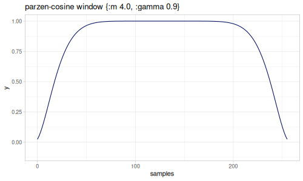</td><td></td></tr><tr><td></td><td></td></tr></tbody></table>
```

:::


#### Bohman

Cosine lobe convolved with itself.

:::: {.grid}
::: {.g-col-6}


::: {.sourceClojure}
```clojure
(k/window :bohman 5)
```
:::


::: {.printedClojure}
```clojure
(3.898171832295186E-17 0.3183098861837907 1.0 0.3183098861837907 3.898171832295186E-17)

```
:::


:::
::: {.g-col-6}


::: {.sourceClojure}
```clojure
(k/window :bohman 8)
```
:::


::: {.printedClojure}
```clojure
(4.2819712847880185E-17 0.07768804147114684 0.48055705552429945 0.9999999999999998 1.0 0.48055705552429945 0.07768804147114697 4.2819712847880185E-17)

```
:::


:::
::::

::: {.clay-table}

```{=html}
<table class="table table-hover table-responsive clay-table"><tbody><tr><td></td><td></td></tr><tr><td></td><td></td></tr></tbody></table>
```

:::


#### Trapezoid

Trapezoid window. Combination of Triangular and Rectangular windows.

Parameter `:alpha` controls flatness of trapezoid (default: `0.25`).

For `:alpha`:

* `0.0` - Triangular window
* `0.5` - Rectangular window

:::: {.grid}
::: {.g-col-6}


::: {.sourceClojure}
```clojure
(k/window :trapezoid 5)
```
:::


::: {.printedClojure}
```clojure
(0.0 1.0 1.0 1.0 0.0)

```
:::


:::
::: {.g-col-6}


::: {.sourceClojure}
```clojure
(k/window :trapezoid 8)
```
:::


::: {.printedClojure}
```clojure
(0.0 0.5714285714285714 1.0 1.0 1.0 1.0 0.5714285714285716 0.0)

```
:::


:::
::::

::: {.clay-table}

```{=html}
<table class="table table-hover table-responsive clay-table"><tbody><tr><td></td><td></td></tr><tr><td></td><td></td></tr></tbody></table>
```

:::


#### Tukey

Tukey window family, combination of Rectangular and Hann windows.

For `:alpha`:

* `0.0` - Rectangular window
* `1.0` - Hann window

:::: {.grid}
::: {.g-col-6}


::: {.sourceClojure}
```clojure
(k/window :tukey 5)
```
:::


::: {.printedClojure}
```clojure
(0.0 1.0 1.0 1.0 0.0)

```
:::


:::
::: {.g-col-6}


::: {.sourceClojure}
```clojure
(k/window :tukey 8)
```
:::


::: {.printedClojure}
```clojure
(0.0 0.6112604669781573 1.0 1.0 1.0 1.0 0.6112604669781576 0.0)

```
:::


:::
::::

::: {.clay-table}

```{=html}
<table class="table table-hover table-responsive clay-table"><tbody><tr><td></td><td></td></tr><tr><td></td><td></td></tr></tbody></table>
```

:::


#### Bartlett-Hann

Combination of Triangular and Hann windows.

:::: {.grid}
::: {.g-col-6}


::: {.sourceClojure}
```clojure
(k/window :bartlett-hann 5)
```
:::


::: {.printedClojure}
```clojure
(0.0 0.5 1.0 0.5 0.0)

```
:::


:::
::: {.g-col-6}


::: {.sourceClojure}
```clojure
(k/window :bartlett-hann 8)
```
:::


::: {.printedClojure}
```clojure
(0.0 0.2280457976626262 0.6483268899970085 0.9999999999999998 1.0 0.6483268899970085 0.22804579766262645 0.0)

```
:::


:::
::::

::: {.clay-table}

```{=html}
<table class="table table-hover table-responsive clay-table"><tbody><tr><td></td><td></td></tr><tr><td></td><td></td></tr></tbody></table>
```

:::


#### Blackman-Harris, Nutall

A collection of Blackman-Harris family, a weighted sum of cosines.

$$w(x)=\sum_{l=0}^{L-1}\alpha_l\cos(2\pi l x)$$

A `:blackman-harris-family` accepts `:coeffs` parameter as a list of coefficients.

:::: {.grid}
::: {.g-col-6}


::: {.sourceClojure}
```clojure
(k/window :blackman-harris-family 5 {:coeffs [0.4 0.5 0.1]})
```
:::


::: {.printedClojure}
```clojure
(2.7755575615628914E-17 0.30000000000000004 1.0 0.30000000000000004 2.7755575615628914E-17)

```
:::


:::
::: {.g-col-6}


::: {.sourceClojure}
```clojure
(k/window :blackman-harris-family 8 {:coeffs [0.4 0.5 0.1]})
```
:::


::: {.printedClojure}
```clojure
(3.040595927556698E-17 0.07230564159112822 0.46138054727767436 0.9999999999999998 0.9999999999999999 0.46138054727767436 0.07230564159112836 3.040595927556698E-17)

```
:::


:::
::::

::: {.clay-table}

```{=html}
<table class="table table-hover table-responsive clay-table"><tbody><tr><td></td><td></td></tr><tr><td></td><td></td></tr></tbody></table>
```

:::


There is a predefined collection of the following windows from the family:

* `:blackman`
* `:blackman-exact`
* `:blackman-harris` - three-term, minimum side-lobe
* `:blackman-harris-61db` - -61dB, three-term
* `:blackman-harris-67db` - -67dB, three-term
* `:blackman-harris-74db` - -74dB, four-term
* `:blackman-harris-92db` - -92dB, four-term
* `:nutall-3-1st` - three-term Nutall, continuous 1st derivative
* `:nutall-3-3rd` - three-term Nutall, continuous 3rd derivative
* `:blackman-nutall` - four-term, minimum side-lobe
* `:nutall-1st` - four-term Nutall, continuous 1st derivative
* `:nutall-3rd` - four-term Nutall, continuous 3rd derivative
* `:nutall-5th` - four-term Nutall, continuous 5th derivative
* `:mottaghi-kashtiban-shayesteh`  - four-term

:::: {.grid}
::: {.g-col-6}


::: {.sourceClojure}
```clojure
(k/window :blackman 5)
```
:::


::: {.printedClojure}
```clojure
(0.0 0.33999999999999997 1.0 0.33999999999999997 0.0)

```
:::


:::
::: {.g-col-6}


::: {.sourceClojure}
```clojure
(k/window :blackman 8)
```
:::


::: {.printedClojure}
```clojure
(0.0 0.09828009557882057 0.4989147207860599 0.9999999999999996 1.0 0.4989147207860599 0.09828009557882073 0.0)

```
:::


:::
::::

::: {.clay-table}

```{=html}
<table class="table table-hover table-responsive clay-table"><tbody><tr><td></td><td></td></tr><tr><td></td><td></td></tr></tbody></table>
```

:::


:::: {.grid}
::: {.g-col-6}


::: {.sourceClojure}
```clojure
(k/window :blackman-exact 5)
```
:::


::: {.printedClojure}
```clojure
(0.006878761822871904 0.3497420464316424 1.0 0.3497420464316424 0.006878761822871904)

```
:::


:::
::: {.g-col-6}


::: {.sourceClojure}
```clojure
(k/window :blackman-exact 8)
```
:::


::: {.printedClojure}
```clojure
(0.007461580400017438 0.10835318211028287 0.507487029671614 0.9999999999999998 1.0 0.507487029671614 0.10835318211028298 0.007461580400017438)

```
:::


:::
::::

::: {.clay-table}

```{=html}
<table class="table table-hover table-responsive clay-table"><tbody><tr><td></td><td></td></tr><tr><td></td><td></td></tr></tbody></table>
```

:::


:::: {.grid}
::: {.g-col-6}


::: {.sourceClojure}
```clojure
(k/window :blackman-harris 5)
```
:::


::: {.printedClojure}
```clojure
(0.005318799999999958 0.34610080000000004 1.0 0.34610080000000004 0.005318799999999958)

```
:::


:::
::: {.g-col-6}


::: {.sourceClojure}
```clojure
(k/window :blackman-harris 8)
```
:::


::: {.printedClojure}
```clojure
(0.005773304288917651 0.10515268671816382 0.5042160721538894 0.9999999999999998 1.0 0.5042160721538894 0.105152686718164 0.005773304288917651)

```
:::


:::
::::

::: {.clay-table}

```{=html}
<table class="table table-hover table-responsive clay-table"><tbody><tr><td></td><td></td></tr><tr><td></td><td></td></tr></tbody></table>
```

:::


:::: {.grid}
::: {.g-col-6}


::: {.sourceClojure}
```clojure
(k/window :blackman-harris-61db 5)
```
:::


::: {.printedClojure}
```clojure
(0.012719999999999967 0.39282000000000006 1.0 0.39282000000000006 0.012719999999999967)

```
:::


:::
::: {.g-col-6}


::: {.sourceClojure}
```clojure
(k/window :blackman-harris-61db 8)
```
:::


::: {.printedClojure}
```clojure
(0.013681247338379686 0.1389399297057468 0.546698374928325 0.9999999999999996 1.0 0.546698374928325 0.138939929705747 0.013681247338379686)

```
:::


:::
::::

::: {.clay-table}

```{=html}
<table class="table table-hover table-responsive clay-table"><tbody><tr><td></td><td></td></tr><tr><td></td><td></td></tr></tbody></table>
```

:::


:::: {.grid}
::: {.g-col-6}


::: {.sourceClojure}
```clojure
(k/window :blackman-harris-67db 5)
```
:::


::: {.printedClojure}
```clojure
(0.0049000000000000024 0.3440100000000001 1.0 0.3440100000000001 0.0049000000000000024)

```
:::


:::
::: {.g-col-6}


::: {.sourceClojure}
```clojure
(k/window :blackman-harris-67db 8)
```
:::


::: {.printedClojure}
```clojure
(0.005320882194899602 0.1035775314824974 0.5023027212395945 0.9999999999999999 1.0 0.5023027212395945 0.10357753148249757 0.005320882194899602)

```
:::


:::
::::

::: {.clay-table}

```{=html}
<table class="table table-hover table-responsive clay-table"><tbody><tr><td></td><td></td></tr><tr><td></td><td></td></tr></tbody></table>
```

:::


:::: {.grid}
::: {.g-col-6}


::: {.sourceClojure}
```clojure
(k/window :blackman-harris-74db 5)
```
:::


::: {.printedClojure}
```clojure
(0.0021799999999999944 0.30325000000000013 1.0 0.30325000000000013 0.0021799999999999944)

```
:::


:::
::: {.g-col-6}


::: {.sourceClojure}
```clojure
(k/window :blackman-harris-74db 8)
```
:::


::: {.printedClojure}
```clojure
(0.0023901608516235075 0.07889604600183199 0.4632017469397877 0.9999999999999996 1.0 0.4632017469397877 0.07889604600183213 0.0023901608516235075)

```
:::


:::
::::

::: {.clay-table}

```{=html}
<table class="table table-hover table-responsive clay-table"><tbody><tr><td></td><td></td></tr><tr><td></td><td></td></tr></tbody></table>
```

:::


:::: {.grid}
::: {.g-col-6}


::: {.sourceClojure}
```clojure
(k/window :blackman-harris-92db 5)
```
:::


::: {.printedClojure}
```clojure
(6.0000000000001025E-5 0.21747000000000005 1.0 0.21747000000000005 6.0000000000001025E-5)

```
:::


:::
::: {.g-col-6}


::: {.sourceClojure}
```clojure
(k/window :blackman-harris-92db 8)
```
:::


::: {.printedClojure}
```clojure
(6.746350266662481E-5 0.03754537709852358 0.3742352334131323 0.9999999999999996 1.0 0.3742352334131323 0.0375453770985237 6.746350266662481E-5)

```
:::


:::
::::

::: {.clay-table}

```{=html}
<table class="table table-hover table-responsive clay-table"><tbody><tr><td></td><td></td></tr><tr><td></td><td></td></tr></tbody></table>
```

:::


:::: {.grid}
::: {.g-col-6}


::: {.sourceClojure}
```clojure
(k/window :nutall-3-1st 5)
```
:::


::: {.printedClojure}
```clojure
(0.0 0.31794000000000006 1.0 0.31794000000000006 0.0)

```
:::


:::
::: {.g-col-6}


::: {.sourceClojure}
```clojure
(k/window :nutall-3-1st 8)
```
:::


::: {.printedClojure}
```clojure
(0.0 0.0840079880762086 0.4782909279014357 1.0 1.0 0.4782909279014357 0.08400798807620874 0.0)

```
:::


:::
::::

::: {.clay-table}

```{=html}
<table class="table table-hover table-responsive clay-table"><tbody><tr><td></td><td></td></tr><tr><td></td><td></td></tr></tbody></table>
```

:::


:::: {.grid}
::: {.g-col-6}


::: {.sourceClojure}
```clojure
(k/window :nutall-3-3rd 5)
```
:::


::: {.printedClojure}
```clojure
(0.0 0.25 1.0 0.25 0.0)

```
:::


:::
::: {.g-col-6}


::: {.sourceClojure}
```clojure
(k/window :nutall-3-3rd 8)
```
:::


::: {.printedClojure}
```clojure
(0.0 0.03922866049811408 0.4135829247341146 0.9999999999999998 1.0 0.4135829247341146 0.0392286604981142 0.0)

```
:::


:::
::::

::: {.clay-table}

```{=html}
<table class="table table-hover table-responsive clay-table"><tbody><tr><td></td><td></td></tr><tr><td></td><td></td></tr></tbody></table>
```

:::


:::: {.grid}
::: {.g-col-6}


::: {.sourceClojure}
```clojure
(k/window :blackman-nutall 5)
```
:::


::: {.printedClojure}
```clojure
(3.628000000000381E-4 0.22698240000000008 1.0 0.22698240000000008 3.628000000000381E-4)

```
:::


:::
::: {.g-col-6}


::: {.sourceClojure}
```clojure
(k/window :blackman-nutall 8)
```
:::


::: {.printedClojure}
```clojure
(4.067940157254954E-4 0.04235655112932582 0.38428760977713056 1.0 1.0 0.38428760977713056 0.042356551129325945 4.067940157254954E-4)

```
:::


:::
::::

::: {.clay-table}

```{=html}
<table class="table table-hover table-responsive clay-table"><tbody><tr><td></td><td></td></tr><tr><td></td><td></td></tr></tbody></table>
```

:::


:::: {.grid}
::: {.g-col-6}


::: {.sourceClojure}
```clojure
(k/window :nutall-1st 5)
```
:::


::: {.printedClojure}
```clojure
(0.0 0.211536 1.0 0.211536 0.0)

```
:::


:::
::: {.g-col-6}


::: {.sourceClojure}
```clojure
(k/window :nutall-1st 8)
```
:::


::: {.printedClojure}
```clojure
(0.0 0.03508532938756397 0.3677403571579412 0.9999999999999998 1.0 0.3677403571579412 0.0350853293875641 0.0)

```
:::


:::
::::

::: {.clay-table}

```{=html}
<table class="table table-hover table-responsive clay-table"><tbody><tr><td></td><td></td></tr><tr><td></td><td></td></tr></tbody></table>
```

:::


:::: {.grid}
::: {.g-col-6}


::: {.sourceClojure}
```clojure
(k/window :nutall-3rd 5)
```
:::


::: {.printedClojure}
```clojure
(4.163336342344337E-17 0.17789200000000008 1.0 0.17789200000000008 4.163336342344337E-17)

```
:::


:::
::: {.g-col-6}


::: {.sourceClojure}
```clojure
(k/window :nutall-3rd 8)
```
:::


::: {.printedClojure}
```clojure
(4.74391799683855E-17 0.021472532451764382 0.3302707906876282 0.9999999999999997 1.0 0.3302707906876282 0.021472532451764493 4.74391799683855E-17)

```
:::


:::
::::

::: {.clay-table}

```{=html}
<table class="table table-hover table-responsive clay-table"><tbody><tr><td></td><td></td></tr><tr><td></td><td></td></tr></tbody></table>
```

:::


:::: {.grid}
::: {.g-col-6}


::: {.sourceClojure}
```clojure
(k/window :nutall-5th 5)
```
:::


::: {.printedClojure}
```clojure
(0.0 0.12500000000000006 1.0 0.12500000000000006 0.0)

```
:::


:::
::: {.g-col-6}


::: {.sourceClojure}
```clojure
(k/window :nutall-5th 8)
```
:::


::: {.printedClojure}
```clojure
(0.0 0.00776971731959981 0.2659768878657344 0.9999999999999996 1.0 0.2659768878657344 0.007769717319599911 0.0)

```
:::


:::
::::

::: {.clay-table}

```{=html}
<table class="table table-hover table-responsive clay-table"><tbody><tr><td></td><td></td></tr><tr><td></td><td></td></tr></tbody></table>
```

:::


:::: {.grid}
::: {.g-col-6}


::: {.sourceClojure}
```clojure
(k/window :mottaghi-kashtiban-shayesteh 5)
```
:::


::: {.printedClojure}
```clojure
(0.002599999999999939 0.5013 1.0 0.5013 0.002599999999999939)

```
:::


:::
::: {.g-col-6}


::: {.sourceClojure}
```clojure
(k/window :mottaghi-kashtiban-shayesteh 8)
```
:::


::: {.printedClojure}
```clojure
(0.03433802426000272 0.23258830978506906 0.653633068852966 1.0 1.0 0.653633068852966 0.23258830978506925 0.03433802426000272)

```
:::


:::
::::

::: {.clay-table}

```{=html}
<table class="table table-hover table-responsive clay-table"><tbody><tr><td></td><td></td></tr><tr><td></td><td></td></tr></tbody></table>
```

:::


## Sine / Cosine


## Hadamard


## Wavelets

::: {.callout-tip title="Defined functions"}
* `wavelet`
* `wavelet-name`
* `coeff-size`
* `phi`, `psi`
* `scaling-function`, `wavelet-function`
:::


### DWT

The Discrete Wavelet Transform (DWT) provides a time–frequency (or time–scale) representation of a signal, analogous to the Short-Time Fourier Transform (STFT). Unlike the STFT, however, the DWT offers multi-resolution analysis, meaning that time and frequency resolutions vary across the spectrum:

* At low frequencies, the DWT provides higher frequency resolution and lower time resolution.
* At high frequencies, it provides higher time resolution and lower frequency resolution.

In the DWT, the signal is successively passed through a pair of filters: a low-pass filter, producing the approximation coefficients, and a high-pass filter, producing the detail coefficients. After filtering, each output is downsampled by a factor of two. The approximation coefficients are then recursively decomposed in the same manner, yielding multiple levels of detail.

The resulting representation consists of detail coefficients at different decomposition levels, each corresponding to a progressively narrower frequency band. At each level, the number of coefficients is halved, while the associated frequency range becomes smaller, collectively capturing both coarse and fine signal structures across scales.

DWT works only on a singal which length is the power of 2.

DWT can be applied to desired level with a `{:level n}` option. Maximum number of levels can be calculated by applying $log_2()$ to the length of the signal. For example signal of the length of 8192 will contain 13 levels. 


::: {.sourceClojure}
```clojure
(m/round (m/log2 8192))
```
:::


::: {.printedClojure}
```clojure
13

```
:::


Layout of the coefficients after full DWT goes as follows:

* Id 0 - zero frequency term (approximation)
* Id 1 - last level N (detail), lowest time resolution, lowest frequencies, narrowest band
* Ids 2 and 3 - level N-1 (detail)
* ids from 4 to 7 - level N-2 (detail)
* ...
* ids from $2^{N-1}$ to $2^N-1$ - Level 1 (detail), highest time resolution, highest frequencies, widest band (half of the spectrum)

Let's see how signal is decomposed into lower and higher frequencies using different wavelets. First define three wavelet transforms:


::: {.sourceClojure}
```clojure
(def haar (t/transformer :dwt "haar"))
```
:::


::: {.sourceClojure}
```clojure
(def daubechies-2 (t/transformer :dwt "db2"))
```
:::


::: {.sourceClojure}
```clojure
(def coiflet-1 (t/transformer :dwt :coiflet-1))
```
:::


::: {.sourceClojure}
```clojure
(def biorthogonal-39 (t/transformer :dwt "bior3.9"))
```
:::


::: {.callout-note title="Examples"}


::: {.sourceClojure}
```clojure
(seq (t/forward-1d haar (range 8))) ;; => (9.899494936611685 5.656854249492391 2.0000000000000027 2.0000000000000027 0.707106781186548 0.7071067811865481 0.7071067811865479 0.7071067811865479)
(seq (t/forward-1d daubechies-2 (range 8))) ;; => (9.899494936611667 -2.9671278329846853 1.3660254037834763 -4.830127018920185 9.919842725025774E-13 9.940936962493652E-13 9.95759030786303E-13 2.8284271247432224)
(seq (t/forward-1d coiflet-1 (range 8))) ;; => (9.899494936611667 -0.9932994188645519 -3.7797375096555634 2.7797375096555643 8.326672684688674E-17 2.220446049250313E-16 1.3243992251527368 -4.152826349898926)
(seq (t/forward-1d biorthogonal-39 (range 8))) ;; => (9.89949493661166 -9.222771649929241 -1.6303710937500027 1.6303710937500018 0.0 1.1102230246251565E-16 -2.220446049250313E-16 2.828427124746192)
```
:::


:::

First we construct a linear chrip signal with added low frequency square wave to the second half of a chirp.


::: {.sourceClojure}
```clojure
(defn chirp+sin
  [^long levels]
  (let [size (m/exp2 levels)
        s4 (m// size 4.0)
        s2 (m// size 2.0)
        square (m/- levels 4)]
    (map (fn [^long x] (m/+ (m/sin (m/* m/TWO_PI (m/cb (m// x s4))))
                           (if (m/> x s2)
                             (if (m/even? (m/>> x square)) -0.75 0.75)
                             0.0))) (range size))))
```
:::


::: {.sourceClojure}
```clojure
(def chirp+sin11 (chirp+sin 11))
```
:::


Length of the signal


::: {.sourceClojure}
```clojure
(count chirp+sin11)
```
:::


::: {.printedClojure}
```clojure
2048

```
:::


::: {.clay-image}

```{=html}

```

:::


Scaleogram shows time-frequency coefficients (L1, normalized to be comparable) for each level. You can see that first level is most detailed but covers half of the band, while last level contains only one coefficient and represents the lowest frequency. Level 0 (DC) is not shown.

You can see the pattern of orange stripes representing raising frequencies over the time. Also, low frequency is recognized at level 8 (especially when HAAR and BiOrthogonal 3.9 wavelets are used). Dark region at top-left means thare are no higher frequencies at the beginning of the signal.

::: {.clay-table}

```{=html}
<table class="table table-hover table-responsive clay-table"><tbody><tr><td></td><td></td></tr><tr><td></td><td></td></tr></tbody></table>
```

:::


Each level (band) can be reconstructed and analyzed separately. To do this it's enough to set all other bands to zero value and reverse DWT. Lowest frequencies reveal the shape of the wavelet.


::: {.sourceClojure}
```clojure
(defn dwt-band
  "Return detail band at given level"
  [coeffs level]
  (let [N (count coeffs)
        target (double-array N)
        rlevel (int (m/exp2 (m/- (m/round (m/log2 N)) level)))]
    (System/arraycopy coeffs rlevel target rlevel rlevel) ;; copy given level
    target))
```
:::


Daubechies 2

::: {.clay-table}

```{=html}
<table class="table table-hover table-responsive clay-table"><tbody><tr><td></td><td></td><td></td></tr><tr><td></td><td></td><td></td></tr><tr><td></td><td></td><td></td></tr></tbody></table>
```

:::


HAAR

::: {.clay-table}

```{=html}
<table class="table table-hover table-responsive clay-table"><tbody><tr><td></td><td></td><td></td></tr><tr><td></td><td></td><td></td></tr><tr><td></td><td></td><td></td></tr></tbody></table>
```

:::


### WPT

Wavelet Packet Transform (or Decomposition) applies filters also on high frequencies (on details). This way the whole band is splitted evenly into 2^N bands at level N. There is no reason to perform full transform. For the best result it's better to stop early. Let's see how it works.


::: {.sourceClojure}
```clojure
(def haar-wpt (t/transformer :wpt :haar))
```
:::


::: {.sourceClojure}
```clojure
(def coiflet-1-wpt (t/transformer :wpt :coiflet-1))
```
:::


::: {.sourceClojure}
```clojure
(defn wpt-bands
  "Return all bands at given level"
  [coeffs level]
  (let [N (count coeffs)
        cnt (m/round (m/exp2 level))
        len (m// N cnt)]
    (map (fn [band]
           (let [target (double-array N)
                 pos (m/* band len)]
             (System/arraycopy coeffs pos target pos len)
             target)) (range cnt))))
```
:::


HAAR WPT at level 2 (4 bands)

::: {.clay-table}

```{=html}
<table class="table table-hover table-responsive clay-table"><tbody><tr><td></td><td></td><td></td><td></td></tr></tbody></table>
```

:::


Coiflet-1 WPT at level 4 (16 bands)

::: {.clay-table}

```{=html}
<table class="table table-hover table-responsive clay-table"><tbody><tr><td></td><td></td><td></td><td></td></tr><tr><td></td><td></td><td></td><td></td></tr><tr><td></td><td></td><td></td><td></td></tr><tr><td></td><td></td><td></td><td></td></tr></tbody></table>
```

:::


### Decomposed


### List of wavelets

There are two sources of wavelets, one based on [JWave](https://github.com/graetz23/JWave) and second based on Matlab.

::: {.callout-caution}
JWave wavelets have some issues with coefficients: some of them are not reversible or have reversed coefficients.
:::

`keyword` based names are for `JWave` wavelets, `string` based are for Matlab (built-in).


#### Haar

Haar (step, or Daubechies 1, db1) wavelet. `:haar-orthogonal` is not normalized version of a wavelet.

::: {.clay-table}

```{=html}
<table class="table table-hover table-responsive clay-table"><thead><tr><th>Built-in</th><th>JWave</th></tr></thead><tbody><tr><td><div><pre><code class="sourceCode language-clojure printed-clojure">[&quot;haar&quot; &quot;db1&quot;]
</code></pre></div></td><td><div><pre><code class="sourceCode language-clojure printed-clojure">[:haar :haar-orthogonal]
</code></pre></div></td></tr></tbody></table>
```

:::


::: {.clay-table}

```{=html}
<table class="table table-hover table-responsive clay-table"><tbody><tr><td></td><td></td></tr><tr><td></td><td></td></tr></tbody></table>
```

:::


#### Daubechies

Daubechies, extremal phase,  wavelets.

::: {.clay-table}

```{=html}
<table class="table table-hover table-responsive clay-table"><thead><tr><th>Built-in</th><th>JWave</th></tr></thead><tbody><tr><td><div><pre><code class="sourceCode language-clojure printed-clojure">[&quot;db2&quot; &quot;db3&quot; &quot;db4&quot; &quot;db5&quot; &quot;db6&quot; &quot;db7&quot; &quot;db8&quot; &quot;db9&quot; &quot;db10&quot; &quot;db11&quot; &quot;db12&quot; &quot;db13&quot; &quot;db14&quot; &quot;db15&quot; &quot;db16&quot; &quot;db17&quot; &quot;db18&quot; &quot;db19&quot; &quot;db20&quot; &quot;db21&quot; &quot;db22&quot; &quot;db23&quot; &quot;db24&quot; &quot;db25&quot; &quot;db26&quot; &quot;db27&quot; &quot;db28&quot; &quot;db29&quot; &quot;db30&quot; &quot;db31&quot; &quot;db32&quot; &quot;db33&quot; &quot;db34&quot; &quot;db35&quot; &quot;db36&quot; &quot;db37&quot; &quot;db38&quot; &quot;db39&quot; &quot;db40&quot; &quot;db41&quot; &quot;db42&quot; &quot;db43&quot; &quot;db44&quot; &quot;db45&quot;]
</code></pre></div></td><td><div><pre><code class="sourceCode language-clojure printed-clojure">[:daubechies-2 :daubechies-3 :daubechies-4 :daubechies-5 :daubechies-6 :daubechies-7 :daubechies-8 :daubechies-9 :daubechies-10 :daubechies-11 :daubechies-12 :daubechies-13 :daubechies-14 :daubechies-15 :daubechies-16 :daubechies-17 :daubechies-18 :daubechies-19 :daubechies-20]
</code></pre></div></td></tr></tbody></table>
```

:::


::: {.clay-table}

```{=html}
<table class="table table-hover table-responsive clay-table"><tbody><tr><td></td><td></td></tr><tr><td></td><td></td></tr><tr><td></td><td></td></tr></tbody></table>
```

:::


#### Symlet

Symlet, least asymmetric, wavelets.

Symlet 2 and 3 are the same as Daubechies. Wavelets starting with `la` are defined in `wavelets` R package and are the same as symlets ("sym4"="la8", "sym5"="la10", etc.).

::: {.clay-table}

```{=html}
<table class="table table-hover table-responsive clay-table"><thead><tr><th>Built-in</th><th>JWave</th></tr></thead><tbody><tr><td><div><pre><code class="sourceCode language-clojure printed-clojure">[&quot;sym2&quot; &quot;sym3&quot; &quot;sym4&quot; &quot;sym5&quot; &quot;sym6&quot; &quot;sym7&quot; &quot;sym8&quot; &quot;sym9&quot; &quot;sym10&quot; &quot;sym11&quot; &quot;sym12&quot; &quot;sym13&quot; &quot;sym14&quot; &quot;sym15&quot; &quot;sym16&quot; &quot;sym17&quot; &quot;sym18&quot; &quot;sym19&quot; &quot;sym20&quot; &quot;sym21&quot; &quot;sym22&quot; &quot;sym23&quot; &quot;sym24&quot; &quot;sym25&quot; &quot;sym26&quot; &quot;sym27&quot; &quot;sym28&quot; &quot;sym29&quot; &quot;sym30&quot; &quot;sym31&quot; &quot;sym32&quot; &quot;sym33&quot; &quot;sym34&quot; &quot;sym35&quot; &quot;sym36&quot; &quot;sym37&quot; &quot;sym38&quot; &quot;sym39&quot; &quot;sym40&quot; &quot;sym41&quot; &quot;sym42&quot; &quot;sym43&quot; &quot;sym44&quot; &quot;sym45&quot; &quot;la8&quot; &quot;la10&quot; &quot;la12&quot; &quot;la14&quot; &quot;la16&quot; &quot;la18&quot; &quot;la20&quot;]
</code></pre></div></td><td><div><pre><code class="sourceCode language-clojure printed-clojure">[:symlet-2 :symlet-3 :symlet-4 :symlet-5 :symlet-6 :symlet-7 :symlet-8 :symlet-9 :symlet-10 :symlet-11 :symlet-12 :symlet-13 :symlet-14 :symlet-15 :symlet-16 :symlet-17 :symlet-18 :symlet-19 :symlet-20]
</code></pre></div></td></tr></tbody></table>
```

:::


::: {.clay-table}

```{=html}
<table class="table table-hover table-responsive clay-table"><tbody><tr><td></td><td></td></tr><tr><td></td><td></td></tr><tr><td></td><td></td></tr></tbody></table>
```

:::


#### Coiflet

Coiflet wavelets.

::: {.clay-table}

```{=html}
<table class="table table-hover table-responsive clay-table"><thead><tr><th>Built-in</th><th>JWave</th></tr></thead><tbody><tr><td><div><pre><code class="sourceCode language-clojure printed-clojure">[&quot;coif1&quot; &quot;coif2&quot; &quot;coif3&quot; &quot;coif4&quot; &quot;coif5&quot;]
</code></pre></div></td><td><div><pre><code class="sourceCode language-clojure printed-clojure">[:coiflet-1 :coiflet-2 :coiflet-3 :coiflet-4 :coiflet-5]
</code></pre></div></td></tr></tbody></table>
```

:::


::: {.clay-table}

```{=html}
<table class="table table-hover table-responsive clay-table"><tbody><tr><td></td><td></td></tr><tr><td></td><td></td></tr><tr><td></td><td></td></tr></tbody></table>
```

:::


#### Best-localized Daubechies

::: {.clay-table}

```{=html}
<table class="table table-hover table-responsive clay-table"><thead><tr><th>Built-in</th><th>JWave</th></tr></thead><tbody><tr><td><div><pre><code class="sourceCode language-clojure printed-clojure">[&quot;bl7&quot; &quot;bl9&quot; &quot;bl10&quot;]
</code></pre></div></td><td>-</td></tr></tbody></table>
```

:::


::: {.clay-table}

```{=html}
<table class="table table-hover table-responsive clay-table"><tbody><tr><td></td><td></td></tr><tr><td></td><td></td></tr><tr><td></td><td></td></tr></tbody></table>
```

:::


#### Fejér-Korovkin

::: {.clay-table}

```{=html}
<table class="table table-hover table-responsive clay-table"><thead><tr><th>Built-in</th><th>JWave</th></tr></thead><tbody><tr><td><div><pre><code class="sourceCode language-clojure printed-clojure">[&quot;fk4&quot; &quot;fk6&quot; &quot;fk8&quot; &quot;fk14&quot; &quot;fk18&quot; &quot;fk22&quot;]
</code></pre></div></td><td>-</td></tr></tbody></table>
```

:::


::: {.clay-table}

```{=html}
<table class="table table-hover table-responsive clay-table"><tbody><tr><td></td><td></td></tr><tr><td></td><td></td></tr><tr><td></td><td></td></tr></tbody></table>
```

:::


#### Morris minimum-bandwidth

::: {.clay-table}

```{=html}
<table class="table table-hover table-responsive clay-table"><thead><tr><th>Built-in</th><th>JWave</th></tr></thead><tbody><tr><td><div><pre><code class="sourceCode language-clojure printed-clojure">[&quot;mb4.2&quot; &quot;mb8.2&quot; &quot;mb8.3&quot; &quot;mb8.4&quot; &quot;mb10.3&quot; &quot;mb12.3&quot; &quot;mb14.3&quot; &quot;mb16.3&quot; &quot;mb18.3&quot; &quot;mb24.3&quot; &quot;mb32.3&quot;]
</code></pre></div></td><td>-</td></tr></tbody></table>
```

:::


::: {.clay-table}

```{=html}
<table class="table table-hover table-responsive clay-table"><tbody><tr><td></td><td></td></tr><tr><td></td><td></td></tr><tr><td></td><td></td></tr></tbody></table>
```

:::


#### Han linear-phase moments

::: {.clay-table}

```{=html}
<table class="table table-hover table-responsive clay-table"><thead><tr><th>Built-in</th><th>JWave</th></tr></thead><tbody><tr><td><div><pre><code class="sourceCode language-clojure printed-clojure">[&quot;han2.3&quot; &quot;han3.3&quot; &quot;han4.5&quot; &quot;han5.5&quot;]
</code></pre></div></td><td>-</td></tr></tbody></table>
```

:::


::: {.clay-table}

```{=html}
<table class="table table-hover table-responsive clay-table"><tbody><tr><td></td><td></td></tr><tr><td></td><td></td></tr><tr><td></td><td></td></tr></tbody></table>
```

:::


#### Beylkin

::: {.clay-table}

```{=html}
<table class="table table-hover table-responsive clay-table"><thead><tr><th>Built-in</th><th>JWave</th></tr></thead><tbody><tr><td><div><pre><code class="sourceCode language-clojure printed-clojure">[&quot;beyl&quot;]
</code></pre></div></td><td>-</td></tr></tbody></table>
```

:::


::: {.clay-table}

```{=html}
<table class="table table-hover table-responsive clay-table"><tbody><tr><td></td><td></td></tr></tbody></table>
```

:::


#### Discrete Meyer

There is a difference in number of coefficients.

::: {.clay-table}

```{=html}
<table class="table table-hover table-responsive clay-table"><thead><tr><th>Built-in</th><th>JWave</th></tr></thead><tbody><tr><td><div><pre><code class="sourceCode language-clojure printed-clojure">[&quot;dmey&quot;]
</code></pre></div></td><td><div><pre><code class="sourceCode language-clojure printed-clojure">[:discrete-mayer]
</code></pre></div></td></tr></tbody></table>
```

:::


::: {.clay-table}

```{=html}
<table class="table table-hover table-responsive clay-table"><tbody><tr><td></td><td></td></tr><tr><td></td><td></td></tr></tbody></table>
```

:::


#### Vaidyanathan

::: {.clay-table}

```{=html}
<table class="table table-hover table-responsive clay-table"><thead><tr><th>Built-in</th><th>JWave</th></tr></thead><tbody><tr><td><div><pre><code class="sourceCode language-clojure printed-clojure">[&quot;vaid&quot;]
</code></pre></div></td><td>-</td></tr></tbody></table>
```

:::


::: {.clay-table}

```{=html}
<table class="table table-hover table-responsive clay-table"><tbody><tr><td></td><td></td></tr></tbody></table>
```

:::


#### Bi-orthogonal

::: {.clay-table}

```{=html}
<table class="table table-hover table-responsive clay-table"><thead><tr><th>Built-in</th><th>JWave</th></tr></thead><tbody><tr><td><div><pre><code class="sourceCode language-clojure printed-clojure">[&quot;bior1.1&quot; &quot;bior1.3&quot; &quot;bior1.5&quot; &quot;bior2.2&quot; &quot;bior2.4&quot; &quot;bior2.6&quot; &quot;bior2.8&quot; &quot;bior3.1&quot; &quot;bior3.3&quot; &quot;bior3.5&quot; &quot;bior3.7&quot; &quot;bior3.9&quot; &quot;bior4.4&quot; &quot;bior5.5&quot; &quot;bior6.8&quot; &quot;rbio1.1&quot; &quot;rbio1.3&quot; &quot;rbio1.5&quot; &quot;rbio2.2&quot; &quot;rbio2.4&quot; &quot;rbio2.6&quot; &quot;rbio2.8&quot; &quot;rbio3.1&quot; &quot;rbio3.3&quot; &quot;rbio3.5&quot; &quot;rbio3.7&quot; &quot;rbio3.9&quot; &quot;rbio4.4&quot; &quot;rbio5.5&quot; &quot;rbio6.8&quot;]
</code></pre></div></td><td><div><pre><code class="sourceCode language-clojure printed-clojure">[:biorthogonal-11 :biorthogonal-13 :biorthogonal-15 :biorthogonal-22 :biorthogonal-24 :biorthogonal-26 :biorthogonal-28 :biorthogonal-31 :biorthogonal-33 :biorthogonal-35 :biorthogonal-37 :biorthogonal-39 :biorthogonal-44 :biorthogonal-55 :biorthogonal-68]
</code></pre></div></td></tr></tbody></table>
```

:::


::: {.clay-table}

```{=html}
<table class="table table-hover table-responsive clay-table"><tbody><tr><td></td><td></td></tr><tr><td></td><td></td></tr><tr><td></td><td></td></tr><tr><td></td><td></td></tr></tbody></table>
```

:::


#### Other

All below (but `:legendre-1`) are not orthogonal (nor bi-orthogonal) and probably are defined with wrong coefficients. Listing them for the reference only.

::: {.clay-table}

```{=html}
<table class="table table-hover table-responsive clay-table"><thead><tr><th>Built-in</th><th>JWave</th></tr></thead><tbody><tr><td>-</td><td><div><pre><code class="sourceCode language-clojure printed-clojure">[:legendre-1 :legendre-2 :legendre-3 :cdf-53 :cdf-97 :battle-23]
</code></pre></div></td></tr></tbody></table>
```

:::


::: {.clay-table}

```{=html}
<table class="table table-hover table-responsive clay-table"><tbody><tr><td></td><td></td></tr><tr><td></td><td></td></tr><tr><td></td><td></td></tr></tbody></table>
```

:::


## Padding


::: {.sourceClojure}
```clojure
(def partial-signal (m/sample m/sin 0.25 2.5 20))
```
:::


::: {.sourceClojure}
```clojure
(defn padding-chart
  [signal pad-method]
  (let [len (count signal)
        start (pad/pad-position :both 90 len)]
    (gg/scatters [[(name pad-method) (range) (t/pad signal 90 pad-method)]
                  ["orignal" (range start (+ start len)) signal]]
                 {:legend-name "Padding" :size 3 :palette [(last gg/palette-blue-0) gg/color-main]
                  :title (str "Padding: " (name pad-method))})))
```
:::


::: {.clay-table}

```{=html}
<table class="table table-hover table-responsive clay-table"><tbody><tr><td></td><td></td></tr><tr><td></td><td></td></tr><tr><td></td><td></td></tr><tr><td></td><td></td></tr></tbody></table>
```

:::


DWT HAAR decomposition for zero and perioding padding (4x original size).

::: {.clay-table}

```{=html}
<table class="table table-hover table-responsive clay-table"><tbody><tr><td></td><td></td></tr></tbody></table>
```

:::


----

::: {.clay-image}

```{=html}

```

:::


::: {.clay-image}

```{=html}

```

:::


::: {.sourceClojure}
```clojure
(gg/function2d (fn [[x y]] (m/sin (m/* x (m/cos y)))) {:x [m/-TWO_PI m/TWO_PI]
                                                      :y [m/-TWO_PI m/TWO_PI]
                                                      :title "sin(x*cos(y))"
                                                      :legend-name "value"})
```
:::


::: {.printedClojure}
```clojure


```
:::


::: {.sourceClojure}
```clojure
(gg/function m/tan {:x [m/-TWO_PI m/TWO_PI]
                    :title "tan(x)"
                    :ylab "y=tan(x)"
                    :ylim [-2 2] ;; we need to limit y axis
                    :steps 500})
```
:::


::: {.printedClojure}
```clojure


```
:::


::: {.sourceClojure}
```clojure
(let [xs (repeatedly 2000 r/grand)
      ys (map (fn [x] (+ (r/grand (+ 0.1 (* x 0.5))) (m/sin (* 2 x)))) xs)]
  (gg/scatter xs ys {:title "Scatter"}))
```
:::


::: {.printedClojure}
```clojure


```
:::


::: {.sourceClojure}
```clojure
(let [xy (take 1000 (r/sequence-generator :r2 2))]
  (gg/scatter xy nil {:title "R2 low-discrepancy sequence generator"}))
```
:::


::: {.printedClojure}
```clojure


```
:::


::: {.sourceClojure}
```clojure
(gg/functions [["tan" m/tan]
               ["cot" m/cot]
               ["sin" m/sin]
               ["cos" m/cos]]
              {:x [m/-TWO_PI m/TWO_PI]
               :title "Basic trigonometric functions"
               :ylim [-2 2]
               :steps 500
               :palette gg/palette-blue-1})
```
:::


::: {.printedClojure}
```clojure


```
:::


::: {.clay-image}

```{=html}

```

:::


## FFT

Details about FFT and use-cases

Some examples:


## Wavelets


## Compression and denoising

An use case with charts


::: {.sourceClojure}
```clojure
(def domain (m/slice-range 0 10 512))
```
:::


::: {.sourceClojure}
```clojure
(def signal (map (fn [x] (+ (Math/sin x)
                         (* 0.1 (- (rand) 0.5)))) ;; add some noise
               domain))
```
:::


::: {.sourceClojure}
```clojure
(def denoised-signal (t/denoise fft-real signal {:method :hard}))
```
:::


::: {.clay-table}

```{=html}
<table class="table table-hover table-responsive clay-table"><tbody><tr><td></td><td></td></tr></tbody></table>
```

:::


## Reference

### fastmath.transform

Transforms.

  See [transformer](#LOS-transformer) and [TransformProto](#LOS-TransformProto) for details.
  
  ### Wavelet
  
  Based on [JWave](https://github.com/cscheiblich/JWave/) library.

  Be aware that some of the wavelet types doesn't work properly. `:battle-23`, `:cdf-53`, `:cdf-97`.

  ### Cos/Sin/Hadamard

  Orthogonal or standard fast sine/cosine/hadamard 1d transforms.

  ### Fourier

  DFT, FFT, DHT.


```{=html}
<span id="#LOS--&gt;complex"></span>
```


#### ->complex

+ `(->complex complex-signal)`

Convert transformed signal to complex numbers.


```{=html}
<div style="text-align: right"><small><a href="https://github.com/generateme/fastmath/tree/3.x/src/fastmath/transform.clj#L276">source</a></small><hr style="margin: 0" /></div>
```


```{=html}
<span id="#LOS-compress"></span>
```


#### compress

+ `(compress trans xs mag)`
+ `(compress xs mag)`

Compress transformed signal `xs` with given magnitude `mag`.


```{=html}
<div style="text-align: right"><small><a href="https://github.com/generateme/fastmath/tree/3.x/src/fastmath/transform.clj#L338">source</a></small><hr style="margin: 0" /></div>
```


```{=html}
<span id="#LOS-compress-peaks-average"></span>
```


#### compress-peaks-average

+ `(compress-peaks-average trans xs)`
+ `(compress-peaks-average xs)`

Compress transformed signal `xs` with peaks average as a magnitude


```{=html}
<div style="text-align: right"><small><a href="https://github.com/generateme/fastmath/tree/3.x/src/fastmath/transform.clj#L351">source</a></small><hr style="margin: 0" /></div>
```


```{=html}
<span id="#LOS-denoise"></span>
```


#### denoise

+ `(denoise xs {:keys [method threshold skip], :or {method :hard, threshold :universal, skip 0}})`
+ `(denoise trans xs method)`
+ `(denoise xs)`

Wavelet shrinkage with some threshold.

  Methods can be:
  * `:hard` (default)  
  * `:soft`
  * `:garrote`
  * `:hyperbole`

  `:threshold` can be a number of one of the [denoise-threshold](#LOS-denoise-threshold) methods (default: `:visu`)

  `:skip` can be used to leave `:skip` number of coefficients unaffected (default: 0)

  Use on transformed sequences or call with transformer object.


```{=html}
<div style="text-align: right"><small><a href="https://github.com/generateme/fastmath/tree/3.x/src/fastmath/transform.clj#L413">source</a></small><hr style="margin: 0" /></div>
```


```{=html}
<span id="#LOS-denoise-threshold"></span>
```


#### denoise-threshold

+ `(denoise-threshold xs threshold)`

Calculate optimal denoise threshold.

  `threshold` is one of the following
  
  * `:visu` - based on median absolute deviation estimate (default)
  * `:universal` - based on standard deviation estimate
  * `:sure` or `:rigrsure` - based on SURE estimator
  * `:hybrid` or `:heursure` - hybrid SURE estimator


```{=html}
<div style="text-align: right"><small><a href="https://github.com/generateme/fastmath/tree/3.x/src/fastmath/transform.clj#L385">source</a></small><hr style="margin: 0" /></div>
```


```{=html}
<span id="#LOS-fft"></span>
```


#### fft

+ `(fft xs)`
+ `(fft xs {:keys [spectrum], :or {spectrum :single-sided}})`

Compute the Fast Fourier Transform of a 1D signal.

  This function converts a time-domain signal into its frequency-domain representation. It automatically detects the input type: real-valued signals (sequence of numbers) are processed using an efficient Real FFT, while complex-valued signals (sequence of Complex numbers, see `fastmath.complex`) use a Complex FFT.

  For real signals, it defaults to a single-sided spectrum, exploiting Hermitian symmetry to save memory and computation.

  Input parameters:
  * `xs` - Input signal as a sequence of doubles (real) or a sequence of complex objects (`Vec2` type).
  * `options` - A map of configuration options:
      * `:spectrum` - Determines the output format for real-valued inputs. Options are `:single-sided` (default), which returns `(N/2)+1` coefficients, or `:double-sided`, which returns the full `N` length complex spectrum.

  Returns a sequence of `fastmath.vector.Vec2` representing complex coefficients in the frequency domain. The result includes metadata (e.g., `:kind`, `:even?`) required by [ifft](#LOS-ifft) to correctly perform the inverse transform.

  These are:

  * `:kind` - can be `:real` or `:complex`
  * `:even?` - `true`, when signal length was even
  * `:real?` - `true` when complex fft was performed

  Returned sequence contains Nyquist frequency coefficient for real and even signals.


```{=html}
<div style="text-align: right"><small><a href="https://github.com/generateme/fastmath/tree/3.x/src/fastmath/transform.clj#L486">source</a></small><hr style="margin: 0" /></div>
```


```{=html}
<span id="#LOS-fft-magnitudes"></span>
```


#### fft-magnitudes

+ `(fft-magnitudes freq-domain)`


```{=html}
<div style="text-align: right"><small><a href="https://github.com/generateme/fastmath/tree/3.x/src/fastmath/transform.clj#L284">source</a></small><hr style="margin: 0" /></div>
```


```{=html}
<span id="#LOS-fft-phases"></span>
```


#### fft-phases

+ `(fft-phases freq-domain)`


```{=html}
<div style="text-align: right"><small><a href="https://github.com/generateme/fastmath/tree/3.x/src/fastmath/transform.clj#L288">source</a></small><hr style="margin: 0" /></div>
```


```{=html}
<span id="#LOS-forward-1d"></span>
```


#### forward-1d

+ `(forward-1d t xs)`
+ `(forward-1d t xs options)`

Forward transform of sequence or array.


```{=html}
<div style="text-align: right"><small><a href="https://github.com/generateme/fastmath/tree/3.x/src/fastmath/transform.clj#L294">source</a></small><hr style="margin: 0" /></div>
```


```{=html}
<span id="#LOS-forward-2d"></span>
```


#### forward-2d

+ `(forward-2d t xss)`

Forward transform of sequence or array.


```{=html}
<div style="text-align: right"><small><a href="https://github.com/generateme/fastmath/tree/3.x/src/fastmath/transform.clj#L304">source</a></small><hr style="margin: 0" /></div>
```


```{=html}
<span id="#LOS-ifft"></span>
```


#### ifft

+ `(ifft xs)`
+ `(ifft xs {:keys [kind real? even?], :or {kind :real, real? true, even? true}})`

Compute the Inverse Fast Fourier Transform (IFFT).

  Converts a frequency-domain signal (spectrum) back into its original time-domain representation. This function is the inverse operation of [fft](#LOS-fft) and automatically handles the reconstruction logic based on the type of the input spectrum. It utilizes metadata (such as signal symmetry and original length parity) attached to the input sequence by [fft](#LOS-fft) to ensure the resulting signal is restored with the correct dimensions and data type.

  Input parameters:
  * `xs` - A sequence of complex coefficients, typically as `fastmath.vector.Vec2` objects.
  * `options` - An optional map of configuration keys (usually inferred from `xs` metadata):
    * `:kind` - The type of transform to perform: `:real` (default) or `:complex`.
    * `:even?` - For `:real` transforms, indicates if the original time-domain signal had an even length (crucial for correctly placing the Nyquist frequency).
    * `:real?` - For `:complex` transforms, indicates if the output should be narrowed to real numbers (doubles).

  Output:
  Returns a sequence representing the time-domain signal. For `:real` kind, it returns a sequence of doubles. For `:complex` kind, it returns a sequence of `Vec2` (complex numbers) unless `:real?` is set to true.


```{=html}
<div style="text-align: right"><small><a href="https://github.com/generateme/fastmath/tree/3.x/src/fastmath/transform.clj#L516">source</a></small><hr style="margin: 0" /></div>
```


```{=html}
<span id="#LOS-pad"></span>
```


#### pad

+ `(pad signal)`
+ `(pad signal N)`
+ `(pad signal N pad-method)`
+ `(pad signal N pad-method side)`

Pad signal.


```{=html}
<div style="text-align: right"><small><a href="https://github.com/generateme/fastmath/tree/3.x/src/fastmath/transform.clj#L314">source</a></small><hr style="margin: 0" /></div>
```


```{=html}
<span id="#LOS-reverse-1d"></span>
```


#### reverse-1d

+ `(reverse-1d t xs)`
+ `(reverse-1d t xs options)`

Forward transform of sequence or array.


```{=html}
<div style="text-align: right"><small><a href="https://github.com/generateme/fastmath/tree/3.x/src/fastmath/transform.clj#L299">source</a></small><hr style="margin: 0" /></div>
```


```{=html}
<span id="#LOS-reverse-2d"></span>
```


#### reverse-2d

+ `(reverse-2d t xss)`

Forward transform of sequence or array.


```{=html}
<div style="text-align: right"><small><a href="https://github.com/generateme/fastmath/tree/3.x/src/fastmath/transform.clj#L308">source</a></small><hr style="margin: 0" /></div>
```


```{=html}
<span id="#LOS-transformer"></span>
```


#### transformer

Create transform object for given wavelet.

  #### Wavelets

  * `:dwt` or `:fast` for 1d or 2d Fast Wavelet Transform. Size of data should be power of `2`.
  * `:wpt` or `:packet` for 1d or 2d Wavelet Packet Transform. Size of data should be power of `2`.
  * `:decomposed-fast` for 1d Fast Wavelet Transform. Data can have any size (Ancient Egyptian Decomposition is used).
  * `:decomposed-packet` for 1d Wavelet Packet Transform. Data can have any size (Ancient Egyptian Decomposition is used).

  Second argument is wavelet name as key. See [wavelets-list](#LOS-wavelets-list) for all supported names.

  #### Sine/Cosine/Hadamard

  * `:standard` for 1d `:sine`, `:cosine`, `:hadamard`.
  * `:orthogonal` for 1d `:sine`, `:cosine`.

  Note that `:sine` and `:cosine` require first element to be equal `0`. Size of data should be power of 2.

  #### Fourier

  * `:standard` `:dft` - 1d Discrete Fourier Transform - returns double-array where even elements are real part, odd elements are imaginary part.


```{=html}
<div style="text-align: right"><small><a href="https://github.com/generateme/fastmath/tree/3.x/src/fastmath/transform.clj#L42">source</a></small><hr style="margin: 0" /></div>
```


```{=html}
<div style="background-color:grey;height:2px;width:100%;"></div>
```


```{=html}
<div><pre><small><small>source: <a href="https://github.com/generateme/fastmath//blob/master/clay/transform.clj">clay/transform.clj</a></small></small></pre></div>
```
